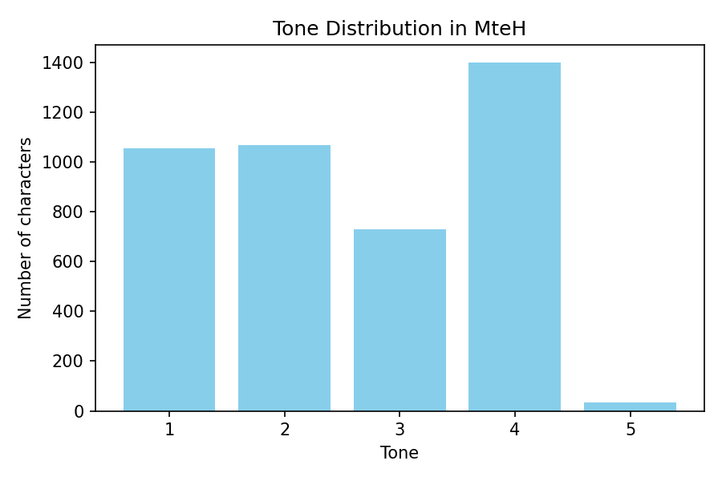
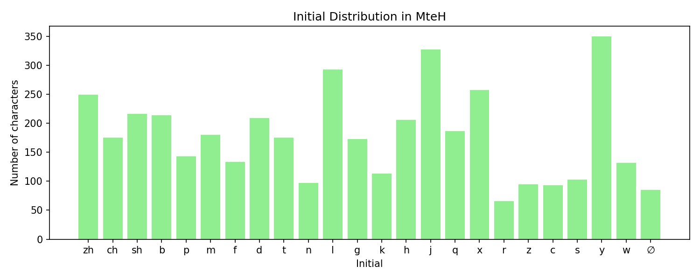
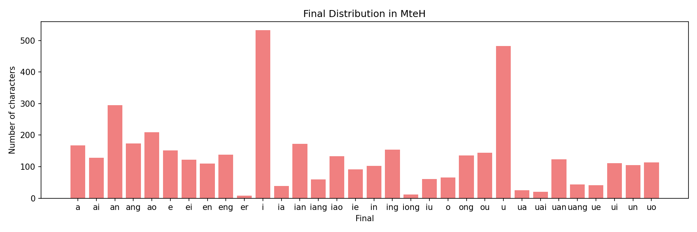
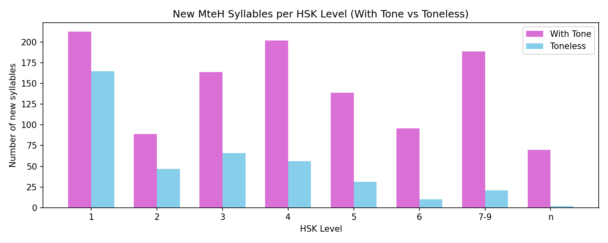

# MteH syllables: all component combinations

*Date: 2026-05-25*

*Source file: ../versions/v0.1.3/mteh_v0.1.3.txt*

*Generated using Python code written by ChatGPT*

This report is automatically generated from the pinyin in the mteh file listed above.  There are two issues:

 - MetH does not account for 多音字 (polyphones); each character is ascribed a single pronunciation.

 - In some cases, pinyin does not accurately reflect actual pronunciation, e.g. chu → ㄔㄨ and qu → ㄑㄩ have different finals (u vs ü).

## Tone Distribution Plot

## Initial Distribution Plot

## Final Distribution Plot

## MteH characters with the same pinyin: initial

- **b (223)**: 不 丙 伯 伴 佰 便 保 倍 傍 八 兵 冰 刨 别 剥 办 勃 包 匕 北 匾 半 卑 博 卜 卞 变 叭 吧 呗 哔 哺 嘣 坂 坝 埠 堡 壁 备 奔 婊 婢 孢 宝 宾 崩 巴 币 布 帛 帮 并 庇 弊 弼 彪 彬 彼 必 怖 悖 悲 惫 愎 憋 扁 扮 扳 把 报 抱 拌 拔 拜 拨 捌 捕 掰 搏 搬 摆 摒 播 敝 斌 斑 暴 曝 本 杯 板 柄 柏 标 梆 棒 榜 槟 步 殡 比 毕 毙 泊 波 泵 渤 滨 濒 炳 焙 煲 煸 爆 爸 版 狈 玻 班 璧 瓣 甭 疤 病 痹 瘪 白 百 碑 碧 磅 礴 禀 秉 秕 笆 笔 笨 箔 簸 簿 粑 绊 绑 绷 编 缤 罢 背 胞 脖 膀 膊 膘 臂 般 舶 芭 苞 苯 荸 菠 葆 蓓 蓖 蔽 薄 蚌 蝙 补 表 被 裨 裱 褒 褓 谤 豹 贝 败 贬 跋 跛 蹦 蹩 辈 辨 辩 辫 边 迸 逼 遍 避 邦 部 鄙 钚 钣 钵 铂 锛 镑 镖 镳 闭 阪 陛 雹 霸 靶 鞭 颁 飙 飚 饱 饼 驳 鬓 鲍 鳖 鼻 龅
- **c (99)**: 丛 从 仓 伺 侧 促 催 册 凑 刺 匆 厕 参 啐 嘈 囱 存 寸 层 岑 崔 彩 忖 恻 悴 惨 惭 慈 才 挫 措 搓 摧 撮 操 擦 曹 曾 材 村 槽 次 此 残 沧 测 涔 淙 漕 灿 猜 猝 璀 璨 瓷 疵 瘁 睬 磁 磋 祠 窜 策 篡 簇 粗 粲 粹 糙 翠 聪 脆 舱 苍 茨 草 菜 萃 葱 蔡 藏 蚕 裁 词 财 赐 踩 蹉 蹙 蹭 蹴 蹿 辞 醋 采 锉 错 雌 餐
- **ch (192)**: 丑 丞 串 乘 产 仇 传 侈 倡 偿 储 充 冲 出 创 初 厂 厨 叉 叱 吃 吵 吹 呈 哧 唇 唱 啜 啻 喘 嗔 嗤 嘲 嚓 场 垂 城 处 姹 娼 嫦 孱 宠 察 尘 尝 尺 岔 崇 川 巢 差 常 床 弛 彻 徜 忏 忡 忱 怅 怆 惆 惩 愁 憧 成 戳 扯 承 抄 抽 拆 持 捶 掣 掺 插 揣 搀 搐 搽 撑 撤 敕 敞 斥 昌 春 晨 朝 杈 杵 查 柴 楚 槌 橙 橱 池 沉 淳 潮 潺 澄 澈 炊 炒 炽 焯 猖 畅 畜 畴 疮 痴 瞅 瞠 矗 础 碴 禅 秤 称 程 稠 穿 窗 笞 筹 纯 绌 绰 绸 缠 翅 耻 肠 臣 臭 舛 船 茬 茶 虫 蝉 蟾 蠢 衩 衬 触 诚 诧 谄 谗 豉 豺 赤 趁 超 踌 踟 踹 蹰 躇 车 辍 辰 迟 逞 酬 醇 钗 钞 铲 锄 锤 长 闯 阐 陈 除 陲 雏 颤 馋 驰 骋 鹑 齿 龀 龊
- **d (220)**: 丁 东 丢 丹 仃 代 佃 但 低 侗 倒 傣 兑 党 兜 典 冬 冻 凋 凳 刀 刁 到 剁 动 单 叠 叨 叮 叼 吊 吨 呆 咄 咚 哆 哒 喋 嗒 嘀 嘟 噔 地 垛 垫 堆 堕 堤 堵 墩 多 大 夺 奠 妒 妲 嫡 宕 定 对 导 岛 岱 巅 帝 带 底 店 度 弟 当 待 得 德 怠 恫 悼 惦 惮 惰 懂 戴 打 抖 抵 担 挡 捣 掂 掇 掉 掸 搭 敌 敦 斗 断 旦 朵 杜 栋 档 歹 殆 殚 段 殿 毒 氮 沌 洞 涤 淀 淡 渎 渡 滇 滴 灯 炖 点 爹 牍 犊 狄 独 玷 电 甸 痘 瘩 癫 登 的 盗 盯 盹 盾 眈 督 睹 瞪 短 砥 碉 碘 碟 祷 稻 窦 端 笃 笛 第 等 答 缎 缔 耷 耽 肚 胆 胴 舵 荡 董 蒂 蚪 蛋 蝶 袋 裆 订 诋 诞 读 调 谍 谛 豆 貂 贷 赌 跌 跺 踮 踱 蹈 蹬 蹲 躲 达 迪 迭 递 逗 逮 遁 道 邓 邸 郸 都 酊 钉 钓 钝 铎 铛 锭 锻 镀 队 陡 雕 顶 顿 颠 黛 鼎
- **f (138)**: 丰 乏 付 份 仿 伏 伐 佛 俘 俯 俸 傅 冯 凡 凤 分 副 匐 匪 反 发 吠 否 吩 咐 啡 坊 坟 复 夫 奉 奋 妃 妇 妨 孚 孵 富 封 峰 帆 幅 幡 府 废 弗 忿 愤 房 扉 扶 抚 拂 放 敷 斐 斧 方 服 枫 梵 樊 氛 氟 沸 法 泛 浮 烦 烽 焚 父 犯 狒 甫 番 疯 矾 福 符 筏 粉 粪 繁 纷 纺 绯 缚 缝 罚 翡 翻 肤 肥 肪 肺 腐 腑 腓 腹 芙 芬 芳 范 茯 菲 蕃 藩 蜂 蜚 蝠 袱 覆 讣 讽 访 诽 负 贩 费 赋 赴 辅 辐 返 逢 釜 锋 阀 阜 防 附 非 风 飞 饭 馥 麸
- **g (184)**: 丐 个 乖 亘 估 佝 供 光 公 共 关 冈 冠 刚 刮 刽 割 功 勾 卦 古 各 告 呱 咕 咣 咯 哥 哽 嗝 嘎 固 国 圭 垢 埂 够 姑 孤 官 宫 寡 尬 尴 岗 工 巩 干 广 庚 弓 归 怪 恭 惯 感 戈 拐 拱 挂 掴 掼 搁 搞 擀 改 攻 故 敢 更 杆 杠 构 果 枸 柑 柜 根 格 桂 梗 棍 棺 概 槁 橄 歌 汞 汩 沟 沽 港 溉 滚 灌 犷 狗 瑰 瓜 甘 疙 癸 皈 盖 盥 睾 硅 秆 稿 竿 箍 管 篙 篝 糕 纲 给 缸 罐 羔 羹 耕 耿 聒 肛 肝 股 胱 胳 膏 苟 莞 菇 葛 虢 蚣 蛊 蛤 裹 褂 观 规 觥 诟 诡 该 谷 贡 购 贯 贵 赣 赶 跟 跪 躬 轨 辜 过 逛 郭 钙 钢 钩 铬 锅 锢 镐 闺 阁 隔 雇 革 顾 馆 骨 骼 高 鬼 鲑 鸽 鼓 龚 龟
- **h (217)**: 乎 互 亥 亨 伙 会 何 侯 候 凰 函 划 劾 化 卉 华 厚 号 合 后 含 吼 呵 呼 和 哄 哈 哗 哼 唤 唬 喉 喊 喙 喝 嗥 嗨 嘿 嚎 回 囫 圜 坏 壑 壕 壶 夯 好 婚 孩 宏 宦 害 寒 寰 幌 幻 弘 弧 彗 很 徊 徨 徽 忽 怀 恍 恒 恢 恨 悍 悔 患 惑 惚 惠 惶 慌 慧 憨 憾 或 户 扈 护 挥 捍 换 撼 旱 昊 昏 晃 晖 晦 杭 核 桓 桦 槐 横 欢 毁 毫 氦 汇 汉 汗 沪 河 泓 洄 洪 活 浑 浒 浣 浩 海 涣 涵 涸 淮 混 湖 滑 潢 瀚 火 灰 烘 烩 焊 焕 煌 狐 狠 猴 猾 獾 环 琥 瑚 画 痕 痪 皇 皓 盒 磺 祜 祸 禾 秽 簧 糊 红 绘 缓 罕 翰 耗 肓 胡 航 花 茴 荒 荟 荤 荷 获 葫 蒿 虎 虹 蚝 蝗 蝴 衡 褐 讳 诙 话 诲 谎 豁 豢 豪 货 贺 贿 赫 踝 轰 辉 还 逅 邯 郝 酣 阂 阖 霍 韩 颌 颔 馄 骇 骸 魂 鸿 鹤 麾 黄 黑 鼾
- **j (357)**: 举 久 九 井 亟 交 京 仅 今 介 件 价 伎 伽 佳 佼 侥 俊 俭 俱 倔 借 倦 倨 假 健 僭 僵 兢 具 兼 冀 军 决 净 减 几 击 剂 剑 剧 剪 剿 加 劫 劲 匠 即 卷 厥 厩 及 句 叫 叽 吉 君 咀 咎 唧 啾 嗟 嘉 噤 嚼 圾 均 坚 基 堇 境 夹 奖 奸 妓 姐 姜 姬 娇 娟 嫁 嫉 孑 季 家 寂 寄 将 尖 就 尽 局 居 届 岌 峻 崛 巨 己 巾 建 径 忌 急 悸 惊 惧 憬 戒 戛 戟 截 技 抉 拒 拘 拣 拮 挤 捐 捡 据 捷 掘 接 掬 揪 揭 搅 撅 攫 救 教 敬 斤 旌 既 旧 晋 景 晶 暨 机 杰 极 架 枷 柩 柬 桀 桔 桨 检 棘 椒 橘 歼 毽 江 汲 沮 洁 津 浆 浇 济 浚 浸 涓 涧 渐 溅 激 灸 炬 炯 烬 焦 煎 爵 狙 狡 獗 玖 珈 甲 界 畸 疆 疚 疽 疾 痂 痉 瘠 皆 皎 监 眷 睑 睛 睫 矜 矩 矫 矶 碱 礁 祭 禁 积 秸 稷 稼 稽 究 窖 窘 竞 竟 竣 竭 笈 笺 筋 简 箕 箭 籍 精 紧 纠 级 纪 经 结 绛 绝 绞 绢 继 绩 缄 缉 缰 缴 羁 羯 聚 肌 肩 胛 胫 胶 脊 脚 臼 舅 舰 艰 节 芥 茎 茧 荆 荐 荚 荠 菁 菊 菌 蒋 蕉 蕨 藉 蛟 街 襟 见 觉 觊 觐 角 解 警 计 讥 记 讲 诀 诘 诫 谏 谨 谲 贱 贾 赳 距 跤 践 跻 跽 踞 蹶 轿 较 辑 近 进 迥 迦 迹 郊 郡 酒 酱 酵 金 鉴 钧 钾 铰 锏 锦 键 锯 镌 镜 间 阱 阶 际 降 隽 集 靖 静 靳 鞠 韭 颈 颉 颊 飓 饥 饯 饺 驹 驾 骄 骏 髻 鲸 鸠 鸡 鹃
- **k (124)**: 亏 亢 侃 傀 克 况 凯 刊 刻 勘 匡 匮 卡 口 叩 可 吭 咔 咖 咳 哐 哭 啃 喀 喟 嗑 困 坎 坑 块 坤 坷 垦 垮 堪 壳 夸 奎 孔 客 宽 寇 库 康 廓 开 快 忾 恐 恪 恳 恺 愧 慨 慷 扛 扣 扩 抗 抠 括 拷 挎 捆 控 揩 旷 昆 枯 柯 框 棵 楷 槛 款 氪 渴 溃 炕 烤 犒 狂 盔 看 眶 睽 瞌 瞰 矿 砍 磕 科 空 窟 窥 筐 筷 篑 糠 绔 考 肯 胯 脍 苛 苦 葵 蝌 裤 课 跨 逵 酷 铐 铠 铿 阔 靠 颏 颗 馈 骷 魁 龛
- **l (308)**: 两 临 丽 乐 乱 了 亮 仑 令 伦 伶 佬 例 侣 俐 俚 俩 偻 僚 儡 六 兰 冷 冽 凉 凌 凛 列 刘 利 力 劣 励 劳 勒 卢 卤 卵 历 厉 厘 另 吏 吕 吝 咙 咧 哩 唠 啦 啰 啷 喇 喱 喽 嘞 嘹 噜 囵 垃 垄 垒 姥 娄 婪 孪 寥 屡 履 岚 岭 峦 嶙 帘 庐 廉 廊 廖 录 律 怜 恋 愣 懒 戮 戾 抡 拉 拎 拢 拦 挛 捋 捞 掠 掳 揽 搂 摞 撂 撩 撸 擂 敛 斓 料 旅 晾 朗 李 来 林 柳 栏 栗 梁 梨 棱 楞 楼 榄 榔 榴 檩 殓 氯 沥 沦 泪 泸 洛 流 浏 浪 涝 涟 淋 溜 滤 滥 漉 漏 漓 潦 澜 灵 炉 炼 烂 烈 烙 燎 牢 犁 狸 狼 猎 獠 率 玲 珑 珞 琅 理 琉 琳 璃 留 略 疗 痢 瘘 瘤 癞 睐 瞭 砺 砾 硫 碌 磊 磷 礼 禄 离 窿 立 笠 笼 箩 篓 篮 篱 籁 类 粒 粮 粱 粼 累 纶 练 络 绫 绺 绿 缆 缕 缭 罗 罹 羚 翎 老 聆 聊 聋 联 肋 胧 脸 腊 良 芦 苓 荔 莅 莉 莱 莲 菱 萝 落 蓝 蕾 虏 虑 蛎 蜡 螂 螺 裂 裸 褛 褴 览 詈 论 谅 赁 赂 赖 趔 路 踉 躏 轮 辆 辘 辣 辽 连 逻 遛 邋 邻 郎 酪 里 量 铃 铝 链 锂 锒 锣 镂 镣 镰 阑 陆 陋 陵 隆 隶 雳 零 雷 霖 露 靓 颅 领 馏 驴 骆 骡 髅 鬣 鲁 鲤 鳞 鹿 麓 麟 黎 龄 龙
- **m (188)**: 么 买 亩 们 免 冒 冕 冥 勉 募 卖 卯 名 吗 命 咪 喵 嘛 埋 墓 墨 妈 妙 妹 姆 娩 媒 媚 孟 密 寐 寞 岷 嵋 帽 幂 幔 幕 庙 弥 忙 悯 慕 慢 懵 扪 抹 抿 拇 描 摩 摸 摹 敏 明 昧 暮 曼 朦 木 末 枚 某 梅 梦 棉 楣 模 檬 母 每 毛 民 氓 沐 没 沫 泌 泯 淼 渺 湄 湎 满 漠 漫 灭 焖 煤 牟 牡 牧 犸 猕 猛 猫 玛 玫 皿 盟 目 盲 眉 眠 眯 眸 睦 瞄 瞑 瞒 矛 码 磨 秒 秘 穆 米 糜 绵 缅 缪 美 脉 腼 膜 芒 苗 茂 茅 茉 茗 茫 莓 莫 莽 萌 蒙 蓦 蔑 蔓 藐 蘑 蚂 蛮 蜜 蜢 蟆 蟒 袂 觅 谋 谜 谟 谧 谩 谬 貌 贸 迈 迷 酩 酶 铆 铭 锚 锰 镁 门 闵 闷 闽 陌 霉 霾 靡 面 馍 馒 马 骂 髦 魅 魔 鳗 鸣 麦 麻 默
- **n (102)**: 乃 你 倪 内 农 凝 努 匿 南 呐 呢 咛 哝 哪 啮 喃 嗫 囊 囔 奈 女 奴 奶 妞 妮 娘 娜 嫩 孽 宁 尼 尿 年 廿 弄 弩 念 忸 怒 怩 恼 您 懦 扭 拈 拟 拧 拿 挠 挪 捏 捺 捻 撵 昵 暖 柠 氖 泞 泥 浓 涅 淖 溺 牛 狞 瑙 男 疟 睨 碾 糯 纳 纽 耐 聂 能 脑 脓 腩 腻 艿 蔫 虐 袅 讷 诺 蹑 逆 那 酿 钠 钮 镊 镍 闹 难 霓 馁 馕 鸟 黏
- **p (148)**: 丕 乒 乓 仆 佩 偏 僻 凭 判 剖 剽 劈 匍 匹 叛 叵 呸 咆 品 啤 啪 喷 嘭 噗 噼 圃 坡 坪 坯 埔 培 婆 媲 嫖 屁 屏 帕 平 庖 庞 彭 彷 徘 怕 怦 扑 扒 批 抛 抨 披 拍 拚 拼 捧 排 撇 攀 旁 普 朋 朴 杷 枇 棚 毗 沛 泡 泼 派 浦 湃 溥 漂 潘 澎 瀑 炮 烹 爬 片 牌 珀 琵 琶 璞 瓢 瓶 畔 疱 疲 痞 癖 皮 盆 盘 盼 瞟 瞥 砰 破 硼 碰 磐 票 篇 篷 粕 翩 耙 聘 胖 胚 脯 脾 膨 苹 菩 萍 葡 葩 蒲 蓬 蜱 螃 袍 裴 譬 评 谱 贫 赔 趴 跑 蹒 辟 迫 配 铺 陪 霹 颇 频 颦 飘 骗 魄 鹏
- **q (194)**: 七 且 丘 乔 乞 乾 亲 企 侨 侵 俏 倩 倾 全 其 凄 切 券 前 劝 勤 区 千 却 卿 去 取 启 呛 嘁 噙 器 囚 圈 堑 墙 奇 契 妻 妾 娶 寝 屈 岂 岖 峭 崎 嵌 巧 庆 弃 强 怯 恰 悄 情 惬 憔 憩 戚 抢 拳 掐 撬 擎 擒 敲 旗 晴 曲 期 权 杞 枪 柒 栖 桥 棋 榷 樵 橇 欠 欺 歉 歧 气 氢 氰 求 汽 沁 沏 泅 泉 泣 洽 浅 淇 清 渠 漆 潜 炝 牵 犬 球 琦 琪 琴 琼 畦 痊 瘸 瞧 瞿 砌 确 祁 祈 祛 禽 秋 秦 穷 穹 窃 窍 签 糗 绮 缺 罄 羌 群 翘 耆 脐 腔 芡 芹 茄 茜 荞 虔 蚯 蛆 蜷 蜻 裘 裙 襁 覃 觑 讫 诠 请 谦 谴 起 趄 趋 趣 跄 跷 蹊 躯 轻 迁 迄 遒 遣 邱 酋 钦 钱 钳 铅 锲 锵 锹 阙 雀 青 鞘 顷 颧 驱 骑 鳍 鹊 麒 黔 齐 龋
- **r (68)**: 乳 人 仁 仍 任 偌 儒 入 冉 冗 刃 嚅 嚷 壤 壬 如 妊 娆 孺 容 弱 忍 惹 戎 扔 扰 揉 攘 日 染 柔 汝 润 溶 濡 热 然 熔 燃 瑞 瓤 睿 纫 绒 绕 肉 芮 若 茸 茹 荣 蓉 蕊 融 蠕 褥 认 让 蹂 软 辱 锐 闰 阮 鞣 韧 饪 饶
- **s (114)**: 三 丝 丧 仨 伞 似 俗 俟 僧 卅 厮 叁 叟 司 咝 唆 啬 嗓 嗖 嗣 嗦 嗽 嘶 四 塑 塞 夙 娑 嫂 孙 宋 宿 寺 岁 嵩 巳 忪 怂 思 悚 愫 所 扫 损 搔 搜 搡 撒 撕 擞 散 斯 松 桑 梭 森 死 洒 涩 溯 燧 狻 琐 瑟 碎 祀 祟 私 稣 穗 笋 算 簌 粟 素 索 绥 缩 耸 肃 肆 腮 臊 艘 色 苏 萨 蒜 蓑 虽 讼 诉 诵 赛 送 速 遂 邃 酥 酸 锁 隋 随 隧 隼 颂 飒 飕 饲 馊 驷 骚 髓 鳃
- **sh (227)**: 上 世 书 事 什 仕 伤 伸 使 侍 倏 傻 兽 删 刷 刹 剩 势 勺 匙 十 升 厦 双 叔 受 史 吮 呻 哨 售 唰 商 啥 善 嗜 噬 圣 塾 墅 士 声 失 奢 始 姗 娠 婶 孀 孰 守 实 审 室 寿 射 少 尚 尸 屎 属 山 市 帅 师 庶 式 弑 恃 恕 慎 慑 戍 扇 手 抒 拭 拴 拾 捎 授 摄 摔 擅 收 数 施 时 昇 是 晌 晒 暑 曙 朔 术 杀 杉 束 枢 柿 树 栓 梢 梳 殊 氏 水 汕 沈 沙 涉 涮 淑 深 渗 湿 漱 潸 烁 烧 煞 煽 熟 爽 牲 狩 狮 珊 甚 生 甥 甩 申 疏 瘦 盛 省 睡 瞬 矢 石 砂 硕 示 社 神 秫 稍 税 竖 笙 筛 筲 纱 纾 绅 绍 绳 绶 缮 署 耍 肾 胜 膳 膻 舌 舍 舐 舒 舜 艄 芍 苫 莎 莘 蔬 薯 虱 蚀 蛇 蜀 蟀 衫 衰 裳 视 誓 讪 设 识 试 诗 说 谁 谥 赊 赎 赏 赡 赦 跚 身 轼 输 述 适 逝 邵 释 铄 铩 闩 闪 陕 霎 霜 韶 顺 食 饰 首 驶 鲨 黍 鼠
- **t (178)**: 亭 他 体 佟 佻 倘 停 偷 兔 凸 剃 剔 厅 台 叹 同 吐 吞 听 唐 唾 啕 啼 嚏 团 囤 图 土 坍 坛 坦 坨 堂 塌 塔 塘 填 天 太 头 套 她 妥 婷 它 屉 屠 屯 帖 庭 廷 弹 彤 徒 忐 忑 忒 态 恬 惕 托 投 抬 拓 拖 挑 挞 挺 捅 掏 探 推 提 搪 摊 昙 替 条 桃 桐 桶 梯 棠 椭 榻 毯 汀 汤 汰 沓 泰 涂 涕 涛 淌 淘 添 湍 溏 滔 滕 滩 潭 炭 烫 特 獭 甜 田 疼 痛 痰 瘫 眺 瞳 碳 秃 突 窕 童 笤 筒 糖 统 胎 脱 腆 腾 腿 膛 臀 舔 艇 苔 荼 萄 藤 蜓 蜕 袒 褪 誊 讨 谈 谭 豚 贪 贴 趟 跆 跎 跳 踏 踢 蹄 蹋 躺 迢 退 逃 透 途 通 遢 酮 钛 铁 铜 陀 陶 霆 颓 题 饨 驮 驼 骰 鸵
- **w (144)**: 万 丸 为 乌 五 亡 伍 伟 伪 位 侮 倭 偎 兀 刎 剜 务 勿 午 卧 卫 危 吴 吻 吾 呜 味 哇 唔 唯 喂 嗡 围 坞 外 妄 妩 委 威 娃 娓 娲 婉 完 宛 尉 尾 屋 巍 巫 帷 幄 弯 往 微 忘 忤 悟 惋 惘 惟 慰 戊 我 挖 挝 挽 捂 握 文 斡 无 旺 晚 晤 望 未 枉 桅 梧 武 歪 毋 污 汪 沃 洼 涡 渥 温 渭 湾 烷 物 猥 猬 王 玩 瓦 瓮 畏 瘟 皖 碗 稳 窝 紊 纨 纬 纹 维 网 罔 翁 胃 腕 舞 芜 苇 萎 蔚 薇 蚊 蛙 蜈 蜗 蜿 袜 诬 误 诿 谓 豌 违 钨 问 闻 雾 韦 顽 骛 魏 鹉 龌
- **x (267)**: 下 习 乡 些 享 亵 仙 休 侠 信 修 偕 像 兄 先 兮 兴 写 凶 刑 削 勋 匈 匣 协 卸 厢 县 叙 向 吓 吸 呷 咸 咻 响 哮 唏 啸 喜 喧 嗅 嘘 嘻 嚣 型 墟 夏 夕 奚 姓 娴 婿 媳 嫌 嬉 孝 学 宣 宪 宵 寻 小 屑 峋 峡 巡 巷 希 席 幸 序 弦 形 徇 徐 徙 循 心 性 恤 息 悉 悬 悻 惜 想 惺 懈 戌 戏 挟 掀 携 擤 效 斜 新 旋 旬 旭 昔 星 显 晓 晰 暄 暇 曦 朽 杏 析 枭 校 栩 械 楔 橡 欣 歇 殉 汐 汛 汹 泄 泻 洗 消 涎 淅 淆 渲 湘 溪 漩 潇 炫 烯 煦 熄 熊 熏 熙 熹 牺 犀 狭 猩 献 玄 现 玺 瑕 璇 痫 癣 皙 相 眩 瞎 硝 祥 禧 秀 稀 穴 笑 箫 箱 系 絮 纤 线 细 绚 绣 绪 续 羞 羡 羲 翔 肖 胁 胸 腥 腺 膝 舷 芯 萧 蓄 薛 薪 薰 藓 虚 虾 蜥 蝎 蟋 蟹 血 衅 行 衔 袖 袭 襄 西 训 讯 许 询 详 诩 谐 谑 谢 象 贤 轩 辖 辛 迅 选 逊 逍 遐 邂 邢 邪 酗 醒 醺 鑫 铣 销 锈 锌 锡 锨 镶 闲 限 险 陷 隙 雄 雪 需 霄 霞 靴 鞋 项 须 飨 饷 馅 馐 香 馨 驯 骁 鲜 黠
- **y (386)**: 一 与 业 严 丫 义 乙 也 予 于 云 亚 亦 亿 以 仪 仰 伊 优 佑 余 佣 佯 依 俑 俞 俨 倚 偃 允 元 养 冤 冶 勇 匀 医 印 压 厌 原 又 友 右 叶 吁 吆 吟 呀 呓 员 呦 咏 咦 咬 咽 哑 哟 唁 喑 喻 嘤 噎 因 园 圆 垠 垣 域 堰 壹 夜 夭 央 夷 奄 奕 妍 妖 姚 姨 姻 娅 娱 婴 媛 嫣 孕 宇 宜 宥 宴 寅 寓 尤 尧 尹 屹 屿 岩 岳 崖 已 幺 幼 幽 应 庸 延 异 弈 弋 引 彝 彦 影 役 徉 御 忆 忧 怏 怡 怨 恙 恿 悠 悦 愈 愉 意 愚 愠 愿 慵 懿 扬 抑 押 拥 掖 掩 揄 揖 揠 援 揶 摇 攸 易 映 晏 晕 曜 曰 曳 月 有 杨 杳 柚 样 椅 椰 榆 樱 檐 欲 殃 殒 殷 毅 毓 氧 永 油 沿 泳 洋 浴 涌 涯 液 淤 淫 淹 渊 渔 渝 游 湮 源 溢 演 漪 漾 瀛 炀 炎 烊 烟 焉 焰 焱 熠 熨 燕 爷 牙 犹 狱 猿 玉 瑜 瑶 用 甬 由 疑 疡 疣 疫 痍 痒 瘀 瘾 盈 益 盐 眼 睚 矣 研 砚 硬 禹 禺 秧 移 窈 窑 筵 粤 约 纭 绎 缘 缨 罂 羊 羽 羿 翌 翼 耀 耘 耶 肄 育 肴 胤 胭 胰 腋 腌 腰 膺 臃 臆 舀 舆 艳 艺 芋 芸 芽 苑 英 茵 荧 荫 药 莹 莺 萤 营 萦 蕴 虞 蚁 蚓 蚜 蛹 蜒 蜴 蝇 衍 衙 衣 袁 裔 裕 要 觎 言 誉 议 讶 译 诣 语 诱 谀 谊 谒 谕 谚 谣 豫 贻 赝 赢 越 跃 踊 轶 辕 迂 迎 运 远 逸 逾 遇 遗 遥 邀 邑 邮 郁 酉 酝 釉 野 钥 铀 银 闫 阅 阉 阎 阳 阴 院 陨 隅 隐 雁 雅 雍 雨 音 韵 页 预 颐 颖 颜 饮 驭 驿 验 魇 鱼 鱿 鸦 鸭 鸯 鸳 鹦 鹬 鹰 黝 鼬 鼹 龈
- **z (105)**: 仄 仔 佐 作 做 兹 再 凿 则 匝 卒 吱 咂 咋 咨 咱 哉 啧 嘴 噪 在 坐 增 奏 奘 姊 姿 子 字 孜 宗 宰 尊 崽 左 座 怎 总 恣 憎 择 揍 攒 攥 族 早 昨 暂 最 杂 枣 栽 棕 泽 渍 滋 滓 澡 灶 灾 燥 琢 皂 眦 砸 祖 租 簪 籽 粽 糟 紫 纂 纵 组 综 罪 脏 自 葬 藻 蚤 诅 责 贼 赃 资 赞 赠 走 足 踪 躁 载 造 遭 遵 邹 醉 钻 镞 阻 髭 鬃 龇
- **zh (263)**: 丈 专 中 主 之 乍 争 仗 仲 众 伫 住 侄 侏 侦 债 值 兆 冢 准 制 助 卓 占 只 召 吒 周 咒 咫 哲 啄 喳 嘱 圳 址 坠 壮 妆 宅 宙 寨 展 峙 崭 州 帐 帚 帜 帧 幢 庄 张 彰 征 志 忠 怔 惴 战 扎 执 找 抓 折 拄 拙 招 拯 拽 指 挚 挣 振 捉 掌 掷 摘 撞 撰 擢 支 政 整 斋 斟 斩 旨 昭 昼 智 朕 札 朱 杖 枕 枝 枳 柱 栅 栈 株 桌 桩 植 椎 楂 榛 榨 止 正 殖 毡 汁 治 沼 沾 注 洲 浊 浙 涨 渣 湛 滞 灼 炙 炸 烛 照 煮 爪 状 狰 猪 珍 珠 璋 甄 疹 症 痔 痣 瘴 皱 盅 盏 直 真 眨 着 睁 瞩 瞻 知 砖 砧 祉 祝 种 秩 稚 窄 窒 站 章 竹 竺 筑 筝 箴 篆 粘 粥 纣 纸 织 终 绽 缀 缜 罩 置 翟 者 职 肇 肘 肢 肿 胀 胄 脂 至 致 臻 舟 芝 芷 茁 著 蒸 蔗 蘸 蛀 蛛 蛭 蛰 蜘 蟑 衷 装 褶 詹 证 诈 诊 诌 诏 诛 诸 谆 贞 账 质 贮 赘 赚 赭 赵 趾 踯 踵 躅 轧 转 轴 辄 辗 辙 这 追 逐 遮 郑 酌 酯 重 针 钟 铡 铮 铸 锥 镇 镯 闸 阵 障 震 馔 驻 骤
- **∅ (94)**: 二 俄 俺 偶 傲 儿 凹 厄 呃 呕 哀 哎 哦 唉 啊 喔 嗯 嗷 噢 噩 坳 埃 奥 娥 婀 安 尔 岸 峨 庵 恩 恶 愕 懊 扼 拗 按 挨 摁 敖 昂 暗 暧 案 欧 欸 殴 氨 洱 澳 熬 爱 獒 癌 皑 盎 矮 碍 翱 而 耳 肮 胺 腭 艾 蔼 藕 蛾 螯 袄 讴 讹 诶 谙 贰 迩 遏 遨 鄂 阿 隘 霭 鞍 颚 额 饵 饿 骜 鳄 鳌 鸥 鹅 鹌 黯

**Total # chars for this group:** 4540

**Top 10 most common keys:**

1. y: 386

2. j: 357

3. l: 308

4. x: 267

5. zh: 263

6. sh: 227

7. b: 223

8. d: 220

9. h: 217

10. q: 194

---

## MteH characters with the same pinyin: final

- **a (174)**: 丫 乍 乏 亚 他 仨 伐 傻 八 刹 匝 卅 卡 压 厦 叉 发 叭 吒 吗 吧 呀 呐 咂 咋 咔 咖 哇 哈 哑 哒 哪 啊 啥 啦 啪 喀 喇 喳 嗒 嘎 嘛 嚓 坝 垃 塌 塔 大 她 妈 妲 姹 娃 娅 娜 娲 它 察 尬 岔 崖 差 巴 帕 怕 扎 扒 打 把 押 拉 拔 拿 挖 挞 捌 捺 插 揠 搭 搽 撒 擦 札 杀 杂 杈 杷 查 栅 楂 榨 榻 沓 沙 法 洒 洼 涯 渣 炸 煞 爬 爸 牙 犸 獭 玛 琶 瓦 疤 瘩 眨 睚 码 砂 砸 碴 笆 筏 答 粑 纱 纳 罚 罢 耙 耷 腊 芭 芽 茬 茶 莎 萨 葩 蚂 蚜 蛙 蜡 蟆 衙 衩 袜 讶 诈 诧 趴 跋 踏 蹋 轧 辣 达 遢 邋 那 钠 铡 铩 闸 阀 阿 雅 霎 霸 靶 飒 马 骂 鲨 鸦 鸭 麻
- **ai (132)**: 丐 乃 买 亥 代 佰 债 傣 再 凯 卖 台 呆 哀 哉 哎 唉 嗨 在 埃 埋 外 太 奈 奶 孩 宅 宰 害 寨 岱 崽 带 开 彩 待 徘 忾 态 怠 恺 慨 戴 才 抬 拆 拍 拜 挨 排 掰 揩 摆 摘 改 斋 晒 暧 材 来 柴 栽 楷 概 歪 歹 殆 氖 氦 汰 泰 派 海 湃 溉 灾 爱 牌 猜 癌 癞 白 百 皑 盖 睐 睬 矮 碍 窄 筛 籁 翟 耐 胎 脉 腮 艾 艿 苔 莱 菜 蔡 蔼 袋 裁 该 豺 财 败 贷 赖 赛 跆 踩 载 迈 还 逮 采 钗 钙 钛 铠 隘 霭 霾 骇 骸 鳃 麦 黛
- **an (319)**: 万 三 严 丸 丹 产 伞 伴 但 侃 俨 俺 偃 兰 冉 凡 函 刊 删 判 剜 办 勘 半 单 南 占 厌 叁 反 叛 叹 含 咱 咽 唁 喃 善 喊 坂 坍 坎 坛 坦 堪 堰 奄 妍 姗 婉 婪 嫣 孱 安 完 宛 宴 寒 尴 展 山 岚 岩 岸 崭 帆 幔 幡 干 庵 延 弯 弹 彦 忏 忐 悍 惋 惨 惭 惮 感 慢 憨 憾 懒 战 扇 扮 扳 担 拌 拚 拦 按 挽 捍 探 掩 掸 掺 揽 搀 搬 摊 撼 擀 擅 攀 攒 敢 散 斑 斓 斩 旦 旱 昙 晏 晚 暂 暗 曼 杆 杉 板 柑 染 栈 栏 案 梵 榄 槛 樊 橄 檐 残 殚 毡 毯 氨 氮 汉 汕 汗 沾 沿 泛 涵 淡 淹 湛 湮 湾 满 滥 滩 演 漫 潘 潭 潸 潺 澜 瀚 灿 炎 炭 烂 烟 烦 烷 焉 焊 焰 焱 然 煽 燃 燕 版 犯 玩 珊 班 璨 瓣 甘 男 畔 番 痰 瘫 皖 盏 盐 盘 盼 眈 看 眼 瞒 瞰 瞻 矾 砍 研 砚 碗 碳 磐 禅 秆 站 竿 筵 篮 簪 粘 粲 繁 纨 绊 绽 缆 缠 缮 罕 翰 翻 耽 肝 胆 胭 胺 腌 腕 腩 膳 膻 般 艳 苫 范 蓝 蔓 蕃 藩 蘸 蚕 蛋 蛮 蜒 蜿 蝉 蟾 衍 衫 袒 褴 览 言 詹 讪 诞 谄 谈 谗 谙 谚 谩 谭 豌 贩 贪 赝 赞 赡 赣 赶 跚 蹒 辗 返 邯 郸 酣 钣 铲 闪 闫 阉 阎 阐 阑 阪 陕 难 雁 鞍 韩 顽 颁 颔 颜 颤 餐 饭 馋 馒 验 魇 鳗 鹌 黯 鼹 鼾 龛
- **ang (184)**: 丈 上 丧 乓 亡 亢 仓 仗 仰 仿 伤 佯 倘 倡 偿 傍 党 养 冈 刚 厂 唐 唱 商 啷 嗓 嚷 囊 囔 场 坊 堂 塘 壤 央 夯 奘 妄 妨 娼 嫦 宕 尚 尝 岗 帐 帮 常 庞 康 廊 张 当 彰 彷 往 徉 徜 忘 忙 怅 怏 恙 惘 慷 房 扛 扬 抗 挡 掌 搡 搪 攘 放 敞 方 旁 旺 昂 昌 晌 朗 望 杖 杠 杨 杭 枉 样 桑 档 梆 棒 棠 榔 榜 殃 氓 氧 汤 汪 沧 洋 浪 涨 淌 港 溏 漾 炀 炕 烊 烫 狼 猖 王 琅 璋 瓤 畅 疡 痒 瘴 盎 盲 磅 秧 章 糖 糠 纲 纺 绑 缸 网 罔 羊 肛 肠 肪 肮 胀 胖 脏 膀 膛 航 舱 芒 芳 苍 茫 荡 莽 葬 藏 蚌 螂 螃 蟑 蟒 裆 裳 让 访 谤 账 赃 赏 趟 躺 邦 郎 钢 铛 锒 镑 长 防 阳 障 馕 鸯
- **ao (218)**: 佬 保 倒 傲 兆 冒 凹 凿 刀 刨 到 劳 勺 包 卯 叨 召 号 吆 吵 告 咆 咬 哨 唠 啕 嗥 嗷 嘈 嘲 噪 嚎 坳 堡 壕 夭 套 奥 好 妖 姚 姥 娆 嫂 孢 宝 导 少 尧 岛 巢 帽 幺 庖 恼 悼 懊 扫 扰 找 抄 抛 报 抱 拗 招 拷 挠 捎 捞 捣 掏 搔 搞 摇 操 敖 早 昊 昭 暴 曜 曝 曹 朝 杳 枣 桃 梢 槁 槽 毛 毫 沼 泡 浩 涛 涝 淖 淘 滔 漕 潮 澡 澳 灶 炒 炮 烙 烤 烧 焯 照 煲 熬 燥 爆 牢 犒 猫 獒 瑙 瑶 疱 皂 皓 盗 睾 矛 祷 稍 稻 稿 窈 窑 筲 篙 糕 糙 糟 绍 绕 罩 羔 翱 耀 老 考 耗 肇 肴 胞 脑 腰 膏 臊 舀 艄 芍 苞 茂 茅 草 药 萄 葆 蒿 藻 蚝 蚤 螯 袄 袍 褒 褓 要 讨 诏 谣 豪 豹 貌 贸 赵 超 跑 蹈 躁 逃 造 道 遥 遨 遭 邀 邵 郝 酪 钞 钥 铆 铐 锚 镐 闹 陶 雹 靠 韶 饱 饶 骚 骜 高 髦 鲍 鳌 龅
- **e (160)**: 业 个 么 乐 也 了 仄 何 侧 俄 克 册 冶 则 刻 割 劾 勒 厄 厕 可 叶 各 合 呃 呢 呵 和 咯 咳 哥 哲 啧 啬 喝 嗑 嗝 噎 噩 坷 塞 壑 壳 夜 奢 娥 婀 客 射 峨 彻 得 德 忑 忒 恪 恶 恻 惹 愕 慑 戈 扯 扼 折 择 掖 掣 揶 搁 摄 撤 曳 柯 核 格 棵 椰 歌 氪 河 泽 测 浙 涉 涩 液 涸 渴 澈 热 爷 特 瑟 疙 的 盒 着 瞌 磕 社 禾 科 策 者 耶 胳 腋 腭 舌 舍 色 苛 荷 葛 蔗 蛇 蛤 蛰 蛾 蝌 褐 褶 讷 讹 设 课 谒 责 贺 赊 赦 赫 赭 车 辄 辙 这 遏 遮 鄂 野 铬 阁 阂 阖 隔 革 页 颌 颏 颗 颚 额 饿 骼 鳄 鸽 鹅 鹤
- **ei (127)**: 为 伟 伪 位 佩 倍 偎 儡 内 北 匪 卑 卫 危 吠 呗 味 呸 唯 啡 喂 嘞 嘿 围 垒 培 备 妃 妹 委 威 娓 媒 媚 寐 尉 尾 嵋 巍 帷 废 微 悖 悲 惟 惫 慰 扉 擂 斐 昧 未 杯 枚 桅 梅 楣 欸 每 沛 没 沸 泪 渭 湄 焙 煤 狈 狒 猥 猬 玫 畏 眉 碑 磊 类 累 纬 给 绯 维 美 翡 肋 肥 肺 胃 背 胚 腓 苇 莓 菲 萎 蓓 蔚 蕾 薇 蜚 袂 被 裴 诶 诽 诿 谁 谓 贝 费 贼 赔 辈 违 配 酶 镁 陪 雷 霉 非 韦 飞 馁 魅 魏 黑
- **en (117)**: 亘 人 什 仁 们 任 份 伸 侦 刃 分 刎 参 吩 吻 呻 啃 喷 嗔 嗯 圳 坟 垦 壬 奋 奔 妊 娠 婶 嫩 审 尘 岑 帧 很 忍 忱 忿 怎 恨 恩 恳 愤 慎 扪 振 摁 文 斟 晨 朕 本 枕 根 森 榛 氛 沈 沉 涔 深 渗 温 焖 焚 狠 珍 甄 甚 申 疹 痕 瘟 盆 真 砧 神 稳 笨 箴 粉 粪 紊 纫 纷 纹 绅 缜 肯 肾 臣 臻 芬 苯 莘 蚊 衬 认 诊 贞 趁 跟 身 辰 针 锛 镇 门 问 闷 闻 阵 陈 震 韧 饪 龀
- **eng (142)**: 丞 丰 乘 争 亨 仍 俸 僧 冯 冷 凤 凳 剩 升 吭 呈 哼 哽 嗡 嘣 嘭 噔 圣 坑 埂 城 增 声 奉 孟 封 层 峰 崩 庚 彭 征 怔 怦 恒 惩 愣 憎 懵 成 扔 承 抨 拯 挣 捧 撑 政 整 昇 更 曾 朋 朦 枫 梗 梦 棚 棱 楞 横 橙 檬 正 泵 滕 澄 澎 灯 烹 烽 牲 狰 猛 瓮 生 甥 甭 疯 疼 症 登 盛 盟 省 睁 瞠 瞪 砰 硼 碰 秤 称 程 笙 等 筝 篷 绳 绷 缝 羹 翁 耕 耿 胜 能 腾 膨 萌 蒙 蒸 蓬 藤 蜂 蜢 衡 誊 讽 证 诚 赠 蹦 蹬 蹭 迸 逞 逢 邓 郑 铮 铿 锋 锰 风 骋 鹏
- **er (9)**: 二 儿 尔 洱 而 耳 贰 迩 饵
- **i (572)**: 一 七 丕 世 丝 丽 义 之 乙 乞 习 事 亟 亦 亿 仔 仕 以 仪 企 伊 伎 伺 似 低 体 你 使 侄 侈 例 侍 依 俐 俚 俟 倚 倪 值 僻 兮 其 兹 冀 凄 几 击 利 制 刺 剂 剃 剔 劈 力 励 势 匕 匙 匹 医 匿 十 即 历 厉 厘 厮 及 只 叱 史 司 叽 吃 吉 吏 启 吱 吸 呓 咝 咦 咨 咪 咫 哔 哧 哩 唏 唧 啤 啻 啼 喜 喱 嗜 嗣 嗤 嘀 嘁 嘶 嘻 器 噬 噼 嚏 四 地 圾 址 坯 基 堤 壁 士 壹 夕 失 夷 奇 契 奕 奚 妓 妮 妻 姊 始 姨 姬 姿 婢 媲 媳 嫉 嫡 嬉 子 字 孜 季 宜 实 室 寂 寄 密 寺 尸 尺 尼 屁 屉 屎 屹 岂 岌 峙 崎 己 已 巳 币 市 师 希 帜 帝 席 幂 庇 底 异 弃 弈 弊 弋 式 弑 弛 弟 弥 弼 彝 役 彼 徙 必 忆 忌 志 思 怡 急 怩 恃 恣 息 悉 悸 惕 惜 愎 意 慈 憩 懿 戏 戚 戟 戾 执 批 技 抑 披 抵 拟 拭 拾 持 指 挚 挤 掷 提 揖 撕 支 敌 敕 敝 斥 斯 施 旗 既 日 旨 时 易 昔 是 昵 晰 智 暨 曦 替 期 机 李 杞 极 枇 析 枝 枳 柒 柿 栖 栗 梨 梯 棋 棘 椅 植 次 欺 止 此 歧 死 殖 毅 比 毕 毗 毙 氏 气 汁 汐 池 汲 汽 沏 沥 治 泌 泣 泥 洗 济 涕 涤 淅 淇 渍 湿 溢 溪 溺 滋 滓 滞 滴 漆 漓 漪 激 炙 炽 烯 熄 熙 熠 熹 牺 犀 犁 狄 狮 狸 猕 玺 理 琦 琪 琵 璃 璧 瓷 畦 畸 疑 疫 疲 疵 疾 痍 痔 痞 痢 痣 痴 痹 瘠 癖 皙 皮 益 直 眦 眯 睨 矢 矣 知 石 矶 砌 砥 砺 砾 碧 磁 示 礼 祀 祁 祈 祉 祠 祭 禧 离 私 秕 秘 秩 积 移 稀 稚 稷 稽 窒 立 笈 笔 笛 笞 笠 第 箕 篱 籍 米 籽 粒 糜 系 紫 级 纪 纸 细 织 绎 继 绩 绮 缉 缔 置 罹 羁 羲 羿 翅 翌 翼 耆 耻 职 肄 肆 肌 肢 胰 脂 脊 脐 脾 腻 膝 臂 臆 自 至 致 舐 艺 芝 芷 茨 荔 荠 荸 莅 莉 蒂 蓖 蔽 藉 虱 蚀 蚁 蛎 蛭 蜘 蜜 蜥 蜱 蜴 蟋 衣 袭 裔 裨 西 觅 视 觊 詈 誓 譬 计 讥 讫 议 记 识 诋 词 译 试 诗 诣 谊 谛 谜 谥 谧 豉 质 贻 资 赐 赤 起 趾 跻 跽 踟 踢 踯 蹄 蹊 轶 轼 辑 辞 辟 迄 迟 迪 迷 迹 适 逆 递 逝 逸 逼 遗 避 邑 邸 鄙 酯 释 里 铣 锂 锡 闭 际 陛 隙 隶 集 雌 雳 霓 霹 靡 颐 题 食 饥 饰 饲 驰 驶 驷 驿 骑 髭 髻 鲤 鳍 鸡 麒 黎 鼻 齐 齿 龇
- **ia (43)**: 下 价 伽 佳 侠 俩 假 加 匣 吓 呷 嘉 夏 夹 嫁 家 峡 恰 戛 掐 暇 架 枷 洽 狭 珈 瑕 甲 痂 瞎 稼 胛 荚 虾 贾 辖 迦 遐 钾 霞 颊 驾 黠
- **ian (177)**: 乾 仙 件 佃 便 俭 倩 偏 健 僭 先 免 典 兼 冕 减 前 剑 剪 勉 匾 千 卞 县 变 咸 坚 垫 堑 填 天 奠 奸 娩 娴 嫌 宪 尖 嵌 巅 帘 年 店 廉 建 廿 弦 念 怜 恋 恬 惦 扁 拈 拣 捡 捻 掀 掂 撵 敛 显 柬 检 棉 欠 歉 歼 殓 殿 毽 浅 涎 涟 涧 淀 添 渐 湎 溅 滇 潜 点 炼 煎 煸 片 牵 献 现 玷 甜 田 电 甸 痫 癫 监 眠 睑 碘 碱 碾 笺 签 简 箭 篇 纤 线 练 绵 缄 缅 编 羡 翩 联 肩 脸 腆 腺 腼 舔 舰 舷 艰 芡 茜 茧 荐 莲 蔫 藓 虔 蝙 衔 见 谏 谦 谴 贤 贬 贱 践 踮 辨 辩 辫 边 迁 连 遍 遣 鉴 钱 钳 铅 链 锏 锨 键 镰 闲 间 限 险 陷 面 鞭 颠 饯 馅 骗 鲜 黏 黔
- **iang (63)**: 两 乡 享 亮 像 僵 凉 匠 厢 向 呛 响 墙 奖 姜 娘 将 巷 强 想 抢 晾 枪 桨 梁 橡 江 浆 湘 炝 疆 相 祥 箱 粮 粱 绛 缰 羌 翔 腔 良 蒋 襁 襄 讲 详 谅 象 跄 踉 辆 酱 酿 量 锵 镶 降 靓 项 飨 饷 香
- **iao (137)**: 乔 交 佻 佼 侥 侨 俏 僚 凋 刁 削 剽 剿 叫 叼 吊 哮 啸 喵 嘹 嚣 妙 娇 婊 嫖 孝 宵 寥 小 尿 峭 巧 庙 廖 彪 悄 憔 挑 掉 描 搅 撂 撩 撬 效 教 敲 料 晓 条 枭 标 校 桥 椒 樵 橇 浇 消 淆 淼 渺 漂 潇 潦 焦 燎 狡 獠 瓢 疗 皎 眺 瞄 瞟 瞧 瞭 矫 硝 碉 礁 票 秒 窍 窕 窖 笑 笤 箫 绞 缭 缴 翘 聊 肖 胶 脚 膘 苗 荞 萧 蕉 藐 蛟 表 袅 裱 角 调 貂 跤 跳 跷 轿 较 辽 迢 逍 郊 酵 钓 铰 销 锹 镖 镣 镳 雕 霄 鞘 飘 飙 飚 饺 骁 骄 鸟
- **ie (102)**: 且 些 亵 介 借 偕 写 冽 切 列 别 劣 劫 协 卸 叠 咧 啮 喋 嗟 嗫 妾 姐 孑 孽 届 屑 帖 怯 惬 憋 懈 戒 截 拮 挟 捏 捷 接 揭 携 撇 斜 杰 桀 械 楔 歇 泄 泻 洁 涅 灭 烈 爹 猎 界 瘪 皆 睫 瞥 碟 秸 窃 竭 结 羯 聂 胁 节 芥 茄 蔑 蝎 蝶 蟹 街 裂 解 诘 诫 谍 谐 谢 贴 趄 趔 跌 蹑 蹩 迭 邂 邪 铁 锲 镊 镍 阶 鞋 颉 鬣 鳖
- **in (112)**: 临 亲 仅 今 侵 信 凛 劲 勤 印 吝 吟 品 喑 噙 噤 因 垠 堇 姻 宾 寅 寝 尹 尽 岷 嶙 巾 引 彬 心 您 悯 抿 拎 拼 擒 敏 斌 斤 新 晋 林 槟 檩 欣 殡 殷 民 沁 泯 津 浸 淋 淫 滨 濒 烬 琳 琴 瘾 皿 矜 磷 禁 禽 秦 筋 粼 紧 缤 聘 胤 芯 芹 茵 荫 薪 蚓 衅 襟 覃 觐 谨 贫 赁 躏 辛 近 进 邻 金 鑫 钦 银 锌 锦 闵 闽 阴 隐 霖 靳 音 频 颦 饮 馨 鬓 鳞 麟 龈
- **ing (163)**: 丁 丙 乒 井 京 亭 仃 令 伶 倾 停 兢 兴 兵 冥 冰 净 凌 凝 凭 刑 卿 厅 另 叮 名 听 命 咛 嘤 坪 型 境 姓 婴 婷 宁 定 屏 岭 平 并 幸 庆 应 庭 廷 形 影 径 性 悻 情 惊 惺 憬 拧 挺 摒 擎 擤 敬 旌 明 星 映 景 晴 晶 杏 柄 柠 樱 氢 氰 汀 泞 清 瀛 灵 炳 狞 猩 玲 瓶 病 痉 盈 盯 睛 瞑 硬 禀 秉 竞 竟 精 经 绫 缨 罂 罄 羚 翎 聆 胫 腥 膺 艇 苓 英 苹 茎 茗 荆 荧 莹 莺 菁 菱 萍 萤 营 萦 蜓 蜻 蝇 行 警 订 评 请 赢 轻 迎 邢 酊 酩 醒 钉 铃 铭 锭 镜 阱 陵 零 霆 青 靖 静 顶 顷 领 颈 颖 饼 鲸 鸣 鹦 鹰 鼎 龄
- **iong (13)**: 兄 凶 匈 汹 炯 熊 琼 穷 穹 窘 胸 迥 雄
- **iu (66)**: 丘 丢 久 九 休 修 六 刘 厩 咎 咻 啾 嗅 囚 妞 就 忸 扭 揪 救 旧 朽 柩 柳 榴 求 泅 流 浏 溜 灸 牛 玖 球 琉 留 疚 瘤 硫 秀 秋 究 糗 纠 纽 绣 绺 羞 臼 舅 蚯 袖 裘 谬 赳 遒 遛 邱 酋 酒 钮 锈 韭 馏 馐 鸠
- **o (75)**: 伯 佛 倭 剥 勃 博 卜 卧 叵 哟 哦 喔 噢 坡 墨 婆 寞 帛 幄 我 抹 拨 挝 握 搏 摩 摸 摹 播 斡 末 柏 模 沃 沫 泊 波 泼 涡 渤 渥 漠 玻 珀 破 磨 礴 窝 箔 簸 粕 脖 膊 膜 舶 茉 莫 菠 蓦 薄 蘑 蜗 谟 跛 迫 钵 铂 陌 颇 馍 驳 魄 魔 默 龌
- **ong (145)**: 丛 东 中 从 仲 众 佟 佣 侗 供 俑 充 公 共 冗 农 冢 冬 冲 冻 功 动 勇 匆 同 咏 咙 咚 哄 哝 囱 垄 孔 宋 宏 宗 宠 宫 容 崇 嵩 工 巩 庸 弄 弓 弘 彤 忠 忡 忪 怂 总 恐 恫 恭 恿 悚 慵 憧 懂 戎 拢 拥 拱 捅 控 攻 松 栋 桐 桶 棕 永 汞 泓 泳 洞 洪 浓 涌 淙 溶 烘 熔 珑 用 甬 痛 盅 瞳 种 空 窿 童 笼 筒 粽 红 纵 终 绒 统 综 耸 聋 聪 肿 胧 胴 脓 臃 茸 荣 董 葱 蓉 虫 虹 蚣 蛹 融 衷 觥 讼 诵 贡 踊 踪 踵 躬 轰 送 通 酮 重 钟 铜 隆 雍 颂 鬃 鸿 龙 龚
- **ou (153)**: 丑 仇 优 佑 佝 侯 候 偶 偷 偻 兜 兽 凑 剖 勾 厚 又 友 受 叟 口 叩 右 后 否 吼 呕 呦 周 咒 售 喉 喽 嗖 嗽 垢 够 头 奏 娄 守 宙 宥 寇 寿 尤 州 帚 幼 幽 忧 悠 惆 愁 手 扣 投 抖 抠 抽 授 揉 揍 搂 搜 擞 收 攸 斗 昼 有 构 枸 某 柔 柚 楼 欧 殴 沟 油 洲 游 漏 牟 犹 狗 狩 猴 由 畴 疣 痘 瘘 瘦 皱 眸 瞅 稠 窦 筹 篓 篝 粥 纣 绶 绸 缪 肉 肘 胄 臭 舟 艘 苟 藕 蚪 讴 诌 诟 诱 谋 豆 购 走 踌 蹂 轴 逅 透 逗 邮 邹 都 酉 酬 釉 钩 铀 镂 陋 陡 鞣 飕 馊 首 骤 骰 髅 鱿 鸥 黝 鼬
- **u (509)**: 不 与 主 举 乌 乎 书 乳 予 于 互 五 亩 仆 付 伍 伏 伫 估 住 余 侏 侣 侮 促 俗 俘 俞 俯 俱 倏 倨 傅 储 儒 兀 兔 入 具 凸 出 初 剧 副 务 助 努 募 勿 匍 匐 区 午 卒 卢 卤 厨 去 叔 取 叙 古 句 吁 吐 吕 吴 吾 呜 呱 呼 咀 咐 咕 哭 哺 唔 唬 喻 嘘 嘟 嘱 噗 噜 嚅 囫 固 图 圃 土 坞 埔 域 埠 堵 塑 塾 墅 墓 墟 壶 处 复 夙 夫 女 奴 如 妇 妒 妩 姆 姑 娱 娶 婿 孚 孤 孰 孵 孺 宇 宿 富 寓 局 居 屈 屋 属 屠 屡 履 屿 岖 巨 巫 布 幅 幕 序 庐 库 府 度 庶 弗 弧 弩 录 律 徐 徒 御 忤 忽 怒 怖 恕 恤 悟 惚 惧 愈 愉 愚 愫 慕 戊 戌 戍 戮 户 扈 扑 扶 抒 抚 护 拂 拄 拇 拒 拘 捂 捋 捕 据 掬 掳 揄 搐 撸 故 数 敷 斧 旅 族 无 旭 晤 普 暑 暮 曙 曲 服 木 术 朱 朴 杜 束 杵 枢 枯 柱 树 栩 株 桔 梧 梳 楚 榆 橘 橱 欲 步 武 殊 毋 母 毒 毓 氟 氯 汝 污 汩 沐 沪 沮 沽 注 泸 浒 浦 浮 浴 涂 淑 淤 渎 渔 渝 渠 渡 湖 溥 溯 滤 漉 漱 濡 瀑 炉 炬 烛 煦 煮 熟 父 牍 牡 牧 物 犊 狐 狙 独 狱 猝 猪 率 玉 珠 琥 瑚 瑜 璞 甫 畜 疏 疽 瘀 目 督 睦 睹 瞩 瞿 矗 矩 础 碌 祖 祛 祜 祝 禄 福 禹 禺 秃 租 秫 稣 穆 突 窟 竖 竹 竺 笃 符 筑 箍 簇 簌 簿 粗 粟 糊 素 絮 纾 组 绌 绔 绪 续 绿 缕 缚 署 羽 聚 肃 肚 股 肤 育 胡 脯 腐 腑 腹 舆 舒 舞 芋 芙 芜 芦 苏 苦 茯 茹 荼 菇 菊 菩 著 葡 葫 蒲 蓄 蔬 薯 虎 虏 虑 虚 虞 蛀 蛆 蛊 蛛 蜀 蜈 蝠 蝴 蠕 补 袱 裕 裤 褛 褥 覆 觎 觑 触 誉 讣 许 诅 诉 诛 诩 诬 语 误 诸 读 谀 谕 谱 谷 豫 负 贮 赂 赋 赌 赎 赴 趋 趣 足 距 路 踞 蹙 蹰 蹴 躅 躇 躯 辅 辐 输 辘 辜 辱 迂 述 逐 途 速 逾 遇 郁 部 酗 酥 酷 醋 釜 钚 钨 铝 铸 铺 锄 锢 锯 镀 镞 阜 阻 附 陆 除 隅 雇 雏 雨 雾 需 露 鞠 须 顾 预 颅 飓 馥 驭 驱 驴 驹 驻 骛 骨 骷 鱼 鲁 鹉 鹬 鹿 麓 麸 黍 鼓 鼠 龋
- **ua (26)**: 划 刮 刷 化 华 卦 哗 唰 垮 夸 寡 抓 挂 挎 桦 滑 爪 猾 瓜 画 耍 胯 花 褂 话 跨
- **uai (22)**: 乖 坏 块 帅 徊 快 怀 怪 拐 拽 掴 揣 摔 槐 淮 甩 筷 脍 蟀 衰 踝 踹
- **uan (135)**: 专 串 乱 传 倦 元 全 关 冠 冤 券 劝 卵 卷 原 员 唤 喘 喧 团 园 圆 圈 圜 垣 娟 媛 孪 官 宣 宦 宽 寰 峦 川 幻 怨 患 悬 惯 愿 拳 拴 挛 捐 换 掼 援 撰 攥 断 旋 暄 暖 权 栓 桓 棺 欢 款 段 泉 浣 涓 涣 涮 渊 渲 湍 源 漩 灌 炫 焕 犬 狻 猿 獾 玄 环 璇 痊 痪 癣 盥 眩 眷 短 砖 穿 窜 端 算 管 篆 篡 纂 绚 绢 缎 缓 缘 罐 舛 船 苑 莞 蒜 蜷 袁 观 诠 豢 贯 赚 蹿 轩 转 软 辕 远 选 酸 钻 锻 镌 闩 阮 院 隽 颧 馆 馔 鸳 鹃
- **uang (50)**: 光 况 凰 创 匡 双 咣 哐 壮 妆 孀 幌 幢 广 庄 床 徨 怆 恍 惶 慌 撞 旷 晃 框 桩 潢 煌 爽 状 犷 狂 疮 皇 眶 矿 磺 窗 筐 簧 肓 胱 荒 蝗 装 谎 逛 闯 霜 黄
- **ue (45)**: 倔 决 却 厥 嚼 学 岳 崛 悦 抉 掘 掠 撅 攫 曰 月 榷 爵 獗 略 疟 瘸 确 穴 粤 约 绝 缺 蕨 薛 虐 血 觉 诀 谑 谲 越 跃 蹶 阅 阙 雀 雪 靴 鹊
- **ui (121)**: 亏 会 傀 催 兑 刽 匮 卉 吹 啐 喙 喟 嘴 回 圭 坠 垂 堆 奎 对 岁 崔 归 彗 徽 恢 悔 悴 惠 惴 愧 慧 挥 捶 推 摧 晖 晦 最 柜 桂 椎 槌 毁 水 汇 洄 溃 灰 炊 烩 燧 瑞 瑰 璀 瘁 癸 皈 盔 睡 睽 睿 硅 碎 祟 秽 税 穗 窥 篑 粹 绘 绥 缀 罪 翠 脆 腿 芮 茴 荟 萃 葵 蕊 虽 蜕 褪 规 讳 诙 诡 诲 贵 贿 赘 跪 轨 辉 追 退 逵 遂 邃 醉 锐 锤 锥 闺 队 陲 隋 随 隧 颓 馈 髓 鬼 魁 鲑 麾 龟
- **un (110)**: 云 仑 伦 俊 允 军 准 勋 匀 君 吞 吨 吮 唇 囤 困 囵 均 坤 墩 婚 孕 存 孙 寸 寻 尊 屯 峋 峻 巡 徇 循 忖 愠 抡 捆 损 敦 旬 昆 昏 春 晕 村 棍 殉 殒 汛 沌 沦 浑 浚 润 淳 混 滚 炖 熏 熨 盹 盾 瞬 竣 笋 纭 纯 纶 群 耘 臀 舜 芸 荤 菌 蕴 薰 蠢 裙 训 讯 论 询 谆 豚 蹲 轮 迅 运 逊 遁 遵 郡 酝 醇 醺 钝 钧 闰 陨 隼 韵 顺 顿 饨 馄 驯 骏 魂 鹑
- **uo (119)**: 伙 佐 作 偌 做 剁 卓 咄 哆 唆 唾 啄 啜 啰 嗦 国 坐 坨 垛 堕 多 夺 妥 娑 左 座 廓 弱 惑 惰 懦 或 戳 所 托 扩 拓 拖 拙 括 挪 挫 捉 掇 措 搓 摞 撮 擢 昨 朔 朵 果 桌 梭 椭 洛 活 浊 火 灼 烁 珞 琐 琢 硕 磋 祸 箩 糯 索 络 绰 缩 罗 聒 脱 舵 若 茁 获 萝 落 蓑 虢 螺 裸 裹 说 诺 豁 货 跎 跺 踱 蹉 躲 辍 过 逻 郭 酌 铄 铎 锁 锅 锉 错 锣 镯 阔 陀 霍 驮 驼 骆 骡 鸵 龊

**Total # chars for this group:** 4540

**Top 10 most common keys:**

1. i: 572

2. u: 509

3. an: 319

4. ao: 218

5. ang: 184

6. ian: 177

7. a: 174

8. ing: 163

9. e: 160

10. ou: 153

---

## MteH characters with the same pinyin: tone

- **1 (1116)**: 一 丁 七 三 专 丕 丘 东 丝 丢 丫 中 丰 丹 之 乌 乎 乒 乓 乖 乡 书 争 亏 些 交 亨 京 亲 仃 今 仓 他 仙 仨 伊 休 优 伤 估 伸 伽 低 佝 佣 佳 佻 侏 供 依 侦 侵 修 倏 倭 倾 偎 偏 偷 催 僧 僵 兄 充 先 光 兜 兢 八 公 兮 关 兵 兹 兼 冈 军 冤 冬 冰 冲 凄 凋 凶 凸 凹 出 击 刀 刁 分 刊 刚 初 删 刮 刷 刹 削 剔 剖 剜 剥 割 剽 劈 功 加 勋 勘 勾 包 匆 匈 匝 匡 区 医 千 升 卑 单 危 卿 厅 压 厢 厮 叁 参 叉 双 发 叔 叨 只 叭 叮 司 叼 叽 吃 吆 君 吞 吨 吩 听 吭 吱 吸 吹 呆 呜 呦 周 呱 呵 呷 呸 呻 呼 咂 咄 咔 咕 咖 咚 咝 咣 咧 咨 咪 咯 咻 哀 哆 哈 哉 哎 哐 哒 哔 哟 哥 哧 哩 哭 哼 唆 唏 唧 唰 商 啡 啪 啰 啷 啾 喀 喑 喔 喝 喧 喳 喵 喷 嗑 嗒 嗔 嗖 嗟 嗡 嗤 嗨 嘁 嘉 嘎 嘘 嘟 嘣 嘤 嘭 嘶 嘻 嘿 噎 噔 噗 噜 噢 噼 嚓 嚣 囔 因 囱 圈 圭 圾 均 坍 坑 坚 坡 坤 坯 垃 基 堆 堤 堪 塌 增 墟 墩 声 壹 夕 多 天 夫 夭 央 夯 失 夸 夹 奔 奚 奢 奸 她 妃 妆 妈 妖 妞 妮 妻 姑 姗 姜 姬 姻 姿 威 娇 娑 娟 娠 娲 娼 婀 婚 婴 嫣 嬉 孀 孙 孜 孢 孤 孵 它 安 宗 官 宣 宫 宵 家 宽 宾 封 将 尊 尖 尴 尸 居 屈 屋 山 岖 峰 崔 崩 嵩 巅 巍 川 州 工 巫 巴 巾 帆 师 希 帧 帮 幡 幺 幽 庄 应 庚 庵 康 庸 开 弓 张 弯 归 当 彪 彬 彰 征 微 徽 心 忠 忡 忧 忪 忽 思 怦 恢 恩 恭 息 悄 悉 悠 悲 惊 惚 惜 惺 慌 慵 慷 憋 憎 憧 憨 戈 戌 戚 戳 扉 扑 扔 托 扳 批 抄 抒 抓 抛 抠 抡 抨 披 押 抽 担 拆 拈 拉 拍 拎 拖 拘 拙 招 拥 拨 拴 拼 挑 挖 挝 挥 捉 捌 捎 捏 捐 捞 掀 掂 掇 掏 掐 掖 接 推 掬 掰 掴 掺 插 揖 揩 揪 揭 搀 搁 搓 搔 搜 搬 搭 摊 摔 摘 摧 摸 撅 撑 撒 撕 撩 播 撮 撸 操 擦 攀 支 收 攸 攻 敦 敲 敷 斋 斌 斑 斟 斤 斯 新 方 施 旌 昆 昇 昌 昏 昔 星 春 昭 晕 晖 晰 晶 暄 曦 曰 更 期 朱 机 杀 杆 杈 杉 村 杯 松 析 枝 枢 枪 枫 枭 枯 枷 柑 柒 柯 标 栓 栖 株 根 栽 框 桌 桑 桩 梆 梢 梭 梯 梳 棕 森 棵 棺 椎 椒 椰 楂 楔 榛 槟 樱 橇 欢 欣 欺 歇 歌 歪 歼 殃 殊 殚 殴 殷 毡 氛 氢 氨 汀 汁 汐 江 污 汤 汪 汹 沏 沙 沟 沧 沽 沾 波 泼 津 洲 洼 浆 浇 消 涓 涛 涡 淅 淑 淤 深 淹 添 清 渊 渣 温 湍 湘 湮 湾 湿 溜 溪 滇 滋 滔 滨 滩 滴 漆 漪 潇 潘 潸 激 濒 灯 灰 灾 炊 烘 烟 烧 烯 烹 烽 焉 焦 焯 煎 煲 煸 煽 熄 熏 熙 熹 爹 牲 牵 牺 犀 狙 狮 狰 狻 猖 猜 猩 猪 猫 獾 玻 珈 珊 珍 珠 班 瑰 璋 瓜 甄 甘 生 甥 申 番 畸 疆 疏 疙 疤 疮 疯 疵 疽 痂 痴 瘀 瘟 瘫 癫 登 皆 皈 皙 盅 监 盔 盯 相 眈 真 眯 睁 睛 督 睾 瞌 瞎 瞠 瞥 瞻 矜 知 矶 砂 砖 砧 砰 硅 硝 碉 碑 碴 磋 磕 礁 祛 私 秃 秋 科 租 秧 积 称 秸 稀 稍 稣 稽 究 空 穿 突 窗 窝 窟 窥 章 端 竿 笆 笙 笞 笺 筋 筐 筛 筝 筲 签 箍 箕 箫 箱 箴 篇 篙 篝 簪 粑 粗 粘 粥 精 糕 糙 糟 糠 纠 纤 约 纱 纲 纷 纾 绅 织 终 经 绯 绷 综 缄 缉 编 缤 缨 缩 缰 缸 缺 罂 羁 羌 羔 羞 羲 羹 翁 翩 翻 耕 耶 耷 耽 聒 聪 肌 肓 肛 肝 肢 肤 肩 肮 胎 胚 胞 胭 胱 胳 胶 胸 脂 脱 腌 腔 腥 腮 腰 膏 膘 膝 膺 膻 臃 臻 舒 舟 般 舱 艄 艘 艰 芝 芬 芭 芯 花 芳 苍 苏 苛 苞 苫 英 茎 茵 荆 荒 荤 荫 莎 莘 莺 菁 菇 菌 菠 菲 萧 葩 葱 蒸 蒿 蓑 蔫 蔬 蕃 蕉 薇 薛 薪 薰 藩 虚 虱 虽 虾 蚣 蚯 蛆 蛙 蛛 蛟 蜂 蜗 蜘 蜚 蜥 蜻 蜿 蝌 蝎 蝙 蟋 蟑 街 衣 衫 衰 衷 装 裆 褒 襄 襟 西 观 规 觥 詹 讥 讴 诌 诗 诙 诛 该 诬 说 诸 谆 谙 谦 豌 貂 贞 贪 贴 赃 资 赊 赳 超 趋 趴 跄 跌 跚 跟 跤 跷 跻 踢 踪 蹉 蹊 蹬 蹲 蹿 身 躬 躯 车 轩 轰 轻 辉 输 辛 辜 边 迁 迂 迦 追 逍 通 逼 遭 遮 遵 邀 邋 邦 邱 邹 郊 郭 郸 都 酣 酥 酸 醺 金 鑫 针 钉 钗 钞 钟 钢 钦 钧 钨 钩 钵 铅 铛 铩 铮 铿 销 锅 锋 锌 锛 锡 锥 锨 锵 锹 镌 镖 镳 镶 闩 间 闺 阉 阴 阶 阿 雍 雕 需 霄 霜 霹 青 非 靴 鞍 鞠 鞭 音 须 颁 颇 颏 颗 颠 风 飕 飘 飙 飚 飞 餐 饥 馊 馐 香 馨 驱 驹 骁 骄 骚 骷 高 髭 鬃 鲑 鲜 鲨 鲸 鳃 鳖 鸠 鸡 鸥 鸦 鸭 鸯 鸳 鸽 鹃 鹌 鹦 鹰 麸 麾 黑 鼾 龅 龇 龚 龛 龟
- **2 (1132)**: 丛 丞 严 临 丸 乏 乔 乘 习 乾 于 云 亟 亡 亭 人 什 仁 仆 仇 仍 从 仑 仪 伏 伐 传 伦 伯 伶 何 余 佛 佟 佯 侄 侠 侨 侯 俗 俘 俞 倔 倪 值 偕 停 偻 偿 僚 儒 儿 元 全 兰 其 农 冥 冯 决 凉 凌 凝 凡 凭 凰 函 凿 刑 刘 则 别 前 劫 劳 劾 勃 勤 勺 匀 匍 匐 匣 十 华 协 卒 卓 南 博 卢 即 厘 原 厥 厨 及 叠 台 合 吉 同 名 吟 含 吴 吾 呈 员 咆 和 咙 咛 咦 咱 咳 咸 哗 哝 哦 哲 唇 唐 唔 唠 唯 啄 啕 啤 啥 啧 啼 喃 喉 喋 喱 喽 嗝 嗥 嗷 嘀 嘈 嘲 嘹 噙 嚅 嚎 嚼 囊 囚 回 团 囤 囫 园 围 囵 国 图 圆 圜 坊 坛 坟 坨 坪 垂 型 垠 垣 埋 城 培 堂 塘 填 塾 墙 壕 壬 壳 壶 头 夷 夺 奇 奎 奴 如 妍 妨 妲 姚 姨 娃 娄 娆 娘 娥 娱 娴 婆 婪 婷 媒 媳 嫉 嫌 嫖 嫡 嫦 孑 存 孚 学 孩 孪 孰 孱 孺 宁 宅 完 宏 实 容 寅 寒 察 寥 寰 寻 尘 尝 尤 尧 尼 局 层 屏 屠 屯 岌 岑 岚 岩 岷 峋 峡 峦 峨 崇 崎 崖 崛 嵋 嶙 巡 巢 帘 帛 席 帷 常 幅 平 年 床 庐 庖 庞 庭 廉 廊 延 廷 弗 弘 弛 弥 弦 弧 弹 强 彝 形 彤 彭 彷 徉 徊 徐 徒 得 徘 徜 徨 循 德 忙 忱 怀 怜 怡 急 怩 恒 恬 您 悬 情 惆 惟 惩 惭 惶 愁 愉 愚 慈 憔 戎 成 戛 截 房 才 扎 扒 扛 执 扪 扬 扶 承 抉 投 折 抬 拂 拔 拦 拧 择 拮 拳 拾 拿 持 挛 挟 挠 挨 挪 捶 捷 排 掘 揄 揉 描 提 援 揶 搏 搪 携 搽 摇 摩 摹 擂 擎 擒 擢 攫 敌 文 斓 斜 旁 旋 族 旗 无 旬 时 昂 明 昙 昨 晨 晴 暇 曹 曾 朋 服 朝 朦 札 杂 权 材 条 来 杨 杭 杰 杷 极 枇 林 枚 柏 柔 柠 查 柴 栏 核 格 桀 桃 桅 桐 桓 桔 桥 梁 梅 梧 梨 棉 棋 棘 棚 棠 棱 植 楞 楣 楼 榆 榔 榴 槌 槐 槽 樊 模 横 樵 橘 橙 橱 檐 檬 欸 歧 残 殖 毋 毒 毗 毛 毫 民 氓 氟 氰 求 池 汲 沉 没 沦 河 油 沿 泅 泉 泊 泓 泥 泸 泽 洁 洄 洋 洪 活 流 浊 浏 浑 浓 浮 涂 涎 涔 涟 涤 涯 涵 涸 淆 淇 淋 淘 淙 淫 淮 淳 渎 渔 渝 渠 渤 游 湄 湖 溏 源 溶 滑 滕 漓 漕 漩 潜 潢 潦 潭 潮 潺 澄 澎 澜 濡 瀛 灵 灼 炀 炉 炎 烛 烦 烷 焚 然 煌 煤 熊 熔 熟 熬 燃 爬 爵 爷 牌 牍 牙 牛 牟 牢 犁 犊 犹 狂 狄 狐 狞 独 狭 狸 狼 猕 猴 猾 猿 獒 獗 獠 玄 王 玩 玫 环 玲 珑 球 琅 琉 琢 琦 琪 琳 琴 琵 琶 琼 瑕 瑚 瑜 瑶 璃 璇 璞 瓢 瓤 瓶 瓷 甜 甭 田 由 男 留 畦 畴 疑 疗 疡 疣 疲 疼 疾 痊 痍 痕 痫 痰 瘠 瘤 瘸 癌 白 皇 皑 皮 盆 盈 盐 盒 盘 盟 盲 直 眉 眠 眸 睚 睫 睽 瞄 瞑 瞒 瞧 瞳 瞿 矛 石 矾 研 砸 硫 硼 碟 磁 磐 磨 磷 磺 礴 祁 祈 神 祠 祥 禅 福 禺 离 禽 禾 秦 秫 移 程 稠 穴 穷 穹 窑 窿 童 竭 竹 竺 笈 笛 笤 符 笼 筏 答 筵 筹 箔 箩 篮 篱 篷 簧 籍 粮 粱 粼 糊 糖 糜 繁 红 级 纨 纭 纯 纶 纹 绒 结 绝 绥 绫 绳 维 绵 绸 缘 缝 缠 缪 缭 罗 罚 罹 羊 羚 群 羯 翎 翔 翟 翱 耆 而 耘 耙 聆 聊 聋 职 联 肠 肥 肪 肴 胁 胡 胧 胰 能 脊 脐 脓 脖 脯 脾 腓 腾 膊 膛 膜 膨 臀 臣 舆 舌 航 舶 舷 船 良 节 芍 芒 芙 芜 芦 芸 芹 芽 苓 苔 苗 苹 茁 茄 茅 茗 茨 茫 茬 茯 茴 茶 茸 茹 荚 荞 荣 荧 荷 荸 荼 莓 莱 莲 莹 菊 菩 菱 萄 萌 萍 萝 萤 营 萦 葛 葡 葫 葵 蒙 蒲 蓉 蓝 蓬 蕨 薄 藉 藏 藤 蘑 虔 虞 虢 虫 虹 蚀 蚊 蚕 蚜 蚝 蛇 蛤 蛮 蛰 蛾 蜈 蜒 蜓 蜱 蜷 蝇 蝉 蝗 蝠 蝴 蝶 螂 螃 融 螯 螺 蟾 蠕 行 衔 衙 衡 袁 袍 袭 袱 裁 裘 裙 裴 褴 覃 觉 觎 言 誊 讹 诀 评 识 词 诘 诚 诠 询 详 诶 读 谀 谁 谈 谋 谍 谐 谗 谜 谟 谣 谩 谭 谲 豚 豪 豺 财 责 贤 贫 贻 贼 赎 赔 赢 足 跆 跋 跎 踌 踝 踟 踯 踱 蹂 蹄 蹒 蹩 蹰 蹶 躅 躇 轧 轮 轴 辄 辐 辑 辕 辖 辙 辞 辰 辽 达 迎 还 违 连 迟 迢 迪 迭 迷 逃 逐 途 逢 逵 逻 逾 遐 遒 遗 遥 遨 邢 邪 邮 邯 邻 郎 酋 酌 酬 酮 酶 醇 钱 钳 铀 铂 铃 铎 铜 铡 铭 银 锄 锒 锚 锣 锤 镞 镯 镰 长 门 闫 闲 闸 闻 阀 阁 阂 阎 阑 阖 防 阳 陀 陈 除 陪 陲 陵 陶 隅 隆 隋 随 隔 难 雄 集 雌 雏 零 雷 雹 霆 霉 霓 霖 霞 霾 革 鞋 鞣 韦 韩 韶 顽 颅 颉 颊 颌 颐 频 颓 题 颜 额 颦 颧 食 饶 馄 馋 馍 馏 馒 馕 驮 驰 驳 驴 驼 骑 骡 骰 骸 骼 髅 髦 魁 魂 魔 鱼 鱿 鳌 鳍 鳗 鳞 鸣 鸵 鸿 鹅 鹏 鹑 麒 麟 麻 黄 黎 黏 黔 黠 鼻 齐 龄 龈 龙
- **3 (770)**: 与 丑 且 丙 两 主 举 乃 久 乙 九 乞 也 买 乳 予 五 井 产 亩 享 仅 仔 以 仰 仿 企 伍 伙 伞 伟 伪 佐 体 你 佬 佰 佼 使 侃 侈 侣 侥 侮 俑 俚 保 俨 俩 俭 俯 俺 倘 倚 偃 假 偶 傀 傣 储 傻 儡 允 免 党 典 养 冉 冕 冗 写 冢 冶 冷 准 减 凛 几 凯 刎 剪 剿 努 勇 勉 匕 北 匪 匹 匾 午 卡 卤 卯 卵 厂 友 反 取 叟 口 古 可 史 叵 吕 否 吮 启 吵 吻 吼 呕 咀 咋 咏 咫 咬 品 哄 响 哑 哪 哺 哽 唬 啃 喇 喊 喘 喜 嗓 嘱 嘴 嚷 圃 土 场 址 坂 坎 坦 坷 垄 垒 垦 垮 埂 埔 堇 堡 堵 塔 壤 奄 奖 女 奶 好 妥 妩 姆 姊 始 姐 委 姥 娓 娩 娶 婉 婊 婶 嫂 孔 宇 守 宛 宝 宠 审 宰 寝 寡 导 小 少 尔 尹 尺 尽 尾 屎 展 属 屡 履 屿 岂 岗 岛 岭 崭 崽 左 巧 巩 己 已 帖 幌 广 底 府 引 弩 彩 影 彼 往 很 徙 忍 忐 忖 忤 忸 怂 怎 总 恍 恐 恳 恺 恼 恿 悔 悚 悯 惋 惘 惨 想 惹 感 慨 憬 懂 懒 懵 我 戟 所 扁 手 打 扫 扭 扯 扰 找 把 抖 抚 抢 抵 抹 抿 拄 拇 拐 拟 拢 拣 拯 拱 拷 指 挡 挤 挺 挽 捂 捅 捆 捋 捕 损 捡 捣 捧 捻 掌 掩 掳 掸 揣 揽 搂 搅 搞 搡 摆 撇 撵 擀 擞 擤 攒 攘 改 敏 敛 敞 敢 整 斐 斧 斩 旅 旨 早 显 晌 晓 晚 普 景 暑 暖 曙 曲 有 朗 本 朴 朵 朽 李 杞 杳 杵 板 枉 枕 果 枣 枳 枸 柄 某 染 柬 柳 栩 桨 桶 梗 检 椅 椭 楚 楷 榄 榜 槁 槛 橄 檩 款 止 此 武 歹 死 殒 毁 母 每 比 毯 氖 氧 水 永 汝 汞 汩 沈 沮 沼 法 泯 泳 洒 洗 洱 浅 浒 浦 海 涌 涨 淌 淼 港 渴 渺 湎 溥 滓 滚 满 演 澡 火 灸 炒 炯 炳 点 烤 煮 燎 爪 爽 版 牡 犬 犷 狗 狠 狡 猛 猥 獭 玖 玛 玺 理 琐 琥 瑙 璀 瓦 甩 甫 甬 甲 疹 痒 痞 瘪 瘾 癖 癣 癸 百 皎 皖 皿 盏 盹 省 眨 眼 睑 睬 睹 瞅 瞟 瞩 矢 矣 矩 矫 短 矮 码 砍 砥 础 碗 碘 碱 碾 磊 礼 祉 祖 祷 禀 禧 禹 秆 秉 种 秒 秕 稳 稿 窄 窈 窕 窘 笃 笋 笔 等 筒 简 管 篓 簸 米 籽 粉 糗 紊 索 紧 紫 纂 纬 纸 纺 纽 组 绑 给 绞 统 绮 绺 缅 缆 缓 缕 缜 缴 网 罔 罕 署 美 羽 翡 老 考 者 耍 耳 耸 耻 耿 肘 股 肯 肿 胆 胛 脑 脚 脸 腆 腐 腑 腩 腼 腿 膀 舀 舍 舔 舛 舞 艇 艿 芷 苇 苟 苦 苯 茧 草 莞 莽 萎 葆 董 蒋 蔼 蕊 蕾 薯 藐 藓 藕 藻 虎 虏 蚁 蚂 蚓 蚤 蚪 蛊 蛹 蜀 蜢 蟒 蠢 衍 补 表 衩 袄 袅 袒 裱 裸 裹 褓 褛 褶 襁 览 角 解 警 讨 讲 许 讽 访 诅 诊 诋 诡 诩 语 请 诽 诿 谄 谎 谨 谱 谴 谷 豉 贬 贾 赌 赏 赭 走 赶 起 趾 跑 跛 踊 踩 踮 踵 蹈 躲 躺 轨 转 软 载 辅 辗 辱 返 远 迥 迩 选 逞 逮 遣 邸 郝 鄙 酉 酊 酒 酩 酯 醒 采 里 野 釜 钣 钮 钾 铁 铆 铝 铠 铣 铰 铲 锁 锂 锏 锦 锰 镁 镐 闪 闯 闵 闽 阐 阪 阮 阱 阻 陕 陡 陨 险 隐 隼 雅 雨 雪 霭 靡 靶 韭 顶 顷 领 颈 颖 飨 饮 饱 饵 饷 饺 饼 馁 馆 首 马 驶 骋 骨 髓 鬼 魇 鲁 鲤 鸟 鹉 黍 黝 鼎 鼓 鼠 鼹 齿 龋
- **4 (1489)**: 万 丈 上 下 不 丐 世 业 丧 个 串 为 丽 义 乍 乐 乱 事 二 互 亘 亚 亢 亥 亦 亮 亵 亿 仄 介 仕 仗 付 代 令 仲 件 价 任 份 伎 众 会 伫 伴 伺 似 佃 但 位 住 佑 作 佩 例 侍 侗 侧 便 促 俊 俏 俐 俟 信 俱 俸 倍 倒 候 借 倡 倦 倨 倩 债 偌 做 健 傅 傍 傲 像 僭 僻 兀 兆 克 兑 兔 入 六 共 兴 具 兽 冀 内 册 再 冒 冠 况 冻 冽 净 凑 凤 凳 刃 切 划 列 创 判 刨 利 到 制 券 刺 刻 刽 剁 剂 剃 剑 剧 剩 副 力 劝 办 务 劣 动 助 励 劲 势 勒 募 勿 化 匠 匮 匿 卅 卉 半 卖 卞 占 卦 卧 卫 印 却 卷 卸 厄 历 厉 厌 厕 厚 厦 厩 去 县 又 受 变 叙 叛 句 另 叩 叫 召 叱 右 叶 号 叹 吁 各 吊 后 吏 吐 向 吓 吝 吠 呃 告 呐 呓 呛 味 命 咎 咐 咒 咽 哨 哮 唁 唉 唤 售 唱 唾 啐 啜 啬 啮 啸 啻 喂 善 喙 喟 喻 嗅 嗜 嗣 嗫 嗽 噤 器 噩 噪 噬 嚏 四 困 固 圣 在 地 圳 坏 坐 块 坝 坞 坠 坳 垛 垢 垫 域 埠 堑 堕 堰 塑 塞 境 墅 墓 墨 壁 壑 士 壮 处 备 复 夏 外 夙 夜 够 大 太 奈 奉 奋 奏 契 奕 套 奘 奠 妄 妇 妊 妒 妓 妙 妹 妾 姓 姹 娅 娜 婢 婿 媚 媛 媲 嫁 嫩 孕 字 孝 孟 季 孽 宋 宕 宙 定 客 室 宥 宦 宪 害 宴 宿 寂 寄 密 寇 富 寐 寓 寞 寨 寸 对 寺 寿 射 尉 尚 尬 就 尿 屁 屉 届 屑 屹 岁 岔 岱 岳 岸 峙 峭 峻 嵌 巨 差 巳 巷 币 市 布 帅 帐 帕 帜 帝 带 帽 幂 幄 幔 幕 幢 干 并 幸 幻 幼 庆 庇 序 库 店 庙 废 度 座 庶 廓 廖 建 廿 异 弃 弄 弈 弊 弋 式 弑 弟 弱 弼 录 彗 彦 役 彻 径 待 徇 律 御 必 忆 忌 忏 忑 忒 志 忘 快 念 忾 忿 态 怅 怆 怏 怒 怔 怕 怖 怠 性 怨 怪 怯 恃 恋 恕 恙 恣 恤 恨 恪 恫 恰 恶 恻 悍 悖 悟 患 悦 悴 悸 悻 悼 惑 惕 惠 惦 惧 惫 惬 惮 惯 惰 惴 愈 愎 意 愕 愠 愣 愤 愧 愫 愿 慎 慑 慕 慢 慧 慰 憩 憾 懈 懊 懦 懿 戊 戍 戏 戒 或 战 戮 戴 户 戾 扇 扈 扣 扩 扮 扼 技 抑 抗 护 报 抱 拌 拒 拓 拗 拚 拜 括 拭 拽 挂 按 挎 挚 挞 挣 挫 振 捍 换 据 捺 授 掉 掠 探 掣 控 措 掷 掼 揍 揠 握 搐 摁 摄 摒 摞 撂 撞 撤 撬 撰 撼 擅 攥 放 政 故 效 救 敕 教 敝 散 敬 数 斗 料 斡 斥 断 既 日 旦 旧 旭 旱 旷 旺 昊 易 映 昧 是 昵 昼 晃 晋 晏 晒 晤 晦 智 晾 暂 暗 暧 暨 暮 暴 曜 曝 曳 曼 替 最 月 朔 朕 望 木 未 末 术 杏 杖 杜 束 杠 构 架 柚 柜 柩 柱 柿 栅 栈 栋 树 栗 校 样 桂 案 档 桦 梦 械 梵 棍 棒 概 榨 榷 榻 橡 欠 次 欲 歉 正 步 殆 殉 殓 殡 段 殿 毅 毓 毕 毙 毽 氏 气 氦 氪 氮 氯 汇 汉 汕 汗 汛 汰 汽 沁 沃 沌 沐 沓 沛 沥 沪 沫 沸 治 泄 泌 泛 泞 泡 泣 注 泪 泰 泵 泻 洛 洞 洽 派 测 济 浙 浚 浣 浩 浪 浴 浸 涅 涉 涕 涝 涣 润 涧 涩 涮 液 淀 淖 淡 混 渍 渐 渗 渡 渥 渭 渲 湃 湛 溃 溅 溉 溢 溯 溺 滞 滤 滥 漂 漉 漏 漠 漫 漱 漾 澈 瀑 瀚 灌 灭 灶 灿 炕 炖 炙 炝 炫 炬 炭 炮 炸 炼 炽 烁 烂 烈 烊 烙 烩 烫 烬 热 焊 焕 焖 焙 焰 焱 煞 煦 照 熠 熨 燕 燥 燧 爆 爱 父 爸 片 牧 物 特 犒 犯 状 犸 狈 狒 狩 狱 猎 猝 猬 献 率 玉 现 玷 珀 珞 瑞 瑟 璧 璨 瓣 瓮 甚 用 电 甸 画 畅 界 畏 畔 畜 略 疚 疟 疫 疱 病 症 痉 痔 痘 痛 痢 痣 痪 痹 瘁 瘘 瘦 瘴 癞 皂 皓 皱 益 盎 盖 盗 盛 盥 目 盼 盾 看 眦 眩 眶 眷 眺 睐 睡 睦 睨 睿 瞪 瞬 瞭 瞰 矗 矿 砌 砚 破 砺 砾 硕 硬 确 碌 碍 碎 碧 碰 碳 磅 示 社 祀 祜 祝 祟 票 祭 祸 禁 禄 秀 秘 秤 秩 秽 税 稚 稷 稻 稼 穆 穗 窃 窍 窒 窖 窜 窦 立 竖 站 竞 竟 竣 笑 笠 笨 第 筑 策 筷 算 箭 篆 篑 篡 簇 簌 簿 籁 类 粒 粕 粟 粤 粪 粲 粹 粽 糯 系 素 累 絮 纣 纪 纫 纳 纵 线 练 细 绊 绌 绍 绎 绔 绕 绘 绚 绛 络 绢 绣 继 绩 绪 续 绰 绶 绽 绿 缀 缎 缔 缚 缮 罄 罐 罢 罩 罪 置 羡 羿 翅 翌 翘 翠 翰 翼 耀 耐 耗 聂 聘 聚 肃 肄 肆 肇 肉 肋 肖 肚 育 肺 肾 胀 胃 胄 背 胖 胜 胤 胫 胯 胴 胺 脆 脉 脍 脏 腊 腋 腕 腭 腹 腺 腻 膳 臂 臆 臊 自 臭 至 致 臼 舅 舐 舜 舰 舵 色 艳 艺 艾 芋 芡 芥 芮 苑 若 茂 范 茉 茜 荐 荔 荟 荠 荡 药 莅 莉 莫 获 菜 萃 萨 落 著 葬 蒂 蒜 蓄 蓓 蓖 蓦 蔑 蔓 蔗 蔚 蔡 蔽 蕴 蘸 虐 虑 蚌 蛀 蛋 蛎 蛭 蜕 蜜 蜡 蜴 蟀 蟹 血 衅 衬 袂 袋 袖 袜 被 裂 裔 裕 裤 裨 褂 褐 褥 褪 要 覆 见 觅 视 觊 觐 觑 触 詈 誉 誓 譬 计 订 讣 认 让 讪 讫 训 议 讯 记 讳 讶 讷 论 讼 设 证 诈 诉 诏 译 试 话 诞 诟 诣 诧 诫 误 诱 诲 诵 诺 课 调 谅 谊 谏 谑 谒 谓 谕 谚 谛 谢 谤 谥 谧 谬 豁 豆 象 豢 豫 豹 貌 贝 负 贡 败 账 货 质 贩 购 贮 贯 贰 贱 贵 贷 贸 费 贺 贿 赁 赂 赋 赐 赖 赘 赚 赛 赝 赞 赠 赡 赣 赤 赦 赫 赴 赵 趁 趄 越 趔 趟 趣 跃 距 跨 跪 路 跳 践 跺 跽 踉 踏 踞 踹 蹋 蹑 蹙 蹦 蹭 蹴 躁 躏 轶 轼 轿 较 辆 辈 辍 辘 辟 辣 辨 辩 辫 迄 迅 过 迈 运 近 这 进 迫 述 迸 迹 退 送 适 逅 逆 逊 透 递 逗 逛 逝 速 造 逸 遁 遂 遇 遍 遏 道 遛 遢 避 邂 邃 邑 邓 那 邵 郁 郑 郡 部 鄂 配 酗 酝 酪 酱 酵 酷 酿 醉 醋 釉 释 重 量 鉴 钓 钙 钚 钛 钝 钠 钥 钻 铄 铐 铬 铸 铺 链 锈 锉 锐 错 锢 锭 键 锯 锲 锻 镀 镂 镇 镊 镍 镑 镜 镣 闭 问 闰 闷 闹 阅 阔 阙 阜 队 阵 附 际 陆 陋 陌 降 限 陛 院 陷 隘 隙 障 隧 隶 隽 雀 雁 雇 雳 雾 震 霍 霎 露 霸 靓 靖 静 靠 面 靳 鞘 韧 韵 页 项 顺 顾 顿 颂 预 颔 颚 颤 飒 飓 饪 饭 饯 饰 饲 饿 馅 馈 馔 馥 驭 驯 驷 驻 驾 驿 骂 骆 骇 验 骏 骗 骛 骜 骤 髻 鬓 鬣 魄 魅 魏 鲍 鳄 鹊 鹤 鹬 鹿 麓 麦 默 黛 黯 鼬 龀 龊 龌
- **5 (33)**: 么 了 们 俄 匙 卜 吒 吗 吧 呀 呗 呢 哇 啊 啦 嗦 嗯 嘛 嘞 埃 奥 子 宜 帚 敖 欧 澳 瘩 的 着 蟆 裳 饨

**Total # chars for this group:** 4540

**Top 10 most common keys:**

1. 4: 1489

2. 2: 1132

3. 1: 1116

4. 3: 770

5. 5: 33

---

## MteH characters with the same pinyin: initial + final

- **ba (17)**: 八 叭 吧 坝 巴 把 拔 捌 爸 疤 笆 粑 罢 芭 跋 霸 靶
- **bai (7)**: 佰 拜 掰 摆 白 百 败
- **ban (18)**: 伴 办 半 坂 扮 扳 拌 搬 斑 板 版 班 瓣 绊 般 钣 阪 颁
- **bang (12)**: 傍 帮 梆 棒 榜 磅 绑 膀 蚌 谤 邦 镑
- **bao (22)**: 保 刨 包 堡 孢 宝 报 抱 暴 曝 煲 爆 胞 苞 葆 褒 褓 豹 雹 饱 鲍 龅
- **bei (17)**: 倍 北 卑 呗 备 悖 悲 惫 杯 焙 狈 碑 背 蓓 被 贝 辈
- **ben (5)**: 奔 本 笨 苯 锛
- **beng (7)**: 嘣 崩 泵 甭 绷 蹦 迸
- **bi (31)**: 匕 哔 壁 婢 币 庇 弊 弼 彼 必 愎 敝 比 毕 毙 璧 痹 碧 秕 笔 臂 荸 蓖 蔽 裨 逼 避 鄙 闭 陛 鼻
- **bian (15)**: 便 匾 卞 变 扁 煸 编 蝙 贬 辨 辩 辫 边 遍 鞭
- **biao (10)**: 婊 彪 标 膘 表 裱 镖 镳 飙 飚
- **bie (5)**: 别 憋 瘪 蹩 鳖
- **bin (9)**: 宾 彬 斌 槟 殡 滨 濒 缤 鬓
- **bing (11)**: 丙 兵 冰 并 摒 柄 炳 病 禀 秉 饼
- **bo (26)**: 伯 剥 勃 博 卜 帛 拨 搏 播 柏 泊 波 渤 玻 礴 箔 簸 脖 膊 舶 菠 薄 跛 钵 铂 驳
- **bu (11)**: 不 哺 埠 布 怖 捕 步 簿 补 部 钚
- **ca (1)**: 擦
- **cai (11)**: 彩 才 材 猜 睬 菜 蔡 裁 财 踩 采
- **can (8)**: 惨 惭 残 灿 璨 粲 蚕 餐
- **cang (5)**: 仓 沧 舱 苍 藏
- **cao (7)**: 嘈 操 曹 槽 漕 糙 草
- **ce (6)**: 侧 册 厕 恻 测 策
- **cen (3)**: 参 岑 涔
- **ceng (3)**: 层 曾 蹭
- **cha (15)**: 叉 嚓 姹 察 岔 差 插 搽 杈 查 碴 茬 茶 衩 诧
- **chai (4)**: 拆 柴 豺 钗
- **chan (16)**: 产 孱 忏 掺 搀 潺 禅 缠 蝉 蟾 谄 谗 铲 阐 颤 馋
- **chang (17)**: 倡 偿 厂 唱 场 娼 嫦 尝 常 徜 怅 敞 昌 猖 畅 肠 长
- **chao (10)**: 吵 嘲 巢 抄 朝 潮 炒 焯 超 钞
- **che (6)**: 彻 扯 掣 撤 澈 车
- **chen (11)**: 嗔 尘 忱 晨 沉 臣 衬 趁 辰 陈 龀
- **cheng (17)**: 丞 乘 呈 城 惩 成 承 撑 橙 澄 瞠 秤 称 程 诚 逞 骋
- **chi (23)**: 侈 叱 吃 哧 啻 嗤 尺 弛 持 敕 斥 池 炽 痴 笞 翅 耻 豉 赤 踟 迟 驰 齿
- **chong (7)**: 充 冲 宠 崇 忡 憧 虫
- **chou (13)**: 丑 仇 惆 愁 抽 畴 瞅 稠 筹 绸 臭 踌 酬
- **chu (19)**: 储 出 初 厨 处 搐 杵 楚 橱 畜 矗 础 绌 触 蹰 躇 锄 除 雏
- **chuai (2)**: 揣 踹
- **chuan (7)**: 串 传 喘 川 穿 舛 船
- **chuang (6)**: 创 床 怆 疮 窗 闯
- **chui (7)**: 吹 垂 捶 槌 炊 锤 陲
- **chun (7)**: 唇 春 淳 纯 蠢 醇 鹑
- **chuo (5)**: 啜 戳 绰 辍 龊
- **ci (14)**: 伺 刺 慈 次 此 瓷 疵 磁 祠 茨 词 赐 辞 雌
- **cong (7)**: 丛 从 匆 囱 淙 聪 葱
- **cou (1)**: 凑
- **cu (7)**: 促 猝 簇 粗 蹙 蹴 醋
- **cuan (3)**: 窜 篡 蹿
- **cui (11)**: 催 啐 崔 悴 摧 璀 瘁 粹 翠 脆 萃
- **cun (4)**: 存 寸 忖 村
- **cuo (8)**: 挫 措 搓 撮 磋 蹉 锉 错
- **da (10)**: 哒 嗒 大 妲 打 搭 瘩 答 耷 达
- **dai (14)**: 代 傣 呆 岱 带 待 怠 戴 歹 殆 袋 贷 逮 黛
- **dan (16)**: 丹 但 单 惮 担 掸 旦 殚 氮 淡 眈 耽 胆 蛋 诞 郸
- **dang (8)**: 党 宕 当 挡 档 荡 裆 铛
- **dao (13)**: 倒 刀 到 叨 导 岛 悼 捣 盗 祷 稻 蹈 道
- **de (3)**: 得 德 的
- **deng (8)**: 凳 噔 灯 登 瞪 等 蹬 邓
- **di (23)**: 低 嘀 地 堤 嫡 帝 底 弟 抵 敌 涤 滴 狄 砥 笛 第 缔 蒂 诋 谛 迪 递 邸
- **dian (19)**: 佃 典 垫 奠 巅 店 惦 掂 殿 淀 滇 点 玷 电 甸 癫 碘 踮 颠
- **diao (10)**: 凋 刁 叼 吊 掉 碉 调 貂 钓 雕
- **die (8)**: 叠 喋 爹 碟 蝶 谍 跌 迭
- **ding (11)**: 丁 仃 叮 定 盯 订 酊 钉 锭 顶 鼎
- **diu (1)**: 丢
- **dong (12)**: 东 侗 冬 冻 动 咚 恫 懂 栋 洞 胴 董
- **dou (10)**: 兜 抖 斗 痘 窦 蚪 豆 逗 都 陡
- **du (18)**: 嘟 堵 妒 度 杜 毒 渎 渡 牍 犊 独 督 睹 笃 肚 读 赌 镀
- **duan (6)**: 断 段 短 端 缎 锻
- **dui (4)**: 兑 堆 对 队
- **dun (11)**: 吨 墩 敦 沌 炖 盹 盾 蹲 遁 钝 顿
- **duo (15)**: 剁 咄 哆 垛 堕 多 夺 惰 掇 朵 舵 跺 踱 躲 铎
- **fa (7)**: 乏 伐 发 法 筏 罚 阀
- **fan (19)**: 凡 反 帆 幡 梵 樊 泛 烦 犯 番 矾 繁 翻 范 蕃 藩 贩 返 饭
- **fang (11)**: 仿 坊 妨 房 放 方 纺 肪 芳 访 防
- **fei (20)**: 匪 吠 啡 妃 废 扉 斐 沸 狒 绯 翡 肥 肺 腓 菲 蜚 诽 费 非 飞
- **fen (13)**: 份 分 吩 坟 奋 忿 愤 氛 焚 粉 粪 纷 芬
- **feng (16)**: 丰 俸 冯 凤 奉 封 峰 枫 烽 疯 缝 蜂 讽 逢 锋 风
- **fo (1)**: 佛
- **fou (1)**: 否
- **fu (50)**: 付 伏 俘 俯 傅 副 匐 咐 复 夫 妇 孚 孵 富 幅 府 弗 扶 抚 拂 敷 斧 服 氟 浮 父 甫 福 符 缚 肤 腐 腑 腹 芙 茯 蝠 袱 覆 讣 负 赋 赴 辅 辐 釜 阜 附 馥 麸
- **ga (2)**: 嘎 尬
- **gai (7)**: 丐 改 概 溉 盖 该 钙
- **gan (14)**: 尴 干 感 擀 敢 杆 柑 橄 甘 秆 竿 肝 赣 赶
- **gang (9)**: 冈 刚 岗 杠 港 纲 缸 肛 钢
- **gao (11)**: 告 搞 槁 睾 稿 篙 糕 羔 膏 镐 高
- **ge (20)**: 个 割 各 咯 哥 嗝 戈 搁 格 歌 疙 胳 葛 蛤 铬 阁 隔 革 骼 鸽
- **gei (1)**: 给
- **gen (3)**: 亘 根 跟
- **geng (8)**: 哽 埂 庚 更 梗 羹 耕 耿
- **gong (17)**: 供 公 共 功 宫 工 巩 弓 恭 拱 攻 汞 蚣 觥 贡 躬 龚
- **gou (13)**: 佝 勾 垢 够 构 枸 沟 狗 篝 苟 诟 购 钩
- **gu (21)**: 估 古 呱 咕 固 姑 孤 故 汩 沽 箍 股 菇 蛊 谷 辜 锢 雇 顾 骨 鼓
- **gua (6)**: 刮 卦 寡 挂 瓜 褂
- **guai (4)**: 乖 怪 拐 掴
- **guan (14)**: 关 冠 官 惯 掼 棺 灌 盥 管 罐 莞 观 贯 馆
- **guang (6)**: 光 咣 广 犷 胱 逛
- **gui (18)**: 刽 圭 归 柜 桂 瑰 癸 皈 硅 规 诡 贵 跪 轨 闺 鬼 鲑 龟
- **gun (2)**: 棍 滚
- **guo (8)**: 国 果 聒 虢 裹 过 郭 锅
- **ha (1)**: 哈
- **hai (9)**: 亥 嗨 孩 害 氦 海 还 骇 骸
- **han (22)**: 函 含 喊 寒 悍 憨 憾 捍 撼 旱 汉 汗 涵 瀚 焊 罕 翰 邯 酣 韩 颔 鼾
- **hang (3)**: 夯 杭 航
- **hao (14)**: 号 嗥 嚎 壕 好 昊 毫 浩 皓 耗 蒿 蚝 豪 郝
- **he (20)**: 何 劾 合 呵 和 喝 壑 核 河 涸 盒 禾 荷 褐 贺 赫 阂 阖 颌 鹤
- **hei (2)**: 嘿 黑
- **hen (4)**: 很 恨 狠 痕
- **heng (5)**: 亨 哼 恒 横 衡
- **hong (10)**: 哄 宏 弘 泓 洪 烘 红 虹 轰 鸿
- **hou (8)**: 侯 候 厚 后 吼 喉 猴 逅
- **hu (24)**: 乎 互 呼 唬 囫 壶 弧 忽 惚 户 扈 护 沪 浒 湖 狐 琥 瑚 祜 糊 胡 葫 虎 蝴
- **hua (10)**: 划 化 华 哗 桦 滑 猾 画 花 话
- **huai (6)**: 坏 徊 怀 槐 淮 踝
- **huan (17)**: 唤 圜 宦 寰 幻 患 换 桓 欢 浣 涣 焕 獾 环 痪 缓 豢
- **huang (17)**: 凰 幌 徨 恍 惶 慌 晃 潢 煌 皇 磺 簧 肓 荒 蝗 谎 黄
- **hui (28)**: 会 卉 喙 回 彗 徽 恢 悔 惠 慧 挥 晖 晦 毁 汇 洄 灰 烩 秽 绘 茴 荟 讳 诙 诲 贿 辉 麾
- **hun (7)**: 婚 昏 浑 混 荤 馄 魂
- **huo (10)**: 伙 惑 或 活 火 祸 获 豁 货 霍
- **ji (69)**: 亟 伎 冀 几 击 剂 即 及 叽 吉 唧 圾 基 妓 姬 嫉 季 寂 寄 岌 己 忌 急 悸 戟 技 挤 既 暨 机 极 棘 汲 济 激 畸 疾 瘠 矶 祭 积 稷 稽 笈 箕 籍 级 纪 继 绩 缉 羁 肌 脊 荠 藉 觊 计 讥 记 跻 跽 辑 迹 际 集 饥 髻 鸡
- **jia (23)**: 价 伽 佳 假 加 嘉 夹 嫁 家 戛 架 枷 珈 甲 痂 稼 胛 荚 贾 迦 钾 颊 驾
- **jian (43)**: 件 俭 健 僭 兼 减 剑 剪 坚 奸 尖 建 拣 捡 柬 检 歼 毽 涧 渐 溅 煎 监 睑 碱 笺 简 箭 缄 肩 舰 艰 茧 荐 见 谏 贱 践 鉴 锏 键 间 饯
- **jiang (15)**: 僵 匠 奖 姜 将 桨 江 浆 疆 绛 缰 蒋 讲 酱 降
- **jiao (31)**: 交 佼 侥 剿 叫 娇 搅 教 椒 浇 焦 狡 皎 矫 礁 窖 绞 缴 胶 脚 蕉 蛟 角 跤 轿 较 郊 酵 铰 饺 骄
- **jie (31)**: 介 借 劫 嗟 姐 孑 届 戒 截 拮 捷 接 揭 杰 桀 洁 界 皆 睫 秸 竭 结 羯 节 芥 街 解 诘 诫 阶 颉
- **jin (24)**: 仅 今 劲 噤 堇 尽 巾 斤 晋 津 浸 烬 矜 禁 筋 紧 襟 觐 谨 近 进 金 锦 靳
- **jing (29)**: 井 京 兢 净 境 径 惊 憬 敬 旌 景 晶 痉 睛 竞 竟 精 经 胫 茎 荆 菁 警 镜 阱 靖 静 颈 鲸
- **jiong (3)**: 炯 窘 迥
- **jiu (21)**: 久 九 厩 咎 啾 就 揪 救 旧 柩 灸 玖 疚 究 纠 臼 舅 赳 酒 韭 鸠
- **ju (30)**: 举 俱 倨 具 剧 句 咀 局 居 巨 惧 拒 拘 据 掬 桔 橘 沮 炬 狙 疽 矩 聚 菊 距 踞 锯 鞠 飓 驹
- **juan (10)**: 倦 卷 娟 捐 涓 眷 绢 镌 隽 鹃
- **jue (17)**: 倔 决 厥 嚼 崛 抉 掘 撅 攫 爵 獗 绝 蕨 觉 诀 谲 蹶
- **jun (11)**: 俊 军 君 均 峻 浚 竣 菌 郡 钧 骏
- **ka (4)**: 卡 咔 咖 喀
- **kai (8)**: 凯 开 忾 恺 慨 揩 楷 铠
- **kan (10)**: 侃 刊 勘 坎 堪 槛 看 瞰 砍 龛
- **kang (7)**: 亢 康 慷 扛 抗 炕 糠
- **kao (6)**: 拷 烤 犒 考 铐 靠
- **ke (21)**: 克 刻 可 咳 嗑 坷 壳 客 恪 柯 棵 氪 渴 瞌 磕 科 苛 蝌 课 颏 颗
- **ken (4)**: 啃 垦 恳 肯
- **keng (3)**: 吭 坑 铿
- **kong (4)**: 孔 恐 控 空
- **kou (5)**: 口 叩 寇 扣 抠
- **ku (9)**: 哭 库 枯 窟 绔 苦 裤 酷 骷
- **kua (5)**: 垮 夸 挎 胯 跨
- **kuai (4)**: 块 快 筷 脍
- **kuan (2)**: 宽 款
- **kuang (9)**: 况 匡 哐 旷 框 狂 眶 矿 筐
- **kui (15)**: 亏 傀 匮 喟 奎 愧 溃 盔 睽 窥 篑 葵 逵 馈 魁
- **kun (4)**: 困 坤 捆 昆
- **kuo (4)**: 廓 扩 括 阔
- **la (8)**: 啦 喇 垃 拉 腊 蜡 辣 邋
- **lai (6)**: 来 癞 睐 籁 莱 赖
- **lan (18)**: 兰 婪 岚 懒 拦 揽 斓 栏 榄 滥 澜 烂 篮 缆 蓝 褴 览 阑
- **lang (10)**: 啷 廊 朗 榔 浪 狼 琅 螂 郎 锒
- **lao (10)**: 佬 劳 唠 姥 捞 涝 烙 牢 老 酪
- **le (3)**: 乐 了 勒
- **lei (11)**: 儡 嘞 垒 擂 泪 磊 类 累 肋 蕾 雷
- **leng (4)**: 冷 愣 棱 楞
- **li (44)**: 丽 例 俐 俚 利 力 励 历 厉 厘 吏 哩 喱 戾 李 栗 梨 沥 漓 犁 狸 理 璃 痢 砺 砾 礼 离 立 笠 篱 粒 罹 荔 莅 莉 蛎 詈 里 锂 隶 雳 鲤 黎
- **lia (1)**: 俩
- **lian (15)**: 帘 廉 怜 恋 敛 殓 涟 炼 练 联 脸 莲 连 链 镰
- **liang (13)**: 两 亮 凉 晾 梁 粮 粱 良 谅 踉 辆 量 靓
- **liao (16)**: 僚 嘹 寥 廖 撂 撩 料 潦 燎 獠 疗 瞭 缭 聊 辽 镣
- **lie (9)**: 冽 列 劣 咧 烈 猎 裂 趔 鬣
- **lin (17)**: 临 凛 吝 嶙 拎 林 檩 淋 琳 磷 粼 赁 躏 邻 霖 鳞 麟
- **ling (18)**: 令 伶 凌 另 岭 灵 玲 绫 羚 翎 聆 苓 菱 铃 陵 零 领 龄
- **liu (14)**: 六 刘 柳 榴 流 浏 溜 琉 留 瘤 硫 绺 遛 馏
- **long (10)**: 咙 垄 拢 珑 窿 笼 聋 胧 隆 龙
- **lou (11)**: 偻 喽 娄 搂 楼 漏 瘘 篓 镂 陋 髅
- **lu (40)**: 侣 卢 卤 吕 噜 屡 履 庐 录 律 戮 捋 掳 撸 旅 氯 泸 滤 漉 炉 率 碌 禄 绿 缕 芦 虏 虑 褛 赂 路 辘 铝 陆 露 颅 驴 鲁 鹿 麓
- **luan (5)**: 乱 卵 孪 峦 挛
- **lue (2)**: 掠 略
- **lun (8)**: 仑 伦 囵 抡 沦 纶 论 轮
- **luo (15)**: 啰 摞 洛 珞 箩 络 罗 萝 落 螺 裸 逻 锣 骆 骡
- **ma (11)**: 吗 嘛 妈 犸 玛 码 蚂 蟆 马 骂 麻
- **mai (7)**: 买 卖 埋 脉 迈 霾 麦
- **man (11)**: 幔 慢 曼 满 漫 瞒 蔓 蛮 谩 馒 鳗
- **mang (7)**: 忙 氓 盲 芒 茫 莽 蟒
- **mao (13)**: 冒 卯 帽 毛 猫 矛 茂 茅 貌 贸 铆 锚 髦
- **me (1)**: 么
- **mei (22)**: 妹 媒 媚 寐 嵋 昧 枚 梅 楣 每 没 湄 煤 玫 眉 美 莓 袂 酶 镁 霉 魅
- **men (5)**: 们 扪 焖 门 闷
- **meng (11)**: 孟 懵 朦 梦 檬 猛 盟 萌 蒙 蜢 锰
- **mi (16)**: 咪 密 幂 弥 泌 猕 眯 秘 米 糜 蜜 觅 谜 谧 迷 靡
- **mian (11)**: 免 冕 勉 娩 棉 湎 眠 绵 缅 腼 面
- **miao (10)**: 喵 妙 庙 描 淼 渺 瞄 秒 苗 藐
- **mie (2)**: 灭 蔑
- **min (9)**: 岷 悯 抿 敏 民 泯 皿 闵 闽
- **ming (9)**: 冥 名 命 明 瞑 茗 酩 铭 鸣
- **miu (1)**: 谬
- **mo (21)**: 墨 寞 抹 摩 摸 摹 末 模 沫 漠 磨 膜 茉 莫 蓦 蘑 谟 陌 馍 魔 默
- **mou (5)**: 某 牟 眸 缪 谋
- **mu (16)**: 亩 募 墓 姆 幕 慕 拇 暮 木 母 沐 牡 牧 目 睦 穆
- **na (8)**: 呐 哪 娜 拿 捺 纳 那 钠
- **nai (6)**: 乃 奈 奶 氖 耐 艿
- **nan (5)**: 南 喃 男 腩 难
- **nang (3)**: 囊 囔 馕
- **nao (6)**: 恼 挠 淖 瑙 脑 闹
- **ne (2)**: 呢 讷
- **nei (2)**: 内 馁
- **nen (1)**: 嫩
- **neng (1)**: 能
- **ni (14)**: 你 倪 匿 妮 尼 怩 拟 昵 泥 溺 睨 腻 逆 霓
- **nian (9)**: 年 廿 念 拈 捻 撵 碾 蔫 黏
- **niang (2)**: 娘 酿
- **niao (3)**: 尿 袅 鸟
- **nie (9)**: 啮 嗫 孽 捏 涅 聂 蹑 镊 镍
- **nin (1)**: 您
- **ning (7)**: 凝 咛 宁 拧 柠 泞 狞
- **niu (6)**: 妞 忸 扭 牛 纽 钮
- **nong (5)**: 农 哝 弄 浓 脓
- **nu (5)**: 努 女 奴 弩 怒
- **nuan (1)**: 暖
- **nue (2)**: 疟 虐
- **nuo (4)**: 懦 挪 糯 诺
- **pa (10)**: 啪 帕 怕 扒 杷 爬 琶 耙 葩 趴
- **pai (6)**: 徘 拍 排 派 湃 牌
- **pan (10)**: 判 叛 拚 攀 潘 畔 盘 盼 磐 蹒
- **pang (6)**: 乓 庞 彷 旁 胖 螃
- **pao (8)**: 咆 庖 抛 泡 炮 疱 袍 跑
- **pei (9)**: 佩 呸 培 沛 胚 裴 赔 配 陪
- **pen (2)**: 喷 盆
- **peng (16)**: 嘭 彭 怦 抨 捧 朋 棚 澎 烹 砰 硼 碰 篷 膨 蓬 鹏
- **pi (23)**: 丕 僻 劈 匹 啤 噼 坯 媲 屁 批 披 枇 毗 琵 疲 痞 癖 皮 脾 蜱 譬 辟 霹
- **pian (5)**: 偏 片 篇 翩 骗
- **piao (7)**: 剽 嫖 漂 瓢 瞟 票 飘
- **pie (2)**: 撇 瞥
- **pin (6)**: 品 拼 聘 贫 频 颦
- **ping (9)**: 乒 凭 坪 屏 平 瓶 苹 萍 评
- **po (10)**: 叵 坡 婆 泼 珀 破 粕 迫 颇 魄
- **pou (1)**: 剖
- **pu (18)**: 仆 匍 噗 圃 埔 扑 普 朴 浦 溥 瀑 璞 脯 菩 葡 蒲 谱 铺
- **qi (47)**: 七 乞 企 其 凄 启 嘁 器 奇 契 妻 岂 崎 弃 憩 戚 旗 期 杞 柒 栖 棋 欺 歧 气 汽 沏 泣 淇 漆 琦 琪 畦 砌 祁 祈 绮 耆 脐 讫 起 蹊 迄 骑 鳍 麒 齐
- **qia (3)**: 恰 掐 洽
- **qian (23)**: 乾 倩 前 千 堑 嵌 欠 歉 浅 潜 牵 签 芡 茜 虔 谦 谴 迁 遣 钱 钳 铅 黔
- **qiang (11)**: 呛 墙 强 抢 枪 炝 羌 腔 襁 跄 锵
- **qiao (19)**: 乔 侨 俏 峭 巧 悄 憔 撬 敲 桥 樵 橇 瞧 窍 翘 荞 跷 锹 鞘
- **qie (9)**: 且 切 妾 怯 惬 窃 茄 趄 锲
- **qin (13)**: 亲 侵 勤 噙 寝 擒 沁 琴 禽 秦 芹 覃 钦
- **qing (15)**: 倾 卿 庆 情 擎 晴 氢 氰 清 罄 蜻 请 轻 青 顷
- **qiong (3)**: 琼 穷 穹
- **qiu (12)**: 丘 囚 求 泅 球 秋 糗 蚯 裘 遒 邱 酋
- **qu (17)**: 区 去 取 娶 屈 岖 曲 渠 瞿 祛 蛆 觑 趋 趣 躯 驱 龋
- **quan (12)**: 全 券 劝 圈 拳 权 泉 犬 痊 蜷 诠 颧
- **que (8)**: 却 榷 瘸 确 缺 阙 雀 鹊
- **qun (2)**: 群 裙
- **ran (4)**: 冉 染 然 燃
- **rang (5)**: 嚷 壤 攘 瓤 让
- **rao (4)**: 娆 扰 绕 饶
- **re (2)**: 惹 热
- **ren (11)**: 人 仁 任 刃 壬 妊 忍 纫 认 韧 饪
- **reng (2)**: 仍 扔
- **ri (1)**: 日
- **rong (10)**: 冗 容 戎 溶 熔 绒 茸 荣 蓉 融
- **rou (5)**: 揉 柔 肉 蹂 鞣
- **ru (12)**: 乳 儒 入 嚅 如 孺 汝 濡 茹 蠕 褥 辱
- **ruan (2)**: 软 阮
- **rui (5)**: 瑞 睿 芮 蕊 锐
- **run (2)**: 润 闰
- **ruo (3)**: 偌 弱 若
- **sa (6)**: 仨 卅 撒 洒 萨 飒
- **sai (3)**: 腮 赛 鳃
- **san (4)**: 三 伞 叁 散
- **sang (4)**: 丧 嗓 搡 桑
- **sao (5)**: 嫂 扫 搔 臊 骚
- **se (5)**: 啬 塞 涩 瑟 色
- **sen (1)**: 森
- **seng (1)**: 僧
- **sha (13)**: 傻 刹 厦 啥 杀 沙 煞 砂 纱 莎 铩 霎 鲨
- **shai (2)**: 晒 筛
- **shan (21)**: 删 善 姗 山 扇 擅 杉 汕 潸 煽 珊 缮 膳 膻 苫 衫 讪 赡 跚 闪 陕
- **shang (7)**: 上 伤 商 尚 晌 裳 赏
- **shao (13)**: 勺 哨 少 捎 梢 烧 稍 筲 绍 艄 芍 邵 韶
- **she (12)**: 奢 射 慑 摄 涉 社 舌 舍 蛇 设 赊 赦
- **shei (1)**: 谁
- **shen (17)**: 什 伸 呻 娠 婶 审 慎 沈 深 渗 甚 申 神 绅 肾 莘 身
- **sheng (13)**: 剩 升 圣 声 昇 牲 生 甥 盛 省 笙 绳 胜
- **shi (51)**: 世 事 仕 使 侍 势 匙 十 史 嗜 噬 士 失 始 实 室 尸 屎 市 师 式 弑 恃 拭 拾 施 时 是 柿 氏 湿 狮 矢 石 示 舐 虱 蚀 视 誓 识 试 诗 谥 轼 适 逝 释 食 饰 驶
- **shou (12)**: 兽 受 售 守 寿 手 授 收 狩 瘦 绶 首
- **shu (37)**: 书 倏 叔 塾 墅 孰 属 庶 恕 戍 抒 数 暑 曙 术 束 枢 树 梳 殊 淑 漱 熟 疏 秫 竖 纾 署 舒 蔬 薯 蜀 赎 输 述 黍 鼠
- **shua (3)**: 刷 唰 耍
- **shuai (5)**: 帅 摔 甩 蟀 衰
- **shuan (4)**: 拴 栓 涮 闩
- **shuang (4)**: 双 孀 爽 霜
- **shui (3)**: 水 睡 税
- **shun (4)**: 吮 瞬 舜 顺
- **shuo (5)**: 朔 烁 硕 说 铄
- **si (20)**: 丝 似 俟 厮 司 咝 嗣 嘶 四 寺 巳 思 撕 斯 死 祀 私 肆 饲 驷
- **song (11)**: 宋 嵩 忪 怂 悚 松 耸 讼 诵 送 颂
- **sou (8)**: 叟 嗖 嗽 搜 擞 艘 飕 馊
- **su (15)**: 俗 塑 夙 宿 愫 溯 稣 簌 粟 素 肃 苏 诉 速 酥
- **suan (4)**: 狻 算 蒜 酸
- **sui (13)**: 岁 燧 碎 祟 穗 绥 虽 遂 邃 隋 随 隧 髓
- **sun (4)**: 孙 损 笋 隼
- **suo (10)**: 唆 嗦 娑 所 梭 琐 索 缩 蓑 锁
- **ta (12)**: 他 塌 塔 她 它 挞 榻 沓 獭 踏 蹋 遢
- **tai (10)**: 台 太 态 抬 汰 泰 胎 苔 跆 钛
- **tan (20)**: 叹 坍 坛 坦 弹 忐 探 摊 昙 毯 滩 潭 炭 痰 瘫 碳 袒 谈 谭 贪
- **tang (14)**: 倘 唐 堂 塘 搪 棠 汤 淌 溏 烫 糖 膛 趟 躺
- **tao (11)**: 啕 套 掏 桃 涛 淘 滔 萄 讨 逃 陶
- **te (3)**: 忑 忒 特
- **teng (5)**: 滕 疼 腾 藤 誊
- **ti (14)**: 体 剃 剔 啼 嚏 屉 惕 提 替 梯 涕 踢 蹄 题
- **tian (8)**: 填 天 恬 添 甜 田 腆 舔
- **tiao (8)**: 佻 挑 条 眺 窕 笤 跳 迢
- **tie (3)**: 帖 贴 铁
- **ting (12)**: 亭 停 厅 听 婷 庭 廷 挺 汀 艇 蜓 霆
- **tong (14)**: 佟 同 彤 捅 桐 桶 痛 瞳 童 筒 统 通 酮 铜
- **tou (5)**: 偷 头 投 透 骰
- **tu (12)**: 兔 凸 吐 图 土 屠 徒 涂 秃 突 荼 途
- **tuan (2)**: 团 湍
- **tui (6)**: 推 腿 蜕 褪 退 颓
- **tun (6)**: 吞 囤 屯 臀 豚 饨
- **tuo (13)**: 唾 坨 妥 托 拓 拖 椭 脱 跎 陀 驮 驼 鸵
- **wa (8)**: 哇 娃 娲 挖 洼 瓦 蛙 袜
- **wai (2)**: 外 歪
- **wan (20)**: 万 丸 剜 婉 完 宛 弯 惋 挽 晚 湾 烷 玩 皖 碗 纨 腕 蜿 豌 顽
- **wang (12)**: 亡 妄 往 忘 惘 旺 望 枉 汪 王 网 罔
- **wei (39)**: 为 伟 伪 位 偎 卫 危 味 唯 喂 围 委 威 娓 尉 尾 巍 帷 微 惟 慰 未 桅 渭 猥 猬 畏 纬 维 胃 苇 萎 蔚 薇 诿 谓 违 韦 魏
- **wen (11)**: 刎 吻 文 温 瘟 稳 紊 纹 蚊 问 闻
- **weng (3)**: 嗡 瓮 翁
- **wo (13)**: 倭 卧 幄 我 挝 握 斡 沃 涡 渥 窝 蜗 龌
- **wu (36)**: 乌 五 伍 侮 兀 务 勿 午 吴 吾 呜 唔 坞 妩 屋 巫 忤 悟 戊 捂 无 晤 梧 武 毋 污 物 舞 芜 蜈 诬 误 钨 雾 骛 鹉
- **xi (46)**: 习 兮 吸 唏 喜 嘻 夕 奚 媳 嬉 希 席 徙 息 悉 惜 戏 昔 晰 曦 析 汐 洗 淅 溪 烯 熄 熙 熹 牺 犀 玺 皙 禧 稀 系 细 羲 膝 蜥 蟋 袭 西 铣 锡 隙
- **xia (16)**: 下 侠 匣 吓 呷 夏 峡 暇 狭 瑕 瞎 虾 辖 遐 霞 黠
- **xian (29)**: 仙 先 县 咸 娴 嫌 宪 弦 掀 显 涎 献 现 痫 纤 线 羡 腺 舷 藓 衔 贤 锨 闲 限 险 陷 馅 鲜
- **xiang (22)**: 乡 享 像 厢 向 响 巷 想 橡 湘 相 祥 箱 翔 襄 详 象 镶 项 飨 饷 香
- **xiao (23)**: 削 哮 啸 嚣 孝 宵 小 效 晓 枭 校 消 淆 潇 硝 笑 箫 肖 萧 逍 销 霄 骁
- **xie (24)**: 些 亵 偕 写 协 卸 屑 懈 挟 携 斜 械 楔 歇 泄 泻 胁 蝎 蟹 谐 谢 邂 邪 鞋
- **xin (11)**: 信 心 新 欣 芯 薪 衅 辛 鑫 锌 馨
- **xing (17)**: 兴 刑 型 姓 幸 形 性 悻 惺 擤 星 杏 猩 腥 行 邢 醒
- **xiong (7)**: 兄 凶 匈 汹 熊 胸 雄
- **xiu (11)**: 休 修 咻 嗅 朽 秀 绣 羞 袖 锈 馐
- **xu (21)**: 叙 嘘 墟 婿 序 徐 恤 戌 旭 栩 煦 絮 绪 续 蓄 虚 许 诩 酗 需 须
- **xuan (15)**: 喧 宣 悬 旋 暄 渲 漩 炫 玄 璇 癣 眩 绚 轩 选
- **xue (7)**: 学 穴 薛 血 谑 雪 靴
- **xun (18)**: 勋 寻 峋 巡 徇 循 旬 殉 汛 熏 薰 训 讯 询 迅 逊 醺 驯
- **ya (19)**: 丫 亚 压 呀 哑 娅 崖 押 揠 涯 牙 睚 芽 蚜 衙 讶 雅 鸦 鸭
- **yan (48)**: 严 俨 偃 厌 咽 唁 堰 奄 妍 嫣 宴 岩 延 彦 掩 晏 檐 沿 淹 湮 演 炎 烟 焉 焰 焱 燕 盐 眼 研 砚 筵 胭 腌 艳 蜒 衍 言 谚 赝 闫 阉 阎 雁 颜 验 魇 鼹
- **yang (22)**: 仰 佯 养 央 徉 怏 恙 扬 杨 样 殃 氧 洋 漾 炀 烊 疡 痒 秧 羊 阳 鸯
- **yao (23)**: 吆 咬 夭 妖 姚 尧 幺 摇 曜 杳 瑶 窈 窑 耀 肴 腰 舀 药 要 谣 遥 邀 钥
- **ye (17)**: 业 也 冶 叶 噎 夜 掖 揶 曳 椰 液 爷 耶 腋 谒 野 页
- **yi (66)**: 一 义 乙 亦 亿 以 仪 伊 依 倚 医 呓 咦 壹 夷 奕 姨 宜 屹 已 异 弈 弋 彝 役 忆 怡 意 懿 抑 揖 易 椅 毅 溢 漪 熠 疑 疫 痍 益 矣 移 绎 羿 翌 翼 肄 胰 臆 艺 蚁 蜴 衣 裔 议 译 诣 谊 贻 轶 逸 遗 邑 颐 驿
- **yin (22)**: 印 吟 喑 因 垠 姻 寅 尹 引 殷 淫 瘾 胤 茵 荫 蚓 银 阴 隐 音 饮 龈
- **ying (25)**: 嘤 婴 应 影 映 樱 瀛 盈 硬 缨 罂 膺 英 荧 莹 莺 萤 营 萦 蝇 赢 迎 颖 鹦 鹰
- **yo (1)**: 哟
- **yong (17)**: 佣 俑 勇 咏 庸 恿 慵 拥 永 泳 涌 用 甬 臃 蛹 踊 雍
- **you (28)**: 优 佑 又 友 右 呦 宥 尤 幼 幽 忧 悠 攸 有 柚 油 游 犹 由 疣 诱 邮 酉 釉 铀 鱿 黝 鼬
- **yu (52)**: 与 予 于 余 俞 吁 喻 域 娱 宇 寓 屿 御 愈 愉 愚 揄 榆 欲 毓 浴 淤 渔 渝 狱 玉 瑜 瘀 禹 禺 羽 育 舆 芋 虞 裕 觎 誉 语 谀 谕 豫 迂 逾 遇 郁 隅 雨 预 驭 鱼 鹬
- **yuan (21)**: 元 冤 原 员 园 圆 垣 媛 怨 愿 援 渊 源 猿 缘 苑 袁 辕 远 院 鸳
- **yue (9)**: 岳 悦 曰 月 粤 约 越 跃 阅
- **yun (16)**: 云 允 匀 孕 愠 晕 殒 熨 纭 耘 芸 蕴 运 酝 陨 韵
- **za (5)**: 匝 咂 咋 杂 砸
- **zai (8)**: 再 哉 在 宰 崽 栽 灾 载
- **zan (5)**: 咱 攒 暂 簪 赞
- **zang (4)**: 奘 脏 葬 赃
- **zao (14)**: 凿 噪 早 枣 澡 灶 燥 皂 糟 藻 蚤 躁 造 遭
- **ze (6)**: 仄 则 啧 择 泽 责
- **zei (1)**: 贼
- **zen (1)**: 怎
- **zeng (3)**: 增 憎 赠
- **zha (15)**: 乍 吒 喳 扎 札 栅 楂 榨 渣 炸 眨 诈 轧 铡 闸
- **zhai (7)**: 债 宅 寨 摘 斋 窄 翟
- **zhan (17)**: 占 展 崭 战 斩 栈 毡 沾 湛 盏 瞻 站 粘 绽 蘸 詹 辗
- **zhang (15)**: 丈 仗 帐 张 彰 掌 杖 涨 璋 瘴 章 胀 蟑 账 障
- **zhao (11)**: 兆 召 找 招 昭 沼 照 罩 肇 诏 赵
- **zhe (13)**: 哲 折 浙 着 者 蔗 蛰 褶 赭 辄 辙 这 遮
- **zhen (22)**: 侦 圳 帧 振 斟 朕 枕 榛 珍 甄 疹 真 砧 箴 缜 臻 诊 贞 针 镇 阵 震
- **zheng (16)**: 争 征 怔 拯 挣 政 整 正 狰 症 睁 筝 蒸 证 郑 铮
- **zhi (50)**: 之 侄 值 制 只 咫 址 峙 帜 志 执 指 挚 掷 支 旨 智 枝 枳 植 止 殖 汁 治 滞 炙 痔 痣 直 知 祉 秩 稚 窒 纸 织 置 职 肢 脂 至 致 芝 芷 蛭 蜘 质 趾 踯 酯
- **zhong (13)**: 中 仲 众 冢 忠 盅 种 终 肿 衷 踵 重 钟
- **zhou (16)**: 周 咒 宙 州 帚 昼 洲 皱 粥 纣 肘 胄 舟 诌 轴 骤
- **zhu (30)**: 主 伫 住 侏 助 嘱 拄 朱 柱 株 注 烛 煮 猪 珠 瞩 祝 竹 竺 筑 著 蛀 蛛 诛 诸 贮 躅 逐 铸 驻
- **zhua (2)**: 抓 爪
- **zhuai (1)**: 拽
- **zhuan (7)**: 专 撰 砖 篆 赚 转 馔
- **zhuang (8)**: 壮 妆 幢 庄 撞 桩 状 装
- **zhui (7)**: 坠 惴 椎 缀 赘 追 锥
- **zhun (2)**: 准 谆
- **zhuo (11)**: 卓 啄 拙 捉 擢 桌 浊 灼 茁 酌 镯
- **zi (20)**: 仔 兹 吱 咨 姊 姿 子 字 孜 恣 渍 滋 滓 眦 籽 紫 自 资 髭 龇
- **zong (8)**: 宗 总 棕 粽 纵 综 踪 鬃
- **zou (4)**: 奏 揍 走 邹
- **zu (9)**: 卒 族 祖 租 组 诅 足 镞 阻
- **zuan (3)**: 攥 纂 钻
- **zui (4)**: 嘴 最 罪 醉
- **zun (2)**: 尊 遵
- **zuo (8)**: 佐 作 做 坐 左 座 昨 琢
- **∅a (2)**: 啊 阿
- **∅ai (15)**: 哀 哎 唉 埃 挨 暧 爱 癌 皑 矮 碍 艾 蔼 隘 霭
- **∅an (13)**: 俺 安 岸 庵 按 暗 案 氨 胺 谙 鞍 鹌 黯
- **∅ang (3)**: 昂 盎 肮
- **∅ao (17)**: 傲 凹 嗷 坳 奥 懊 拗 敖 澳 熬 獒 翱 螯 袄 遨 骜 鳌
- **∅e (20)**: 俄 厄 呃 噩 娥 婀 峨 恶 愕 扼 腭 蛾 讹 遏 鄂 颚 额 饿 鳄 鹅
- **∅ei (2)**: 欸 诶
- **∅en (3)**: 嗯 恩 摁
- **∅er (9)**: 二 儿 尔 洱 而 耳 贰 迩 饵
- **∅o (3)**: 哦 喔 噢
- **∅ou (7)**: 偶 呕 欧 殴 藕 讴 鸥

**Total # chars for this group:** 4540

**Top 10 most common keys:**

1. ji: 69

2. yi: 66

3. yu: 52

4. shi: 51

5. zhi: 50

6. fu: 50

7. yan: 48

8. qi: 47

9. xi: 46

10. li: 44

---

## MteH characters with the same pinyin: initial + tone

- **b1 (66)**: 八 兵 冰 剥 包 卑 叭 哔 嘣 奔 孢 宾 崩 巴 帮 彪 彬 悲 憋 扳 拨 捌 掰 搬 播 斌 斑 杯 标 梆 槟 波 滨 濒 煲 煸 玻 班 疤 碑 笆 粑 绷 编 缤 胞 膘 般 芭 苞 菠 蝙 褒 边 逼 邦 钵 锛 镖 镳 鞭 颁 飙 飚 鳖 龅
- **b2 (25)**: 伯 别 勃 博 帛 拔 搏 柏 泊 渤 甭 白 礴 箔 脖 膊 舶 荸 薄 跋 蹩 铂 雹 驳 鼻
- **b3 (46)**: 丙 佰 保 匕 北 匾 哺 坂 堡 婊 宝 彼 扁 把 捕 摆 本 板 柄 榜 比 炳 版 瘪 百 禀 秉 秕 笔 簸 绑 膀 苯 葆 补 表 裱 褓 贬 跛 鄙 钣 阪 靶 饱 饼
- **b4 (83)**: 不 伴 便 倍 傍 刨 办 半 卞 变 坝 埠 壁 备 婢 币 布 并 庇 弊 弼 必 怖 悖 惫 愎 扮 报 抱 拌 拜 摒 敝 暴 曝 棒 步 殡 毕 毙 泵 焙 爆 爸 狈 璧 瓣 病 痹 碧 磅 笨 簿 绊 罢 背 臂 蓓 蓖 蔽 蚌 被 裨 谤 豹 贝 败 蹦 辈 辨 辩 辫 迸 遍 避 部 钚 镑 闭 陛 霸 鬓 鲍
- **b5 (3)**: 卜 吧 呗
- **c1 (25)**: 仓 催 匆 参 囱 崔 搓 摧 撮 操 擦 村 沧 猜 疵 磋 粗 糙 聪 舱 苍 葱 蹉 蹿 餐
- **c2 (28)**: 丛 从 嘈 存 层 岑 惭 慈 才 曹 曾 材 槽 残 涔 淙 漕 瓷 磁 祠 茨 藏 蚕 裁 词 财 辞 雌
- **c3 (9)**: 彩 忖 惨 此 璀 睬 草 踩 采
- **c4 (37)**: 伺 侧 促 册 凑 刺 厕 啐 寸 恻 悴 挫 措 次 测 灿 猝 璨 瘁 窜 策 篡 簇 粲 粹 翠 脆 菜 萃 蔡 赐 蹙 蹭 蹴 醋 锉 错
- **ch1 (41)**: 充 冲 出 初 叉 吃 吹 哧 嗔 嗤 嚓 娼 川 忡 憧 戳 抄 抽 拆 掺 插 搀 撑 昌 春 杈 炊 焯 猖 疮 痴 瞠 碴 称 穿 窗 笞 超 车 钗 钞
- **ch2 (81)**: 丞 乘 仇 传 偿 厨 呈 唇 嘲 垂 城 嫦 孱 察 尘 尝 崇 巢 常 床 弛 徜 忱 惆 惩 愁 成 承 持 捶 搽 晨 朝 查 柴 槌 橙 橱 池 沉 淳 潮 潺 澄 畴 禅 程 稠 筹 纯 绸 缠 肠 臣 船 茬 茶 虫 蝉 蟾 诚 谗 豺 踌 踟 蹰 躇 辰 迟 酬 醇 锄 锤 长 陈 除 陲 雏 馋 驰 鹑
- **ch3 (30)**: 丑 产 侈 储 厂 吵 喘 场 宠 尺 扯 揣 敞 杵 楚 炒 瞅 础 耻 舛 蠢 衩 谄 豉 逞 铲 闯 阐 骋 齿
- **ch4 (40)**: 串 倡 创 叱 唱 啜 啻 处 姹 岔 差 彻 忏 怅 怆 掣 搐 撤 敕 斥 澈 炽 畅 畜 矗 秤 绌 绰 翅 臭 衬 触 诧 赤 趁 踹 辍 颤 龀 龊
- **d1 (60)**: 丁 东 丢 丹 仃 低 兜 冬 凋 刀 刁 单 叨 叮 叼 吨 呆 咄 咚 哆 哒 嗒 嘟 噔 堆 堤 墩 多 巅 当 担 掂 掇 搭 敦 殚 滇 滴 灯 爹 癫 登 盯 眈 督 碉 端 耷 耽 裆 貂 跌 蹬 蹲 郸 都 钉 铛 雕 颠
- **d2 (27)**: 叠 喋 嘀 夺 妲 嫡 得 德 敌 毒 涤 渎 牍 犊 狄 独 碟 笛 答 蝶 读 谍 踱 达 迪 迭 铎
- **d3 (39)**: 傣 党 典 堵 导 岛 底 懂 打 抖 抵 挡 捣 掸 朵 歹 点 盹 睹 短 砥 碘 祷 笃 等 胆 董 蚪 诋 赌 踮 蹈 躲 逮 邸 酊 陡 顶 鼎
- **d4 (92)**: 代 佃 但 侗 倒 兑 冻 凳 到 剁 动 吊 地 垛 垫 堕 大 奠 妒 宕 定 对 岱 帝 带 店 度 弟 待 怠 恫 悼 惦 惮 惰 戴 掉 斗 断 旦 杜 栋 档 殆 段 殿 氮 沌 洞 淀 淡 渡 炖 玷 电 甸 痘 盗 盾 瞪 稻 窦 第 缎 缔 肚 胴 舵 荡 蒂 蛋 袋 订 诞 调 谛 豆 贷 跺 递 逗 遁 道 邓 钓 钝 锭 锻 镀 队 顿 黛
- **d5 (2)**: 瘩 的
- **f1 (36)**: 丰 分 发 吩 啡 夫 妃 孵 封 峰 帆 幡 扉 敷 方 枫 氛 烽 番 疯 纷 绯 翻 肤 芬 芳 菲 蕃 藩 蜂 蜚 锋 非 风 飞 麸
- **f2 (41)**: 乏 伏 伐 佛 俘 冯 凡 匐 坊 坟 妨 孚 幅 弗 房 扶 拂 服 樊 氟 浮 烦 焚 矾 福 符 筏 繁 缝 罚 肥 肪 腓 芙 茯 蝠 袱 辐 逢 阀 防
- **f3 (22)**: 仿 俯 匪 反 否 府 抚 斐 斧 法 甫 粉 纺 翡 腐 腑 讽 访 诽 辅 返 釜
- **f4 (39)**: 付 份 俸 傅 凤 副 吠 咐 复 奉 奋 妇 富 废 忿 愤 放 梵 沸 泛 父 犯 狒 粪 缚 肺 腹 范 覆 讣 负 贩 费 赋 赴 阜 附 饭 馥
- **g1 (84)**: 乖 估 佝 供 光 公 关 冈 刚 刮 割 功 勾 呱 咕 咣 咯 哥 嘎 圭 姑 孤 官 宫 尴 工 庚 弓 归 恭 戈 掴 搁 攻 更 杆 柑 根 棺 歌 沟 沽 瑰 瓜 甘 疙 皈 睾 硅 竿 箍 篙 篝 糕 纲 缸 羔 羹 耕 聒 肛 肝 胱 胳 膏 菇 蚣 观 规 觥 该 跟 躬 辜 郭 钢 钩 锅 闺 高 鲑 鸽 龚 龟
- **g2 (10)**: 嗝 国 格 葛 虢 蛤 阁 隔 革 骼
- **g3 (45)**: 古 哽 埂 寡 岗 巩 广 感 拐 拱 搞 擀 改 敢 果 枸 梗 槁 橄 汞 汩 港 滚 犷 狗 癸 秆 稿 管 给 耿 股 苟 莞 蛊 裹 诡 谷 赶 轨 镐 馆 骨 鬼 鼓
- **g4 (45)**: 丐 个 亘 共 冠 刽 卦 各 告 固 垢 够 尬 干 怪 惯 挂 掼 故 杠 构 柜 桂 棍 概 溉 灌 盖 盥 罐 褂 诟 贡 购 贯 贵 赣 跪 过 逛 钙 铬 锢 雇 顾
- **h1 (36)**: 乎 亨 呵 呼 哈 哼 喝 嗨 嘿 夯 婚 徽 忽 恢 惚 慌 憨 挥 昏 晖 欢 灰 烘 獾 肓 花 荒 荤 蒿 诙 轰 辉 酣 麾 黑 鼾
- **h2 (84)**: 何 侯 凰 函 劾 华 合 含 和 哗 喉 嗥 嚎 回 囫 圜 壕 壶 孩 宏 寒 寰 弘 弧 徊 徨 怀 恒 惶 杭 核 桓 槐 横 毫 河 泓 洄 洪 活 浑 涵 涸 淮 湖 滑 潢 煌 狐 猴 猾 环 瑚 痕 皇 盒 磺 禾 簧 糊 红 胡 航 茴 荷 葫 虹 蚝 蝗 蝴 衡 豪 踝 还 邯 阂 阖 韩 颌 馄 骸 魂 鸿 黄
- **h3 (21)**: 伙 吼 哄 唬 喊 好 幌 很 恍 悔 毁 浒 海 火 狠 琥 缓 罕 虎 谎 郝
- **h4 (76)**: 互 亥 会 候 划 化 卉 厚 号 后 唤 喙 坏 壑 宦 害 幻 彗 恨 悍 患 惑 惠 慧 憾 或 户 扈 护 捍 换 撼 旱 昊 晃 晦 桦 氦 汇 汉 汗 沪 浣 浩 涣 混 瀚 烩 焊 焕 画 痪 皓 祜 祸 秽 绘 翰 耗 荟 获 褐 讳 话 诲 豁 豢 货 贺 贿 赫 逅 霍 颔 骇 鹤
- **j1 (112)**: 交 京 今 伽 佳 僵 兢 兼 军 击 加 叽 君 唧 啾 嗟 嘉 圾 均 坚 基 夹 奸 姜 姬 娇 娟 家 将 尖 居 巾 惊 拘 捐 接 掬 揪 揭 撅 斤 旌 晶 机 枷 椒 歼 江 津 浆 浇 涓 激 焦 煎 狙 珈 畸 疆 疽 痂 皆 监 睛 矜 矶 礁 积 秸 稽 究 笺 筋 箕 精 纠 经 缄 缉 缰 羁 肌 肩 胶 艰 茎 荆 菁 菌 蕉 蛟 街 襟 讥 赳 跤 跻 迦 郊 金 钧 镌 间 阶 鞠 饥 驹 骄 鲸 鸠 鸡 鹃
- **j2 (57)**: 亟 倔 决 劫 即 厥 及 吉 嚼 嫉 孑 局 岌 崛 急 戛 截 抉 拮 捷 掘 攫 杰 极 桀 桔 棘 橘 汲 洁 爵 獗 疾 瘠 睫 竭 笈 籍 级 结 绝 羯 脊 节 荚 菊 蕨 藉 觉 诀 诘 谲 蹶 辑 集 颉 颊
- **j3 (65)**: 举 久 九 井 仅 佼 侥 俭 假 减 几 剪 剿 咀 堇 奖 姐 尽 己 憬 戟 拣 挤 捡 搅 景 柬 桨 检 沮 灸 炯 狡 玖 甲 皎 睑 矩 矫 碱 窘 简 紧 绞 缴 胛 脚 茧 蒋 角 解 警 讲 谨 贾 迥 酒 钾 铰 锏 锦 阱 韭 颈 饺
- **j4 (123)**: 介 件 价 伎 俊 俱 借 倦 倨 健 僭 具 冀 净 剂 剑 剧 劲 匠 卷 厩 句 叫 咎 噤 境 妓 嫁 季 寂 寄 就 届 峻 巨 建 径 忌 悸 惧 戒 技 拒 据 救 教 敬 既 旧 晋 暨 架 柩 毽 济 浚 浸 涧 渐 溅 炬 烬 界 疚 痉 眷 祭 禁 稷 稼 窖 竞 竟 竣 箭 纪 绛 绢 继 绩 聚 胫 臼 舅 舰 芥 荐 荠 见 觊 觐 计 记 诫 谏 贱 距 践 跽 踞 轿 较 近 进 迹 郡 酱 酵 鉴 键 锯 镜 际 降 隽 靖 静 靳 飓 饯 驾 骏 髻
- **k1 (42)**: 亏 刊 勘 匡 吭 咔 咖 哐 哭 喀 嗑 坑 坤 堪 夸 宽 康 开 慷 抠 揩 昆 枯 柯 框 棵 盔 瞌 磕 科 空 窟 窥 筐 糠 苛 蝌 铿 颏 颗 骷 龛
- **k2 (9)**: 咳 壳 奎 扛 狂 睽 葵 逵 魁
- **k3 (28)**: 侃 傀 凯 卡 口 可 啃 坎 坷 垦 垮 孔 恐 恳 恺 慨 拷 捆 楷 槛 款 渴 烤 砍 考 肯 苦 铠
- **k4 (45)**: 亢 克 况 刻 匮 叩 喟 困 块 客 寇 库 廓 快 忾 恪 愧 扣 扩 抗 括 挎 控 旷 氪 溃 炕 犒 看 眶 瞰 矿 筷 篑 绔 胯 脍 裤 课 跨 酷 铐 阔 靠 馈
- **l1 (14)**: 咧 哩 啰 啷 噜 垃 抡 拉 拎 捞 撩 撸 溜 邋
- **l2 (130)**: 临 仑 伦 伶 偻 僚 兰 凉 凌 刘 劳 卢 厘 咙 唠 喱 喽 嘹 囵 娄 婪 孪 寥 岚 峦 嶙 帘 庐 廉 廊 怜 拦 挛 擂 斓 来 林 栏 梁 梨 棱 楞 楼 榔 榴 沦 泸 流 浏 涟 淋 漓 潦 澜 灵 炉 牢 犁 狸 狼 獠 玲 珑 琅 琉 琳 璃 留 疗 瘤 硫 磷 离 窿 笼 箩 篮 篱 粮 粱 粼 纶 绫 缭 罗 罹 羚 翎 聆 聊 聋 联 胧 良 芦 苓 莱 莲 菱 萝 蓝 螂 螺 褴 轮 辽 连 逻 邻 郎 铃 锒 锣 镰 阑 陵 隆 零 雷 霖 颅 馏 驴 骡 髅 鳞 麟 黎 龄 龙
- **l3 (52)**: 两 佬 侣 俚 俩 儡 冷 凛 卤 卵 吕 喇 垄 垒 姥 屡 履 岭 懒 拢 捋 掳 揽 搂 敛 旅 朗 李 柳 榄 檩 燎 理 磊 礼 篓 绺 缆 缕 老 脸 蕾 虏 裸 褛 览 里 铝 锂 领 鲁 鲤
- **l4 (109)**: 丽 乐 乱 亮 令 例 俐 六 冽 列 利 力 劣 励 勒 历 厉 另 吏 吝 廖 录 律 恋 愣 戮 戾 掠 摞 撂 料 晾 栗 殓 氯 沥 泪 洛 浪 涝 滤 滥 漉 漏 炼 烂 烈 烙 猎 率 珞 略 痢 瘘 癞 睐 瞭 砺 砾 碌 禄 立 笠 籁 类 粒 累 练 络 绿 肋 腊 荔 莅 莉 落 虑 蛎 蜡 裂 詈 论 谅 赁 赂 赖 趔 路 踉 躏 辆 辘 辣 遛 酪 量 链 镂 镣 陆 陋 隶 雳 露 靓 骆 鬣 鹿 麓
- **l5 (3)**: 了 啦 嘞
- **m1 (6)**: 咪 喵 妈 摸 猫 眯
- **m2 (71)**: 冥 名 埋 媒 岷 嵋 弥 忙 扪 描 摩 摹 明 朦 枚 梅 棉 楣 模 檬 毛 民 氓 没 湄 煤 牟 猕 玫 盟 盲 眉 眠 眸 瞄 瞑 瞒 矛 磨 糜 绵 缪 膜 芒 苗 茅 茗 茫 莓 萌 蒙 蘑 蛮 谋 谜 谟 谩 迷 酶 铭 锚 门 霉 霾 馍 馒 髦 魔 鳗 鸣 麻
- **m3 (45)**: 买 亩 免 冕 勉 卯 姆 娩 悯 懵 抹 抿 拇 敏 某 母 每 泯 淼 渺 湎 满 牡 猛 玛 皿 码 秒 米 缅 美 腼 莽 藐 蚂 蜢 蟒 酩 铆 锰 镁 闵 闽 靡 马
- **m4 (61)**: 冒 募 卖 命 墓 墨 妙 妹 媚 孟 密 寐 寞 帽 幂 幔 幕 庙 慕 慢 昧 暮 曼 木 末 梦 沐 沫 泌 漠 漫 灭 焖 牧 犸 目 睦 秘 穆 脉 茂 茉 莫 蓦 蔑 蔓 蜜 袂 觅 谧 谬 貌 贸 迈 闷 陌 面 骂 魅 麦 默
- **m5 (5)**: 么 们 吗 嘛 蟆
- **n1 (6)**: 囔 妞 妮 拈 捏 蔫
- **n2 (31)**: 倪 农 凝 南 咛 哝 喃 囊 奴 娘 宁 尼 年 怩 您 拧 拿 挠 挪 柠 泥 浓 牛 狞 男 能 脓 难 霓 馕 黏
- **n3 (25)**: 乃 你 努 哪 女 奶 弩 忸 恼 扭 拟 捻 撵 暖 氖 瑙 碾 纽 脑 腩 艿 袅 钮 馁 鸟
- **n4 (39)**: 内 匿 呐 啮 嗫 奈 娜 嫩 孽 尿 廿 弄 念 怒 懦 捺 昵 泞 涅 淖 溺 疟 睨 糯 纳 耐 聂 腻 虐 讷 诺 蹑 逆 那 酿 钠 镊 镍 闹
- **n5 (1)**: 呢
- **p1 (37)**: 丕 乒 乓 偏 剖 剽 劈 呸 啪 喷 嘭 噗 噼 坡 坯 怦 扑 批 抛 抨 披 拍 拼 攀 泼 潘 烹 瞥 砰 篇 翩 胚 葩 趴 霹 颇 飘
- **p2 (61)**: 仆 凭 匍 咆 啤 坪 培 婆 嫖 屏 平 庖 庞 彭 彷 徘 扒 排 旁 朋 杷 枇 棚 毗 澎 爬 牌 琵 琶 璞 瓢 瓶 疲 皮 盆 盘 硼 磐 篷 耙 脯 脾 膨 苹 菩 萍 葡 蒲 蓬 蜱 螃 袍 裴 评 贫 赔 蹒 陪 频 颦 鹏
- **p3 (16)**: 匹 叵 品 圃 埔 捧 撇 普 朴 浦 溥 痞 癖 瞟 谱 跑
- **p4 (34)**: 佩 僻 判 叛 媲 屁 帕 怕 拚 沛 泡 派 湃 漂 瀑 炮 片 珀 畔 疱 盼 破 碰 票 粕 聘 胖 譬 辟 迫 配 铺 骗 魄
- **q1 (53)**: 七 丘 亲 侵 倾 凄 区 千 卿 嘁 圈 妻 屈 岖 悄 戚 掐 敲 期 枪 柒 栖 橇 欺 氢 沏 清 漆 牵 祛 秋 签 缺 羌 腔 蚯 蛆 蜻 谦 趋 跄 跷 蹊 躯 轻 迁 邱 钦 铅 锵 锹 青 驱
- **q2 (70)**: 乔 乾 侨 全 其 前 勤 噙 囚 墙 奇 崎 强 情 憔 拳 擎 擒 旗 晴 权 桥 棋 樵 歧 氰 求 泅 泉 淇 渠 潜 球 琦 琪 琴 琼 畦 痊 瘸 瞧 瞿 祁 祈 禽 秦 穷 穹 群 耆 脐 芹 茄 荞 虔 蜷 裘 裙 覃 诠 遒 酋 钱 钳 颧 骑 鳍 麒 黔 齐
- **q3 (23)**: 且 乞 企 取 启 娶 寝 岂 巧 抢 曲 杞 浅 犬 糗 绮 襁 请 谴 起 遣 顷 龋
- **q4 (48)**: 俏 倩 切 券 劝 却 去 呛 器 堑 契 妾 峭 嵌 庆 弃 怯 恰 惬 憩 撬 榷 欠 歉 气 汽 沁 泣 洽 炝 砌 确 窃 窍 罄 翘 芡 茜 觑 讫 趄 趣 迄 锲 阙 雀 鞘 鹊
- **r1 (1)**: 扔
- **r2 (29)**: 人 仁 仍 儒 嚅 壬 如 娆 孺 容 戎 揉 柔 溶 濡 然 熔 燃 瓤 绒 茸 茹 荣 蓉 融 蠕 蹂 鞣 饶
- **r3 (15)**: 乳 冉 冗 嚷 壤 忍 惹 扰 攘 染 汝 蕊 软 辱 阮
- **r4 (23)**: 任 偌 入 刃 妊 弱 日 润 热 瑞 睿 纫 绕 肉 芮 若 褥 认 让 锐 闰 韧 饪
- **s1 (40)**: 三 丝 仨 僧 厮 叁 司 咝 唆 嗖 嘶 娑 孙 嵩 忪 思 搔 搜 撒 撕 斯 松 桑 梭 森 狻 私 稣 缩 腮 艘 苏 蓑 虽 酥 酸 飕 馊 骚 鳃
- **s2 (4)**: 俗 绥 隋 随
- **s3 (20)**: 伞 叟 嗓 嫂 怂 悚 所 扫 损 搡 擞 死 洒 琐 笋 索 耸 锁 隼 髓
- **s4 (49)**: 丧 似 俟 卅 啬 嗣 嗽 四 塑 塞 夙 宋 宿 寺 岁 巳 愫 散 涩 溯 燧 瑟 碎 祀 祟 穗 算 簌 粟 素 肃 肆 臊 色 萨 蒜 讼 诉 诵 赛 送 速 遂 邃 隧 颂 飒 饲 驷
- **s5 (1)**: 嗦
- **sh1 (78)**: 书 伤 伸 倏 删 刷 刹 升 双 叔 呻 唰 商 声 失 奢 姗 娠 孀 尸 山 师 抒 拴 捎 摔 收 施 昇 杀 杉 枢 栓 梢 梳 殊 沙 淑 深 湿 潸 烧 煽 牲 狮 珊 生 甥 申 疏 砂 稍 笙 筛 筲 纱 纾 绅 膻 舒 艄 苫 莎 莘 蔬 虱 衫 衰 诗 说 赊 跚 身 输 铩 闩 霜 鲨
- **sh2 (23)**: 什 勺 十 啥 塾 孰 实 拾 时 熟 石 神 秫 绳 舌 芍 蚀 蛇 识 谁 赎 韶 食
- **sh3 (33)**: 使 傻 史 吮 始 婶 守 审 少 屎 属 手 晌 暑 曙 水 沈 爽 甩 省 矢 署 耍 舍 薯 蜀 赏 闪 陕 首 驶 黍 鼠
- **sh4 (91)**: 上 世 事 仕 侍 兽 剩 势 厦 受 哨 售 善 嗜 噬 圣 墅 士 室 寿 射 尚 市 帅 庶 式 弑 恃 恕 慎 慑 戍 扇 拭 授 摄 擅 数 是 晒 朔 术 束 柿 树 氏 汕 涉 涮 渗 漱 烁 煞 狩 甚 瘦 盛 睡 瞬 硕 示 社 税 竖 绍 绶 缮 肾 胜 膳 舐 舜 蟀 视 誓 讪 设 试 谥 赡 赦 轼 述 适 逝 邵 释 铄 霎 顺 饰
- **sh5 (2)**: 匙 裳
- **t1 (36)**: 他 佻 偷 凸 剔 厅 吞 听 坍 塌 天 她 它 托 拖 挑 掏 推 摊 梯 汀 汤 涛 添 湍 滔 滩 瘫 秃 突 胎 脱 贪 贴 踢 通
- **t2 (77)**: 亭 佟 停 台 同 唐 啕 啼 团 囤 图 坛 坨 堂 塘 填 头 婷 屠 屯 庭 廷 弹 彤 徒 恬 投 抬 提 搪 昙 条 桃 桐 棠 涂 淘 溏 滕 潭 甜 田 疼 痰 瞳 童 笤 糖 腾 膛 臀 苔 荼 萄 藤 蜓 誊 谈 谭 豚 跆 跎 蹄 迢 逃 途 酮 铜 陀 陶 霆 颓 题 驮 驼 骰 鸵
- **t3 (26)**: 体 倘 土 坦 塔 妥 帖 忐 挺 捅 桶 椭 毯 淌 獭 窕 筒 统 腆 腿 舔 艇 袒 讨 躺 铁
- **t4 (38)**: 兔 剃 叹 吐 唾 嚏 太 套 屉 忑 忒 态 惕 拓 挞 探 替 榻 汰 沓 泰 涕 炭 烫 特 痛 眺 碳 蜕 褪 趟 跳 踏 蹋 退 透 遢 钛
- **t5 (1)**: 饨
- **w1 (33)**: 乌 倭 偎 剜 危 呜 嗡 威 娲 屋 巍 巫 弯 微 挖 挝 歪 污 汪 洼 涡 温 湾 瘟 窝 翁 薇 蛙 蜗 蜿 诬 豌 钨
- **w2 (29)**: 丸 亡 吴 吾 唔 唯 围 娃 完 帷 惟 文 无 桅 梧 毋 烷 王 玩 纨 纹 维 芜 蚊 蜈 违 闻 韦 顽
- **w3 (38)**: 五 伍 伟 伪 侮 刎 午 吻 妩 委 娓 婉 宛 尾 往 忤 惋 惘 我 挽 捂 晚 枉 武 猥 瓦 皖 碗 稳 紊 纬 网 罔 舞 苇 萎 诿 鹉
- **w4 (43)**: 万 为 位 兀 务 勿 卧 卫 味 喂 坞 外 妄 尉 幄 忘 悟 慰 戊 握 斡 旺 晤 望 未 沃 渥 渭 物 猬 瓮 畏 胃 腕 蔚 袜 误 谓 问 雾 骛 魏 龌
- **w5 (1)**: 哇
- **x1 (105)**: 乡 些 仙 休 修 兄 先 兮 凶 削 勋 匈 厢 吸 呷 咻 唏 喧 嘘 嘻 嚣 墟 夕 奚 嬉 宣 宵 希 心 息 悉 惜 惺 戌 掀 新 昔 星 晰 暄 曦 析 枭 楔 欣 歇 汐 汹 消 淅 湘 溪 潇 烯 熄 熏 熙 熹 牺 犀 猩 皙 相 瞎 硝 稀 箫 箱 纤 羞 羲 胸 腥 膝 芯 萧 薛 薪 薰 虚 虾 蜥 蝎 蟋 襄 西 轩 辛 逍 醺 鑫 销 锌 锡 锨 镶 需 霄 靴 须 馐 香 馨 骁 鲜
- **x2 (58)**: 习 侠 偕 刑 匣 协 咸 型 娴 媳 嫌 学 寻 峋 峡 巡 席 弦 形 徐 循 悬 挟 携 斜 旋 旬 暇 涎 淆 漩 熊 狭 玄 瑕 璇 痫 祥 穴 翔 胁 舷 行 衔 袭 询 详 谐 贤 辖 遐 邢 邪 闲 雄 霞 鞋 黠
- **x3 (26)**: 享 写 响 喜 小 徙 想 擤 显 晓 朽 栩 洗 玺 癣 禧 藓 许 诩 选 醒 铣 险 雪 飨 饷
- **x4 (78)**: 下 亵 信 像 兴 卸 县 叙 向 吓 哮 啸 嗅 夏 姓 婿 孝 宪 屑 巷 幸 序 徇 性 恤 悻 懈 戏 效 旭 杏 校 械 橡 殉 汛 泄 泻 渲 炫 煦 献 现 眩 秀 笑 系 絮 线 细 绚 绣 绪 续 羡 肖 腺 蓄 蟹 血 衅 袖 训 讯 谑 谢 象 迅 逊 邂 酗 锈 限 陷 隙 项 馅 驯
- **y1 (76)**: 一 丫 伊 优 佣 依 冤 医 压 吆 呦 哟 喑 嘤 噎 因 壹 夭 央 妖 姻 婴 嫣 幺 幽 应 庸 忧 悠 慵 押 拥 掖 揖 攸 晕 曰 椰 樱 殃 殷 淤 淹 渊 湮 漪 烟 焉 瘀 秧 约 缨 罂 耶 胭 腌 腰 膺 臃 英 茵 荫 莺 衣 迂 邀 阉 阴 雍 音 鸦 鸭 鸯 鸳 鹦 鹰
- **y2 (115)**: 严 于 云 仪 余 佯 俞 元 匀 原 吟 员 咦 园 圆 垠 垣 夷 妍 姚 姨 娱 寅 尤 尧 岩 崖 延 彝 徉 怡 愉 愚 扬 揄 援 揶 摇 杨 榆 檐 油 沿 洋 涯 淫 渔 渝 游 源 瀛 炀 炎 爷 牙 犹 猿 瑜 瑶 由 疑 疡 疣 痍 盈 盐 睚 研 禺 移 窑 筵 纭 缘 羊 耘 肴 胰 舆 芸 芽 荧 莹 萤 营 萦 虞 蚜 蜒 蝇 衙 袁 觎 言 谀 谣 贻 赢 辕 迎 逾 遗 遥 邮 铀 银 闫 阎 阳 隅 颐 颜 鱼 鱿 龈
- **y3 (63)**: 与 乙 也 予 以 仰 俑 俨 倚 偃 允 养 冶 勇 友 咏 咬 哑 奄 宇 尹 屿 已 引 影 恿 掩 有 杳 椅 殒 氧 永 泳 涌 演 甬 痒 瘾 眼 矣 禹 窈 羽 舀 蚁 蚓 蛹 衍 语 踊 远 酉 野 陨 隐 雅 雨 颖 饮 魇 黝 鼹
- **y4 (130)**: 业 义 亚 亦 亿 佑 印 厌 又 右 叶 吁 呓 咽 唁 喻 域 堰 夜 奕 娅 媛 孕 宥 宴 寓 屹 岳 幼 异 弈 弋 彦 役 御 忆 怏 怨 恙 悦 愈 意 愠 愿 懿 抑 揠 易 映 晏 曜 曳 月 柚 样 欲 毅 毓 浴 液 溢 漾 烊 焰 焱 熠 熨 燕 狱 玉 用 疫 益 砚 硬 粤 绎 羿 翌 翼 耀 肄 育 胤 腋 臆 艳 艺 芋 苑 药 蕴 蜴 裔 裕 要 誉 议 讶 译 诣 诱 谊 谒 谕 谚 豫 赝 越 跃 轶 运 逸 遇 邑 郁 酝 釉 钥 阅 院 雁 韵 页 预 驭 驿 验 鹬 鼬
- **y5 (2)**: 呀 宜
- **z1 (29)**: 兹 匝 吱 咂 咨 哉 增 姿 孜 宗 尊 憎 栽 棕 滋 灾 租 簪 糟 综 赃 资 踪 遭 遵 邹 髭 鬃 龇
- **z2 (16)**: 凿 则 卒 咱 啧 择 族 昨 杂 泽 琢 砸 责 贼 足 镞
- **z3 (26)**: 仔 佐 咋 嘴 姊 宰 崽 左 怎 总 攒 早 枣 滓 澡 祖 籽 紫 纂 组 藻 蚤 诅 走 载 阻
- **z4 (33)**: 仄 作 做 再 噪 在 坐 奏 奘 字 座 恣 揍 攥 暂 最 渍 灶 燥 皂 眦 粽 纵 罪 脏 自 葬 赞 赠 躁 造 醉 钻
- **z5 (1)**: 子
- **zh1 (82)**: 专 中 之 争 侏 侦 只 周 喳 妆 州 帧 庄 张 彰 征 忠 抓 拙 招 捉 摘 支 斋 斟 昭 朱 枝 株 桌 桩 椎 楂 榛 毡 汁 沾 洲 渣 狰 猪 珍 珠 璋 甄 盅 真 睁 瞻 知 砖 砧 章 筝 箴 粘 粥 织 终 肢 脂 臻 舟 芝 蒸 蛛 蜘 蟑 衷 装 詹 诌 诛 诸 谆 贞 追 遮 针 钟 铮 锥
- **zh2 (34)**: 侄 值 卓 哲 啄 宅 扎 执 折 擢 札 植 殖 浊 灼 烛 直 竹 竺 翟 职 茁 蛰 踯 躅 轧 轴 辄 辙 逐 酌 铡 镯 闸
- **zh3 (44)**: 主 冢 准 咫 嘱 址 展 崭 找 拄 拯 指 掌 整 斩 旨 枕 枳 止 沼 涨 煮 爪 疹 盏 眨 瞩 祉 种 窄 纸 缜 者 肘 肿 芷 褶 诊 赭 趾 踵 转 辗 酯
- **zh4 (100)**: 丈 乍 仗 仲 众 伫 住 债 兆 制 助 占 召 咒 圳 坠 壮 宙 寨 峙 帐 帜 幢 志 怔 惴 战 拽 挚 挣 振 掷 撞 撰 政 昼 智 朕 杖 柱 栅 栈 榨 正 治 注 浙 湛 滞 炙 炸 照 状 症 痔 痣 瘴 皱 祝 秩 稚 窒 站 筑 篆 纣 绽 缀 罩 置 肇 胀 胄 至 致 著 蔗 蘸 蛀 蛭 证 诈 诏 账 质 贮 赘 赚 赵 这 郑 重 铸 镇 阵 障 震 馔 驻 骤
- **zh5 (3)**: 吒 帚 着
- **∅1 (18)**: 凹 哀 哎 喔 噢 婀 安 庵 恩 殴 氨 肮 讴 谙 阿 鞍 鸥 鹌
- **∅2 (22)**: 儿 哦 嗷 娥 峨 挨 昂 欸 熬 獒 癌 皑 翱 而 蛾 螯 讹 诶 遨 额 鳌 鹅
- **∅3 (13)**: 俺 偶 呕 尔 洱 矮 耳 蔼 藕 袄 迩 霭 饵
- **∅4 (33)**: 二 傲 厄 呃 唉 噩 坳 岸 恶 愕 懊 扼 拗 按 摁 暗 暧 案 爱 盎 碍 胺 腭 艾 贰 遏 鄂 隘 颚 饿 骜 鳄 黯
- **∅5 (8)**: 俄 啊 嗯 埃 奥 敖 欧 澳

**Total # chars for this group:** 4540

**Top 10 most common keys:**

1. y4: 130

2. l2: 130

3. j4: 123

4. y2: 115

5. j1: 112

6. l4: 109

7. x1: 105

8. zh4: 100

9. d4: 92

10. sh4: 91

---

## MteH characters with the same pinyin: final + tone

- **a1 (60)**: 丫 他 仨 八 刹 匝 压 叉 发 叭 咂 咔 咖 哈 哒 啪 喀 喳 嗒 嘎 嚓 垃 塌 她 妈 娲 它 巴 押 拉 挖 捌 插 搭 撒 擦 杀 杈 楂 沙 洼 渣 疤 砂 碴 笆 粑 纱 耷 芭 莎 葩 蛙 趴 邋 铩 阿 鲨 鸦 鸭
- **a2 (38)**: 乏 伐 啥 妲 娃 察 崖 扎 扒 拔 拿 搽 札 杂 杷 查 涯 爬 牙 琶 睚 砸 筏 答 罚 耙 芽 茬 茶 蚜 衙 跋 轧 达 铡 闸 阀 麻
- **a3 (21)**: 傻 卡 咋 哑 哪 喇 塔 打 把 法 洒 獭 玛 瓦 眨 码 蚂 衩 雅 靶 马
- **a4 (45)**: 乍 亚 卅 厦 呐 坝 大 姹 娅 娜 尬 岔 差 帕 怕 挞 捺 揠 栅 榨 榻 沓 炸 煞 爸 犸 纳 罢 腊 萨 蜡 袜 讶 诈 诧 踏 蹋 辣 遢 那 钠 霎 霸 飒 骂
- **a5 (10)**: 吒 吗 吧 呀 哇 啊 啦 嘛 瘩 蟆
- **ai1 (22)**: 呆 哀 哉 哎 嗨 开 拆 拍 掰 揩 摘 斋 栽 歪 灾 猜 筛 胎 腮 该 钗 鳃
- **ai2 (26)**: 台 埋 孩 宅 徘 才 抬 挨 排 材 来 柴 牌 癌 白 皑 翟 苔 莱 裁 豺 财 跆 还 霾 骸
- **ai3 (29)**: 乃 买 佰 傣 凯 奶 宰 崽 彩 恺 慨 摆 改 楷 歹 氖 海 百 睬 矮 窄 艿 蔼 踩 载 逮 采 铠 霭
- **ai4 (54)**: 丐 亥 代 债 再 卖 唉 在 外 太 奈 害 寨 岱 带 待 忾 态 怠 戴 拜 晒 暧 概 殆 氦 汰 泰 派 湃 溉 爱 癞 盖 睐 碍 籁 耐 脉 艾 菜 蔡 袋 败 贷 赖 赛 迈 钙 钛 隘 骇 麦 黛
- **ai5 (1)**: 埃
- **an1 (80)**: 三 丹 刊 删 剜 勘 单 叁 坍 堪 姗 嫣 安 尴 山 帆 幡 庵 弯 憨 扳 担 掺 搀 搬 摊 攀 斑 杆 杉 柑 殚 毡 氨 沾 淹 湮 湾 滩 潘 潸 烟 焉 煽 珊 班 甘 番 瘫 眈 瞻 竿 簪 粘 翻 耽 肝 胭 腌 膻 般 苫 蕃 藩 蜿 衫 詹 谙 豌 贪 跚 郸 酣 阉 鞍 颁 餐 鹌 鼾 龛
- **an2 (76)**: 严 丸 兰 凡 函 南 含 咱 喃 坛 妍 婪 孱 完 寒 岚 岩 延 弹 惭 拦 斓 昙 栏 樊 檐 残 沿 涵 潭 潺 澜 炎 烦 烷 然 燃 玩 男 痰 盐 盘 瞒 矾 研 磐 禅 筵 篮 繁 纨 缠 蓝 蚕 蛮 蜒 蝉 蟾 褴 言 谈 谗 谩 谭 蹒 邯 闫 阎 阑 难 韩 顽 颜 馋 馒 鳗
- **an3 (65)**: 产 伞 侃 俨 俺 偃 冉 反 喊 坂 坎 坦 奄 婉 宛 展 崭 忐 惋 惨 感 懒 挽 掩 掸 揽 擀 攒 敢 斩 晚 板 染 榄 槛 橄 毯 满 演 版 皖 盏 眼 砍 碗 秆 缆 罕 胆 腩 衍 袒 览 谄 赶 辗 返 钣 铲 闪 阐 阪 陕 魇 鼹
- **an4 (98)**: 万 伴 但 判 办 半 占 厌 叛 叹 咽 唁 善 堰 宴 岸 幔 干 彦 忏 悍 惮 慢 憾 战 扇 扮 拌 拚 按 捍 探 撼 擅 散 旦 旱 晏 暂 暗 曼 栈 案 梵 氮 汉 汕 汗 泛 淡 湛 滥 漫 瀚 灿 炭 烂 焊 焰 焱 燕 犯 璨 瓣 畔 盼 看 瞰 砚 碳 站 粲 绊 绽 缮 翰 胺 腕 膳 艳 范 蔓 蘸 蛋 讪 诞 谚 贩 赝 赞 赡 赣 雁 颔 颤 饭 验 黯
- **ang1 (44)**: 乓 仓 伤 冈 刚 商 啷 囔 央 夯 娼 帮 康 张 当 彰 慷 方 昌 桑 梆 殃 汤 汪 沧 猖 璋 秧 章 糠 纲 缸 肛 肮 舱 芳 苍 蟑 裆 赃 邦 钢 铛 鸯
- **ang2 (55)**: 亡 佯 偿 唐 囊 坊 堂 塘 妨 嫦 尝 常 庞 廊 彷 徉 徜 忙 房 扛 扬 搪 旁 昂 杨 杭 棠 榔 氓 洋 溏 炀 狼 王 琅 瓤 疡 盲 糖 羊 肠 肪 膛 航 芒 茫 藏 螂 螃 郎 锒 长 防 阳 馕
- **ang3 (37)**: 仰 仿 倘 党 养 厂 嗓 嚷 场 壤 岗 往 惘 挡 掌 搡 攘 敞 晌 朗 枉 榜 氧 涨 淌 港 痒 纺 绑 网 罔 膀 莽 蟒 访 赏 躺
- **ang4 (47)**: 丈 上 丧 亢 仗 倡 傍 唱 奘 妄 宕 尚 帐 忘 怅 怏 恙 抗 放 旺 望 杖 杠 样 档 棒 浪 漾 炕 烊 烫 畅 瘴 盎 磅 胀 胖 脏 荡 葬 蚌 让 谤 账 趟 镑 障
- **ang5 (1)**: 裳
- **ao1 (47)**: 凹 刀 包 叨 吆 夭 妖 孢 幺 抄 抛 招 捎 捞 掏 搔 操 昭 梢 涛 滔 烧 焯 煲 猫 睾 稍 筲 篙 糕 糙 糟 羔 胞 腰 膏 艄 苞 蒿 褒 超 遭 邀 钞 骚 高 龅
- **ao2 (54)**: 凿 劳 勺 咆 唠 啕 嗥 嗷 嘈 嘲 嚎 壕 姚 娆 尧 巢 庖 挠 摇 曹 朝 桃 槽 毛 毫 淘 漕 潮 熬 牢 獒 瑶 矛 窑 翱 肴 芍 茅 萄 蚝 螯 袍 谣 豪 逃 遥 遨 锚 陶 雹 韶 饶 髦 鳌
- **ao3 (49)**: 佬 保 卯 吵 咬 堡 好 姥 嫂 宝 导 少 岛 恼 扫 扰 找 拷 捣 搞 早 杳 枣 槁 沼 澡 炒 烤 瑙 祷 稿 窈 老 考 脑 舀 草 葆 藻 蚤 袄 褓 讨 跑 蹈 郝 铆 镐 饱
- **ao4 (65)**: 倒 傲 兆 冒 刨 到 召 号 告 哨 噪 坳 套 帽 悼 懊 报 抱 拗 昊 暴 曜 曝 泡 浩 涝 淖 灶 炮 烙 照 燥 爆 犒 疱 皂 皓 盗 稻 绍 绕 罩 耀 耗 肇 臊 茂 药 要 诏 豹 貌 贸 赵 躁 造 道 邵 酪 钥 铐 闹 靠 骜 鲍
- **ao5 (3)**: 奥 敖 澳
- **e1 (30)**: 割 呵 咯 哥 喝 嗑 噎 奢 婀 戈 掖 搁 柯 棵 椰 歌 疙 瞌 磕 科 耶 胳 苛 蝌 赊 车 遮 颏 颗 鸽
- **e2 (45)**: 何 则 劾 合 和 咳 哲 啧 嗝 壳 娥 峨 得 德 折 择 揶 核 格 河 泽 涸 爷 盒 禾 舌 荷 葛 蛇 蛤 蛰 蛾 讹 责 辄 辙 阁 阂 阖 隔 革 颌 额 骼 鹅
- **e3 (12)**: 也 冶 可 坷 惹 扯 渴 者 舍 褶 赭 野
- **e4 (67)**: 业 个 乐 仄 侧 克 册 刻 勒 厄 厕 叶 各 呃 啬 噩 塞 壑 夜 客 射 彻 忑 忒 恪 恶 恻 愕 慑 扼 掣 摄 撤 曳 氪 测 浙 涉 涩 液 澈 热 特 瑟 社 策 腋 腭 色 蔗 褐 讷 设 课 谒 贺 赦 赫 这 遏 鄂 铬 页 颚 饿 鳄 鹤
- **e5 (6)**: 么 了 俄 呢 的 着
- **ei1 (22)**: 偎 卑 危 呸 啡 嘿 妃 威 巍 微 悲 扉 杯 碑 绯 胚 菲 薇 蜚 非 飞 黑
- **ei2 (33)**: 唯 围 培 媒 嵋 帷 惟 擂 枚 桅 梅 楣 欸 没 湄 煤 玫 眉 维 肥 腓 莓 裴 诶 谁 贼 赔 违 酶 陪 雷 霉 韦
- **ei3 (24)**: 伟 伪 儡 北 匪 垒 委 娓 尾 斐 每 猥 磊 纬 给 美 翡 苇 萎 蕾 诽 诿 镁 馁
- **ei4 (46)**: 为 位 佩 倍 内 卫 吠 味 喂 备 妹 媚 寐 尉 废 悖 惫 慰 昧 未 沛 沸 泪 渭 焙 狈 狒 猬 畏 类 累 肋 肺 胃 背 蓓 蔚 袂 被 谓 贝 费 辈 配 魅 魏
- **ei5 (2)**: 呗 嘞
- **en1 (36)**: 伸 侦 分 参 吩 呻 喷 嗔 奔 娠 帧 恩 斟 根 森 榛 氛 深 温 珍 甄 申 瘟 真 砧 箴 纷 绅 臻 芬 莘 贞 跟 身 针 锛
- **en2 (24)**: 人 什 仁 坟 壬 尘 岑 忱 扪 文 晨 沉 涔 焚 痕 盆 神 纹 臣 蚊 辰 门 闻 陈
- **en3 (22)**: 刎 吻 啃 垦 婶 审 很 忍 怎 恳 本 枕 沈 狠 疹 稳 粉 紊 缜 肯 苯 诊
- **en4 (33)**: 亘 任 份 刃 圳 奋 妊 嫩 忿 恨 愤 慎 振 摁 朕 渗 焖 甚 笨 粪 纫 肾 衬 认 趁 镇 问 闷 阵 震 韧 饪 龀
- **en5 (2)**: 们 嗯
- **eng1 (53)**: 丰 争 亨 僧 升 吭 哼 嗡 嘣 嘭 噔 坑 增 声 封 峰 崩 庚 征 怦 憎 扔 抨 撑 昇 更 枫 灯 烹 烽 牲 狰 生 甥 疯 登 睁 瞠 砰 称 笙 筝 绷 羹 翁 耕 蒸 蜂 蹬 铮 铿 锋 风
- **eng2 (44)**: 丞 乘 仍 冯 呈 城 层 彭 恒 惩 成 承 曾 朋 朦 棚 棱 楞 横 橙 檬 滕 澄 澎 甭 疼 盟 硼 程 篷 绳 缝 能 腾 膨 萌 蒙 蓬 藤 衡 誊 诚 逢 鹏
- **eng3 (17)**: 冷 哽 埂 懵 拯 捧 整 梗 猛 省 等 耿 蜢 讽 逞 锰 骋
- **eng4 (28)**: 俸 凤 凳 剩 圣 奉 孟 怔 愣 挣 政 梦 正 泵 瓮 症 盛 瞪 碰 秤 胜 证 赠 蹦 蹭 迸 邓 郑
- **er2 (2)**: 儿 而
- **er3 (5)**: 尔 洱 耳 迩 饵
- **er4 (2)**: 二 贰
- **i1 (134)**: 一 七 丕 丝 之 伊 低 依 兮 兹 凄 击 剔 劈 医 厮 只 司 叽 吃 吱 吸 咝 咨 咪 哔 哧 哩 唏 唧 嗤 嘁 嘶 嘻 噼 圾 坯 基 堤 壹 夕 失 奚 妮 妻 姬 姿 嬉 孜 尸 师 希 思 息 悉 惜 戚 批 披 揖 撕 支 斯 施 昔 晰 曦 期 机 析 枝 柒 栖 梯 欺 汁 汐 沏 淅 湿 溪 滋 滴 漆 漪 激 烯 熄 熙 熹 牺 犀 狮 畸 疵 痴 皙 眯 知 矶 私 积 稀 稽 笞 箕 织 缉 羁 羲 肌 肢 脂 膝 芝 虱 蜘 蜥 蟋 衣 西 讥 诗 资 跻 踢 蹊 逼 锡 霹 饥 髭 鸡 龇
- **i2 (126)**: 习 亟 仪 侄 倪 值 其 十 即 厘 及 吉 咦 啤 啼 喱 嘀 夷 奇 姨 媳 嫉 嫡 实 尼 岌 崎 席 弛 弥 彝 怡 急 怩 慈 执 拾 持 提 敌 旗 时 极 枇 梨 棋 棘 植 歧 殖 毗 池 汲 泥 涤 淇 漓 犁 狄 狸 猕 琦 琪 琵 璃 瓷 畦 疑 疲 疾 痍 瘠 皮 直 石 磁 祁 祈 祠 离 移 笈 笛 篱 籍 糜 级 罹 耆 职 胰 脊 脐 脾 茨 荸 藉 蚀 蜱 袭 识 词 谜 贻 踟 踯 蹄 辑 辞 迟 迪 迷 遗 集 雌 霓 颐 题 食 驰 骑 鳍 麒 黎 鼻 齐
- **i3 (79)**: 乙 乞 仔 以 企 体 你 使 侈 俚 倚 几 匕 匹 史 启 咫 喜 址 姊 始 尺 屎 岂 己 已 底 彼 徙 戟 抵 拟 指 挤 旨 李 杞 枳 椅 止 此 死 比 洗 滓 玺 理 痞 癖 矢 矣 砥 礼 祉 禧 秕 笔 米 籽 紫 纸 绮 耻 芷 蚁 诋 豉 起 趾 邸 鄙 酯 里 铣 锂 靡 驶 鲤 齿
- **i4 (230)**: 世 丽 义 事 亦 亿 仕 伎 伺 似 例 侍 俐 俟 僻 冀 利 制 刺 剂 剃 力 励 势 匿 历 厉 叱 吏 呓 啻 嗜 嗣 器 噬 嚏 四 地 壁 士 契 奕 妓 婢 媲 字 季 室 寂 寄 密 寺 屁 屉 屹 峙 巳 币 市 帜 帝 幂 庇 异 弃 弈 弊 弋 式 弑 弟 弼 役 必 忆 忌 志 恃 恣 悸 惕 愎 意 憩 懿 戏 戾 技 抑 拭 挚 掷 敕 敝 斥 既 日 易 是 昵 智 暨 替 柿 栗 次 毅 毕 毙 氏 气 汽 沥 治 泌 泣 济 涕 渍 溢 溺 滞 炙 炽 熠 璧 疫 痔 痢 痣 痹 益 眦 睨 砌 砺 砾 碧 示 祀 祭 秘 秩 稚 稷 窒 立 笠 第 粒 系 纪 细 绎 继 绩 缔 置 羿 翅 翌 翼 肄 肆 腻 臂 臆 自 至 致 舐 艺 荔 荠 莅 莉 蒂 蓖 蔽 蛎 蛭 蜜 蜴 裔 裨 觅 视 觊 詈 誓 譬 计 讫 议 记 译 试 诣 谊 谛 谥 谧 质 赐 赤 跽 轶 轼 辟 迄 迹 适 逆 递 逝 逸 避 邑 释 闭 际 陛 隙 隶 雳 饰 饲 驷 驿 髻
- **i5 (3)**: 匙 子 宜
- **ia1 (14)**: 伽 佳 加 呷 嘉 夹 家 掐 枷 珈 痂 瞎 虾 迦
- **ia2 (13)**: 侠 匣 峡 戛 暇 狭 瑕 荚 辖 遐 霞 颊 黠
- **ia3 (6)**: 俩 假 甲 胛 贾 钾
- **ia4 (10)**: 下 价 吓 夏 嫁 恰 架 洽 稼 驾
- **ian1 (41)**: 仙 偏 先 兼 千 坚 天 奸 尖 巅 拈 掀 掂 歼 添 滇 煎 煸 牵 癫 监 笺 签 篇 纤 缄 编 翩 肩 艰 蔫 蝙 谦 边 迁 铅 锨 间 鞭 颠 鲜
- **ian2 (34)**: 乾 前 咸 填 娴 嫌 帘 年 廉 弦 怜 恬 棉 涎 涟 潜 甜 田 痫 眠 绵 联 舷 莲 虔 衔 贤 连 钱 钳 镰 闲 黏 黔
- **ian3 (39)**: 俭 免 典 冕 减 剪 勉 匾 娩 扁 拣 捡 捻 撵 敛 显 柬 检 浅 湎 点 睑 碘 碱 碾 简 缅 脸 腆 腼 舔 茧 藓 谴 贬 踮 遣 锏 险
- **ian4 (63)**: 件 佃 便 倩 健 僭 剑 卞 县 变 垫 堑 奠 宪 嵌 店 建 廿 念 恋 惦 欠 歉 殓 殿 毽 涧 淀 渐 溅 炼 片 献 现 玷 电 甸 箭 线 练 羡 腺 舰 芡 茜 荐 见 谏 贱 践 辨 辩 辫 遍 鉴 链 键 限 陷 面 饯 馅 骗
- **iang1 (20)**: 乡 僵 厢 姜 将 枪 江 浆 湘 疆 相 箱 缰 羌 腔 襄 跄 锵 镶 香
- **iang2 (11)**: 凉 墙 娘 强 梁 祥 粮 粱 翔 良 详
- **iang3 (12)**: 两 享 响 奖 想 抢 桨 蒋 襁 讲 飨 饷
- **iang4 (20)**: 亮 像 匠 向 呛 巷 晾 橡 炝 绛 谅 象 踉 辆 酱 酿 量 降 靓 项
- **iao1 (49)**: 交 佻 凋 刁 削 剽 叼 喵 嚣 娇 宵 彪 悄 挑 撩 敲 枭 标 椒 橇 浇 消 潇 焦 硝 碉 礁 箫 胶 膘 萧 蕉 蛟 貂 跤 跷 逍 郊 销 锹 镖 镳 雕 霄 飘 飙 飚 骁 骄
- **iao2 (25)**: 乔 侨 僚 嘹 嫖 寥 憔 描 条 桥 樵 淆 潦 獠 瓢 疗 瞄 瞧 笤 缭 聊 苗 荞 辽 迢
- **iao3 (28)**: 佼 侥 剿 婊 小 巧 搅 晓 淼 渺 燎 狡 皎 瞟 矫 秒 窕 绞 缴 脚 藐 表 袅 裱 角 铰 饺 鸟
- **iao4 (35)**: 俏 叫 吊 哮 啸 妙 孝 尿 峭 庙 廖 掉 撂 撬 效 教 料 校 漂 眺 瞭 票 窍 窖 笑 翘 肖 调 跳 轿 较 酵 钓 镣 鞘
- **ie1 (19)**: 些 咧 嗟 憋 捏 接 揭 楔 歇 爹 皆 瞥 秸 蝎 街 贴 跌 阶 鳖
- **ie2 (33)**: 偕 别 劫 协 叠 喋 孑 截 拮 挟 捷 携 斜 杰 桀 洁 睫 碟 竭 结 羯 胁 节 茄 蝶 诘 谍 谐 蹩 迭 邪 鞋 颉
- **ie3 (8)**: 且 写 姐 帖 撇 瘪 解 铁
- **ie4 (42)**: 亵 介 借 冽 切 列 劣 卸 啮 嗫 妾 孽 届 屑 怯 惬 懈 戒 械 泄 泻 涅 灭 烈 猎 界 窃 聂 芥 蔑 蟹 裂 诫 谢 趄 趔 蹑 邂 锲 镊 镍 鬣
- **in1 (37)**: 亲 今 侵 喑 因 姻 宾 巾 彬 心 拎 拼 斌 斤 新 槟 欣 殷 津 滨 濒 矜 筋 缤 芯 茵 荫 薪 襟 辛 金 鑫 钦 锌 阴 音 馨
- **in2 (31)**: 临 勤 吟 噙 垠 寅 岷 嶙 您 擒 林 民 淋 淫 琳 琴 磷 禽 秦 粼 芹 覃 贫 邻 银 霖 频 颦 鳞 麟 龈
- **in3 (23)**: 仅 凛 品 堇 寝 尹 尽 引 悯 抿 敏 檩 泯 瘾 皿 紧 蚓 谨 锦 闵 闽 隐 饮
- **in4 (21)**: 信 劲 印 吝 噤 晋 殡 沁 浸 烬 禁 聘 胤 衅 觐 赁 躏 近 进 靳 鬓
- **ing1 (45)**: 丁 乒 京 仃 倾 兢 兵 冰 卿 厅 叮 听 嘤 婴 应 惊 惺 旌 星 晶 樱 氢 汀 清 猩 盯 睛 精 经 缨 罂 腥 膺 英 茎 荆 莺 菁 蜻 轻 钉 青 鲸 鹦 鹰
- **ing2 (61)**: 亭 伶 停 冥 凌 凝 凭 刑 名 咛 坪 型 婷 宁 屏 平 庭 廷 形 情 拧 擎 明 晴 柠 氰 瀛 灵 狞 玲 瓶 盈 瞑 绫 羚 翎 聆 苓 苹 茗 荧 莹 菱 萍 萤 营 萦 蜓 蝇 行 评 赢 迎 邢 铃 铭 陵 零 霆 鸣 龄
- **ing3 (26)**: 丙 井 岭 影 憬 挺 擤 景 柄 炳 禀 秉 艇 警 请 酊 酩 醒 阱 顶 顷 领 颈 颖 饼 鼎
- **ing4 (31)**: 令 兴 净 另 命 境 姓 定 并 幸 庆 径 性 悻 摒 敬 映 杏 泞 病 痉 硬 竞 竟 罄 胫 订 锭 镜 靖 静
- **iong1 (5)**: 兄 凶 匈 汹 胸
- **iong2 (5)**: 熊 琼 穷 穹 雄
- **iong3 (3)**: 炯 窘 迥
- **iu1 (18)**: 丘 丢 休 修 咻 啾 妞 揪 溜 秋 究 纠 羞 蚯 赳 邱 馐 鸠
- **iu2 (17)**: 刘 囚 榴 求 泅 流 浏 牛 球 琉 留 瘤 硫 裘 遒 酋 馏
- **iu3 (14)**: 久 九 忸 扭 朽 柳 灸 玖 糗 纽 绺 酒 钮 韭
- **iu4 (17)**: 六 厩 咎 嗅 就 救 旧 柩 疚 秀 绣 臼 舅 袖 谬 遛 锈
- **o1 (19)**: 倭 剥 哟 喔 噢 坡 拨 挝 摸 播 波 泼 涡 玻 窝 菠 蜗 钵 颇
- **o2 (28)**: 伯 佛 勃 博 哦 婆 帛 搏 摩 摹 柏 模 泊 渤 磨 礴 箔 脖 膊 膜 舶 薄 蘑 谟 铂 馍 驳 魔
- **o3 (5)**: 叵 我 抹 簸 跛
- **o4 (22)**: 卧 墨 寞 幄 握 斡 末 沃 沫 渥 漠 珀 破 粕 茉 莫 蓦 迫 陌 魄 默 龌
- **o5 (1)**: 卜
- **ong1 (47)**: 东 中 佣 供 充 公 冬 冲 功 匆 咚 囱 宗 宫 嵩 工 庸 弓 忠 忡 忪 恭 慵 憧 拥 攻 松 棕 烘 盅 空 终 综 聪 臃 葱 蚣 衷 觥 踪 躬 轰 通 钟 雍 鬃 龚
- **ong2 (41)**: 丛 从 佟 农 同 咙 哝 宏 容 崇 弘 彤 戎 桐 泓 洪 浓 淙 溶 熔 珑 瞳 窿 童 笼 红 绒 聋 胧 脓 茸 荣 蓉 虫 虹 融 酮 铜 隆 鸿 龙
- **ong3 (34)**: 俑 冗 冢 勇 咏 哄 垄 孔 宠 巩 怂 总 恐 恿 悚 懂 拢 拱 捅 桶 永 汞 泳 涌 甬 种 筒 统 耸 肿 董 蛹 踊 踵
- **ong4 (23)**: 仲 众 侗 共 冻 动 宋 弄 恫 控 栋 洞 用 痛 粽 纵 胴 讼 诵 贡 送 重 颂
- **ou1 (33)**: 优 佝 偷 兜 剖 勾 呦 周 嗖 州 幽 忧 悠 抠 抽 搜 收 攸 殴 沟 洲 篝 粥 舟 艘 讴 诌 邹 都 钩 飕 馊 鸥
- **ou2 (38)**: 仇 侯 偻 喉 喽 头 娄 尤 惆 愁 投 揉 柔 楼 油 游 牟 犹 猴 由 畴 疣 眸 稠 筹 绸 缪 谋 踌 蹂 轴 邮 酬 铀 鞣 骰 髅 鱿
- **ou3 (28)**: 丑 偶 友 叟 口 否 吼 呕 守 手 抖 搂 擞 有 枸 某 狗 瞅 篓 肘 苟 藕 蚪 走 酉 陡 首 黝
- **ou4 (52)**: 佑 候 兽 凑 厚 又 受 叩 右 后 咒 售 嗽 垢 够 奏 宙 宥 寇 寿 幼 扣 授 揍 斗 昼 构 柚 漏 狩 痘 瘘 瘦 皱 窦 纣 绶 肉 胄 臭 诟 诱 豆 购 逅 透 逗 釉 镂 陋 骤 鼬
- **ou5 (2)**: 帚 欧
- **u1 (90)**: 乌 乎 书 估 侏 倏 凸 出 初 区 叔 呜 呱 呼 咕 哭 嘘 嘟 噗 噜 墟 夫 姑 孤 孵 居 屈 屋 岖 巫 忽 惚 戌 扑 抒 拘 掬 撸 敷 朱 枢 枯 株 梳 殊 污 沽 淑 淤 狙 猪 珠 疏 疽 瘀 督 祛 秃 租 稣 突 窟 箍 粗 纾 肤 舒 苏 菇 蔬 虚 蛆 蛛 诛 诬 诸 趋 躯 输 辜 迂 酥 钨 需 鞠 须 驱 驹 骷 麸
- **u2 (118)**: 于 仆 伏 余 俗 俘 俞 儒 匍 匐 卒 卢 厨 吴 吾 唔 嚅 囫 图 塾 壶 奴 如 娱 孚 孰 孺 局 屠 幅 庐 弗 弧 徐 徒 愉 愚 扶 拂 揄 族 无 服 桔 梧 榆 橘 橱 毋 毒 氟 泸 浮 涂 渎 渔 渝 渠 湖 濡 炉 烛 熟 牍 犊 狐 独 瑚 瑜 璞 瞿 福 禺 秫 竹 竺 符 糊 胡 脯 舆 芙 芜 芦 茯 茹 荼 菊 菩 葡 葫 蒲 虞 蜈 蝠 蝴 蠕 袱 觎 读 谀 赎 足 蹰 躅 躇 辐 逐 途 逾 锄 镞 除 隅 雏 颅 驴 鱼
- **u3 (110)**: 与 主 举 乳 予 五 亩 伍 侣 侮 俯 储 努 午 卤 取 古 吕 咀 哺 唬 嘱 圃 土 埔 堵 女 妩 姆 娶 宇 属 屡 履 屿 府 弩 忤 抚 拄 拇 捂 捋 捕 掳 斧 旅 普 暑 曙 曲 朴 杵 栩 楚 武 母 汝 汩 沮 浒 浦 溥 煮 牡 琥 甫 睹 瞩 矩 础 祖 禹 笃 组 缕 署 羽 股 腐 腑 舞 苦 薯 虎 虏 蛊 蜀 补 褛 许 诅 诩 语 谱 谷 赌 辅 辱 釜 铝 阻 雨 骨 鲁 鹉 黍 鼓 鼠 龋
- **u4 (191)**: 不 互 付 伫 住 促 俱 倨 傅 兀 兔 入 具 剧 副 务 助 募 勿 去 叙 句 吁 吐 咐 喻 固 坞 域 埠 塑 墅 墓 处 复 夙 妇 妒 婿 宿 富 寓 巨 布 幕 序 库 度 庶 录 律 御 怒 怖 恕 恤 悟 惧 愈 愫 慕 戊 戍 戮 户 扈 护 拒 据 搐 故 数 旭 晤 暮 木 术 杜 束 柱 树 欲 步 毓 氯 沐 沪 注 浴 渡 溯 滤 漉 漱 瀑 炬 煦 父 牧 物 狱 猝 率 玉 畜 目 睦 矗 碌 祜 祝 禄 穆 竖 筑 簇 簌 簿 粟 素 絮 绌 绔 绪 续 绿 缚 聚 肃 肚 育 腹 芋 著 蓄 虑 蛀 裕 裤 褥 覆 觑 触 誉 讣 诉 误 谕 豫 负 贮 赂 赋 赴 趣 距 路 踞 蹙 蹴 辘 述 速 遇 郁 部 酗 酷 醋 钚 铸 铺 锢 锯 镀 阜 附 陆 雇 雾 露 顾 预 飓 馥 驭 驻 骛 鹬 鹿 麓
- **ua1 (7)**: 刮 刷 唰 夸 抓 瓜 花
- **ua2 (4)**: 华 哗 滑 猾
- **ua3 (4)**: 垮 寡 爪 耍
- **ua4 (11)**: 划 化 卦 挂 挎 桦 画 胯 褂 话 跨
- **uai1 (4)**: 乖 掴 摔 衰
- **uai2 (5)**: 徊 怀 槐 淮 踝
- **uai3 (3)**: 拐 揣 甩
- **uai4 (10)**: 坏 块 帅 快 怪 拽 筷 脍 蟀 踹
- **uan1 (32)**: 专 关 冤 喧 圈 娟 官 宣 宽 川 拴 捐 暄 栓 棺 欢 涓 渊 湍 狻 獾 砖 穿 端 观 蹿 轩 酸 镌 闩 鸳 鹃
- **uan2 (35)**: 传 元 全 原 员 团 园 圆 圜 垣 孪 寰 峦 悬 拳 挛 援 旋 权 桓 泉 源 漩 猿 玄 环 璇 痊 缘 船 蜷 袁 诠 辕 颧
- **uan3 (18)**: 卵 喘 暖 款 犬 癣 短 管 纂 缓 舛 莞 转 软 远 选 阮 馆
- **uan4 (50)**: 串 乱 倦 冠 券 劝 卷 唤 媛 宦 幻 怨 患 惯 愿 换 掼 撰 攥 断 段 浣 涣 涮 渲 灌 炫 焕 痪 盥 眩 眷 窜 算 篆 篡 绚 绢 缎 罐 苑 蒜 豢 贯 赚 钻 锻 院 隽 馔
- **uang1 (19)**: 光 匡 双 咣 哐 妆 孀 庄 慌 框 桩 疮 窗 筐 肓 胱 荒 装 霜
- **uang2 (12)**: 凰 床 徨 惶 潢 煌 狂 皇 磺 簧 蝗 黄
- **uang3 (7)**: 幌 广 恍 爽 犷 谎 闯
- **uang4 (12)**: 况 创 壮 幢 怆 撞 旷 晃 状 眶 矿 逛
- **ue1 (6)**: 撅 曰 约 缺 薛 靴
- **ue2 (19)**: 倔 决 厥 嚼 学 崛 抉 掘 攫 爵 獗 瘸 穴 绝 蕨 觉 诀 谲 蹶
- **ue3 (1)**: 雪
- **ue4 (19)**: 却 岳 悦 掠 月 榷 略 疟 确 粤 虐 血 谑 越 跃 阅 阙 雀 鹊
- **ui1 (31)**: 亏 催 吹 圭 堆 崔 归 徽 恢 挥 推 摧 晖 椎 灰 炊 瑰 皈 盔 硅 窥 虽 规 诙 辉 追 锥 闺 鲑 麾 龟
- **ui2 (17)**: 回 垂 奎 捶 槌 洄 睽 绥 茴 葵 逵 锤 陲 隋 随 颓 魁
- **ui3 (13)**: 傀 嘴 悔 毁 水 璀 癸 腿 蕊 诡 轨 髓 鬼
- **ui4 (60)**: 会 兑 刽 匮 卉 啐 喙 喟 坠 对 岁 彗 悴 惠 惴 愧 慧 晦 最 柜 桂 汇 溃 烩 燧 瑞 瘁 睡 睿 碎 祟 秽 税 穗 篑 粹 绘 缀 罪 翠 脆 芮 荟 萃 蜕 褪 讳 诲 贵 贿 赘 跪 退 遂 邃 醉 锐 队 隧 馈
- **un1 (27)**: 军 勋 君 吞 吨 均 坤 墩 婚 孙 尊 抡 敦 昆 昏 春 晕 村 熏 荤 菌 薰 谆 蹲 遵 醺 钧
- **un2 (32)**: 云 仑 伦 匀 唇 囤 囵 存 寻 屯 峋 巡 循 旬 沦 浑 淳 纭 纯 纶 群 耘 臀 芸 裙 询 豚 轮 醇 馄 魂 鹑
- **un3 (13)**: 允 准 吮 忖 捆 损 殒 滚 盹 笋 蠢 陨 隼
- **un4 (37)**: 俊 困 孕 寸 峻 徇 愠 棍 殉 汛 沌 浚 润 混 炖 熨 盾 瞬 竣 舜 蕴 训 讯 论 迅 运 逊 遁 郡 酝 钝 闰 韵 顺 顿 驯 骏
- **un5 (1)**: 饨
- **uo1 (25)**: 咄 哆 唆 啰 多 娑 戳 托 拖 拙 捉 掇 搓 撮 桌 梭 磋 缩 聒 脱 蓑 说 蹉 郭 锅
- **uo2 (30)**: 卓 啄 国 坨 夺 挪 擢 昨 活 浊 灼 琢 箩 罗 茁 萝 虢 螺 跎 踱 逻 酌 铎 锣 镯 陀 驮 驼 骡 鸵
- **uo3 (15)**: 伙 佐 妥 左 所 朵 果 椭 火 琐 索 裸 裹 躲 锁
- **uo4 (48)**: 作 偌 做 剁 唾 啜 坐 垛 堕 座 廓 弱 惑 惰 懦 或 扩 拓 括 挫 措 摞 朔 洛 烁 珞 硕 祸 糯 络 绰 舵 若 获 落 诺 豁 货 跺 辍 过 铄 锉 错 阔 霍 骆 龊
- **uo5 (1)**: 嗦

**Total # chars for this group:** 4540

**Top 10 most common keys:**

1. i4: 230

2. u4: 191

3. i1: 134

4. i2: 126

5. u2: 118

6. u3: 110

7. an4: 98

8. u1: 90

9. an1: 80

10. i3: 79

---

## MteH characters with the same pinyin: initial + final + tone

- **ba1 (8)**: 八 叭 巴 捌 疤 笆 粑 芭
- **ba2 (2)**: 拔 跋
- **ba3 (2)**: 把 靶
- **ba4 (4)**: 坝 爸 罢 霸
- **ba5 (1)**: 吧
- **bai1 (1)**: 掰
- **bai2 (1)**: 白
- **bai3 (3)**: 佰 摆 百
- **bai4 (2)**: 拜 败
- **ban1 (6)**: 扳 搬 斑 班 般 颁
- **ban3 (5)**: 坂 板 版 钣 阪
- **ban4 (7)**: 伴 办 半 扮 拌 瓣 绊
- **bang1 (3)**: 帮 梆 邦
- **bang3 (3)**: 榜 绑 膀
- **bang4 (6)**: 傍 棒 磅 蚌 谤 镑
- **bao1 (7)**: 包 孢 煲 胞 苞 褒 龅
- **bao2 (1)**: 雹
- **bao3 (6)**: 保 堡 宝 葆 褓 饱
- **bao4 (8)**: 刨 报 抱 暴 曝 爆 豹 鲍
- **bei1 (4)**: 卑 悲 杯 碑
- **bei3 (1)**: 北
- **bei4 (11)**: 倍 备 悖 惫 焙 狈 背 蓓 被 贝 辈
- **bei5 (1)**: 呗
- **ben1 (2)**: 奔 锛
- **ben3 (2)**: 本 苯
- **ben4 (1)**: 笨
- **beng1 (3)**: 嘣 崩 绷
- **beng2 (1)**: 甭
- **beng4 (3)**: 泵 蹦 迸
- **bi1 (2)**: 哔 逼
- **bi2 (2)**: 荸 鼻
- **bi3 (6)**: 匕 彼 比 秕 笔 鄙
- **bi4 (21)**: 壁 婢 币 庇 弊 弼 必 愎 敝 毕 毙 璧 痹 碧 臂 蓖 蔽 裨 避 闭 陛
- **bian1 (5)**: 煸 编 蝙 边 鞭
- **bian3 (3)**: 匾 扁 贬
- **bian4 (7)**: 便 卞 变 辨 辩 辫 遍
- **biao1 (7)**: 彪 标 膘 镖 镳 飙 飚
- **biao3 (3)**: 婊 表 裱
- **bie1 (2)**: 憋 鳖
- **bie2 (2)**: 别 蹩
- **bie3 (1)**: 瘪
- **bin1 (7)**: 宾 彬 斌 槟 滨 濒 缤
- **bin4 (2)**: 殡 鬓
- **bing1 (2)**: 兵 冰
- **bing3 (6)**: 丙 柄 炳 禀 秉 饼
- **bing4 (3)**: 并 摒 病
- **bo1 (7)**: 剥 拨 播 波 玻 菠 钵
- **bo2 (16)**: 伯 勃 博 帛 搏 柏 泊 渤 礴 箔 脖 膊 舶 薄 铂 驳
- **bo3 (2)**: 簸 跛
- **bo5 (1)**: 卜
- **bu3 (3)**: 哺 捕 补
- **bu4 (8)**: 不 埠 布 怖 步 簿 部 钚
- **ca1 (1)**: 擦
- **cai1 (1)**: 猜
- **cai2 (4)**: 才 材 裁 财
- **cai3 (4)**: 彩 睬 踩 采
- **cai4 (2)**: 菜 蔡
- **can1 (1)**: 餐
- **can2 (3)**: 惭 残 蚕
- **can3 (1)**: 惨
- **can4 (3)**: 灿 璨 粲
- **cang1 (4)**: 仓 沧 舱 苍
- **cang2 (1)**: 藏
- **cao1 (2)**: 操 糙
- **cao2 (4)**: 嘈 曹 槽 漕
- **cao3 (1)**: 草
- **ce4 (6)**: 侧 册 厕 恻 测 策
- **cen1 (1)**: 参
- **cen2 (2)**: 岑 涔
- **ceng2 (2)**: 层 曾
- **ceng4 (1)**: 蹭
- **cha1 (5)**: 叉 嚓 插 杈 碴
- **cha2 (5)**: 察 搽 查 茬 茶
- **cha3 (1)**: 衩
- **cha4 (4)**: 姹 岔 差 诧
- **chai1 (2)**: 拆 钗
- **chai2 (2)**: 柴 豺
- **chan1 (2)**: 掺 搀
- **chan2 (8)**: 孱 潺 禅 缠 蝉 蟾 谗 馋
- **chan3 (4)**: 产 谄 铲 阐
- **chan4 (2)**: 忏 颤
- **chang1 (3)**: 娼 昌 猖
- **chang2 (7)**: 偿 嫦 尝 常 徜 肠 长
- **chang3 (3)**: 厂 场 敞
- **chang4 (4)**: 倡 唱 怅 畅
- **chao1 (4)**: 抄 焯 超 钞
- **chao2 (4)**: 嘲 巢 朝 潮
- **chao3 (2)**: 吵 炒
- **che1 (1)**: 车
- **che3 (1)**: 扯
- **che4 (4)**: 彻 掣 撤 澈
- **chen1 (1)**: 嗔
- **chen2 (7)**: 尘 忱 晨 沉 臣 辰 陈
- **chen4 (3)**: 衬 趁 龀
- **cheng1 (3)**: 撑 瞠 称
- **cheng2 (11)**: 丞 乘 呈 城 惩 成 承 橙 澄 程 诚
- **cheng3 (2)**: 逞 骋
- **cheng4 (1)**: 秤
- **chi1 (5)**: 吃 哧 嗤 痴 笞
- **chi2 (6)**: 弛 持 池 踟 迟 驰
- **chi3 (5)**: 侈 尺 耻 豉 齿
- **chi4 (7)**: 叱 啻 敕 斥 炽 翅 赤
- **chong1 (4)**: 充 冲 忡 憧
- **chong2 (2)**: 崇 虫
- **chong3 (1)**: 宠
- **chou1 (1)**: 抽
- **chou2 (9)**: 仇 惆 愁 畴 稠 筹 绸 踌 酬
- **chou3 (2)**: 丑 瞅
- **chou4 (1)**: 臭
- **chu1 (2)**: 出 初
- **chu2 (7)**: 厨 橱 蹰 躇 锄 除 雏
- **chu3 (4)**: 储 杵 楚 础
- **chu4 (6)**: 处 搐 畜 矗 绌 触
- **chuai3 (1)**: 揣
- **chuai4 (1)**: 踹
- **chuan1 (2)**: 川 穿
- **chuan2 (2)**: 传 船
- **chuan3 (2)**: 喘 舛
- **chuan4 (1)**: 串
- **chuang1 (2)**: 疮 窗
- **chuang2 (1)**: 床
- **chuang3 (1)**: 闯
- **chuang4 (2)**: 创 怆
- **chui1 (2)**: 吹 炊
- **chui2 (5)**: 垂 捶 槌 锤 陲
- **chun1 (1)**: 春
- **chun2 (5)**: 唇 淳 纯 醇 鹑
- **chun3 (1)**: 蠢
- **chuo1 (1)**: 戳
- **chuo4 (4)**: 啜 绰 辍 龊
- **ci1 (1)**: 疵
- **ci2 (8)**: 慈 瓷 磁 祠 茨 词 辞 雌
- **ci3 (1)**: 此
- **ci4 (4)**: 伺 刺 次 赐
- **cong1 (4)**: 匆 囱 聪 葱
- **cong2 (3)**: 丛 从 淙
- **cou4 (1)**: 凑
- **cu1 (1)**: 粗
- **cu4 (6)**: 促 猝 簇 蹙 蹴 醋
- **cuan1 (1)**: 蹿
- **cuan4 (2)**: 窜 篡
- **cui1 (3)**: 催 崔 摧
- **cui3 (1)**: 璀
- **cui4 (7)**: 啐 悴 瘁 粹 翠 脆 萃
- **cun1 (1)**: 村
- **cun2 (1)**: 存
- **cun3 (1)**: 忖
- **cun4 (1)**: 寸
- **cuo1 (4)**: 搓 撮 磋 蹉
- **cuo4 (4)**: 挫 措 锉 错
- **da1 (4)**: 哒 嗒 搭 耷
- **da2 (3)**: 妲 答 达
- **da3 (1)**: 打
- **da4 (1)**: 大
- **da5 (1)**: 瘩
- **dai1 (1)**: 呆
- **dai3 (3)**: 傣 歹 逮
- **dai4 (10)**: 代 岱 带 待 怠 戴 殆 袋 贷 黛
- **dan1 (7)**: 丹 单 担 殚 眈 耽 郸
- **dan3 (2)**: 掸 胆
- **dan4 (7)**: 但 惮 旦 氮 淡 蛋 诞
- **dang1 (3)**: 当 裆 铛
- **dang3 (2)**: 党 挡
- **dang4 (3)**: 宕 档 荡
- **dao1 (2)**: 刀 叨
- **dao3 (5)**: 导 岛 捣 祷 蹈
- **dao4 (6)**: 倒 到 悼 盗 稻 道
- **de2 (2)**: 得 德
- **de5 (1)**: 的
- **deng1 (4)**: 噔 灯 登 蹬
- **deng3 (1)**: 等
- **deng4 (3)**: 凳 瞪 邓
- **di1 (3)**: 低 堤 滴
- **di2 (7)**: 嘀 嫡 敌 涤 狄 笛 迪
- **di3 (5)**: 底 抵 砥 诋 邸
- **di4 (8)**: 地 帝 弟 第 缔 蒂 谛 递
- **dian1 (5)**: 巅 掂 滇 癫 颠
- **dian3 (4)**: 典 点 碘 踮
- **dian4 (10)**: 佃 垫 奠 店 惦 殿 淀 玷 电 甸
- **diao1 (6)**: 凋 刁 叼 碉 貂 雕
- **diao4 (4)**: 吊 掉 调 钓
- **die1 (2)**: 爹 跌
- **die2 (6)**: 叠 喋 碟 蝶 谍 迭
- **ding1 (5)**: 丁 仃 叮 盯 钉
- **ding3 (3)**: 酊 顶 鼎
- **ding4 (3)**: 定 订 锭
- **diu1 (1)**: 丢
- **dong1 (3)**: 东 冬 咚
- **dong3 (2)**: 懂 董
- **dong4 (7)**: 侗 冻 动 恫 栋 洞 胴
- **dou1 (2)**: 兜 都
- **dou3 (3)**: 抖 蚪 陡
- **dou4 (5)**: 斗 痘 窦 豆 逗
- **du1 (2)**: 嘟 督
- **du2 (6)**: 毒 渎 牍 犊 独 读
- **du3 (4)**: 堵 睹 笃 赌
- **du4 (6)**: 妒 度 杜 渡 肚 镀
- **duan1 (1)**: 端
- **duan3 (1)**: 短
- **duan4 (4)**: 断 段 缎 锻
- **dui1 (1)**: 堆
- **dui4 (3)**: 兑 对 队
- **dun1 (4)**: 吨 墩 敦 蹲
- **dun3 (1)**: 盹
- **dun4 (6)**: 沌 炖 盾 遁 钝 顿
- **duo1 (4)**: 咄 哆 多 掇
- **duo2 (3)**: 夺 踱 铎
- **duo3 (2)**: 朵 躲
- **duo4 (6)**: 剁 垛 堕 惰 舵 跺
- **fa1 (1)**: 发
- **fa2 (5)**: 乏 伐 筏 罚 阀
- **fa3 (1)**: 法
- **fan1 (6)**: 帆 幡 番 翻 蕃 藩
- **fan2 (5)**: 凡 樊 烦 矾 繁
- **fan3 (2)**: 反 返
- **fan4 (6)**: 梵 泛 犯 范 贩 饭
- **fang1 (2)**: 方 芳
- **fang2 (5)**: 坊 妨 房 肪 防
- **fang3 (3)**: 仿 纺 访
- **fang4 (1)**: 放
- **fei1 (8)**: 啡 妃 扉 绯 菲 蜚 非 飞
- **fei2 (2)**: 肥 腓
- **fei3 (4)**: 匪 斐 翡 诽
- **fei4 (6)**: 吠 废 沸 狒 肺 费
- **fen1 (5)**: 分 吩 氛 纷 芬
- **fen2 (2)**: 坟 焚
- **fen3 (1)**: 粉
- **fen4 (5)**: 份 奋 忿 愤 粪
- **feng1 (9)**: 丰 封 峰 枫 烽 疯 蜂 锋 风
- **feng2 (3)**: 冯 缝 逢
- **feng3 (1)**: 讽
- **feng4 (3)**: 俸 凤 奉
- **fo2 (1)**: 佛
- **fou3 (1)**: 否
- **fu1 (5)**: 夫 孵 敷 肤 麸
- **fu2 (18)**: 伏 俘 匐 孚 幅 弗 扶 拂 服 氟 浮 福 符 芙 茯 蝠 袱 辐
- **fu3 (9)**: 俯 府 抚 斧 甫 腐 腑 辅 釜
- **fu4 (18)**: 付 傅 副 咐 复 妇 富 父 缚 腹 覆 讣 负 赋 赴 阜 附 馥
- **ga1 (1)**: 嘎
- **ga4 (1)**: 尬
- **gai1 (1)**: 该
- **gai3 (1)**: 改
- **gai4 (5)**: 丐 概 溉 盖 钙
- **gan1 (6)**: 尴 杆 柑 甘 竿 肝
- **gan3 (6)**: 感 擀 敢 橄 秆 赶
- **gan4 (2)**: 干 赣
- **gang1 (6)**: 冈 刚 纲 缸 肛 钢
- **gang3 (2)**: 岗 港
- **gang4 (1)**: 杠
- **gao1 (6)**: 睾 篙 糕 羔 膏 高
- **gao3 (4)**: 搞 槁 稿 镐
- **gao4 (1)**: 告
- **ge1 (9)**: 割 咯 哥 戈 搁 歌 疙 胳 鸽
- **ge2 (8)**: 嗝 格 葛 蛤 阁 隔 革 骼
- **ge4 (3)**: 个 各 铬
- **gei3 (1)**: 给
- **gen1 (2)**: 根 跟
- **gen4 (1)**: 亘
- **geng1 (4)**: 庚 更 羹 耕
- **geng3 (4)**: 哽 埂 梗 耿
- **gong1 (12)**: 供 公 功 宫 工 弓 恭 攻 蚣 觥 躬 龚
- **gong3 (3)**: 巩 拱 汞
- **gong4 (2)**: 共 贡
- **gou1 (5)**: 佝 勾 沟 篝 钩
- **gou3 (3)**: 枸 狗 苟
- **gou4 (5)**: 垢 够 构 诟 购
- **gu1 (9)**: 估 呱 咕 姑 孤 沽 箍 菇 辜
- **gu3 (7)**: 古 汩 股 蛊 谷 骨 鼓
- **gu4 (5)**: 固 故 锢 雇 顾
- **gua1 (2)**: 刮 瓜
- **gua3 (1)**: 寡
- **gua4 (3)**: 卦 挂 褂
- **guai1 (2)**: 乖 掴
- **guai3 (1)**: 拐
- **guai4 (1)**: 怪
- **guan1 (4)**: 关 官 棺 观
- **guan3 (3)**: 管 莞 馆
- **guan4 (7)**: 冠 惯 掼 灌 盥 罐 贯
- **guang1 (3)**: 光 咣 胱
- **guang3 (2)**: 广 犷
- **guang4 (1)**: 逛
- **gui1 (9)**: 圭 归 瑰 皈 硅 规 闺 鲑 龟
- **gui3 (4)**: 癸 诡 轨 鬼
- **gui4 (5)**: 刽 柜 桂 贵 跪
- **gun3 (1)**: 滚
- **gun4 (1)**: 棍
- **guo1 (3)**: 聒 郭 锅
- **guo2 (2)**: 国 虢
- **guo3 (2)**: 果 裹
- **guo4 (1)**: 过
- **ha1 (1)**: 哈
- **hai1 (1)**: 嗨
- **hai2 (3)**: 孩 还 骸
- **hai3 (1)**: 海
- **hai4 (4)**: 亥 害 氦 骇
- **han1 (3)**: 憨 酣 鼾
- **han2 (6)**: 函 含 寒 涵 邯 韩
- **han3 (2)**: 喊 罕
- **han4 (11)**: 悍 憾 捍 撼 旱 汉 汗 瀚 焊 翰 颔
- **hang1 (1)**: 夯
- **hang2 (2)**: 杭 航
- **hao1 (1)**: 蒿
- **hao2 (6)**: 嗥 嚎 壕 毫 蚝 豪
- **hao3 (2)**: 好 郝
- **hao4 (5)**: 号 昊 浩 皓 耗
- **he1 (2)**: 呵 喝
- **he2 (13)**: 何 劾 合 和 核 河 涸 盒 禾 荷 阂 阖 颌
- **he4 (5)**: 壑 褐 贺 赫 鹤
- **hei1 (2)**: 嘿 黑
- **hen2 (1)**: 痕
- **hen3 (2)**: 很 狠
- **hen4 (1)**: 恨
- **heng1 (2)**: 亨 哼
- **heng2 (3)**: 恒 横 衡
- **hong1 (2)**: 烘 轰
- **hong2 (7)**: 宏 弘 泓 洪 红 虹 鸿
- **hong3 (1)**: 哄
- **hou2 (3)**: 侯 喉 猴
- **hou3 (1)**: 吼
- **hou4 (4)**: 候 厚 后 逅
- **hu1 (4)**: 乎 呼 忽 惚
- **hu2 (10)**: 囫 壶 弧 湖 狐 瑚 糊 胡 葫 蝴
- **hu3 (4)**: 唬 浒 琥 虎
- **hu4 (6)**: 互 户 扈 护 沪 祜
- **hua1 (1)**: 花
- **hua2 (4)**: 华 哗 滑 猾
- **hua4 (5)**: 划 化 桦 画 话
- **huai2 (5)**: 徊 怀 槐 淮 踝
- **huai4 (1)**: 坏
- **huan1 (2)**: 欢 獾
- **huan2 (4)**: 圜 寰 桓 环
- **huan3 (1)**: 缓
- **huan4 (10)**: 唤 宦 幻 患 换 浣 涣 焕 痪 豢
- **huang1 (3)**: 慌 肓 荒
- **huang2 (10)**: 凰 徨 惶 潢 煌 皇 磺 簧 蝗 黄
- **huang3 (3)**: 幌 恍 谎
- **huang4 (1)**: 晃
- **hui1 (8)**: 徽 恢 挥 晖 灰 诙 辉 麾
- **hui2 (3)**: 回 洄 茴
- **hui3 (2)**: 悔 毁
- **hui4 (15)**: 会 卉 喙 彗 惠 慧 晦 汇 烩 秽 绘 荟 讳 诲 贿
- **hun1 (3)**: 婚 昏 荤
- **hun2 (3)**: 浑 馄 魂
- **hun4 (1)**: 混
- **huo2 (1)**: 活
- **huo3 (2)**: 伙 火
- **huo4 (7)**: 惑 或 祸 获 豁 货 霍
- **ji1 (20)**: 击 叽 唧 圾 基 姬 机 激 畸 矶 积 稽 箕 缉 羁 肌 讥 跻 饥 鸡
- **ji2 (19)**: 亟 即 及 吉 嫉 岌 急 极 棘 汲 疾 瘠 笈 籍 级 脊 藉 辑 集
- **ji3 (4)**: 几 己 戟 挤
- **ji4 (26)**: 伎 冀 剂 妓 季 寂 寄 忌 悸 技 既 暨 济 祭 稷 纪 继 绩 荠 觊 计 记 跽 迹 际 髻
- **jia1 (10)**: 伽 佳 加 嘉 夹 家 枷 珈 痂 迦
- **jia2 (3)**: 戛 荚 颊
- **jia3 (5)**: 假 甲 胛 贾 钾
- **jia4 (5)**: 价 嫁 架 稼 驾
- **jian1 (12)**: 兼 坚 奸 尖 歼 煎 监 笺 缄 肩 艰 间
- **jian3 (12)**: 俭 减 剪 拣 捡 柬 检 睑 碱 简 茧 锏
- **jian4 (19)**: 件 健 僭 剑 建 毽 涧 渐 溅 箭 舰 荐 见 谏 贱 践 鉴 键 饯
- **jiang1 (7)**: 僵 姜 将 江 浆 疆 缰
- **jiang3 (4)**: 奖 桨 蒋 讲
- **jiang4 (4)**: 匠 绛 酱 降
- **jiao1 (12)**: 交 娇 椒 浇 焦 礁 胶 蕉 蛟 跤 郊 骄
- **jiao3 (13)**: 佼 侥 剿 搅 狡 皎 矫 绞 缴 脚 角 铰 饺
- **jiao4 (6)**: 叫 教 窖 轿 较 酵
- **jie1 (7)**: 嗟 接 揭 皆 秸 街 阶
- **jie2 (15)**: 劫 孑 截 拮 捷 杰 桀 洁 睫 竭 结 羯 节 诘 颉
- **jie3 (2)**: 姐 解
- **jie4 (7)**: 介 借 届 戒 界 芥 诫
- **jin1 (8)**: 今 巾 斤 津 矜 筋 襟 金
- **jin3 (6)**: 仅 堇 尽 紧 谨 锦
- **jin4 (10)**: 劲 噤 晋 浸 烬 禁 觐 近 进 靳
- **jing1 (12)**: 京 兢 惊 旌 晶 睛 精 经 茎 荆 菁 鲸
- **jing3 (6)**: 井 憬 景 警 阱 颈
- **jing4 (11)**: 净 境 径 敬 痉 竞 竟 胫 镜 靖 静
- **jiong3 (3)**: 炯 窘 迥
- **jiu1 (6)**: 啾 揪 究 纠 赳 鸠
- **jiu3 (6)**: 久 九 灸 玖 酒 韭
- **jiu4 (9)**: 厩 咎 就 救 旧 柩 疚 臼 舅
- **ju1 (7)**: 居 拘 掬 狙 疽 鞠 驹
- **ju2 (4)**: 局 桔 橘 菊
- **ju3 (4)**: 举 咀 沮 矩
- **ju4 (15)**: 俱 倨 具 剧 句 巨 惧 拒 据 炬 聚 距 踞 锯 飓
- **juan1 (5)**: 娟 捐 涓 镌 鹃
- **juan4 (5)**: 倦 卷 眷 绢 隽
- **jue1 (1)**: 撅
- **jue2 (16)**: 倔 决 厥 嚼 崛 抉 掘 攫 爵 獗 绝 蕨 觉 诀 谲 蹶
- **jun1 (5)**: 军 君 均 菌 钧
- **jun4 (6)**: 俊 峻 浚 竣 郡 骏
- **ka1 (3)**: 咔 咖 喀
- **ka3 (1)**: 卡
- **kai1 (2)**: 开 揩
- **kai3 (5)**: 凯 恺 慨 楷 铠
- **kai4 (1)**: 忾
- **kan1 (4)**: 刊 勘 堪 龛
- **kan3 (4)**: 侃 坎 槛 砍
- **kan4 (2)**: 看 瞰
- **kang1 (3)**: 康 慷 糠
- **kang2 (1)**: 扛
- **kang4 (3)**: 亢 抗 炕
- **kao3 (3)**: 拷 烤 考
- **kao4 (3)**: 犒 铐 靠
- **ke1 (10)**: 嗑 柯 棵 瞌 磕 科 苛 蝌 颏 颗
- **ke2 (2)**: 咳 壳
- **ke3 (3)**: 可 坷 渴
- **ke4 (6)**: 克 刻 客 恪 氪 课
- **ken3 (4)**: 啃 垦 恳 肯
- **keng1 (3)**: 吭 坑 铿
- **kong1 (1)**: 空
- **kong3 (2)**: 孔 恐
- **kong4 (1)**: 控
- **kou1 (1)**: 抠
- **kou3 (1)**: 口
- **kou4 (3)**: 叩 寇 扣
- **ku1 (4)**: 哭 枯 窟 骷
- **ku3 (1)**: 苦
- **ku4 (4)**: 库 绔 裤 酷
- **kua1 (1)**: 夸
- **kua3 (1)**: 垮
- **kua4 (3)**: 挎 胯 跨
- **kuai4 (4)**: 块 快 筷 脍
- **kuan1 (1)**: 宽
- **kuan3 (1)**: 款
- **kuang1 (4)**: 匡 哐 框 筐
- **kuang2 (1)**: 狂
- **kuang4 (4)**: 况 旷 眶 矿
- **kui1 (3)**: 亏 盔 窥
- **kui2 (5)**: 奎 睽 葵 逵 魁
- **kui3 (1)**: 傀
- **kui4 (6)**: 匮 喟 愧 溃 篑 馈
- **kun1 (2)**: 坤 昆
- **kun3 (1)**: 捆
- **kun4 (1)**: 困
- **kuo4 (4)**: 廓 扩 括 阔
- **la1 (3)**: 垃 拉 邋
- **la3 (1)**: 喇
- **la4 (3)**: 腊 蜡 辣
- **la5 (1)**: 啦
- **lai2 (2)**: 来 莱
- **lai4 (4)**: 癞 睐 籁 赖
- **lan2 (11)**: 兰 婪 岚 拦 斓 栏 澜 篮 蓝 褴 阑
- **lan3 (5)**: 懒 揽 榄 缆 览
- **lan4 (2)**: 滥 烂
- **lang1 (1)**: 啷
- **lang2 (7)**: 廊 榔 狼 琅 螂 郎 锒
- **lang3 (1)**: 朗
- **lang4 (1)**: 浪
- **lao1 (1)**: 捞
- **lao2 (3)**: 劳 唠 牢
- **lao3 (3)**: 佬 姥 老
- **lao4 (3)**: 涝 烙 酪
- **le4 (2)**: 乐 勒
- **le5 (1)**: 了
- **lei2 (2)**: 擂 雷
- **lei3 (4)**: 儡 垒 磊 蕾
- **lei4 (4)**: 泪 类 累 肋
- **lei5 (1)**: 嘞
- **leng2 (2)**: 棱 楞
- **leng3 (1)**: 冷
- **leng4 (1)**: 愣
- **li1 (1)**: 哩
- **li2 (11)**: 厘 喱 梨 漓 犁 狸 璃 离 篱 罹 黎
- **li3 (7)**: 俚 李 理 礼 里 锂 鲤
- **li4 (25)**: 丽 例 俐 利 力 励 历 厉 吏 戾 栗 沥 痢 砺 砾 立 笠 粒 荔 莅 莉 蛎 詈 隶 雳
- **lia3 (1)**: 俩
- **lian2 (8)**: 帘 廉 怜 涟 联 莲 连 镰
- **lian3 (2)**: 敛 脸
- **lian4 (5)**: 恋 殓 炼 练 链
- **liang2 (5)**: 凉 梁 粮 粱 良
- **liang3 (1)**: 两
- **liang4 (7)**: 亮 晾 谅 踉 辆 量 靓
- **liao1 (1)**: 撩
- **liao2 (9)**: 僚 嘹 寥 潦 獠 疗 缭 聊 辽
- **liao3 (1)**: 燎
- **liao4 (5)**: 廖 撂 料 瞭 镣
- **lie1 (1)**: 咧
- **lie4 (8)**: 冽 列 劣 烈 猎 裂 趔 鬣
- **lin1 (1)**: 拎
- **lin2 (11)**: 临 嶙 林 淋 琳 磷 粼 邻 霖 鳞 麟
- **lin3 (2)**: 凛 檩
- **lin4 (3)**: 吝 赁 躏
- **ling2 (14)**: 伶 凌 灵 玲 绫 羚 翎 聆 苓 菱 铃 陵 零 龄
- **ling3 (2)**: 岭 领
- **ling4 (2)**: 令 另
- **liu1 (1)**: 溜
- **liu2 (9)**: 刘 榴 流 浏 琉 留 瘤 硫 馏
- **liu3 (2)**: 柳 绺
- **liu4 (2)**: 六 遛
- **long2 (8)**: 咙 珑 窿 笼 聋 胧 隆 龙
- **long3 (2)**: 垄 拢
- **lou2 (5)**: 偻 喽 娄 楼 髅
- **lou3 (2)**: 搂 篓
- **lou4 (4)**: 漏 瘘 镂 陋
- **lu1 (2)**: 噜 撸
- **lu2 (7)**: 卢 庐 泸 炉 芦 颅 驴
- **lu3 (13)**: 侣 卤 吕 屡 履 捋 掳 旅 缕 虏 褛 铝 鲁
- **lu4 (18)**: 录 律 戮 氯 滤 漉 率 碌 禄 绿 虑 赂 路 辘 陆 露 鹿 麓
- **luan2 (3)**: 孪 峦 挛
- **luan3 (1)**: 卵
- **luan4 (1)**: 乱
- **lue4 (2)**: 掠 略
- **lun1 (1)**: 抡
- **lun2 (6)**: 仑 伦 囵 沦 纶 轮
- **lun4 (1)**: 论
- **luo1 (1)**: 啰
- **luo2 (7)**: 箩 罗 萝 螺 逻 锣 骡
- **luo3 (1)**: 裸
- **luo4 (6)**: 摞 洛 珞 络 落 骆
- **ma1 (1)**: 妈
- **ma2 (1)**: 麻
- **ma3 (4)**: 玛 码 蚂 马
- **ma4 (2)**: 犸 骂
- **ma5 (3)**: 吗 嘛 蟆
- **mai2 (2)**: 埋 霾
- **mai3 (1)**: 买
- **mai4 (4)**: 卖 脉 迈 麦
- **man2 (5)**: 瞒 蛮 谩 馒 鳗
- **man3 (1)**: 满
- **man4 (5)**: 幔 慢 曼 漫 蔓
- **mang2 (5)**: 忙 氓 盲 芒 茫
- **mang3 (2)**: 莽 蟒
- **mao1 (1)**: 猫
- **mao2 (5)**: 毛 矛 茅 锚 髦
- **mao3 (2)**: 卯 铆
- **mao4 (5)**: 冒 帽 茂 貌 贸
- **me5 (1)**: 么
- **mei2 (13)**: 媒 嵋 枚 梅 楣 没 湄 煤 玫 眉 莓 酶 霉
- **mei3 (3)**: 每 美 镁
- **mei4 (6)**: 妹 媚 寐 昧 袂 魅
- **men2 (2)**: 扪 门
- **men4 (2)**: 焖 闷
- **men5 (1)**: 们
- **meng2 (5)**: 朦 檬 盟 萌 蒙
- **meng3 (4)**: 懵 猛 蜢 锰
- **meng4 (2)**: 孟 梦
- **mi1 (2)**: 咪 眯
- **mi2 (5)**: 弥 猕 糜 谜 迷
- **mi3 (2)**: 米 靡
- **mi4 (7)**: 密 幂 泌 秘 蜜 觅 谧
- **mian2 (3)**: 棉 眠 绵
- **mian3 (7)**: 免 冕 勉 娩 湎 缅 腼
- **mian4 (1)**: 面
- **miao1 (1)**: 喵
- **miao2 (3)**: 描 瞄 苗
- **miao3 (4)**: 淼 渺 秒 藐
- **miao4 (2)**: 妙 庙
- **mie4 (2)**: 灭 蔑
- **min2 (2)**: 岷 民
- **min3 (7)**: 悯 抿 敏 泯 皿 闵 闽
- **ming2 (7)**: 冥 名 明 瞑 茗 铭 鸣
- **ming3 (1)**: 酩
- **ming4 (1)**: 命
- **miu4 (1)**: 谬
- **mo1 (1)**: 摸
- **mo2 (9)**: 摩 摹 模 磨 膜 蘑 谟 馍 魔
- **mo3 (1)**: 抹
- **mo4 (10)**: 墨 寞 末 沫 漠 茉 莫 蓦 陌 默
- **mou2 (4)**: 牟 眸 缪 谋
- **mou3 (1)**: 某
- **mu3 (5)**: 亩 姆 拇 母 牡
- **mu4 (11)**: 募 墓 幕 慕 暮 木 沐 牧 目 睦 穆
- **na2 (1)**: 拿
- **na3 (1)**: 哪
- **na4 (6)**: 呐 娜 捺 纳 那 钠
- **nai3 (4)**: 乃 奶 氖 艿
- **nai4 (2)**: 奈 耐
- **nan2 (4)**: 南 喃 男 难
- **nan3 (1)**: 腩
- **nang1 (1)**: 囔
- **nang2 (2)**: 囊 馕
- **nao2 (1)**: 挠
- **nao3 (3)**: 恼 瑙 脑
- **nao4 (2)**: 淖 闹
- **ne4 (1)**: 讷
- **ne5 (1)**: 呢
- **nei3 (1)**: 馁
- **nei4 (1)**: 内
- **nen4 (1)**: 嫩
- **neng2 (1)**: 能
- **ni1 (1)**: 妮
- **ni2 (5)**: 倪 尼 怩 泥 霓
- **ni3 (2)**: 你 拟
- **ni4 (6)**: 匿 昵 溺 睨 腻 逆
- **nian1 (2)**: 拈 蔫
- **nian2 (2)**: 年 黏
- **nian3 (3)**: 捻 撵 碾
- **nian4 (2)**: 廿 念
- **niang2 (1)**: 娘
- **niang4 (1)**: 酿
- **niao3 (2)**: 袅 鸟
- **niao4 (1)**: 尿
- **nie1 (1)**: 捏
- **nie4 (8)**: 啮 嗫 孽 涅 聂 蹑 镊 镍
- **nin2 (1)**: 您
- **ning2 (6)**: 凝 咛 宁 拧 柠 狞
- **ning4 (1)**: 泞
- **niu1 (1)**: 妞
- **niu2 (1)**: 牛
- **niu3 (4)**: 忸 扭 纽 钮
- **nong2 (4)**: 农 哝 浓 脓
- **nong4 (1)**: 弄
- **nu2 (1)**: 奴
- **nu3 (3)**: 努 女 弩
- **nu4 (1)**: 怒
- **nuan3 (1)**: 暖
- **nue4 (2)**: 疟 虐
- **nuo2 (1)**: 挪
- **nuo4 (3)**: 懦 糯 诺
- **pa1 (3)**: 啪 葩 趴
- **pa2 (5)**: 扒 杷 爬 琶 耙
- **pa4 (2)**: 帕 怕
- **pai1 (1)**: 拍
- **pai2 (3)**: 徘 排 牌
- **pai4 (2)**: 派 湃
- **pan1 (2)**: 攀 潘
- **pan2 (3)**: 盘 磐 蹒
- **pan4 (5)**: 判 叛 拚 畔 盼
- **pang1 (1)**: 乓
- **pang2 (4)**: 庞 彷 旁 螃
- **pang4 (1)**: 胖
- **pao1 (1)**: 抛
- **pao2 (3)**: 咆 庖 袍
- **pao3 (1)**: 跑
- **pao4 (3)**: 泡 炮 疱
- **pei1 (2)**: 呸 胚
- **pei2 (4)**: 培 裴 赔 陪
- **pei4 (3)**: 佩 沛 配
- **pen1 (1)**: 喷
- **pen2 (1)**: 盆
- **peng1 (5)**: 嘭 怦 抨 烹 砰
- **peng2 (9)**: 彭 朋 棚 澎 硼 篷 膨 蓬 鹏
- **peng3 (1)**: 捧
- **peng4 (1)**: 碰
- **pi1 (7)**: 丕 劈 噼 坯 批 披 霹
- **pi2 (8)**: 啤 枇 毗 琵 疲 皮 脾 蜱
- **pi3 (3)**: 匹 痞 癖
- **pi4 (5)**: 僻 媲 屁 譬 辟
- **pian1 (3)**: 偏 篇 翩
- **pian4 (2)**: 片 骗
- **piao1 (2)**: 剽 飘
- **piao2 (2)**: 嫖 瓢
- **piao3 (1)**: 瞟
- **piao4 (2)**: 漂 票
- **pie1 (1)**: 瞥
- **pie3 (1)**: 撇
- **pin1 (1)**: 拼
- **pin2 (3)**: 贫 频 颦
- **pin3 (1)**: 品
- **pin4 (1)**: 聘
- **ping1 (1)**: 乒
- **ping2 (8)**: 凭 坪 屏 平 瓶 苹 萍 评
- **po1 (3)**: 坡 泼 颇
- **po2 (1)**: 婆
- **po3 (1)**: 叵
- **po4 (5)**: 珀 破 粕 迫 魄
- **pou1 (1)**: 剖
- **pu1 (2)**: 噗 扑
- **pu2 (7)**: 仆 匍 璞 脯 菩 葡 蒲
- **pu3 (7)**: 圃 埔 普 朴 浦 溥 谱
- **pu4 (2)**: 瀑 铺
- **qi1 (12)**: 七 凄 嘁 妻 戚 期 柒 栖 欺 沏 漆 蹊
- **qi2 (18)**: 其 奇 崎 旗 棋 歧 淇 琦 琪 畦 祁 祈 耆 脐 骑 鳍 麒 齐
- **qi3 (7)**: 乞 企 启 岂 杞 绮 起
- **qi4 (10)**: 器 契 弃 憩 气 汽 泣 砌 讫 迄
- **qia1 (1)**: 掐
- **qia4 (2)**: 恰 洽
- **qian1 (6)**: 千 牵 签 谦 迁 铅
- **qian2 (7)**: 乾 前 潜 虔 钱 钳 黔
- **qian3 (3)**: 浅 谴 遣
- **qian4 (7)**: 倩 堑 嵌 欠 歉 芡 茜
- **qiang1 (5)**: 枪 羌 腔 跄 锵
- **qiang2 (2)**: 墙 强
- **qiang3 (2)**: 抢 襁
- **qiang4 (2)**: 呛 炝
- **qiao1 (5)**: 悄 敲 橇 跷 锹
- **qiao2 (7)**: 乔 侨 憔 桥 樵 瞧 荞
- **qiao3 (1)**: 巧
- **qiao4 (6)**: 俏 峭 撬 窍 翘 鞘
- **qie2 (1)**: 茄
- **qie3 (1)**: 且
- **qie4 (7)**: 切 妾 怯 惬 窃 趄 锲
- **qin1 (3)**: 亲 侵 钦
- **qin2 (8)**: 勤 噙 擒 琴 禽 秦 芹 覃
- **qin3 (1)**: 寝
- **qin4 (1)**: 沁
- **qing1 (7)**: 倾 卿 氢 清 蜻 轻 青
- **qing2 (4)**: 情 擎 晴 氰
- **qing3 (2)**: 请 顷
- **qing4 (2)**: 庆 罄
- **qiong2 (3)**: 琼 穷 穹
- **qiu1 (4)**: 丘 秋 蚯 邱
- **qiu2 (7)**: 囚 求 泅 球 裘 遒 酋
- **qiu3 (1)**: 糗
- **qu1 (8)**: 区 屈 岖 祛 蛆 趋 躯 驱
- **qu2 (2)**: 渠 瞿
- **qu3 (4)**: 取 娶 曲 龋
- **qu4 (3)**: 去 觑 趣
- **quan1 (1)**: 圈
- **quan2 (8)**: 全 拳 权 泉 痊 蜷 诠 颧
- **quan3 (1)**: 犬
- **quan4 (2)**: 券 劝
- **que1 (1)**: 缺
- **que2 (1)**: 瘸
- **que4 (6)**: 却 榷 确 阙 雀 鹊
- **qun2 (2)**: 群 裙
- **ran2 (2)**: 然 燃
- **ran3 (2)**: 冉 染
- **rang2 (1)**: 瓤
- **rang3 (3)**: 嚷 壤 攘
- **rang4 (1)**: 让
- **rao2 (2)**: 娆 饶
- **rao3 (1)**: 扰
- **rao4 (1)**: 绕
- **re3 (1)**: 惹
- **re4 (1)**: 热
- **ren2 (3)**: 人 仁 壬
- **ren3 (1)**: 忍
- **ren4 (7)**: 任 刃 妊 纫 认 韧 饪
- **reng1 (1)**: 扔
- **reng2 (1)**: 仍
- **ri4 (1)**: 日
- **rong2 (9)**: 容 戎 溶 熔 绒 茸 荣 蓉 融
- **rong3 (1)**: 冗
- **rou2 (4)**: 揉 柔 蹂 鞣
- **rou4 (1)**: 肉
- **ru2 (7)**: 儒 嚅 如 孺 濡 茹 蠕
- **ru3 (3)**: 乳 汝 辱
- **ru4 (2)**: 入 褥
- **ruan3 (2)**: 软 阮
- **rui3 (1)**: 蕊
- **rui4 (4)**: 瑞 睿 芮 锐
- **run4 (2)**: 润 闰
- **ruo4 (3)**: 偌 弱 若
- **sa1 (2)**: 仨 撒
- **sa3 (1)**: 洒
- **sa4 (3)**: 卅 萨 飒
- **sai1 (2)**: 腮 鳃
- **sai4 (1)**: 赛
- **san1 (2)**: 三 叁
- **san3 (1)**: 伞
- **san4 (1)**: 散
- **sang1 (1)**: 桑
- **sang3 (2)**: 嗓 搡
- **sang4 (1)**: 丧
- **sao1 (2)**: 搔 骚
- **sao3 (2)**: 嫂 扫
- **sao4 (1)**: 臊
- **se4 (5)**: 啬 塞 涩 瑟 色
- **sen1 (1)**: 森
- **seng1 (1)**: 僧
- **sha1 (8)**: 刹 杀 沙 砂 纱 莎 铩 鲨
- **sha2 (1)**: 啥
- **sha3 (1)**: 傻
- **sha4 (3)**: 厦 煞 霎
- **shai1 (1)**: 筛
- **shai4 (1)**: 晒
- **shan1 (11)**: 删 姗 山 杉 潸 煽 珊 膻 苫 衫 跚
- **shan3 (2)**: 闪 陕
- **shan4 (8)**: 善 扇 擅 汕 缮 膳 讪 赡
- **shang1 (2)**: 伤 商
- **shang3 (2)**: 晌 赏
- **shang4 (2)**: 上 尚
- **shang5 (1)**: 裳
- **shao1 (6)**: 捎 梢 烧 稍 筲 艄
- **shao2 (3)**: 勺 芍 韶
- **shao3 (1)**: 少
- **shao4 (3)**: 哨 绍 邵
- **she1 (2)**: 奢 赊
- **she2 (2)**: 舌 蛇
- **she3 (1)**: 舍
- **she4 (7)**: 射 慑 摄 涉 社 设 赦
- **shei2 (1)**: 谁
- **shen1 (8)**: 伸 呻 娠 深 申 绅 莘 身
- **shen2 (2)**: 什 神
- **shen3 (3)**: 婶 审 沈
- **shen4 (4)**: 慎 渗 甚 肾
- **sheng1 (7)**: 升 声 昇 牲 生 甥 笙
- **sheng2 (1)**: 绳
- **sheng3 (1)**: 省
- **sheng4 (4)**: 剩 圣 盛 胜
- **shi1 (8)**: 失 尸 师 施 湿 狮 虱 诗
- **shi2 (8)**: 十 实 拾 时 石 蚀 识 食
- **shi3 (6)**: 使 史 始 屎 矢 驶
- **shi4 (28)**: 世 事 仕 侍 势 嗜 噬 士 室 市 式 弑 恃 拭 是 柿 氏 示 舐 视 誓 试 谥 轼 适 逝 释 饰
- **shi5 (1)**: 匙
- **shou1 (1)**: 收
- **shou3 (3)**: 守 手 首
- **shou4 (8)**: 兽 受 售 寿 授 狩 瘦 绶
- **shu1 (13)**: 书 倏 叔 抒 枢 梳 殊 淑 疏 纾 舒 蔬 输
- **shu2 (5)**: 塾 孰 熟 秫 赎
- **shu3 (8)**: 属 暑 曙 署 薯 蜀 黍 鼠
- **shu4 (11)**: 墅 庶 恕 戍 数 术 束 树 漱 竖 述
- **shua1 (2)**: 刷 唰
- **shua3 (1)**: 耍
- **shuai1 (2)**: 摔 衰
- **shuai3 (1)**: 甩
- **shuai4 (2)**: 帅 蟀
- **shuan1 (3)**: 拴 栓 闩
- **shuan4 (1)**: 涮
- **shuang1 (3)**: 双 孀 霜
- **shuang3 (1)**: 爽
- **shui3 (1)**: 水
- **shui4 (2)**: 睡 税
- **shun3 (1)**: 吮
- **shun4 (3)**: 瞬 舜 顺
- **shuo1 (1)**: 说
- **shuo4 (4)**: 朔 烁 硕 铄
- **si1 (9)**: 丝 厮 司 咝 嘶 思 撕 斯 私
- **si3 (1)**: 死
- **si4 (10)**: 似 俟 嗣 四 寺 巳 祀 肆 饲 驷
- **song1 (3)**: 嵩 忪 松
- **song3 (3)**: 怂 悚 耸
- **song4 (5)**: 宋 讼 诵 送 颂
- **sou1 (5)**: 嗖 搜 艘 飕 馊
- **sou3 (2)**: 叟 擞
- **sou4 (1)**: 嗽
- **su1 (3)**: 稣 苏 酥
- **su2 (1)**: 俗
- **su4 (11)**: 塑 夙 宿 愫 溯 簌 粟 素 肃 诉 速
- **suan1 (2)**: 狻 酸
- **suan4 (2)**: 算 蒜
- **sui1 (1)**: 虽
- **sui2 (3)**: 绥 隋 随
- **sui3 (1)**: 髓
- **sui4 (8)**: 岁 燧 碎 祟 穗 遂 邃 隧
- **sun1 (1)**: 孙
- **sun3 (3)**: 损 笋 隼
- **suo1 (5)**: 唆 娑 梭 缩 蓑
- **suo3 (4)**: 所 琐 索 锁
- **suo5 (1)**: 嗦
- **ta1 (4)**: 他 塌 她 它
- **ta3 (2)**: 塔 獭
- **ta4 (6)**: 挞 榻 沓 踏 蹋 遢
- **tai1 (1)**: 胎
- **tai2 (4)**: 台 抬 苔 跆
- **tai4 (5)**: 太 态 汰 泰 钛
- **tan1 (5)**: 坍 摊 滩 瘫 贪
- **tan2 (7)**: 坛 弹 昙 潭 痰 谈 谭
- **tan3 (4)**: 坦 忐 毯 袒
- **tan4 (4)**: 叹 探 炭 碳
- **tang1 (1)**: 汤
- **tang2 (8)**: 唐 堂 塘 搪 棠 溏 糖 膛
- **tang3 (3)**: 倘 淌 躺
- **tang4 (2)**: 烫 趟
- **tao1 (3)**: 掏 涛 滔
- **tao2 (6)**: 啕 桃 淘 萄 逃 陶
- **tao3 (1)**: 讨
- **tao4 (1)**: 套
- **te4 (3)**: 忑 忒 特
- **teng2 (5)**: 滕 疼 腾 藤 誊
- **ti1 (3)**: 剔 梯 踢
- **ti2 (4)**: 啼 提 蹄 题
- **ti3 (1)**: 体
- **ti4 (6)**: 剃 嚏 屉 惕 替 涕
- **tian1 (2)**: 天 添
- **tian2 (4)**: 填 恬 甜 田
- **tian3 (2)**: 腆 舔
- **tiao1 (2)**: 佻 挑
- **tiao2 (3)**: 条 笤 迢
- **tiao3 (1)**: 窕
- **tiao4 (2)**: 眺 跳
- **tie1 (1)**: 贴
- **tie3 (2)**: 帖 铁
- **ting1 (3)**: 厅 听 汀
- **ting2 (7)**: 亭 停 婷 庭 廷 蜓 霆
- **ting3 (2)**: 挺 艇
- **tong1 (1)**: 通
- **tong2 (8)**: 佟 同 彤 桐 瞳 童 酮 铜
- **tong3 (4)**: 捅 桶 筒 统
- **tong4 (1)**: 痛
- **tou1 (1)**: 偷
- **tou2 (3)**: 头 投 骰
- **tou4 (1)**: 透
- **tu1 (3)**: 凸 秃 突
- **tu2 (6)**: 图 屠 徒 涂 荼 途
- **tu3 (1)**: 土
- **tu4 (2)**: 兔 吐
- **tuan1 (1)**: 湍
- **tuan2 (1)**: 团
- **tui1 (1)**: 推
- **tui2 (1)**: 颓
- **tui3 (1)**: 腿
- **tui4 (3)**: 蜕 褪 退
- **tun1 (1)**: 吞
- **tun2 (4)**: 囤 屯 臀 豚
- **tun5 (1)**: 饨
- **tuo1 (3)**: 托 拖 脱
- **tuo2 (6)**: 坨 跎 陀 驮 驼 鸵
- **tuo3 (2)**: 妥 椭
- **tuo4 (2)**: 唾 拓
- **wa1 (4)**: 娲 挖 洼 蛙
- **wa2 (1)**: 娃
- **wa3 (1)**: 瓦
- **wa4 (1)**: 袜
- **wa5 (1)**: 哇
- **wai1 (1)**: 歪
- **wai4 (1)**: 外
- **wan1 (5)**: 剜 弯 湾 蜿 豌
- **wan2 (6)**: 丸 完 烷 玩 纨 顽
- **wan3 (7)**: 婉 宛 惋 挽 晚 皖 碗
- **wan4 (2)**: 万 腕
- **wang1 (1)**: 汪
- **wang2 (2)**: 亡 王
- **wang3 (5)**: 往 惘 枉 网 罔
- **wang4 (4)**: 妄 忘 旺 望
- **wei1 (6)**: 偎 危 威 巍 微 薇
- **wei2 (8)**: 唯 围 帷 惟 桅 维 违 韦
- **wei3 (10)**: 伟 伪 委 娓 尾 猥 纬 苇 萎 诿
- **wei4 (15)**: 为 位 卫 味 喂 尉 慰 未 渭 猬 畏 胃 蔚 谓 魏
- **wen1 (2)**: 温 瘟
- **wen2 (4)**: 文 纹 蚊 闻
- **wen3 (4)**: 刎 吻 稳 紊
- **wen4 (1)**: 问
- **weng1 (2)**: 嗡 翁
- **weng4 (1)**: 瓮
- **wo1 (5)**: 倭 挝 涡 窝 蜗
- **wo3 (1)**: 我
- **wo4 (7)**: 卧 幄 握 斡 沃 渥 龌
- **wu1 (7)**: 乌 呜 屋 巫 污 诬 钨
- **wu2 (8)**: 吴 吾 唔 无 梧 毋 芜 蜈
- **wu3 (10)**: 五 伍 侮 午 妩 忤 捂 武 舞 鹉
- **wu4 (11)**: 兀 务 勿 坞 悟 戊 晤 物 误 雾 骛
- **xi1 (32)**: 兮 吸 唏 嘻 夕 奚 嬉 希 息 悉 惜 昔 晰 曦 析 汐 淅 溪 烯 熄 熙 熹 牺 犀 皙 稀 羲 膝 蜥 蟋 西 锡
- **xi2 (4)**: 习 媳 席 袭
- **xi3 (6)**: 喜 徙 洗 玺 禧 铣
- **xi4 (4)**: 戏 系 细 隙
- **xia1 (3)**: 呷 瞎 虾
- **xia2 (10)**: 侠 匣 峡 暇 狭 瑕 辖 遐 霞 黠
- **xia4 (3)**: 下 吓 夏
- **xian1 (6)**: 仙 先 掀 纤 锨 鲜
- **xian2 (10)**: 咸 娴 嫌 弦 涎 痫 舷 衔 贤 闲
- **xian3 (3)**: 显 藓 险
- **xian4 (10)**: 县 宪 献 现 线 羡 腺 限 陷 馅
- **xiang1 (8)**: 乡 厢 湘 相 箱 襄 镶 香
- **xiang2 (3)**: 祥 翔 详
- **xiang3 (5)**: 享 响 想 飨 饷
- **xiang4 (6)**: 像 向 巷 橡 象 项
- **xiao1 (13)**: 削 嚣 宵 枭 消 潇 硝 箫 萧 逍 销 霄 骁
- **xiao2 (1)**: 淆
- **xiao3 (2)**: 小 晓
- **xiao4 (7)**: 哮 啸 孝 效 校 笑 肖
- **xie1 (4)**: 些 楔 歇 蝎
- **xie2 (9)**: 偕 协 挟 携 斜 胁 谐 邪 鞋
- **xie3 (1)**: 写
- **xie4 (10)**: 亵 卸 屑 懈 械 泄 泻 蟹 谢 邂
- **xin1 (9)**: 心 新 欣 芯 薪 辛 鑫 锌 馨
- **xin4 (2)**: 信 衅
- **xing1 (4)**: 惺 星 猩 腥
- **xing2 (5)**: 刑 型 形 行 邢
- **xing3 (2)**: 擤 醒
- **xing4 (6)**: 兴 姓 幸 性 悻 杏
- **xiong1 (5)**: 兄 凶 匈 汹 胸
- **xiong2 (2)**: 熊 雄
- **xiu1 (5)**: 休 修 咻 羞 馐
- **xiu3 (1)**: 朽
- **xiu4 (5)**: 嗅 秀 绣 袖 锈
- **xu1 (6)**: 嘘 墟 戌 虚 需 须
- **xu2 (1)**: 徐
- **xu3 (3)**: 栩 许 诩
- **xu4 (11)**: 叙 婿 序 恤 旭 煦 絮 绪 续 蓄 酗
- **xuan1 (4)**: 喧 宣 暄 轩
- **xuan2 (5)**: 悬 旋 漩 玄 璇
- **xuan3 (2)**: 癣 选
- **xuan4 (4)**: 渲 炫 眩 绚
- **xue1 (2)**: 薛 靴
- **xue2 (2)**: 学 穴
- **xue3 (1)**: 雪
- **xue4 (2)**: 血 谑
- **xun1 (4)**: 勋 熏 薰 醺
- **xun2 (6)**: 寻 峋 巡 循 旬 询
- **xun4 (8)**: 徇 殉 汛 训 讯 迅 逊 驯
- **ya1 (5)**: 丫 压 押 鸦 鸭
- **ya2 (7)**: 崖 涯 牙 睚 芽 蚜 衙
- **ya3 (2)**: 哑 雅
- **ya4 (4)**: 亚 娅 揠 讶
- **ya5 (1)**: 呀
- **yan1 (8)**: 嫣 淹 湮 烟 焉 胭 腌 阉
- **yan2 (15)**: 严 妍 岩 延 檐 沿 炎 盐 研 筵 蜒 言 闫 阎 颜
- **yan3 (9)**: 俨 偃 奄 掩 演 眼 衍 魇 鼹
- **yan4 (16)**: 厌 咽 唁 堰 宴 彦 晏 焰 焱 燕 砚 艳 谚 赝 雁 验
- **yang1 (4)**: 央 殃 秧 鸯
- **yang2 (9)**: 佯 徉 扬 杨 洋 炀 疡 羊 阳
- **yang3 (4)**: 仰 养 氧 痒
- **yang4 (5)**: 怏 恙 样 漾 烊
- **yao1 (6)**: 吆 夭 妖 幺 腰 邀
- **yao2 (8)**: 姚 尧 摇 瑶 窑 肴 谣 遥
- **yao3 (4)**: 咬 杳 窈 舀
- **yao4 (5)**: 曜 耀 药 要 钥
- **ye1 (4)**: 噎 掖 椰 耶
- **ye2 (2)**: 揶 爷
- **ye3 (3)**: 也 冶 野
- **ye4 (8)**: 业 叶 夜 曳 液 腋 谒 页
- **yi1 (8)**: 一 伊 依 医 壹 揖 漪 衣
- **yi2 (13)**: 仪 咦 夷 姨 彝 怡 疑 痍 移 胰 贻 遗 颐
- **yi3 (7)**: 乙 以 倚 已 椅 矣 蚁
- **yi4 (37)**: 义 亦 亿 呓 奕 屹 异 弈 弋 役 忆 意 懿 抑 易 毅 溢 熠 疫 益 绎 羿 翌 翼 肄 臆 艺 蜴 裔 议 译 诣 谊 轶 逸 邑 驿
- **yi5 (1)**: 宜
- **yin1 (8)**: 喑 因 姻 殷 茵 荫 阴 音
- **yin2 (6)**: 吟 垠 寅 淫 银 龈
- **yin3 (6)**: 尹 引 瘾 蚓 隐 饮
- **yin4 (2)**: 印 胤
- **ying1 (11)**: 嘤 婴 应 樱 缨 罂 膺 英 莺 鹦 鹰
- **ying2 (10)**: 瀛 盈 荧 莹 萤 营 萦 蝇 赢 迎
- **ying3 (2)**: 影 颖
- **ying4 (2)**: 映 硬
- **yo1 (1)**: 哟
- **yong1 (6)**: 佣 庸 慵 拥 臃 雍
- **yong3 (10)**: 俑 勇 咏 恿 永 泳 涌 甬 蛹 踊
- **yong4 (1)**: 用
- **you1 (6)**: 优 呦 幽 忧 悠 攸
- **you2 (9)**: 尤 油 游 犹 由 疣 邮 铀 鱿
- **you3 (4)**: 友 有 酉 黝
- **you4 (9)**: 佑 又 右 宥 幼 柚 诱 釉 鼬
- **yu1 (3)**: 淤 瘀 迂
- **yu2 (19)**: 于 余 俞 娱 愉 愚 揄 榆 渔 渝 瑜 禺 舆 虞 觎 谀 逾 隅 鱼
- **yu3 (8)**: 与 予 宇 屿 禹 羽 语 雨
- **yu4 (22)**: 吁 喻 域 寓 御 愈 欲 毓 浴 狱 玉 育 芋 裕 誉 谕 豫 遇 郁 预 驭 鹬
- **yuan1 (3)**: 冤 渊 鸳
- **yuan2 (12)**: 元 原 员 园 圆 垣 援 源 猿 缘 袁 辕
- **yuan3 (1)**: 远
- **yuan4 (5)**: 媛 怨 愿 苑 院
- **yue1 (2)**: 曰 约
- **yue4 (7)**: 岳 悦 月 粤 越 跃 阅
- **yun1 (1)**: 晕
- **yun2 (5)**: 云 匀 纭 耘 芸
- **yun3 (3)**: 允 殒 陨
- **yun4 (7)**: 孕 愠 熨 蕴 运 酝 韵
- **za1 (2)**: 匝 咂
- **za2 (2)**: 杂 砸
- **za3 (1)**: 咋
- **zai1 (3)**: 哉 栽 灾
- **zai3 (3)**: 宰 崽 载
- **zai4 (2)**: 再 在
- **zan1 (1)**: 簪
- **zan2 (1)**: 咱
- **zan3 (1)**: 攒
- **zan4 (2)**: 暂 赞
- **zang1 (1)**: 赃
- **zang4 (3)**: 奘 脏 葬
- **zao1 (2)**: 糟 遭
- **zao2 (1)**: 凿
- **zao3 (5)**: 早 枣 澡 藻 蚤
- **zao4 (6)**: 噪 灶 燥 皂 躁 造
- **ze2 (5)**: 则 啧 择 泽 责
- **ze4 (1)**: 仄
- **zei2 (1)**: 贼
- **zen3 (1)**: 怎
- **zeng1 (2)**: 增 憎
- **zeng4 (1)**: 赠
- **zha1 (3)**: 喳 楂 渣
- **zha2 (5)**: 扎 札 轧 铡 闸
- **zha3 (1)**: 眨
- **zha4 (5)**: 乍 栅 榨 炸 诈
- **zha5 (1)**: 吒
- **zhai1 (2)**: 摘 斋
- **zhai2 (2)**: 宅 翟
- **zhai3 (1)**: 窄
- **zhai4 (2)**: 债 寨
- **zhan1 (5)**: 毡 沾 瞻 粘 詹
- **zhan3 (5)**: 展 崭 斩 盏 辗
- **zhan4 (7)**: 占 战 栈 湛 站 绽 蘸
- **zhang1 (5)**: 张 彰 璋 章 蟑
- **zhang3 (2)**: 掌 涨
- **zhang4 (8)**: 丈 仗 帐 杖 瘴 胀 账 障
- **zhao1 (2)**: 招 昭
- **zhao3 (2)**: 找 沼
- **zhao4 (7)**: 兆 召 照 罩 肇 诏 赵
- **zhe1 (1)**: 遮
- **zhe2 (5)**: 哲 折 蛰 辄 辙
- **zhe3 (3)**: 者 褶 赭
- **zhe4 (3)**: 浙 蔗 这
- **zhe5 (1)**: 着
- **zhen1 (12)**: 侦 帧 斟 榛 珍 甄 真 砧 箴 臻 贞 针
- **zhen3 (4)**: 枕 疹 缜 诊
- **zhen4 (6)**: 圳 振 朕 镇 阵 震
- **zheng1 (7)**: 争 征 狰 睁 筝 蒸 铮
- **zheng3 (2)**: 拯 整
- **zheng4 (7)**: 怔 挣 政 正 症 证 郑
- **zhi1 (11)**: 之 只 支 枝 汁 知 织 肢 脂 芝 蜘
- **zhi2 (8)**: 侄 值 执 植 殖 直 职 踯
- **zhi3 (11)**: 咫 址 指 旨 枳 止 祉 纸 芷 趾 酯
- **zhi4 (20)**: 制 峙 帜 志 挚 掷 智 治 滞 炙 痔 痣 秩 稚 窒 置 至 致 蛭 质
- **zhong1 (6)**: 中 忠 盅 终 衷 钟
- **zhong3 (4)**: 冢 种 肿 踵
- **zhong4 (3)**: 仲 众 重
- **zhou1 (6)**: 周 州 洲 粥 舟 诌
- **zhou2 (1)**: 轴
- **zhou3 (1)**: 肘
- **zhou4 (7)**: 咒 宙 昼 皱 纣 胄 骤
- **zhou5 (1)**: 帚
- **zhu1 (8)**: 侏 朱 株 猪 珠 蛛 诛 诸
- **zhu2 (5)**: 烛 竹 竺 躅 逐
- **zhu3 (5)**: 主 嘱 拄 煮 瞩
- **zhu4 (12)**: 伫 住 助 柱 注 祝 筑 著 蛀 贮 铸 驻
- **zhua1 (1)**: 抓
- **zhua3 (1)**: 爪
- **zhuai4 (1)**: 拽
- **zhuan1 (2)**: 专 砖
- **zhuan3 (1)**: 转
- **zhuan4 (4)**: 撰 篆 赚 馔
- **zhuang1 (4)**: 妆 庄 桩 装
- **zhuang4 (4)**: 壮 幢 撞 状
- **zhui1 (3)**: 椎 追 锥
- **zhui4 (4)**: 坠 惴 缀 赘
- **zhun1 (1)**: 谆
- **zhun3 (1)**: 准
- **zhuo1 (3)**: 拙 捉 桌
- **zhuo2 (8)**: 卓 啄 擢 浊 灼 茁 酌 镯
- **zi1 (9)**: 兹 吱 咨 姿 孜 滋 资 髭 龇
- **zi3 (5)**: 仔 姊 滓 籽 紫
- **zi4 (5)**: 字 恣 渍 眦 自
- **zi5 (1)**: 子
- **zong1 (5)**: 宗 棕 综 踪 鬃
- **zong3 (1)**: 总
- **zong4 (2)**: 粽 纵
- **zou1 (1)**: 邹
- **zou3 (1)**: 走
- **zou4 (2)**: 奏 揍
- **zu1 (1)**: 租
- **zu2 (4)**: 卒 族 足 镞
- **zu3 (4)**: 祖 组 诅 阻
- **zuan3 (1)**: 纂
- **zuan4 (2)**: 攥 钻
- **zui3 (1)**: 嘴
- **zui4 (3)**: 最 罪 醉
- **zun1 (2)**: 尊 遵
- **zuo2 (2)**: 昨 琢
- **zuo3 (2)**: 佐 左
- **zuo4 (4)**: 作 做 坐 座
- **∅a1 (1)**: 阿
- **∅a5 (1)**: 啊
- **∅ai1 (2)**: 哀 哎
- **∅ai2 (3)**: 挨 癌 皑
- **∅ai3 (3)**: 矮 蔼 霭
- **∅ai4 (6)**: 唉 暧 爱 碍 艾 隘
- **∅ai5 (1)**: 埃
- **∅an1 (6)**: 安 庵 氨 谙 鞍 鹌
- **∅an3 (1)**: 俺
- **∅an4 (6)**: 岸 按 暗 案 胺 黯
- **∅ang1 (1)**: 肮
- **∅ang2 (1)**: 昂
- **∅ang4 (1)**: 盎
- **∅ao1 (1)**: 凹
- **∅ao2 (7)**: 嗷 熬 獒 翱 螯 遨 鳌
- **∅ao3 (1)**: 袄
- **∅ao4 (5)**: 傲 坳 懊 拗 骜
- **∅ao5 (3)**: 奥 敖 澳
- **∅e1 (1)**: 婀
- **∅e2 (6)**: 娥 峨 蛾 讹 额 鹅
- **∅e4 (12)**: 厄 呃 噩 恶 愕 扼 腭 遏 鄂 颚 饿 鳄
- **∅e5 (1)**: 俄
- **∅ei2 (2)**: 欸 诶
- **∅en1 (1)**: 恩
- **∅en4 (1)**: 摁
- **∅en5 (1)**: 嗯
- **∅er2 (2)**: 儿 而
- **∅er3 (5)**: 尔 洱 耳 迩 饵
- **∅er4 (2)**: 二 贰
- **∅o1 (2)**: 喔 噢
- **∅o2 (1)**: 哦
- **∅ou1 (3)**: 殴 讴 鸥
- **∅ou3 (3)**: 偶 呕 藕
- **∅ou5 (1)**: 欧

**Total # chars for this group:** 4540

**Top 10 most common keys:**

1. yi4: 37

2. xi1: 32

3. shi4: 28

4. ji4: 26

5. li4: 25

6. yu4: 22

7. bi4: 21

8. ji1: 20

9. zhi4: 20

10. yu2: 19

---

## New Syllables by HSK Level

Counts are shown both **with tone** (full syllable) and **toneless** (initial+final only)

- **HSK 1**: 213 new syllables (with tone), 165 new toneless syllables
- **HSK 2**: 89 new syllables (with tone), 47 new toneless syllables
- **HSK 3**: 164 new syllables (with tone), 66 new toneless syllables
- **HSK 4**: 202 new syllables (with tone), 56 new toneless syllables
- **HSK 5**: 139 new syllables (with tone), 31 new toneless syllables
- **HSK 6**: 96 new syllables (with tone), 10 new toneless syllables
- **HSK 7-9**: 189 new syllables (with tone), 21 new toneless syllables
- **HSK non-HSK**: 70 new syllables (with tone), 2 new toneless syllables

---

## Exhaustive New Syllables by HSK Level

### With Tone

**HSK 1 (213 syllables)**:

ba1, ba4, ba5, bai2, bai3, ban1, ban4, bao1, bei1, ben3, bian1, bian4, bing4, bu4, cai4, cha2, chang2, chang4, chao1, che1, chi1, chu1, chuan1, chuang2, da3, da4, dan4, dao4, de2, de5, di4, dian3, dian4, dong1, dou1, du2, dui4, duo1, fan4, fang2, fei1, fen1, fu2, gao1, ge1, ge4, gei3, gong1, gou3, guan1, gui4, guo2, guo3, hai2, han4, hao3, hao4, he1, he2, hen3, hou4, hua4, huan1, hui2, hui4, huo3, ji1, ji3, jia1, jian1, jian4, jiao4, jie3, jin1, jiu3, jue2, kai1, kan4, ke3, ke4, kou3, kuai4, lai2, lao3, le5, leng3, li3, liang3, liang4, ling2, liu4, ma1, ma5, mai3, mai4, mang2, mao1, me5, mei2, mei4, men5, mi3, mian4, ming2, na3, na4, nai3, nan2, nao3, ne5, neng2, ni3, nian2, nin2, niu2, nu3, peng2, piao4, ping2, qi1, qi3, qi4, qian1, qian2, qing3, qu4, re4, ren2, ren4, ri4, san1, shang1, shang4, shao3, shei2, shen2, sheng1, shi1, shi2, shi4, shou3, shu1, shui3, shui4, shuo1, si1, si4, sui4, ta1, tai4, ti2, tian1, tiao2, ting1, tong2, wai4, wan2, wan3, wei4, wen2, wen4, wo3, wu3, xi1, xi2, xi3, xi4, xia4, xian1, xian4, xiang3, xiao3, xiao4, xie1, xie3, xie4, xin1, xing1, xing4, xiu1, xue2, xue3, yang4, yao4, ye3, yi1, yi3, yi5, ying3, you3, yu3, yuan2, yuan4, yue4, zai4, zao3, zen3, zhao3, zhe4, zhen1, zheng4, zhi1, zhong1, zhu4, zhuo1, zi4, zi5, zu1, zuo2, zuo4, ∅ai4, ∅er2, ∅er4

**HSK 2 (89 syllables)**:

bang1, bei4, bi3, biao3, bie2, chang3, ci2, ci4, cong2, cuo4, deng3, dong3, dong4, fu1, gao4, gen1, guan3, guo4, hei1, hong2, hua1, huai4, ji4, jiao1, jie4, jin4, jing1, jiu4, ka1, kao3, ku4, lan2, le4, lei4, li2, liu2, lou2, lu3, lu4, man4, mei3, men2, na2, niao3, pang2, pao3, qing2, qiu2, ran2, rang4, rou4, se4, shao4, shen1, shi3, song4, su4, sui1, suo3, teng2, ti1, ti3, tiao4, tie3, tou2, wan4, wang3, wang4, yan2, yan3, ye2, yi4, yin1, yong3, you2, you4, yu2, yuan3, yun4, zhan4, zhang4, zhe5, zhou1, zhun3, zou3, zu2, zui4, zuo3, ∅a5

**HSK 3 (164 syllables)**:

ba3, ban3, bao3, bao4, bei3, bi4, bin1, bing1, cai2, cao3, cen1, ceng2, cha4, chen4, cheng2, chi2, chu2, chu3, chu4, chuan2, chun1, cong1, da2, dai4, dan1, dang1, deng1, diao4, ding4, diu1, duan3, duan4, duo3, fa1, fa3, fang1, fang4, feng1, fu4, gai1, gai4, gan3, gan4, gang1, geng1, gong4, gu4, gua1, guai4, guan4, hai3, hai4, hu1, hu4, huan2, huan4, huang2, hun1, huo2, huo4, ji2, jia3, jian3, jiang3, jiao3, jie1, jie2, jing4, ju1, ju4, ka3, kang1, kong1, ku1, kuang4, li4, lian3, lian4, liang2, liao2, liao4, lin2, ma3, man3, mao2, mao4, mo4, mu4, pa2, pa4, pai1, pan2, pang4, pi2, pian4, qi2, qie3, qing1, qiu1, qu1, quan2, qun2, rong2, ru2, sai4, san3, sao3, sha1, shan1, shao1, shao2, shou1, shou4, shu4, shua1, shuang1, suan4, tang2, te4, tian2, ting3, tu1, tu2, tui3, wu1, wu4, xiang1, xiang4, xie2, xin4, xing2, xiong2, xu1, xuan3, ya2, yang2, yang3, ye4, yi2, yin2, yin3, ying1, ying2, yong4, yu4, zan2, zang4, ze2, zhan3, zhang1, zhao4, zhe3, zhi2, zhi3, zhong3, zhong4, zhu3, zong3, zui3, ∅a1, ∅ai3, ∅an1, ∅e4, ∅er3

**HSK 4 (202 syllables)**:

bai4, bang4, ben4, bi2, biao1, bing3, bo1, bo2, ca1, cai1, cai3, can1, cao1, ce4, chan3, chen2, chuang1, chui1, ci3, cu1, cun1, cun2, dao1, dao3, di1, di3, du3, du4, dun4, fan1, fan2, fan3, fei4, fen4, fou3, gai3, ge2, gou4, gu1, gu3, gua4, guang1, guang3, guang4, gui1, han2, han3, hang2, he4, hu3, huai2, hui3, jia4, jiang1, jiang4, jin3, jing3, jiu1, ju3, ke1, ke2, ken3, kong3, ku3, kun4, la1, la4, lan3, lang4, lia3, lian2, lie4, ling4, luan4, lun4, luo4, ma2, man2, meng4, mi2, mi4, mian3, miao3, min2, ming4, mu3, nai4, nao4, nei4, niang2, nong2, nong4, nuan3, pai2, pan4, pang1, pei2, pi1, pian1, pin2, pin3, pin4, ping1, po1, po4, pu2, pu3, qian4, qiang2, qiao1, qiao2, qiao3, qie4, qin1, qin2, qing4, qu3, que1, que4, ran3, rao3, reng1, reng2, ru4, san4, sen1, she4, shen4, sheng3, sheng4, shi5, shu2, shu3, shuai4, shun4, shuo4, si3, song1, sou4, suan1, sui2, sun1, tai2, tan2, tang1, tang3, tang4, tao2, tao3, tao4, ting2, tong1, tong3, tong4, tu3, tui1, tuo1, wa4, wei1, wei2, wen1, wu2, xian2, xian3, xiang2, xiao1, xing3, xiong1, xiu4, xu3, xu4, xue4, ya1, ya4, yan1, yan4, yao1, yin4, you1, yue1, yun2, yun3, za2, zan4, zeng1, zhao1, zhe2, zheng1, zheng3, zhi4, zhuan1, zhuan3, zhuan4, zhuang1, zi1, zi3, zu3, zun1, ∅an4, ∅ao4, ∅en5, ∅ou3

**HSK 5 (139 syllables)**:

bang3, bu3, cang2, cha1, chai1, chao2, chao3, che4, cheng1, chi3, chi4, chong1, chong2, chong3, chou1, chou3, chou4, chuang4, cu4, cui1, dan3, dang3, dang4, di2, die2, dou4, dui1, dun1, fa2, fang3, fei2, fo2, fu3, gao3, gou1, gun3, guo1, ha1, heng2, hou2, hu2, hua2, huan3, hui1, ju2, juan1, juan4, jun1, kao4, kong4, kou4, kuan1, kuan3, kuang2, kui1, kun1, kuo4, lang2, lao2, ling3, long2, lou4, luo2, ma4, mian2, miao2, min3, mo1, mo2, mou3, nian4, pai4, pei4, pen2, peng4, pi3, pin1, po2, qian3, qiang3, qie2, qiong2, quan4, rao4, ren3, ruan3, run4, ruo4, sa3, sha3, sha4, shai4, shan4, shang3, she2, she3, shuai1, sou1, su2, sun3, suo1, ti4, tiao1, tie1, tu4, tuan2, tui4, wan1, wei3, wen3, wo4, xuan1, xun2, xun4, ya5, yao2, yao3, ying4, yong1, zai3, zao1, zao4, zeng4, zha4, zhai1, zhai3, zhang3, zhen3, zhen4, zhu1, zhu2, zhua1, zhuang4, zhui1, zong1, ∅ai1, ∅ao2, ∅o2, ∅ou5

**HSK 6 (96 syllables)**:

ba2, ben1, bi1, can2, cang1, chai2, chou2, chuan4, chuang3, chui2, chun2, cui4, cun4, da1, dai1, die1, ding3, du1, duan1, duo2, fen3, feng4, ga4, gan1, gang3, gong3, guai3, gui3, gun4, hao2, hen2, hen4, hun4, kan1, kan3, kang4, kua1, kui4, la5, lai4, lan4, lang3, lei2, lue4, lun2, mai2, miao4, mie4, ni2, niu3, nu4, nuo4, pao1, pao4, pen1, peng3, piao1, pu1, pu4, qia4, qiang1, qu2, quan1, rang3, rou2, sa1, sang3, sang4, shai1, shan3, shen3, ta3, ta4, tan4, tao1, tou1, tou4, tun1, wa1, wa2, wa5, wai1, wang2, xuan2, yang1, yun1, zai1, zha2, zhai2, zhan1, zhou4, zong4, zou4, zuan4, ∅ang2, ∅e2

**HSK 7-9 (189 syllables)**:

bai1, bao2, beng1, beng4, bian3, bie1, bo3, bo5, can3, can4, cao2, ceng4, chan1, chan2, chan4, chang1, che3, cheng3, cheng4, chuai3, chuai4, chuan3, chun3, chuo1, chuo4, ci1, cou4, cuan4, cui3, cuo1, da5, dai3, deng4, dian1, diao1, ding1, dou3, dun3, duo4, fei3, fen2, feng2, feng3, gang4, geng3, gua3, guai1, han1, hang1, heng1, hong1, hong3, hou3, huang1, huang3, huang4, hun2, jia2, jiong3, jun4, kai3, kang2, keng1, kou1, kua3, kua4, kuang1, kui2, kun3, la3, lao1, lao4, lei3, leng2, leng4, lie1, lin1, lin4, liu1, liu3, long3, lou3, lu2, luan2, luan3, lun1, luo1, luo3, mang3, men4, meng2, meng3, mi1, miu4, mo3, mou2, nang2, nao2, nei3, nen4, ni4, nian3, niang4, niao4, nie1, ning2, ning4, nu2, nue4, nuo2, pa1, pan1, pao2, pei1, peng1, pi4, pie3, pou1, qia1, qiang4, qiao4, qin3, quan3, que2, rao2, re3, rong3, ru3, rui4, sa4, sang1, sao1, seng1, shang5, she1, sheng2, shua3, shuai3, shuan1, shuan4, shuang3, song3, su1, sui3, suo5, tai1, tan1, tan3, tian3, tui2, tun2, tuo2, tuo3, tuo4, wa3, wang1, weng1, wo1, xia1, xia2, xiao2, xiu3, xu2, xuan4, xue1, xun1, ya3, ye1, yu1, yuan1, zan3, zang1, zao2, zei2, zha1, zha3, zhai4, zhe1, zhou2, zhou5, zhua3, zhuai4, zhui4, zhuo2, ∅ai2, ∅ao1, ∅ao5, ∅en1, ∅ou1

**HSK non-HSK (70 syllables)**:

bei5, beng2, bie3, bin4, cen2, cha3, chen1, cuan1, cun3, ga1, gen4, hai1, hao1, jue1, kai4, kui3, lang1, lei5, li1, liao1, liao3, lin3, lu1, mao3, miao1, ming3, nan3, nang1, ne4, ni1, nian1, nie4, niu1, piao2, piao3, pie1, po3, qin4, qiu3, rang2, rui3, sai1, sao4, sha2, shun3, sou3, tiao3, tuan1, tun5, weng4, yo1, za1, za3, zan1, ze4, zha5, zhou3, zhun1, zou1, zuan3, ∅ai5, ∅an3, ∅ang1, ∅ang4, ∅ao3, ∅e1, ∅e5, ∅ei2, ∅en4, ∅o1

### Toneless (Initial + Final only)

**HSK 1 (165 syllables)**:

ba, bai, ban, bao, bei, ben, bian, bing, bu, cai, cha, chang, chao, che, chi, chu, chuan, chuang, da, dan, dao, de, di, dian, dong, dou, du, dui, duo, fan, fang, fei, fen, fu, gao, ge, gei, gong, gou, guan, gui, guo, hai, han, hao, he, hen, hou, hua, huan, hui, huo, ji, jia, jian, jiao, jie, jin, jiu, jue, kai, kan, ke, kou, kuai, lai, lao, le, leng, li, liang, ling, liu, ma, mai, mang, mao, me, mei, men, mi, mian, ming, na, nai, nan, nao, ne, neng, ni, nian, nin, niu, nu, peng, piao, ping, qi, qian, qing, qu, re, ren, ri, san, shang, shao, shei, shen, sheng, shi, shou, shu, shui, shuo, si, sui, ta, tai, ti, tian, tiao, ting, tong, wai, wan, wei, wen, wo, wu, xi, xia, xian, xiang, xiao, xie, xin, xing, xiu, xue, yang, yao, ye, yi, ying, you, yu, yuan, yue, zai, zao, zen, zhao, zhe, zhen, zheng, zhi, zhong, zhu, zhuo, zi, zu, zuo, ∅ai, ∅er

**HSK 2 (47 syllables)**:

bang, bi, biao, bie, ci, cong, cuo, deng, gen, hei, hong, huai, jing, ka, kao, ku, lan, lei, lou, lu, man, niao, pang, pao, qiu, ran, rang, rou, se, song, su, suo, teng, tie, tou, wang, yan, yin, yong, yun, zhan, zhang, zhou, zhun, zou, zui, ∅a

**HSK 3 (66 syllables)**:

bin, cao, cen, ceng, chen, cheng, chun, dai, dang, diao, ding, diu, duan, fa, feng, gai, gan, gang, geng, gu, gua, guai, hu, huang, hun, jiang, ju, kang, kong, kuang, lian, liao, lin, mo, mu, pa, pai, pan, pi, pian, qie, quan, qun, rong, ru, sai, sao, sha, shan, shua, shuang, suan, tang, te, tu, tui, xiong, xu, xuan, ya, zan, zang, ze, zong, ∅an, ∅e

**HSK 4 (56 syllables)**:

bo, ca, can, ce, chan, chui, cu, cun, dun, fou, guang, hang, ken, kun, la, lang, lia, lie, luan, lun, luo, meng, miao, min, nei, niang, nong, nuan, pei, pin, po, pu, qiang, qiao, qin, que, rao, reng, sen, she, shuai, shun, sou, sun, tan, tao, tuo, wa, za, zeng, zhuan, zhuang, zun, ∅ao, ∅en, ∅ou

**HSK 5 (31 syllables)**:

cang, chai, chong, chou, cui, die, fo, gun, ha, heng, juan, jun, kuan, kui, kuo, long, mou, pen, qiong, ruan, run, ruo, sa, shai, tuan, xun, zha, zhai, zhua, zhui, ∅o

**HSK 6 (10 syllables)**:

ga, kua, lue, mie, nuo, qia, sang, tun, zuan, ∅ang

**HSK 7-9 (21 syllables)**:

beng, chuai, chuo, cou, cuan, jiong, keng, miu, nang, nen, nie, ning, nue, pie, pou, rui, seng, shuan, weng, zei, zhuai

**HSK non-HSK (2 syllables)**:

yo, ∅ei

---

