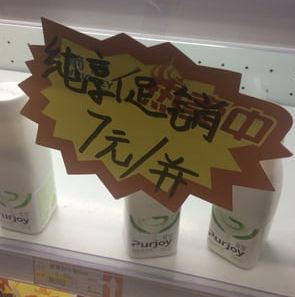

There are some Chinese characters which we should know exist, but they wouldn't normally be used in the HSK exam or in mainland China (so are not included in the MteH corpus).  They may arise outside of mainland China or in Mandarin dialects, or may be considered obsolete, or may be found in usernames, character riddles (字谜), fiction, the Bible, etc.

## Pronouns

There has been many pronouns used throughout the Chinese speaking world, and they have evolved over time.  Some are obsolete, some are used in some parts of the world, some are used in dialects, and some are used in specific circumstances.  They might be encountered in historical movies, quotations, chengyu, classical Chinese, etc.

| Character | Pinyin | Meaning | Person | Notes |
|------------|---------|----------|---------|--------|
| 俺 | ǎn | I / me | 1st | Northern dialect; included in MetH |
| 吾 | wú | I / me | 1st | Classical / literary |
| 予／余 | yú | I / me | 1st | Classical forms |
| 朕 | zhèn | I / me | 1st | Used only by emperors |
| 寡人 | guǎrén | I / me | 1st | Used by ancient nobility |
| 咱 | zán | we (inclusive) | 1st (plural) | Common in Mainland China; included in MteH |
| 侬 | nóng | I / me | 1st | Wu dialect |
| 妳 | nǐ | you (female) | 2nd | Commonly used in Taiwan |
| 祢 | nǐ | you (God) | 2nd | Used in the Bible |
| 恁 | nèn / lín | you (plural / formal) | 2nd | Used in Taiwanese Hokkien |
| 汝 | rǔ | you / thou | 2nd | Classical Chinese |
| 牠 | tā | it (animal) | 3rd | Commonly used in Taiwan |
| 伊 | yī | he / she | 3rd | Classical and southern dialects |
| 佢 | keoi⁵ | he / she / it | 3rd | Cantonese |
| 渠 | qú | he / she | 3rd | Classical Chinese |
| 祂 | tā | He (God) | 3rd | Used in the Bible |
| 怹 | tān | he / she (formal) | 3rd | Obsolete formal form |
| 其 | qí | he / she / it / their | 3rd | Classical / legal Chinese |

Nowadays, "ta" (also written "Ta" or "TA") is sometimes used as a gender-neutral pronoun (e.g., if you don't know which pronoun to use):

> 
>
> [约5000斤稻谷、房屋变“焦炭”，别小看TA的破坏力](https://finance.sina.com.cn/roll/2025-10-25/doc-infvaynn5812262.shtml?cref=cj), 环球网, 2025.

## Abbreviation characters

There's a small number characters which are essentially just abbreviations.  This one is actually used (and is included in the MteH corpus):

> 甭 (béng) 不用

But these characters are not used in standard Mandarin (outside of people saying "these characters exist"):

> 嫑 (biáo) 不要
> 孬 (nāo) 不好
> 甮 (fèng) 勿用
> 嘦 (jiào) 只要

There's also:

> 圕 (tuān) 图书馆

which is rarely seen in calligraphy.

## Multi-syllable characters

Almost every character corresponds to a single syllable in Chinese.  The only exceptions that seem to exist are:

> 瓩 (qiānwǎ) = 千瓦 kilowatt (1000W)  
> 瓸 (bǎiwǎ) = 百瓦 hectowatt (100W)  
> 瓧 (shíwǎ) = 十瓦 decawatt (10W)  
> 瓰 (fēnwǎ) = 分瓦 deciwatt (0.1W)  
> 瓼 (lǐwǎ) = 厘瓦 centiwatt (0.01W)  
> 瓱 (háowǎ) = 毫瓦 milliwatt (0.001W)
> 
> 兛 (qiānkè) = 千克 kilogram (1000g)  
> 兡 (bǎikè) = 百克 hectogram (100g)  
> 兙 (shíkè) = 十克 decagram (10g)  
> 兝 (fēnkè) = 分克 decigram (0.1g)  
> 兣 (gōnglǐ) = 厘克 (líkè) centigram (0.01g)  
> 兞 (háokè) = 毫克 milligram (0.001g)

(And sometimes 圕 is pronounced 图书馆.)  These characters are extremely rare, and probably should be regarded as obsolete.

## Bopomofo/Zhuyin

Instead of pinyin, another pronunciation system is Zhuyin (注音), aka [Bopomofo](https://en.wikipedia.org/wiki/Bopomofo), which has its own characters (enjoy the [Bopomofo song](https://www.youtube.com/watch?v=nKmwhmI0mBE)):

> ㄅ (b) ㄆ (p) ㄇ (m) ㄈ (f) ㄉ (d) ㄊ (t) ㄋ (n) ㄌ (l)  
> ㄍ (g) ㄎ (k) ㄏ (h) ㄐ (j) ㄑ (q) ㄒ (x)  
> ㄓ (zh) ㄔ (ch) ㄕ (sh) ㄖ (r) ㄗ (z) ㄘ (c) ㄙ (s)  
> ㄧ (i) ㄨ (u) ㄩ (ü) ㄚ (a) ㄛ (o) ㄜ (e) ㄝ (ê)  
> ㄞ (ai) ㄟ (ei) ㄠ (ao) ㄡ (ou) ㄢ (an) ㄣ (en) ㄤ (ang) ㄥ (eng) ㄦ (er)  
> 大家一起来唱ㄅㄆㄇㄈ

## Others

### Taiwan

A few characters which are used in Taiwan come up from time to time e.g., if you're reading online:

| Taiwan   | Mainland   |
| -------- | ---------- |
| 蚵 (é)   | 牡蛎 (mǔlì) |
| 矽 (xī)  | 硅 (guī)    |

For example:

>   
>
> [“后果将非常严重”：矽谷对AI泡沫破裂的担忧正在升温](https://www.bbc.com/zhongwen/articles/ce3y3gdv5yxo/simp), BBC, 2025.

### Zero

零 (líng) (meaning 0) can be written as a circle:

> 〇 (líng)

It is often (but not always) used in dates, e.g. 二〇〇八年八月八日.

### Japanese characters

The Japanese character

> の

is often used as a decorative 的 in China, particular in restaurant names.  You might also see the Japanese

> 丼

used for Japanese-style rice dishes.

### Jiong

The characters

> 囧 (jiǒng) and 冏 (jiǒng)

are sometimes used as an "embarrassed face" emoji.

### Biang

The character

> 𰻞 (biáng)

exclusively refers to a type of noodles 𰻞𰻞面.  It's noted for having a large number of characters, and is sometimes used as calligraphy in shops that sell 𰻞.  You'll also see "biangbiang面", perhaps because a font doesn't contain the character 𰻞.

### Shuangxi

The character 

> 囍 (xǐ)

is decorative character used for good fortune for weddings in China; it's called 双喜 (shuāngxǐ).

> 

### Chichu

The characters in

> 彳亍 (chìchù) to walk slowly

seem to be derived from 行 (xíng) "to walk".

### Shorthand

The character

> 歺 (cān)

is used as a simpler way of handwriting 餐 (cān).  You might also encounter other abbreviations, such as:

> 

where 并 is used as an abbreviation for 瓶.

### "Made-up" characters

Sometimes you'll see Chinese characters which are "made up" in some way, such as:

> 
>
> Image source: [Please help to identify the character](https://chinese.stackexchange.com/q/27173/8099)

which is a decorative merging of the characters in the chengyu 招財進寳 (simplified: 招财进宝).  This is the style of writing of [讳秘字](https://zh.wikipedia.org/wiki/讳秘字) (huìmìzì), used in Daoism.

### Swastika

The swastika character is seen in Buddhist temples in China:

> 卐 (wàn)  
> 卍 (wàn)

### Decorative characters

Some characters are mostly used for decorative purposes nowadays, such as:

> 嬲 (niǎo)  
> 嫐 (nǎo)

You may also see things like 火炎焱燚 e.g. in online usernames.  See [Repeated-component characters](repeated_components.md) for a fairly comprehensive list of characters which are composd of repeated components like this; they're often used decoratively.
