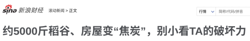
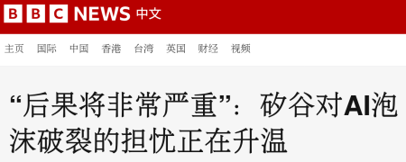
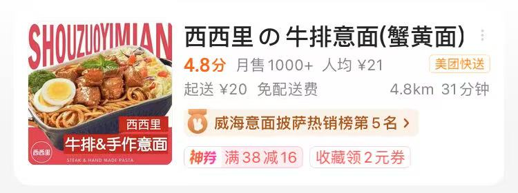
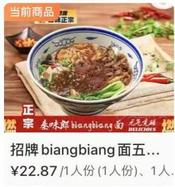
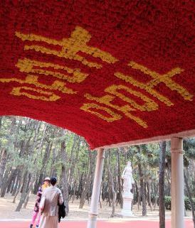
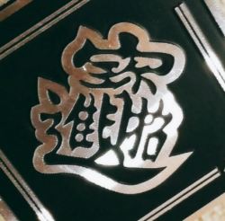

# Characters to know exist

There are some Chinese characters which we should know exist, but they wouldn't normally be used in the HSK exam or in mainland China in standard Mandarin, so are not included in the MteH corpus.  Such characters may arise outside of mainland China or in Mandarin dialects, or may be considered obsolete, or may be found in usernames, character riddles (字谜), fiction, the Bible, etc.

Some topics deserve their own page:

- Every element on the [periodic Table](periodic_table.md) gets its own Chinese character.

- Each Chinese province, etc., is assigned a [province abbreviations](province_abbreviations.md).

- There are characters which are composed on [repeated components](repeated_components.md), which are often used decoratively.

- Some character with specific components are fairly regular: [虫](虫.md) (insects and "lower life forms"), [鱼](鱼.md) (fish and other aquatic animals), [鸟](鸟.md) (birds), [木](木.md) (trees and woods), [疒](疒.md) (sickness).

## Pronouns

There has been many pronouns used throughout the Chinese speaking world, and have changed over time.  Some are obsolete, some are only used in some parts of the world, some are used in dialects, and some are only used in specific circumstances.  They might be encountered in historical movies, quotations, chengyu, classical Chinese, etc.  Aside from the pronouns used in modern standard Mandarin, we have:

| Pronoun | Pinyin | Meaning | Person | Notes |
|------------|---------|----------|---------|--------|
| 俺 | ǎn | I / me | 1st | Northern dialect |
| 吾 | wú | I / me | 1st | Classical / literary |
| 予／余 | yú | I / me | 1st | Classical forms |
| 朕 | zhèn | I / me | 1st | Used only by emperors |
| 寡人 | guǎrén | I / me | 1st | Used by ancient nobility |
| 侬 | nóng | I / me | 1st | Wu dialect |
| 妳 | nǐ | you (female) | 2nd | Commonly used in Taiwan |
| 祢 | nǐ | you (God) | 2nd | Used in the Bible |
| 恁 | nín | you (plural / formal) | 2nd | Used in Taiwanese Hokkien |
| 汝 | rǔ | you / thou | 2nd | Classical Chinese |
| 尔 | ěr | you / thou | 2nd | Classical Chinese |
| 牠 | tā | it (animal) | 3rd | Commonly used in Taiwan |
| 伊 | yī | he / she | 3rd | Classical and southern dialects |
| 佢 | keoi⁵ | he / she / it | 3rd | Cantonese |
| 渠 | qú | he / she | 3rd | Classical Chinese |
| 祂 | tā | He (God) | 3rd | Used in the Bible |
| 怹 | tān | he / she (formal) | 3rd | Obsolete formal form |
| 其 | qí | he / she / it / their | 3rd | Classical / legal Chinese |

This list is not comprehensive.  The pronouns 俺, 吾, and 朕 are included in MteH, and the characters 予, 余, 寡, 人, 汝, 尔, 伊, 渠, and 其 are included in MteH because they are also used outside of pronouns.

Nowadays, "ta" (also written "Ta" or "TA") is sometimes used as a gender-neutral second-person pronoun:

> 
>
> [约5000斤稻谷、房屋变“焦炭”，别小看TA的破坏力](https://finance.sina.com.cn/roll/2025-10-25/doc-infvaynn5812262.shtml?cref=cj), 环球网, 2025.

## Abbreviation characters

There's a small number characters which are essentially just abbreviations:

| Character | Pinyin | Contraction | Notes |
|-----------|--------|-------|-------|
| 甭 | béng | 不用 | Commonly used; included in MteH corpus |
| 嫑 | biáo | 不要 | Rare; not used in standard Mandarin |
| 孬 | nāo | 不好 | Rare; dialectal |
| 甮 | fèng | 勿用 | Rare; obsolete |
| 覅 | fiào​ | 勿要 | Rare; dialectal |
| 嘦 | jiào | 只要 | Rare |
| 圕 | tuān | 图书馆 | Rare; mainly in calligraphy or decorative use |

## Multi-syllable characters

Almost every character corresponds to a single syllable in Chinese.  The only exceptions that seem to exist are:

| Character | Pinyin | Meaning | Value |
|-----------|--------|---------|-------|
| **Power (瓦 / W)** | | | |
| 瓩 | qiānwǎ | 千瓦 | 1000 W |
| 瓸 | bǎiwǎ | 百瓦 | 100 W |
| 瓧 | shíwǎ | 十瓦 | 10 W |
| 瓰 | fēnwǎ | 分瓦 | 0.1 W |
| 瓼 | lǐwǎ | 厘瓦 | 0.01 W |
| 瓱 | háowǎ | 毫瓦 | 0.001 W |
| **Mass (克 / g)** | | | |
| 兛 | qiānkè | 千克 | 1000 g |
| 兡 | bǎikè | 百克 | 100 g |
| 兙 | shíkè | 十克 | 10 g |
| 兝 | fēnkè | 分克 | 0.1 g |
| 兣 | gōnglǐ | 厘克 | 0.01 g |
| 兞 | háokè | 毫克 | 0.001 g |

(And sometimes 圕 is pronounced 图书馆.)  These characters are extremely rare, and probably should be regarded as obsolete.

There's also 粨 (百米; 100m) which may be pronounced bǎi​mǐ, but also just bǎi​.

## Bopomofo/Zhuyin

Instead of pinyin, another pronunciation system is Zhuyin (注音), aka [Bopomofo](https://en.wikipedia.org/wiki/Bopomofo), which has its own characters (enjoy the [Bopomofo song](https://www.youtube.com/watch?v=nKmwhmI0mBE)):

> ㄅ (b) ㄆ (p) ㄇ (m) ㄈ (f) ㄉ (d) ㄊ (t) ㄋ (n) ㄌ (l)  
> ㄍ (g) ㄎ (k) ㄏ (h) ㄐ (j) ㄑ (q) ㄒ (x)  
> ㄓ (zh) ㄔ (ch) ㄕ (sh) ㄖ (r) ㄗ (z) ㄘ (c) ㄙ (s)  
> ㄧ (i) ㄨ (u) ㄩ (ü) ㄚ (a) ㄛ (o) ㄜ (e) ㄝ (ê)  
> ㄞ (ai) ㄟ (ei) ㄠ (ao) ㄡ (ou) ㄢ (an) ㄣ (en) ㄤ (ang) ㄥ (eng) ㄦ (er)  
> 大家一起来唱ㄅㄆㄇㄈ

## Others

### Taiwan

A few characters which are used in Taiwan come up from time to time e.g., if you're reading online:

| Taiwan   | Mainland   |
| -------- | ---------- |
| 蚵 (é)   | 牡蛎 (mǔlì) |
| 矽 (xī)  | 硅 (guī)    |

For example:

> 
>
> [“后果将非常严重”：矽谷对AI泡沫破裂的担忧正在升温](https://www.bbc.com/zhongwen/articles/ce3y3gdv5yxo/simp), BBC, 2025.

### Zero

零 (líng) (meaning 0) can be written as a circle:

> 〇 (líng)

It is often (but not always) used in dates, e.g. 二〇〇八年八月八日.

### Japanese characters

The Japanese character

> の

is often used as a decorative 的 in China, particular in relation to restaurants:

> 
>
> 西西里の牛排意面（蟹黄面）

You might also see the Japanese

> 丼

used for Japanese-style rice dishes.

### Jiong

The characters

> 囧 (jiǒng) and 冏 (jiǒng)

are sometimes used as an "embarrassed face" emoji.

### Biang

The character

> 𰻞 (biáng)

exclusively refers to a type of noodles 𰻞𰻞面.  The character is noted for having a large number of strokes, and is sometimes used as calligraphy in shops that sell 𰻞𰻞面.  You'll normally see "biangbiang面" on menus, perhaps because a font doesn't contain the character 𰻞:

> 
>
> 招牌 biangbiang 面

### Shuangxi

The character 

> 囍 (xǐ)

is decorative character used for good fortune for weddings in China; it's called 双喜 (shuāngxǐ).

> 

### Chichu

The characters in

> 彳亍 (chìchù) to walk slowly

seem to be derived from 行 (xíng) "to walk".

### Jiejue

The word

> 孑孓 (jié​jué) mosquito larva; wiggler

has rarely occurring characters.  The most important thing is to know that they're different characters from 子 and 予.

Instead of 孑孓, you could use the direct 蚊子幼虫.  The literary character 孑 (jié) appears in words like e.g. 孑立 (jié​lì​) = "to be alone" and chengyu such as 孑然一身 and 茕茕孑立, but there are other (more common) ways to express being alone.

### Yuezha

In Mandarin, 蟑螂 (zhāng​láng​) is the word for cockroach; there is a Cantonese word:

> 曱甴 cockroach

although you might see the characters 曱甴 (yuē​zhá) used decoratively.

### Shorthand

The character

> 歺 (cān)

is used as a simpler way of handwriting 餐 (cān).  You might also encounter other abbreviations, such as:

> 

where 并 is used as shorthand for 瓶.

### "Made-up" characters

Sometimes you'll see Chinese characters which are "made up" in some way, such as:

> 
>
> Image source: [Please help to identify the character](https://chinese.stackexchange.com/q/27173/8099)

which is a decorative merging of the characters in the chengyu 招財進寳 (simplified: 招财进宝).  This is the style of writing of [讳秘字](https://zh.wikipedia.org/wiki/讳秘字) (huìmìzì), used in Daoism.

### Swastika

The swastika character is seen in Buddhist temples in China:

> 卐 (wàn)  
> 卍 (wàn)

### Decorative characters

Some characters are mostly used for decorative purposes nowadays, such as:

> 嬲 (niǎo)  
> 嫐 (nǎo)

You may also see things like 火炎焱燚 e.g. in online usernames.  See [Repeated-component characters](repeated_components.md) for a fairly comprehensive list of characters which are composd of repeated components like this; they're often used decoratively.

### Syllables not covered by MteH

Here we survey the syllables which don't occur in MteH.  First, the syllables cēn and děi arise in Mandarin as 多音字 (polyphones):

> 参差不齐 (cēn cī bù qí)  
> 得 (děi)

The character:

> 咯 (lo)

is used as a particle indicating something is obvious.

The characters:

> 扽 (dèn​)  
> 嗲 (diǎ​)  
> 耨 (nòu​)

exist in Mandarin, but are rare.

And some onomatopoeia are given characters, like:

> 欻 (chuā​)  
> 吧 (biā​)
