# Chinese ethnicities

| ethnic group | pinyin | English | images | comments | image source |
|--------------|--------|---------|--------|----------|--------------|
| 汉族 | Hànzú | Han | 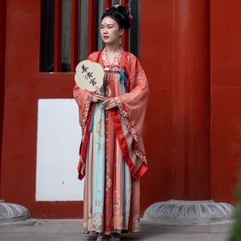 | 90%+ of Chinese people are Han Chinese (largest ethnic group in the world; 1.4 billion people; 20%+ of the world's population); there are another 55 officially recognized ethnic groups in China | [Pexels](https://www.pexels.com/photo/elegant-woman-in-traditional-asian-attire-34521640/); [Wikimedia](https://commons.wikimedia.org/wiki/File:%E6%96%87%E6%88%BF%E5%9B%9B%E5%AF%B6_Four_Treasures_in_the_Study,_Paper,_Writing_Brush,_Ink_Stick,_and_Ink_Stone_-_panoramio.jpg) |

Recognized ethnic minorities:

| ethnic group | pinyin | English | images | comments | image source |
|--------------|--------|---------|--------|----------|--------------|
| 阿昌族 | Āchāngzú | Achang | [TO DO] | | [TO DO] |
| 白族 | Báizú | Bai | 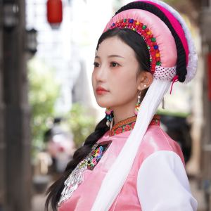 | | [Pexels](https://www.pexels.com/photo/woman-in-pink-traditional-clothing-18658203/) |
| 布朗族 | Bùlǎngzú | Blang | [TO DO] | | [TO DO] |
| 保安族 | Bǎo'ānzú | Bonan | [TO DO] | | [TO DO] |
| 布依族 | Bùyīzú | Bouyei | 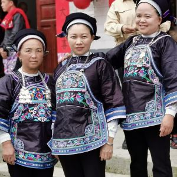 | | [Wikimedia](https://commons.wikimedia.org/wiki/File:Three_matchmakers.jpg) |
| 达斡尔族 | Dáwò'ěrzú | Daur | [TO DO] | | [TO DO] |
| 傣族 | Dǎizú | Dai | 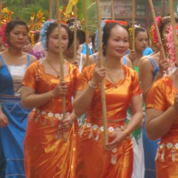 | | [Wikimedia](https://commons.wikimedia.org/wiki/File:%E4%BA%91%E5%8D%97%E7%9C%81%E8%A5%BF%E5%8F%8C%E7%89%88%E7%BA%B3%E5%82%A3%E6%97%8F%E8%87%AA%E6%B2%BB%E5%B7%9E%E6%99%AF%E6%B4%AA%E5%B8%822009%E5%B9%B4%E4%BC%A0%E7%BB%9F%E6%B3%BC%E6%B0%B4%E8%8A%82%E6%97%A5%E9%87%8C%E5%8C%85%E5%90%AB%E9%93%9C%E8%87%AD%E7%85%A7%E7%89%87%E7%BE%A4%E4%BC%97%E7%9A%84%E9%98%9F%E4%BC%8D_-_panoramio.jpg) |
| 德昂族 | Dé'ángzú | De'ang | [TO DO] | | [TO DO] |
| 侗族 | Dòngzú | Dong | 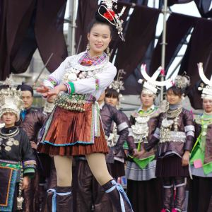 | | [Wikimedia](https://commons.wikimedia.org/wiki/File:%E4%BE%97%E6%97%8F%E6%9C%8D%E9%A5%B02.jpg) |
| 东乡族 | Dōngxiāngzú | Dongxiang | 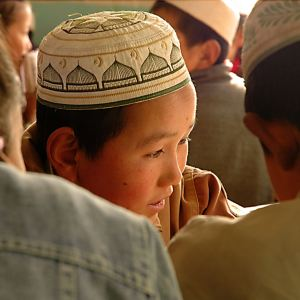 | | [Wikimedia](https://commons.wikimedia.org/wiki/File:Dongxiang_minority_student.jpg) |
| 独龙族 | Dúlóngzú | Drung / Dulong | [TO DO] | | [TO DO] |
| 鄂温克族 | Èwēnkèzú | Ewenki | [TO DO] | | [TO DO] |
| 高山族 | Gāoshānzú | Gaoshan | [TO DO] | | [TO DO] |
| 仡佬族 | Gēlǎozú | Gelao | [TO DO] | | [TO DO] |
| 哈尼族 | Hānízú | Hani | [TO DO] | | [TO DO] |
| 哈萨克族 | Hāsàkèzú | Kazak | [TO DO] | | [TO DO] |
| 回族 | Huízú | Hui | 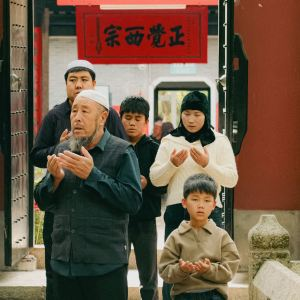 | Islamic ethnic group, noted for 兰州拉面 (Lanzhou pulled noodles) which are 清真 (halal) | [Pexels](https://www.pexels.com/photo/group-praying-at-historical-asian-temple-entrance-30419194/); [Wikimedia](https://commons.wikimedia.org/wiki/File:Lanzhou_Handmade_Beef_Noodles.jpg) |
| 赫哲族 | Hèzhézú | Hezhen | [TO DO] | | [TO DO] |
| 京族 | Jīngzú | Gin; Jing | [TO DO] | | [TO DO] |
| 景颇族 | Jǐngpōzú | Jingpo | [TO DO] | | [TO DO] |
| 基诺族 | Jīnuòzú | Jino | [TO DO] | | [TO DO] |
| 柯尔克孜族 | Kē'ěrkèzīzú | Kyrghiz | 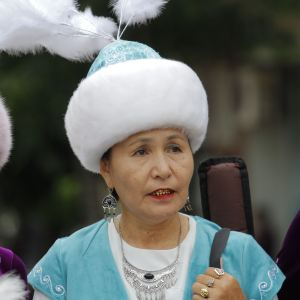 | | [Pexels](https://www.pexels.com/photo/women-in-traditional-hats-17116610/) |
| 朝鲜族 | Cháoxiǎnzú | Korean | [TO DO] | | [TO DO] |
| 拉祜族 | Lāhùzú | Lahu | [TO DO] | | [TO DO] |
| 黎族 | Lízú | Li | [TO DO] | | [TO DO] |
| 傈僳族 | Lìsùzú | Lisu | [TO DO] | | [TO DO] |
| 珞巴族 | Luòbāzú | Lhoba | [TO DO] | | [TO DO] |
| 满族 | Mǎnzú | Manchu | [TO DO] | | [TO DO] |
| 毛南族 | Máonánzú | Maonan | [TO DO] | | [TO DO] |
| 门巴族 | Ménbāzú | Monba | [TO DO] | | [TO DO] |
| 蒙古族 | Měnggǔzú | Mongol | [TO DO] | | [TO DO] |
| 苗族 | Miáozú | Miao; Hmong | 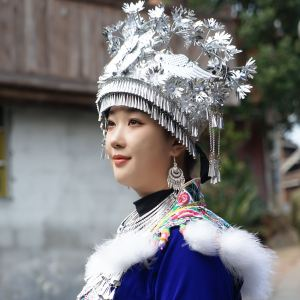 | | [Pexels](https://www.pexels.com/photo/traditional-chinese-costume-with-silver-headwear-30770253/) |
| 仫佬族 | Mùlǎozú | Mulao | [TO DO] | | [TO DO] |
| 纳西族 | Nàxīzú | Naxi | [TO DO] | | [TO DO] |
| 怒族 | Nùzú | Nu | [TO DO] | | [TO DO] |
| 鄂伦春族 | Èlúnchūnzú | Oroqen | [TO DO] | | [TO DO] |
| 普米族 | Pǔmǐzú | Pumi | [TO DO] | | [TO DO] |
| 羌族 | Qiāngzú | Qiang | [TO DO] | | [TO DO] |
| 俄罗斯族 | Éluósīzú | Russian | [TO DO] | | [TO DO] |
| 撒拉族 | Sālāzú | Salar | [TO DO] | | [TO DO] |
| 畲族 | Shēzú | She | [TO DO] | | [TO DO] |
| 水族 | Shuǐzú | Shui | [TO DO] | | [TO DO] |
| 塔吉克族 | Tǎjíkèzú | Tajik | [TO DO] | | [TO DO] |
| 塔塔尔族 | Tǎtǎ'ěrzú | Tatar | [TO DO] | | [TO DO] |
| 藏族 | Zàngzú | Tibetan | 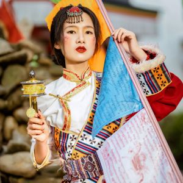 | | [Pexels](https://www.pexels.com/photo/asian-woman-wearing-colorful-kimono-16762991/) |
| 土族 | Tǔzú | Tu | [TO DO] | | [TO DO] |
| 土家族 | Tǔjiāzú | Tujia | [TO DO] | | [TO DO] |
| 维吾尔族 | Wéiwú'ěrzú | Uyghur | 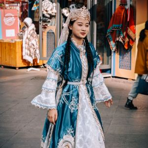 | | [Pexels](https://www.pexels.com/photo/traditional-dress-walking-in-chinese-market-32792820/) |
| 乌孜别克族 | Wūzībiékèzú | Uzbek | 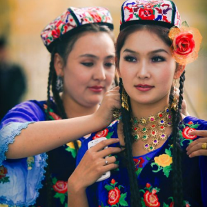 | | [Pexels](https://www.pexels.com/photo/women-wearing-traditional-clothing-9194538/) |
| 佤族 | Wǎzú | Va | [TO DO] | | [TO DO] |
| 锡伯族 | Xíbózú | Xibe | [TO DO] | | [TO DO] |
| 瑶族 | Yáozú | Yao | 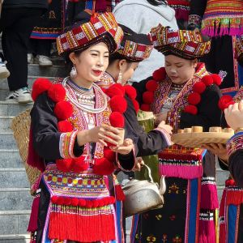 | | [Wikimedia](https://commons.wikimedia.org/wiki/File:Yao_people%27s_Harvest_Festival_in_Nala_Village_-_5.jpg) |
| 彝族 | Yízú | Yi | 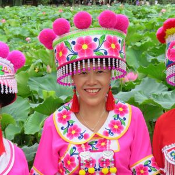 | | [Pexels](https://www.pexels.com/photo/women-wearing-traditional-clothes-12368070/) |
| 裕固族 | Yùgùzú | Yugur | [TO DO] | | [TO DO] |
| 壮族 | Zhuàngzú | Zhuang | 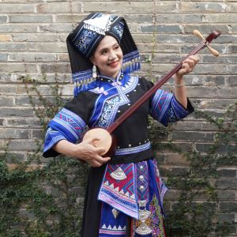 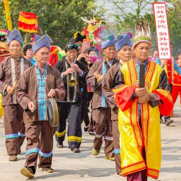 | | [Pexels](https://www.pexels.com/photo/traditional-zhuang-folk-music-performance-34748480/) |

Unrecognized ethnic minorities:

| ethnic group | pinyin | English | images | comments | image source |
|--------------|--------|---------|--------|----------|--------------|
| 摩梭人 | Mósuōrén | Mosuo | [TO DO] | | [TO DO] |
| 穿青人 | Chuānqīngrén | Chuanqing | [TO DO] | | [TO DO] |
| 艾努人 | Àinǔrén | Äynu | [TO DO] | | [TO DO] |
| 革家人 | Géjiārén | Gejia | [TO DO] | | [TO DO] |
| 白马人 | Báimǎrén | Baima | [TO DO] | | [TO DO] |
| 回辉人 | Huíhuīrén | Utsul | [TO DO] | | [TO DO] |
| 夏尔巴人 | Xià'ěrbārén | Sherpa | [TO DO] | | [TO DO] |
