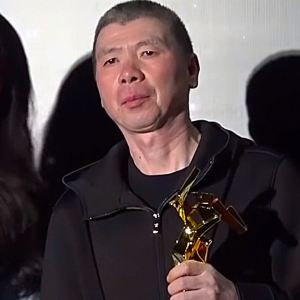

# Characters is Chinese family names

These characters appear in Chinese family names, yet are rarely used in other contexts, and could easily be overlooked in one's studies.  Students need to know how to pronunce them, and recognize that they're family names.

| chars | image 1 | image 2 | image 3 | image sources |
|-------|---------|---------|---------|---------------|
| 亓 | [TO DO] | [TO DO] | [TO DO] | [source 1]; [source 2]; [source 3] |
| 仇 | [TO DO] | [TO DO] | [TO DO] | [source 1]; [source 2]; [source 3] |
| 仝 | [TO DO] | [TO DO] | [TO DO] | [source 1]; [source 2]; [source 3] |
| 佘 | [TO DO] | [TO DO] | [TO DO] | [source 1]; [source 2]; [source 3] |
| 佟 | [TO DO] | [TO DO] | [TO DO] | [source 1]; [source 2]; [source 3] |
| 冯 |  冯小刚 Féng Xiǎogāng |  冯巩 Féng Gǒng |  冯宝宝 Féng Bǎobǎo | [Wikipedia](https://zh.wikipedia.org/wiki/File:%E9%A6%AE%E5%B0%8F%E5%89%9B.jpg); [Wikimedia](https://zh.wikipedia.org/wiki/File:Feng_Gong_in_December_2019.jpg); [Wikimedia](https://zh.wikipedia.org/wiki/File:Petrina_Fung_Bo_Bo.jpg) |
| 冼 | [TO DO] | [TO DO] | [TO DO] | [source 1]; [source 2]; [source 3] |
| 刘 | [TO DO] | [TO DO] | [TO DO] | [source 1]; [source 2]; [source 3] |
| 匡 | [TO DO] | [TO DO] | [TO DO] | [source 1]; [source 2]; [source 3] |
| 卞 | [TO DO] | [TO DO] | [TO DO] | [source 1]; [source 2]; [source 3] |
| 吕 | [TO DO] | [TO DO] | [TO DO] | [source 1]; [source 2]; [source 3] |
| 奚 | [TO DO] | [TO DO] | [TO DO] | [source 1]; [source 2]; [source 3] |
| 姚 | [TO DO] | [TO DO] | [TO DO] | [source 1]; [source 2]; [source 3] |
| 尹 | [TO DO] | [TO DO] | [TO DO] | [source 1]; [source 2]; [source 3] |
| 岑 | [TO DO] | [TO DO] | [TO DO] | [source 1]; [source 2]; [source 3] |
| 崔 | [TO DO] | [TO DO] | [TO DO] | [source 1]; [source 2]; [source 3] |
| 嵇 | [TO DO] | [TO DO] | [TO DO] | [source 1]; [source 2]; [source 3] |
| 廖 | [TO DO] | [TO DO] | [TO DO] | [source 1]; [source 2]; [source 3] |
| 敖 | [TO DO] | [TO DO] | [TO DO] | [source 1]; [source 2]; [source 3] |
| 昝 | [TO DO] | [TO DO] | [TO DO] | [source 1]; [source 2]; [source 3] |
| 晁 | [TO DO] | [TO DO] | [TO DO] | [source 1]; [source 2]; [source 3] |
| 曾 | [TO DO] | [TO DO] | [TO DO] | [source 1]; [source 2]; [source 3] |
| 朴 | [TO DO] | [TO DO] | [TO DO] | [source 1]; [source 2]; [source 3] |
| 栾 | [TO DO] | [TO DO] | [TO DO] | [source 1]; [source 2]; [source 3] |
| 樊 | [TO DO] | [TO DO] | [TO DO] | [source 1]; [source 2]; [source 3] |
| 沈 | [TO DO] | [TO DO] | [TO DO] | [source 1]; [source 2]; [source 3] |
| 潘 | [TO DO] | [TO DO] | [TO DO] | [source 1]; [source 2]; [source 3] |
| 狄 | [TO DO] | [TO DO] | [TO DO] | [source 1]; [source 2]; [source 3] |
| 瞿 | [TO DO] | [TO DO] | [TO DO] | [source 1]; [source 2]; [source 3] |
| 祁 | [TO DO] | [TO DO] | [TO DO] | [source 1]; [source 2]; [source 3] |
| 翟 | [TO DO] | [TO DO] | [TO DO] | [source 1]; [source 2]; [source 3] |
| 聂 | [TO DO] | [TO DO] | [TO DO] | [source 1]; [source 2]; [source 3] |
| 胥 | [TO DO] | [TO DO] | [TO DO] | [source 1]; [source 2]; [source 3] |
| 臧 | [TO DO] | [TO DO] | [TO DO] | [source 1]; [source 2]; [source 3] |
| 芮 | [TO DO] | [TO DO] | [TO DO] | [source 1]; [source 2]; [source 3] |
| 蒋 | [TO DO] | [TO DO] | [TO DO] | [source 1]; [source 2]; [source 3] |
| 蔡 | [TO DO] | [TO DO] | [TO DO] | [source 1]; [source 2]; [source 3] |
| 蔺 | [TO DO] | [TO DO] | [TO DO] | [source 1]; [source 2]; [source 3] |
| 薛 | [TO DO] | [TO DO] | [TO DO] | [source 1]; [source 2]; [source 3] |
| 虞 | [TO DO] | [TO DO] | [TO DO] | [source 1]; [source 2]; [source 3] |
| 袁 | [TO DO] | [TO DO] | [TO DO] | [source 1]; [source 2]; [source 3] |
| 裴 | [TO DO] | [TO DO] | [TO DO] | [source 1]; [source 2]; [source 3] |
| 褚 | [TO DO] | [TO DO] | [TO DO] | [source 1]; [source 2]; [source 3] |
| 覃 | [TO DO] | [TO DO] | [TO DO] | [source 1]; [source 2]; [source 3] |
| 谌 | [TO DO] | [TO DO] | [TO DO] | [source 1]; [source 2]; [source 3] |
| 谭  | [TO DO] | [TO DO] | [TO DO] | [source 1]; [source 2]; [source 3] |
| 贾 | [TO DO] | [TO DO] | [TO DO] | [source 1]; [source 2]; [source 3] |
| 逯 | [TO DO] | [TO DO] | [TO DO] | [source 1]; [source 2]; [source 3] |
| 邓 | [TO DO] | [TO DO] | [TO DO] | [source 1]; [source 2]; [source 3] |
| 邝 | [TO DO] | [TO DO] | [TO DO] | [source 1]; [source 2]; [source 3] |
| 邢 | [TO DO] | [TO DO] | [TO DO] | [source 1]; [source 2]; [source 3] |
| 邬 | [TO DO] | [TO DO] | [TO DO] | [source 1]; [source 2]; [source 3] |
| 邰 | [TO DO] | [TO DO] | [TO DO] | [source 1]; [source 2]; [source 3] |
| 邱 | [TO DO] | [TO DO] | [TO DO] | [source 1]; [source 2]; [source 3] |
| 邵 | [TO DO] | [TO DO] | [TO DO] | [source 1]; [source 2]; [source 3] |
| 邸 | [TO DO] | [TO DO] | [TO DO] | [source 1]; [source 2]; [source 3] |
| 邹 | [TO DO] | [TO DO] | [TO DO] | [source 1]; [source 2]; [source 3] |
| 郜 | [TO DO] | [TO DO] | [TO DO] | [source 1]; [source 2]; [source 3] |
| 郝 | [TO DO] | [TO DO] | [TO DO] | [source 1]; [source 2]; [source 3] |
| 郭 | [TO DO] | [TO DO] | [TO DO] | [source 1]; [source 2]; [source 3] |
| 鄢 | [TO DO] | [TO DO] | [TO DO] | [source 1]; [source 2]; [source 3] |
| 闫, 阎 | [TO DO] | [TO DO] | [TO DO] | [source 1]; [source 2]; [source 3] |
| 闵 | [TO DO] | [TO DO] | [TO DO] | [source 1]; [source 2]; [source 3] |
| 阙 | [TO DO] | [TO DO] | [TO DO] | [source 1]; [source 2]; [source 3] |
| 阚 | [TO DO] | [TO DO] | [TO DO] | [source 1]; [source 2]; [source 3] |
| 阮 | [TO DO] | [TO DO] | [TO DO] | [source 1]; [source 2]; [source 3] |
| 靳 | [TO DO] | [TO DO] | [TO DO] | [source 1]; [source 2]; [source 3] |
| 龚 | [TO DO] | [TO DO] | [TO DO] | [source 1]; [source 2]; [source 3] |

The copyrighted images above have been reduced in quality from their originals, and are used under "fair use" for educational purposes (much like how Baidu Image Search or Google Image Search uses copyrighted images).  The author is not an international copyright lawyer, so if a mistake has been made, please [raise an issue](https://github.com/becky82/mteh/issues) so it can be corrected.
