# Characters common in given names

These characters appear often in given names in Chinese (in Chinese names and/or transliterations of non-Chinese names), yet are rarely used in other contexts.  Students might encounter these characters in names, so need to know how they're pronounced, but in general, it's not especially important to know what these characters mean.  I suggest paying attention to male vs. female names, Chinese vs. non-Chinese names, two vs. three characters, and the age range of people who have a given character in their name.

| chars | image 1 | image 2 | image 3 | image sources |
|-------|---------|---------|---------|---------------|
| 乔 |  史蒂文·乔布斯 Shǐdìwén Qiáobùsī (Steve Jobs) |  迈克尔·乔丹 Màikè'ěr Qiáodān (Michael Jordan) |  乔治 Qiáozhì (George) | [Wikimedia](https://commons.wikimedia.org/wiki/File:%E4%B8%8A%E6%B5%B7_%E5%BE%AE%E5%8D%9A%E7%94%B5%E5%BD%B1%E4%B9%8B%E5%A4%9C_(2).jpg); [Wikipedia](https://zh.wikipedia.org/wiki/%E8%BF%88%E5%85%8B%E5%B0%94%C2%B7%E4%B9%94%E4%B8%B9); [Peppa Pig Fandom](https://peppapig.fandom.com/wiki/George_Pig) |
| 亨 | 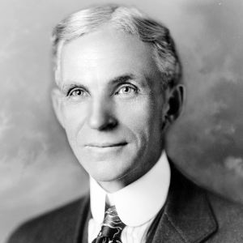 亨利·福特 Hēnglì Fútè (Henry Ford) |  亨利八世 Hēnglì bāshì (Henry the 8th) |  亨利·卡维尔 Hēnglì Kǎwéi'ěr (Henry Cavill) | [Wikimedia](https://commons.wikimedia.org/wiki/File:Henry_ford_1919.jpg); [Wikimedia](https://commons.wikimedia.org/wiki/File:After_Hans_Holbein_the_Younger_-_Portrait_of_Henry_VIII_-_Google_Art_Project.jpg); [Wikimedia](https://commons.wikimedia.org/wiki/File:Henry_Cavill_(48417923606).jpg) |
| 俪 |  孙俪 Sūn Lì |  张俪 Zhāng Lì |  唐俪辞 Táng Lìcí | [Wikimedia](https://commons.wikimedia.org/wiki/File:Sun_Li_(%E5%AD%99%E4%BF%AA)_at_the_premiere_event_of_the_film_%22Looking_Up%22_(%E9%93%B6%E6%B2%B3%E8%A1%A5%E4%B9%A0%E7%8F%AD)_in_July_2019.png) ; [Baidu Baike](https://baike.baidu.com/item/%E5%BC%A0%E4%BF%AA/10390391); [Baidu Baike](https://baike.baidu.com/item/%E5%94%90%E4%BF%AA%E8%BE%9E/63747880) |
| 卢 |  卢卡斯·莫拉 Lúkǎsī Mòlā (Lucas Moura) |  罗梅卢·卢卡库 Luóméilú Lúkǎkù (Romelu Lukaku) |   乔治·卢卡斯 Qiáozhì Lúkǎsī (George Lucas) | [Wikimedia](https://commons.wikimedia.org/wiki/File:Lucas_training_Doha_2013_01.jpg); [Wikimedia](https://commons.wikimedia.org/wiki/File:Romelu_Lukaku_(12.06.2021)_(cropped).jpg); [Wikimedia](https://commons.wikimedia.org/wiki/File:George_Lucas_cropped_2009.jpg) |
| 喆 |  陶喆 Táo Zhé |  陈喆 Chén Zhé | 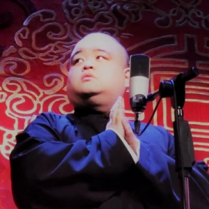 刘喆 Liú Zhé | [Wikipedia](https://zh.wikipedia.org/wiki/File:%E9%99%B6%E5%96%86_%E5%86%8D%E4%BB%B6%E4%BD%A0%E5%A5%BD%E5%97%8E_%E6%96%B0%E6%AD%8C%E7%99%BC%E8%A1%A8%E6%9C%83.JPG); [Wikipedia](https://en.wikipedia.org/wiki/File:1080113%E9%9F%93%E5%9C%8B%E7%91%9C%E6%8B%9C%E6%9C%83%E7%93%8A%E7%91%A4_%E9%80%9A%E7%A8%BF01_(cropped).jpg); [Baidu Baike](https://baike.baidu.com/item/%E5%88%98%E5%96%86/2834365) |
| 奕 |  赵奕欢 Zhào Yìhuān |  张奕 Zhāng Yì |  陈奕迅 Chén Yìxùn | [Baidu Baike](https://baike.baidu.com/item/%E8%B5%B5%E5%A5%95%E6%AC%A2/6954925); [Wikimedia](https://commons.wikimedia.org/wiki/File:Chang_Yi_Saitama_Seibu_Lions_20230423.jpg); [Wikimedia](https://commons.wikimedia.org/wiki/File:EasonChanperformance.jpg) |
| 妍 |  陈妍希 Chén Yánxī |  朴芝妍 Piáo Zhīyán 박지연 Bak Ji Yeon | 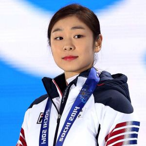 金妍儿 Jīn Yánér 김연아 Kim Yeon-a | [Wikipedia](https://zh.wikipedia.org/wiki/File:Michelle_Chen.jpg); [Wikipedia](https://zh.wikipedia.org/wiki/File:170614_T-ARA_Park_Ji-yeon_at_What%27s_My_Name_Showcase.jpg); [Wikipedia](https://zh.wikipedia.org/wiki/%E9%87%91%E5%A6%8D%E5%85%92#/media/File:Korea_Kim_Yuna_Sochi_Medal_Ceremony_08.jpg) |
| 娜 | 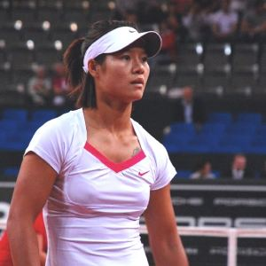 李娜 Lǐ Nà |  安吉丽娜·朱莉 Ānjílìnà Zhūlì (Angelina Jolie) |  古力娜扎 Gǔlìnàzhā (Gülnezer) | [Wikimedia](https://commons.wikimedia.org/wiki/File:Li_Na_Photo_by_Sascha_Grabow.jpg); [Wikimedia](https://commons.wikimedia.org/wiki/File:Angelina_Jolie_at_the_2025_Toronto_International_Film_Festival._02.jpg); [YouTube](https://youtu.be/GO6-GolalNs?si=KRhBX-sW-KF_OxDK&t=27) |
| 娟 | 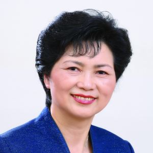 李兰娟 Lǐ Lánjuān | 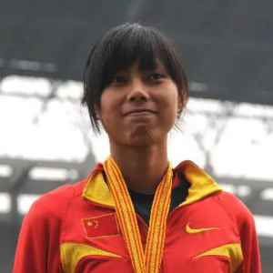 郑幸娟 Zhèng Xìngjuān | 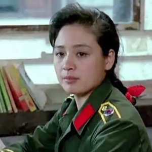 伍宇娟 Wǔ Yǔjuān | [Wikipedia](https://en.wikipedia.org/wiki/Li_Lanjuan); [Baidu Baike](https://baike.baidu.com/item/%E9%83%91%E5%B9%B8%E5%A8%9F/4876048); [Baidu Baike](https://baike.baidu.com/item/%E4%BC%8D%E5%AE%87%E5%A8%9F/3601201) |
| 婧 |  鞠婧祎 Jū Jìngyī | 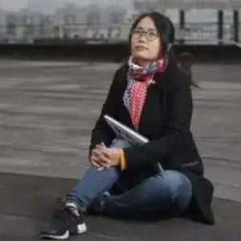 郭婧 Guō Jìng | 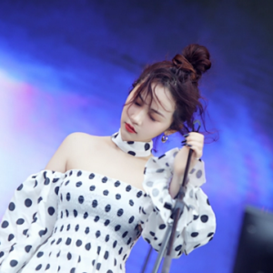 陈婧霏 Chén Jìngfēi | [Wikimedia](https://zh.wikipedia.org/wiki/File:%E9%9E%A0%E5%A9%A7%E7%A5%8E_%E6%81%8B%E7%88%B1%E5%91%8A%E6%80%A5%E8%88%9E%E5%8F%B0.jpg); [Baidu Baike](https://baike.baidu.com/item/%E9%83%AD%E5%A9%A7/19927639); [Baidu Baike](https://baike.baidu.com/item/%E9%99%88%E5%A9%A7%E9%9C%8F/23674423) |
| 婷 | 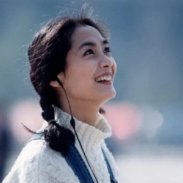 李婷 Lǐ Tíng |  王婷 Wáng Tíng | 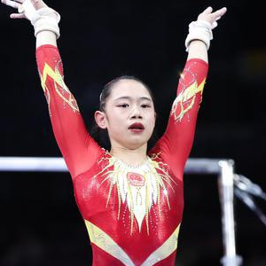 刘婷婷 Liú Tíngtíng | [Baidu Baike](https://baike.baidu.com/item/%E6%9D%8E%E5%A9%B7/7588649); [Baidu Baike](https://baike.baidu.com/item/%E7%8E%8B%E5%A9%B7/17947435); [Sina News](https://sports.sina.cn/others/ticao/2019-10-08/detail-iicezzrr0895169.d.html) |
| 媛 | 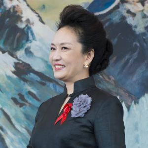 彭丽媛 Péng Lìyuán | 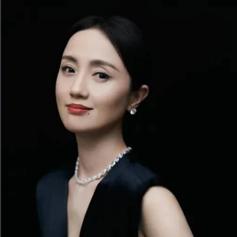 朱媛媛 Zhū Yuányuán |  李媛 Lǐ Yuán | [Wikimedia](https://commons.wikimedia.org/wiki/File:JulianaAwada_y_Peng_Liyuan.jpg); [Baidu Baike](https://baike.baidu.com/item/%E6%9C%B1%E5%AA%9B%E5%AA%9B/506550); [Baidu Baike](https://baike.baidu.com/item/%E6%9D%8E%E5%AA%9B/3451) |
| 宸 | 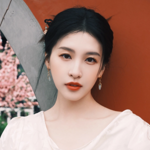 杜雨宸 Dù Yǔchén | 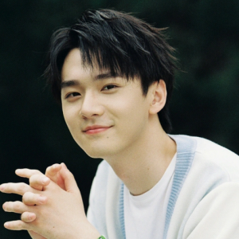 张宸逍 Zhāng Chénxiāo | 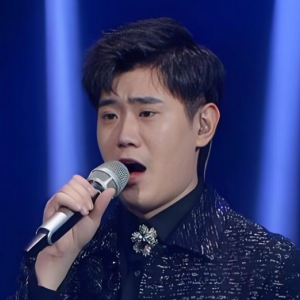 戴宸 Dài Chén | [Baidu Baike](https://baike.baidu.com/item/%E6%9D%9C%E9%9B%A8%E5%AE%B8/17181150); [Baidu Baike](https://baike.baidu.com/item/%E5%BC%A0%E5%AE%B8%E9%80%8D/58919083); [Baidu Baike](https://baike.baidu.com/item/%E6%88%B4%E5%AE%B8/49717610) |
| 尼 |  梅拉尼娅·特朗普 Méilāníyà Tèlǎngpǔ (Melania Trump) | 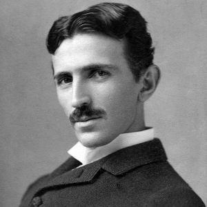 尼古拉·特斯拉 Nígǔlā Tèsīlā (Nikola Tesla) |  尼尔·阿姆斯特朗 Ní'ěr Āmǔsītèlǎng (Neil Armstrong) | [Wikimedia](https://commons.wikimedia.org/wiki/File:Melania_Trump_official_portrait_(cropped).jpg); [Wikimedia](https://commons.wikimedia.org/wiki/File:Tesla_circa_1890.jpeg); [Wikimedia](https://commons.wikimedia.org/wiki/File:Neil_Armstrong_pose.jpg) |
| 怡 | 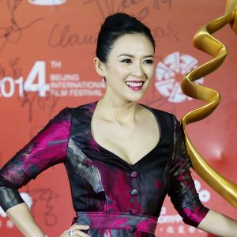 章子怡 Zhāng Zǐyí |  罗怡 Luó Yí | 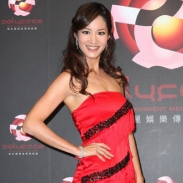 谢怡芬 Xiè Yífēn | [Wikimedia](https://commons.wikimedia.org/wiki/File:%E5%8C%97%E4%BA%AC%E7%94%B5%E5%BD%B1%E8%8A%82%E9%97%AD%E5%B9%95%E5%BC%8F%E7%BA%A2%E6%AF%AF---%E7%AB%A0%E5%AD%90%E6%80%A1.jpg); [Baidu Baike](https://baike.baidu.com/item/%E7%BD%97%E6%80%A1/23711790); [Baidu Baike](https://baike.baidu.com/item/%E8%B0%A2%E6%80%A1%E8%8A%AC/9243099) |
| 昊 | 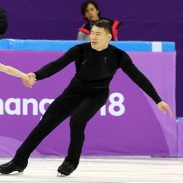 张昊 Zhāng Hào |  李昊 Lǐ Hào |  陈昊宇 Chén Hàoyǔ | [Wikimedia](https://commons.wikimedia.org/wiki/File:Photos_%E2%80%93_Olympics_2018_%E2%80%93_Pairs_(YU_Xiaoyu_ZHANG_Hao_CHN_%E2%80%93_8th_Place)_(22).jpg); [Baidu Baike](https://baike.baidu.com/item/%E6%9D%8E%E6%98%8A/22336959); [Baidu Baike](https://baike.baidu.com/item/%E9%99%88%E6%98%8A%E5%AE%87/769842) |
| 昕 | 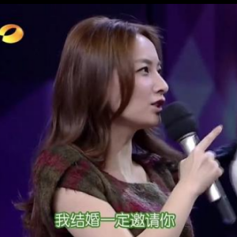 吴昕 Wú Xīn | 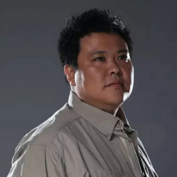 张昕宇 Zhāng Xīnyǔ | 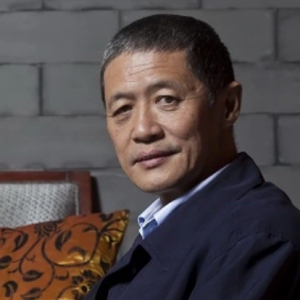 李昕 Lǐ Xīn | [Wap Baike](https://wapbaike.baidu.com/tashuo/browse/content?id=0705d7139dcf0efd71a207fc); [baidu Baike](https://baike.baidu.com/item/%E5%BC%A0%E6%98%95%E5%AE%87/79048); [Baidu Baike](https://baike.baidu.com/item/李昕/2069892) |
| 梓 | 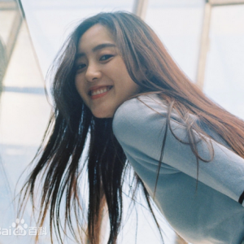 王梓薇 Wáng Zǐwēi |  张梓琳 Zhāng Zǐlín | 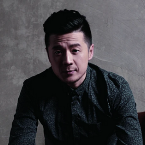 赵梓冲 Zhào Zǐchōng | [Baidu Baike](https://baike.baidu.com/item/%E7%8E%8B%E6%A2%93%E8%96%87/19709653); [Wikimedia](https://commons.wikimedia.org/wiki/File:Miss_World_2007_-_Zhang_Zilin_(3243539382).jpg); [Baidu Baike](https://baike.baidu.com/item/%E8%B5%B5%E6%A2%93%E5%86%B2/8679256) |
| 烨 | 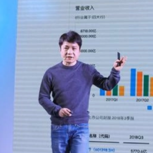 陈烨 Chén Yè |  王烨 Wáng Yè |  黄寅烨 Huáng Yínyè 황인엽 Hwang In-youp | [Baidu Baike](https://baike.baidu.com/item/%E9%99%88%E7%83%A8/20786488); [Baidu Baike](https://baike.baidu.com/item/%E7%8E%8B%E7%83%A8/53486496); [Wikimedia](https://commons.wikimedia.org/wiki/File:%ED%99%A9%EC%9D%B8%EC%97%BD.jpg) |
| 煜 | 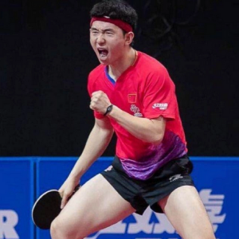 张煜东 Zhāng Yùdōng |  王煜辉 Wáng Yùhuī | 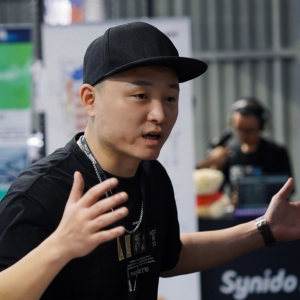 陈煜 Chén Yù | [Baidu Baike](https://baike.baidu.com/item/%E5%BC%A0%E7%85%9C%E4%B8%9C/15286416); [Baidu Baike](https://baike.baidu.com/item/%E7%8E%8B%E7%85%9C%E8%BE%89/10621394); [Baidu Baike](https://baike.baidu.com/item/陈煜/23758778) |
| 珂 | 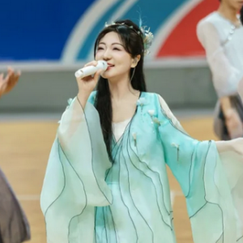 刘珂矣 Liú Kēyǐ |  徐珂 Xú Kē | 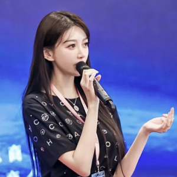 叶珂 Yè Kē | [Baidu Baike](https://baike.baidu.com/item/%E5%88%98%E7%8F%82%E7%9F%A3/4473594); [Baidu Baike](https://baike.baidu.com/item/%E5%BE%90%E7%8F%82/23578331); [Baidu Baike](https://baike.baidu.com/item/%E5%8F%B6%E7%8F%82/3082453) |
| 珊 | 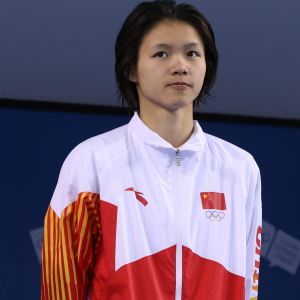 林珊 Lín Shān |  苏珊·博伊尔 Sūshān Bóyīěr (Susan Boyle) |  张珊 Zhāng Shān | [Wikipedia](https://zh.wikipedia.org/wiki/File:2018-10-15_Victory_ceremony_(Diving_Girls_3m_springboard)_at_2018_Summer_Youth_Olympics_by_Sandro_Halank%E2%80%93014.jpg); [Wikimedia](https://commons.wikimedia.org/wiki/File:Susan_Boyle_Nov_2009.jpg); [Baidu Baike](https://baike.baidu.com/item/%E5%BC%A0%E7%8F%8A/67095448) |
| 琛 | 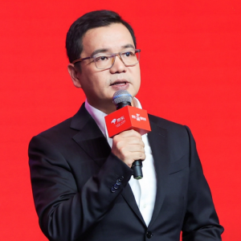 林琛 Lín Chēn | 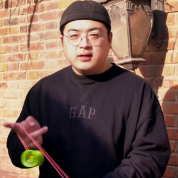 刘子琛 Liú Zǐchēn |  陈琛 Chén Chēn | [Baidu Baike](https://baike.baidu.com/item/%E6%9E%97%E7%90%9B/7076065); [Baidu Baike](https://baike.baidu.com/item/%E5%88%98%E5%AD%90%E7%90%9B/62568027); [Baidu Baike](https://baike.baidu.com/item/%E9%99%88%E7%90%9B/18841943) |
| 琦 | 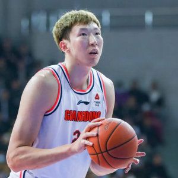 周琦 Zhōu Qí |  宋雨琦 Sòng Yǔqí |  吴琦 Wú Qí | [Wikipedia](https://zh.wikipedia.org/wiki/%E5%91%A8%E7%90%A6); [Wikimedia](https://commons.wikimedia.org/wiki/File:6%EC%9B%94_2%EC%9D%BC_(%EC%97%AC%EC%9E%90)%EC%95%84%EC%9D%B4%EB%93%A4_%ED%8C%AC%EC%82%AC%EC%9D%B8%ED%9A%8C_(6).jpg); [Baidu Baike](https://baike.baidu.com/item/%E5%90%B4%E7%90%A6/13034434) |
| 琪 |  陈钰琪 Chén Yùqí | 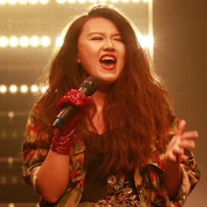 李琪 Lǐ Qí | 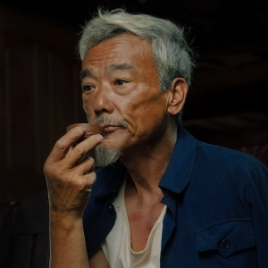 张琪 Zhāng Qí | [Wikipedia](https://zh.wikipedia.org/wiki/File:YukeeChen2018Guangzhou.jpg); [Baidu Baike](https://baike.baidu.com/item/%E6%9D%8E%E7%90%AA/15199254); [Baidu Baike](https://baike.baidu.com/item/%E5%BC%A0%E7%90%AA/10463910) |
| 瑶 | 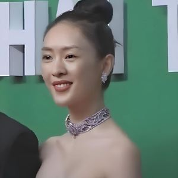 童瑶 Tóng Yáo |  王伊瑶 Wáng Yīyáo | 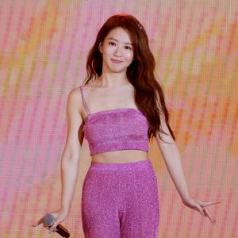 郭书瑶 Guō Shūyáo | [Wikimedia](https://commons.wikimedia.org/wiki/File:Tong_Yao_(%E7%AB%A5%E7%91%B6)_at_the_25th_Shanghai_Television_Festival_-_Magnolia_Awards_in_June_2019.jpg); [Baidu Baike](https://baike.baidu.com/item/%E7%8E%8B%E4%BC%8A%E7%91%B6/61453309); [Wikipedia](https://zh.wikipedia.org/wiki/File:Kuo_Shu-yau_2023.jpg) |
| 璇 | 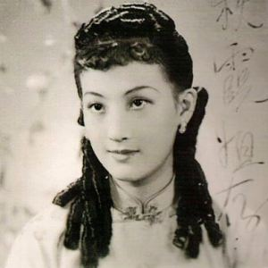 周璇 Zhōu Xuán | 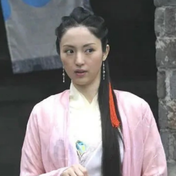 董璇 Dǒng Xuán | 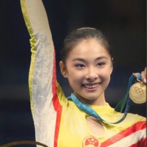 刘璇 Liú Xuán | [Wikimedia](https://commons.wikimedia.org/wiki/File:Zhou_Xuan3.jpg); [Baidu Baike](https://baike.baidu.com/item/%E8%91%A3%E7%92%87/364782); [Baidu Baike](https://baike.baidu.com/item/%E5%88%98%E7%92%87/6098) |
| 璐 | 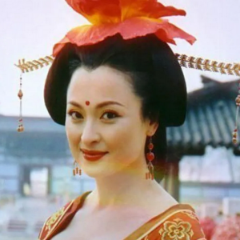 王璐瑶 Wáng Lùyáo |  李璐璐 Lǐ Lùlù | 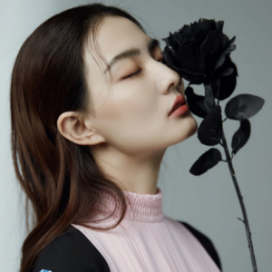 徐璐 Xú Lù | [Baidu Baike](https://baike.baidu.com/item/%E7%8E%8B%E7%92%90%E7%91%B6/52073); [Baidu Baike](https://baike.baidu.com/item/%E6%9D%8E%E7%92%90%E7%92%90/64171532); [Baidu Baike](https://baike.baidu.com/item/%E5%BE%90%E7%92%90/51957) |
| 睿 |  赵睿 Zhào Ruì |  张睿 Zhāng Ruì | 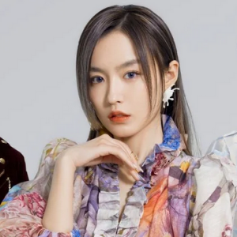 韩睿 Hán Ruì | [Baidu Baike](https://baike.baidu.com/item/%E8%B5%B5%E7%9D%BF/16684438); [Baidu Baike](https://baike.baidu.com/item/%E5%BC%A0%E7%9D%BF/10510276); [Baidu Baike](https://baike.baidu.com/item/%E9%9F%A9%E7%9D%BF/22995966) |
| 祺 | 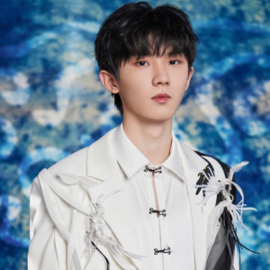 马嘉祺 Mǎ Jiāqí | 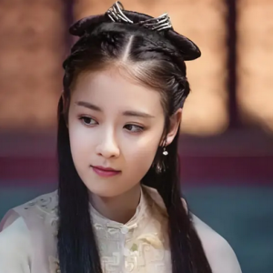 杨祺如 Yáng Qírú | 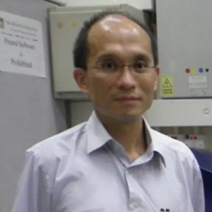 张祺忠 Zhāng Qízhōng | [Baidu Baike](https://baike.baidu.com/item/%E9%A9%AC%E5%98%89%E7%A5%BA/17979493); [Baidu Baike](https://baike.baidu.com/item/%E6%9D%A8%E7%A5%BA%E5%A6%82/23476421); [Baidu Baike](https://baike.baidu.com/item/%E5%BC%A0%E7%A5%BA%E5%BF%A0/22843846) |
| 芷 |  刘芷汐 Liú Zhǐxī |  韩芷苓 Hán Zhǐlíng | 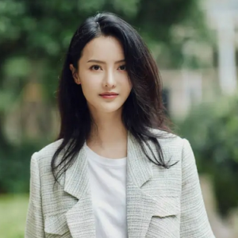 张芷溪 Zhāng Zhǐxī | [Baidu Baike](https://baike.baidu.com/item/%E5%88%98%E8%8A%B7%E6%B1%90/12008094); [Baidu Baike](https://baike.baidu.com/item/%E9%9F%A9%E8%8A%B7%E8%8B%93/19316967); [Baidu Baike](https://baike.baidu.com/item/%E5%BC%A0%E8%8A%B7%E6%BA%AA/1351450) |
| 轩 | 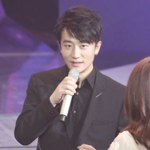 黄轩 Huáng Xuān |  张轩睿 Zhāng Xuānruì |  王轩 Wáng Xuān | [Wikimedia](https://commons.wikimedia.org/wiki/File:%E4%B8%8A%E6%B5%B7_%E5%BE%AE%E5%8D%9A%E7%94%B5%E5%BD%B1%E4%B9%8B%E5%A4%9C_(2).jpg); [Wikimedia](https://commons.wikimedia.org/wiki/File:Derek_Chang_%E5%BC%B5%E8%BB%92%E7%9D%BF_-_Live_interview_after_the_premiere_of_TV_series_%22Yong-Jiu_Grocery_Store%22_on_August_15,_2019.jpg); [Baidu Baike](https://baike.baidu.com/item/%E7%8E%8B%E8%BD%A9/23480901) |
| 鑫 |  张鑫 Zhāng Xīn | 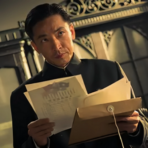 王鑫 Wáng Xīn |  郑鑫 Zhèng Xīn | [Baidu Baike](https://baike.baidu.com/item/%E5%BC%A0%E9%91%AB/19823527); [Baidu Baike](https://baike.baidu.com/item/%E7%8E%8B%E9%91%AB/1629186); [Baidu Baike](https://baike.baidu.com/item/%E9%83%91%E9%91%AB/60249972) |
| 钊 |  梁钊峰 Liáng Zhāofēng | [TO DO] | [TO DO] | [Wikimedia](https://zh.wikipedia.org/wiki/File:Chiu_Fung_20231012.jpg); [source 2]; [source 3] |
| 雯 | [TO DO] | [TO DO] | [TO DO] | [source 1]; [source 2]; [source 3] |
| 骁 | [TO DO] | [TO DO] | [TO DO] | [source 1]; [source 2]; [source 3] |
| 骊 | [TO DO] | [TO DO] | [TO DO] | [source 1]; [source 2]; [source 3] |
| 骥 | [TO DO] | [TO DO] | [TO DO] | [source 1]; [source 2]; [source 3] |

The copyrighted images above have been reduced in quality from their originals, and are used under "fair use" for educational purposes (much like how Baidu Image Search or Google Image Search uses copyrighted images).  The author is not an international copyright lawyer, so if a mistake has been made, please [raise an issue](https://github.com/becky82/mteh/issues) so it can be corrected.
