# Characters in Chinese historical figure's names

The characters listed below are noteworthy because they occur in Chinese historical figure's names, and are rarely (if ever) used outside these names.  It's not especially important to know what these characters mean, but it is important to be able to recognize these historical figures.

| chars | name | pinyin | image | description | image source |
|-------|------|--------|-------|-------------|--------------|
| 丕 | 曹丕 | Cáo Pī | 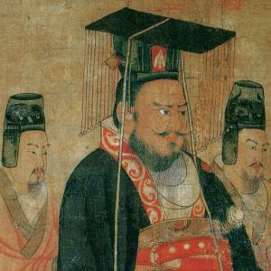 | 曹操's son and second emperor of 魏 Wei during the Three Kingdoms period | [Wikimedia](https://zh.wikipedia.org/wiki/%E6%9B%B9%E4%B8%95) |
| 僧 | 唐僧 | Tángsēng | 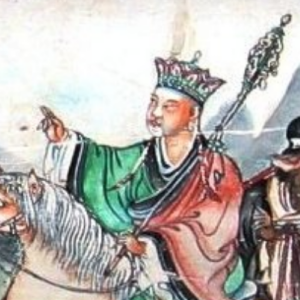 | Buddhist monk Tripitaka in novel "Journey to the West" 《西游记》, based on historical 玄奘 | [Wikimedia](https://en.wikipedia.org/wiki/File:JourneytotheWest.jpg) |
| 勰 | 刘勰 | Liú Xié | 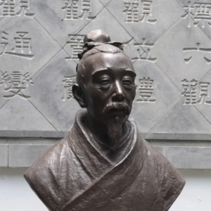 | Southern Qi / Liang dynasty monk; author of 《文心雕龙》 | [Baidu Baike](https://baike.baidu.com/item/%E5%88%98%E5%8B%B0/197270) |
| 匡, 胤 | 赵匡胤 | Zhào Kuāngyìn | 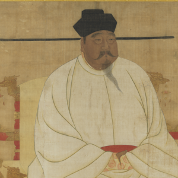 | Founder of Song dynasty | [Wikimedia](https://commons.wikimedia.org/wiki/File:Song_Taizu.jpg) |
| 奘 | 玄奘 | Xuánzàng | 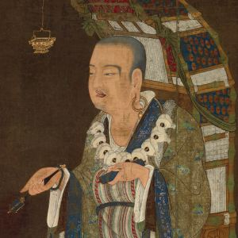 | Tang dynasty monk | [Wikimedia](https://zh.wikipedia.org/wiki/File:Xuanzang_w.jpg) |
| 妲 | 妲己 | Dájǐ | 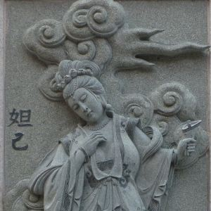 | favourite consort of 商纣王 King Zhou of Shang | [Wikimedia](https://zh-classical.wikipedia.org/wiki/%E6%AA%94%E6%A1%88:Ping_Sien_Si_-_026_Daji_(16133466711).jpg) |
| 棠 | 左宗棠 | Zuǒ Zōngtáng | 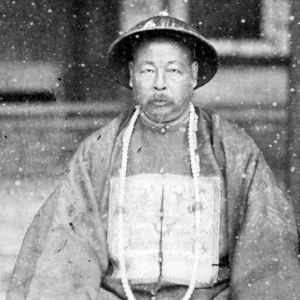 | Qing dynasty general; "General Tso" | [Wikimedia](https://commons.wikimedia.org/wiki/File:Zuo_Zongtang_1875.jpg) |
| 棣 | 朱棣 | Zhū Dì | 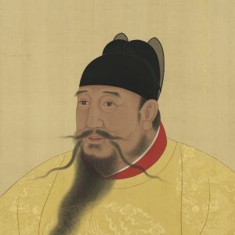 | Ming emperor 永乐 Yongle | [Wikimedia](https://commons.wikimedia.org/wiki/File:%E5%A4%AA%E5%AE%97%E6%96%87%E7%9A%87%E5%B8%9D.jpg) |
| 洵 | 苏洵 | Sū Xún | 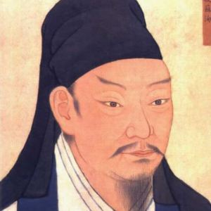 | Song dynasty scholar, father of 苏轼 Su Shi and 苏辙 Su Zhe | [Wikimedia](https://commons.wikimedia.org/wiki/File:%E5%AE%8B%E5%A4%AA%E5%B8%B8%E7%BC%96%E6%A0%A1%E8%8B%8F%E6%B4%B5.jpg) |
| 熙 | 康熙 | Kāngxī | 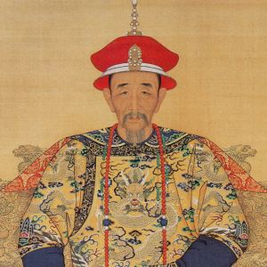 | Qing emperor; known for e.g. Kangxi dictionary 《康熙字典》 | [Wikimedia](https://commons.wikimedia.org/wiki/File:Portrait_of_the_Kangxi_Emperor_in_Court_Dress.jpg) |
| 熹 | 朱熹 | Zhū Xī | 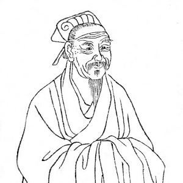 | Song dynasty Neo-Confucian philosopher | [Wikimedia](https://commons.wikimedia.org/wiki/File:Zhu_Xi.jpg) |
| 瑜 | 周瑜 | Zhōu Yú | 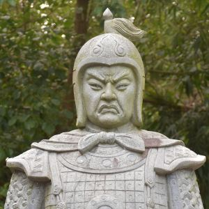 | Eastern Wu general, strategist in Three Kingdoms | [Wikimedia](https://commons.wikimedia.org/wiki/File:DSC_0365_(44986130604).jpg) |
| 甫 | 杜甫 | Dù Fǔ | 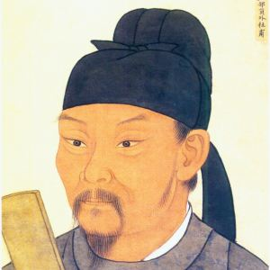 | Tang dynasty poet | [Wikimedia](https://commons.wikimedia.org/wiki/File:Dufu.jpg) |
| 祯 | 崇祯 | Chóng Zhēn | 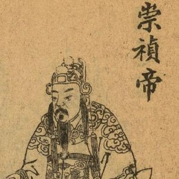 | last Ming emperor | [Wikimedia](https://zh.wikipedia.org/wiki/File:%E6%98%8E%E6%84%8D%E5%B8%9D%E6%9C%B1%E7%94%B1%E6%A3%80.jpg) |
| 禧 | 慈禧 | Cíxǐ | 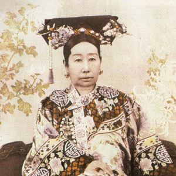 | Qing dynasty empress dowager | [Wikimedia](https://commons.wikimedia.org/wiki/File:Empress_Dowager_Cixi_(c._1890,_small_version)_-_02.jpg) |
| 纣 | 商纣王 | Shāng Zhòu Wáng | 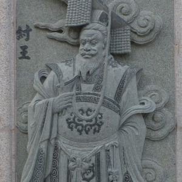 | tyrannical Shang dynasty king | [Wikimedia](https://commons.wikimedia.org/wiki/File:King_Zhou_of_Shng_Dynasty.jpg) |
| 羲 | 王羲之 | Wáng Xīzhī | 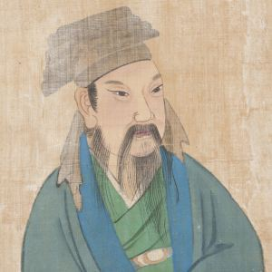 | Jin dynasty calligrapher, known as 书圣 "Sage of Calligraphy" | [Wikimedia](https://en.wikipedia.org/wiki/File:Portraits_of_Famous_Men_-_Wang_Xizhi_(cropped).jpg) |
| 菩 | 观音菩萨 | Guānyīn Púsà | 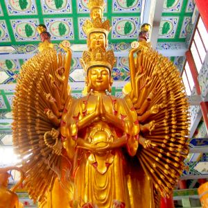 | the 菩萨 Bodhisattva of compassion in Buddhism | [Wikimedia](https://commons.wikimedia.org/wiki/File:Thousand_Armed_Avalokitesvara_-_Guanyin_Nunnery_-_2.jpeg) |
| 葛 | 诸葛亮 | Zhūgě Liàng | 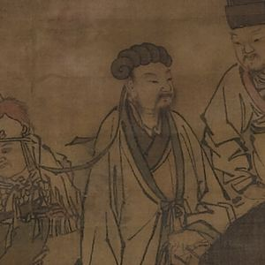 | Shu 蜀 strategist during the Three Kingdoms, famed for wisdom | [Wikimedia](https://commons.wikimedia.org/wiki/File:Kongming_Leaving_the_Mountains_(cropped).jpg) |
| 轲 | 孟轲 | Mèng Kē | 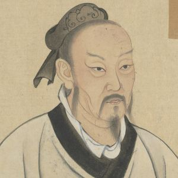 | Confucian philosopher Mencius; also known as 孟子 Mèngzǐ | [Wikimedia](https://commons.wikimedia.org/wiki/File:Mencius_Chinese_portrait.jpg) |
| 轼 | 苏轼 | Sū Shì | 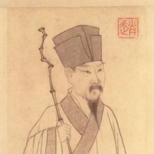 | Song dynasty poet | [Wikimedia](https://commons.wikimedia.org/wiki/File:Su_shi.jpg) |
| 辙 | 苏辙 | Sū Zhé | 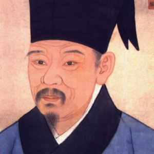 | Song dynasty scholar, younger brother of 苏轼 Su Shi | [Wikimedia](https://commons.wikimedia.org/wiki/File:%E5%AE%8B%E9%97%A8%E4%B8%8B%E4%BE%8D%E9%83%8E%E8%8B%8F%E6%96%87%E5%AE%9A%E5%85%AC%E8%BE%99.jpg) |
| 逵 | 李逵 | Lǐ Kuí | 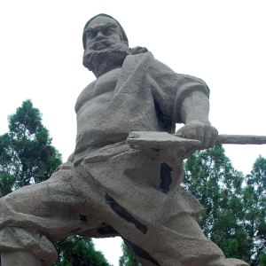 | hero in novel "Water Margin" 《水浒传》 | [Wikimedia](https://commons.wikimedia.org/wiki/File:Shuipo_Liangshan_(2910767757).jpg) |

