# Characters in Chinese historical figures' names

The characters listed below are noteworthy because they occur in Chinese historical figure's names, and are rarely (if ever) used outside these names.  It's not especially important to know what these characters mean, but it is important to be able to recognize these historical figures.

| chars | name | pinyin | image | description | image source |
|-------|------|--------|-------|-------------|--------------|
| 丕 | 曹丕 | Cáo Pī |  | 曹操's son and second emperor of 魏 Wei during the Three Kingdoms period | [Wikimedia](https://zh.wikipedia.org/wiki/%E6%9B%B9%E4%B8%95) |
| 仝 | 卢仝 | Lú Tóng | 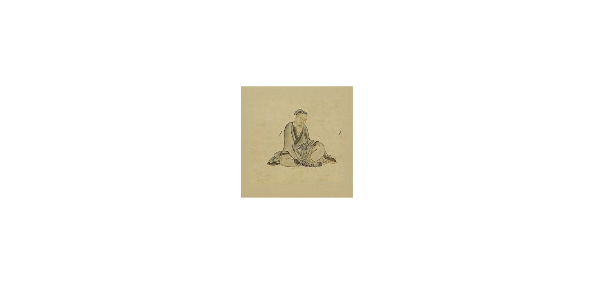 | Tang dynasty poet, known for Lu Tong's Seven Bowls of Tea [《七碗茶歌》](https://baike.baidu.com/item/%E4%B8%83%E7%A2%97%E8%8C%B6%E6%AD%8C/50360173) | [Wikimedia](https://commons.wikimedia.org/wiki/File:Tang_dynasty_poet_Lu_Tong.jpg); margins adjusted using Pixelcut AI |
| 佗 | 华佗 | Huà Tuó | 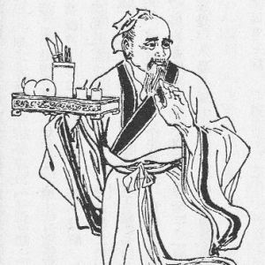 | Han dynasty physician | [Wikimedia](https://commons.wikimedia.org/wiki/File:HuaTuo.jpg) |
| 俞 | 俞伯牙 | Yú Bóyá | 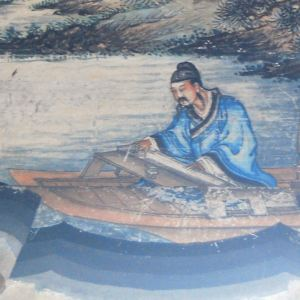 | guqin master of Spring and Autumn period; known for friendship with 钟子期 and the [知音](https://baike.baidu.com/item/%E7%9F%A5%E9%9F%B3/677) backstory | [Wikimedia](https://commons.wikimedia.org/wiki/File:Boya.JPG) |
| 僧 | 唐僧 | Tángsēng |  | Buddhist monk Tripitaka in novel "Journey to the West" 《西游记》, based on historical 玄奘; the character 僧 appears in 僧人 (sēngrén) one of the words for monk, along with 和尚 (héshang) | [Wikimedia](https://en.wikipedia.org/wiki/File:JourneytotheWest.jpg) |
| 勰 | 刘勰 | Liú Xié |  | Southern Qi / Liang dynasty monk; author of [《文心雕龙》](https://baike.baidu.com/item/%E6%96%87%E5%BF%83%E9%9B%95%E9%BE%99/743008) | [Baidu Baike](https://baike.baidu.com/item/%E5%88%98%E5%8B%B0/197270) |
| 勰 | 贾思勰 | Jiǎ Sīxié |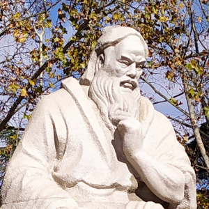 | Northern Wei agricultural scientist; author of [《齐民要术》](https://baike.baidu.com/item/%E9%BD%90%E6%B0%91%E8%A6%81%E6%9C%AF/581147) | [Wikimedia](https://commons.wikimedia.org/wiki/File:%E8%B4%BE%E6%80%9D%E5%8B%B0%E5%83%8F.jpg) |
| 匡 | 匡衡 | Kuāng Héng | 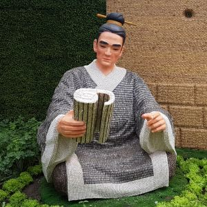 | Known for the chengyu [凿壁偷光](https://baike.baidu.com/item/凿壁借光/1570589) | [Wikimedia](https://commons.wikimedia.org/wiki/File:2017-04-20_Shouguang_Vegetable_SciTech_Fair_3.038_anagoria.jpg) |
| 匡, 胤 | 赵匡胤 | Zhào Kuāngyìn |  | Founder of Song dynasty; origin of the chengyu [黄袍加身](https://baike.baidu.com/item/%E9%BB%84%E8%A2%8D%E5%8A%A0%E8%BA%AB/1453087); known for [杯酒释兵权](https://baike.baidu.com/item/%E6%9D%AF%E9%85%92%E9%87%8A%E5%85%B5%E6%9D%83/186091) after taking power where he convinced generals to relinquish power (rather than execute them), leading to [重文轻武](https://baike.baidu.com/item/重文轻武) and a downplaying of military strength | [Wikimedia](https://commons.wikimedia.org/wiki/File:Song_Taizu.jpg) |
| 奘 | 玄奘 | Xuánzàng |  | Tang dynasty monk | [Wikimedia](https://zh.wikipedia.org/wiki/File:Xuanzang_w.jpg) |
| 妲 | 妲己 | Dájǐ |  | favourite consort of 商纣王 King Zhou of Shang | [Wikimedia](https://zh-classical.wikipedia.org/wiki/%E6%AA%94%E6%A1%88:Ping_Sien_Si_-_026_Daji_(16133466711).jpg) |
| 姒 | 褒姒 | Bāo Sì | 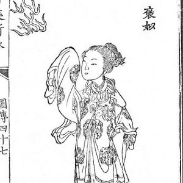 | a wife of 周幽王 (King You of Zhou); a figure in the [烽火戏诸侯](https://baike.baidu.com/item/烽火戏诸侯/34836) (a Chinese fable akin to "the boy who cried wolf", but with beacons lit unnecessarily) leading to the end of the Western Zhou dynasty | [Wikimedia](https://zh.wikipedia.org/zh-cn/%E8%A4%92%E5%A7%92) |
| 嬴 | 嬴政 | Yíng Zhèng | 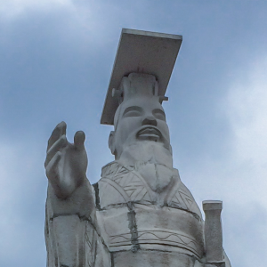 | personal name of 秦始皇, the first emperor of a unified China | [Wikimedia](https://commons.wikimedia.org/wiki/File:Qin_Shi_Huang_statue.jpg) |
| 尧 | 尧 | Yáo | 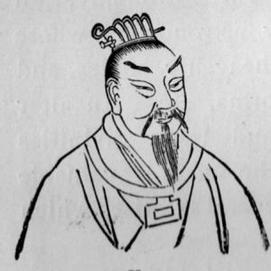 | legendary ruler Yao; one of the [五帝](https://baike.baidu.com/item/%E4%BA%94%E5%B8%9D/362094) (Five Legendary Emperors); passed the throne to the meritorious 舜 (Shun) instead of his own son | [Wikimedia](https://commons.wikimedia.org/wiki/File:EmperorYao2.jpg) |
| 嵇 | 嵇康 | Jī Kāng | 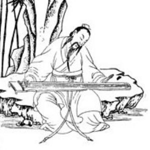 | Three Kingdoms composer, essayist, poet | [Wikimedia](https://commons.wikimedia.org/wiki/File:Xikang_(cropped).jpg) |
| 彧 | 荀彧 | Xún Yù | 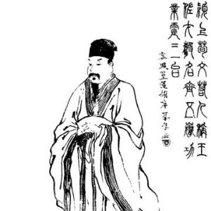 | Political strategist and advisor to Cao Cao in late Han dynasty | [Wikimedia](https://commons.wikimedia.org/wiki/File:Xun_Yu_Qing_illustration.jpg) |
| 晁 | 晁补之 | Cháo Bǔzhī | 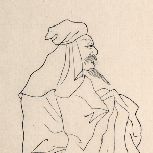 | Northern Song dynasty poet; one of the four [苏门四学士](https://baike.baidu.com/item/苏门四学士) who studied under 苏轼 | [Wikimedia](https://zh.wikipedia.org/wiki/%E6%99%81%E8%A1%A5%E4%B9%8B#/media/File:%E6%99%81%E8%A3%9C%E4%B9%8B.jpg) |
| 棠 | 左宗棠 | Zuǒ Zōngtáng |  | Qing dynasty general; used in 左宗棠鸡 (General Tso's chicken) | [Wikimedia](https://commons.wikimedia.org/wiki/File:Zuo_Zongtang_1875.jpg) |
| 棣 | 朱棣 | Zhū Dì |  | Ming emperor 永乐 Yongle | [Wikimedia](https://commons.wikimedia.org/wiki/File:%E5%A4%AA%E5%AE%97%E6%96%87%E7%9A%87%E5%B8%9D.jpg) |
| 洵 | 苏洵 | Sū Xún |  | Song dynasty scholar, father of 苏轼 Su Shi and 苏辙 Su Zhe | [Wikimedia](https://commons.wikimedia.org/wiki/File:%E5%AE%8B%E5%A4%AA%E5%B8%B8%E7%BC%96%E6%A0%A1%E8%8B%8F%E6%B4%B5.jpg) |
| 炀 | 隋炀帝 | Suí Yáng Dì | 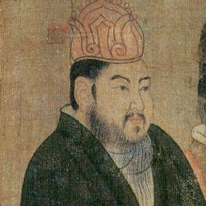 | Emperor Yang of Sui; 杨广 | [Wikimedia](https://commons.wikimedia.org/wiki/File:Sui_Yangdi_Tang.jpg) |
| 熙 | 康熙 | Kāngxī |  | Qing emperor; known for e.g. Kangxi dictionary [《康熙字典》](https://baike.baidu.com/item/%E5%BA%B7%E7%86%99%E5%AD%97%E5%85%B8/599071) | [Wikimedia](https://commons.wikimedia.org/wiki/File:Portrait_of_the_Kangxi_Emperor_in_Court_Dress.jpg) |
| 熹 | 朱熹 | Zhū Xī |  | Song dynasty Neo-Confucian philosopher | [Wikimedia](https://commons.wikimedia.org/wiki/File:Zhu_Xi.jpg) |
| 珅 | 和珅 | Hé Shēn | 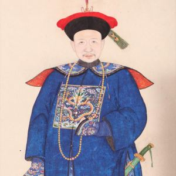 | Corrupt manchu Qing dynasty official | [Wikimedia](https://commons.wikimedia.org/wiki/File:Hesen.jpg) |
| 瑜 | 周瑜 | Zhōu Yú |  | Eastern Wu general, strategist in Three Kingdoms period | [Wikimedia](https://commons.wikimedia.org/wiki/File:DSC_0365_(44986130604).jpg) |
| 瓒 | 公孙瓒 | Gōngsūn Zàn | 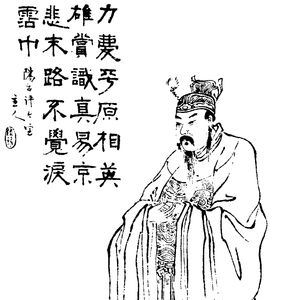 | late-Han warlord; called 白马将军 for riding a white horse; he called his followers who also rode white horses 白马义从 | [Wikimedia](https://commons.wikimedia.org/wiki/File:Gongsun_Zan_Qing_illustration.jpg) |
| 甫 | 杜甫 | Dù Fǔ |  | Tang dynasty poet | [Wikimedia](https://commons.wikimedia.org/wiki/File:Dufu.jpg) |
| 祯 | 崇祯 | Chóng Zhēn |  | last Ming emperor | [Wikimedia](https://zh.wikipedia.org/wiki/File:%E6%98%8E%E6%84%8D%E5%B8%9D%E6%9C%B1%E7%94%B1%E6%A3%80.jpg) |
| 禧 | 慈禧 | Cíxǐ |  | Qing dynasty empress dowager | [Wikimedia](https://commons.wikimedia.org/wiki/File:Empress_Dowager_Cixi_(c._1890,_small_version)_-_02.jpg) |
| 禹 | 大禹 | Dà Yǔ | 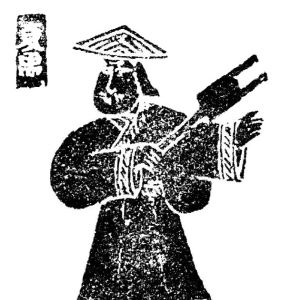 | Yu the Great (or Yu the Engineer), founder of the Xia dynasty; legendary ruler who tamed the Great Flood through irrigation canals [大禹治水](https://baike.baidu.com/item/%E5%A4%A7%E7%A6%B9%E6%B2%BB%E6%B0%B4/13884282) | [Wikimedia](https://commons.wikimedia.org/wiki/File:%E5%A4%A7%E7%A6%B9%E6%B2%BB%E6%B0%B4%E5%9C%96.jpg) |
| 纣 | 商纣王 | Shāng Zhòu Wáng |  | tyrannical Shang dynasty king | [Wikimedia](https://commons.wikimedia.org/wiki/File:King_Zhou_of_Shng_Dynasty.jpg) |
| 羲 | 王羲之 | Wáng Xīzhī |  | Jin dynasty calligrapher, known as 书圣 "Sage of Calligraphy"; the chengyu [入木三分](https://baike.baidu.com/item/入木三分/830568) describes the difficulty in carving his calligraphy into wood, and is now used to praise incisive writing | [Wikimedia](https://en.wikipedia.org/wiki/File:Portraits_of_Famous_Men_-_Wang_Xizhi_(cropped).jpg) |
| 羿 | 后羿 | Hòuyì | 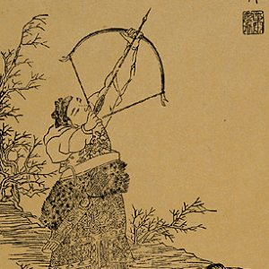 | mythological archer; wife is 嫦娥; known for shooting down 9 of 10 suns [后羿射日](https://baike.baidu.com/item/%E5%90%8E%E7%BE%BF%E5%B0%84%E6%97%A5/1059) | [Wikimedia](https://commons.wikimedia.org/wiki/File:Houyi_Shooting_an_Arrow,_Xiao_Yuncong.gif) |
| 聃 | 老聃 | Lǎo Dān | 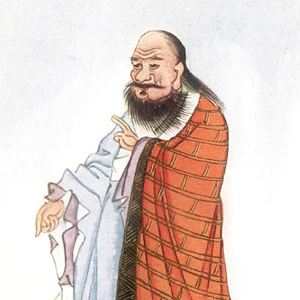 | 老子 (Laozi), ancient philosopher and founder of Taoism | [Wikimedia](https://commons.wikimedia.org/wiki/File:Lao_Tzu_-_Project_Gutenberg_eText_15250.jpg) |
| 胥 | 伍子胥 | Wǔ Zǐxū | 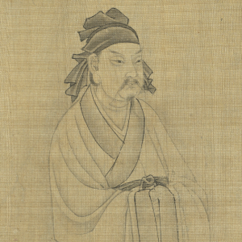 | military general and politician of Wu during the Spring and Autumn period; also called 伍员 (Wǔ Yún)  | [Wikimedia](https://zh.wikipedia.org/wiki/File:Wu_Yun_(Wu_Zixu).png) |
| 膑 | 孙膑 | Sūn Bìn | 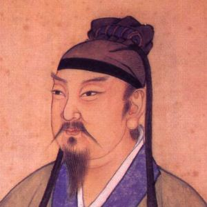 | Warring States military strategist of Qi; author of [《孙膑兵法》](https://baike.baidu.com/item/%E5%AD%99%E8%86%91%E5%85%B5%E6%B3%95/436235) (Sun Bin's Art of War) | [Wikimedia](https://commons.wikimedia.org/wiki/File:Sun_Bin.jpg) |
| 舜 | 舜 | Shùn | 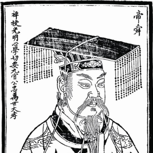 | legendary ruler Yao; one of the [五帝](https://baike.baidu.com/item/%E4%BA%94%E5%B8%9D/362094) (Five Legendary Emperors); aka 虞舜 (Yú Shùn) | [Wikimedia](https://commons.wikimedia.org/wiki/File:%E5%B8%9D%E8%88%9C.png) |
| 荀 | 荀子 | Xún Zǐ | 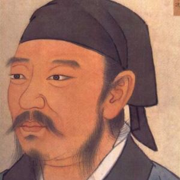 | Warring States Confucian philosopher; author of [《荀子》](https://baike.baidu.com/item/荀子/6764725) | [Wikimedia](https://zh.wikipedia.org/wiki/File:%E6%88%98%E5%9B%BD%E6%97%B6%E6%A5%9A%E5%85%B0%E9%99%B5%E4%BB%A4%E8%8D%80%E5%86%B5.jpg) |
| 菩 | 观音菩萨 | Guānyīn Púsà |  | the 菩萨 Bodhisattva of compassion in Buddhism | [Wikimedia](https://commons.wikimedia.org/wiki/File:Thousand_Armed_Avalokitesvara_-_Guanyin_Nunnery_-_2.jpeg) |
| 葛 | 诸葛亮 | Zhūgě Liàng |  | Shu 蜀 strategist during the Three Kingdoms, famed for wisdom; 诸葛 is a two-character surname | [Wikimedia](https://commons.wikimedia.org/wiki/File:Kongming_Leaving_the_Mountains_(cropped).jpg) |
| 蔺 | 蔺相如 | Lìn Xiāngrú | 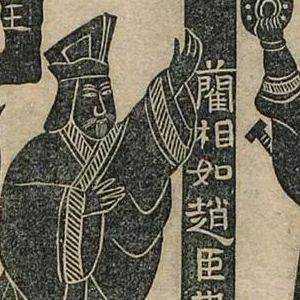 | Warring States Zhao diplomat, famous for 《战国策》; part of the background stories for the chengyus [完璧归赵](https://baike.baidu.com/item/%E5%AE%8C%E7%92%A7%E5%BD%92%E8%B5%B5/358352) and [刎颈之交](https://baike.baidu.com/item/%E5%88%8E%E9%A2%88%E4%B9%8B%E4%BA%A4/318215) | [Wikimedia](https://en.wikipedia.org/wiki/File:Heshibi_%E5%AE%8C%E7%92%A7%E5%BD%92%E8%B5%B5%E6%AD%A6%E6%B0%8F%E7%A5%A0_%E9%87%91%E7%9F%B3%E7%B4%A23.jpg) |
| 蚩 | 蚩尤 | Chī Yóu |  | Mythical tribal leader of the Nine Li tribe; ancient war deity defeated by the 黄帝 (Yellow Emperor) at the [涿鹿之战](https://baike.baidu.com/item/%E6%B6%BF%E9%B9%BF%E4%B9%8B%E6%88%98/120371) | [Wikimedia](https://commons.wikimedia.org/wiki/File:Chi_You.gif) |
| 蠡 | 范蠡 | Fàn Lǐ | 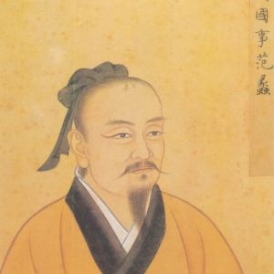 | politician of Yue during Spring and Autumn period | [Wikimedia](https://zh-classical.wikipedia.org/wiki/%E6%AA%94%E6%A1%88:Fanli.jpg) |
| 襄 | 赵襄子 | Zhào Xiāngzǐ | 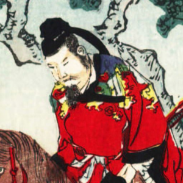 | founder of 赵国 during the late Spring and Autumn period; appears in the background story for [争先恐后](https://baike.baidu.com/item/%E4%BA%89%E5%85%88%E6%81%90%E5%90%8E/1663456) | [Wikimedia](https://commons.wikimedia.org/wiki/File:Yu_Rang_cuts_the_robe,_ascribed_Nobukazu.jpg) |
| 詹 | 詹天佑 | Zhān Tiānyòu | 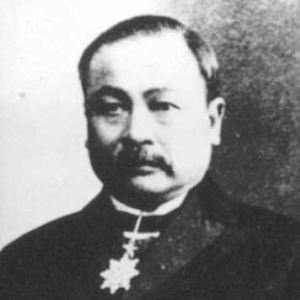 | known as the 中国铁路之父 (Father of China's Railroad) for building the [京张铁路](https://baike.baidu.com/item/%E4%BA%AC%E5%BC%A0%E9%93%81%E8%B7%AF/1702790) (Imperial Peking-Kalgan Railway) | [Wikimedia](https://commons.wikimedia.org/wiki/File:Jeme_Tien_Yow.jpg) |
| 诩 | 贾诩 | Jiǎ Xǔ | 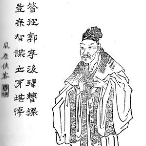 | Cao Wei official in Three Kingdoms period | [Wikimedia](https://commons.wikimedia.org/wiki/File:Jia_Xu2.jpg) |
| 轲 | 孟轲 | Mèng Kē |  | Confucian philosopher Mencius; also known as 孟子 Mèngzǐ; the chengyu [孟母三迁](https://baike.baidu.com/item/%E5%AD%9F%E6%AF%8D%E4%B8%89%E8%BF%81/826039) tells the story of his mother moving house twice (three residences) to secure Mencius's education | [Wikimedia](https://commons.wikimedia.org/wiki/File:Mencius_Chinese_portrait.jpg) |
| 轼 | 苏轼 | Sū Shì |  | Song dynasty poet | [Wikimedia](https://commons.wikimedia.org/wiki/File:Su_shi.jpg) |
| 辙 | 苏辙 | Sū Zhé |  | Song dynasty scholar, younger brother of 苏轼 Su Shi | [Wikimedia](https://commons.wikimedia.org/wiki/File:%E5%AE%8B%E9%97%A8%E4%B8%8B%E4%BE%8D%E9%83%8E%E8%8B%8F%E6%96%87%E5%AE%9A%E5%85%AC%E8%BE%99.jpg) |
| 逖 | 祖逖 | Zǔ Tì | 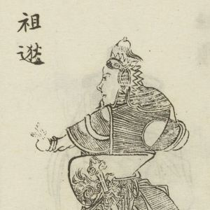 | Jin Dynasty general; forces lost during [五胡乱华](https://baike.baidu.com/item/五胡乱华) (Upheaval of the Five Barbarians) | [Wikimedia](https://commons.wikimedia.org/wiki/File:Zu_Ti(%E7%B9%A1%E5%83%8F%E4%B8%89%E5%9C%8B%E6%BC%94%E7%BE%A9%E7%BA%8C%E7%B7%A8).jpg) |
| 逵 | 李逵 | Lǐ Kuí |  | fictional; hero in novel "Water Margin" 《水浒传》 | [Wikimedia](https://commons.wikimedia.org/wiki/File:Shuipo_Liangshan_(2910767757).jpg) |
| 遂 | 毛遂 | Máo Suì| 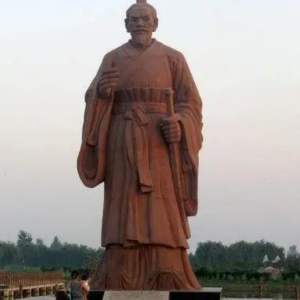 | Zhao diplomat in Warring States period; volunteered to secure Chu alliance [毛遂自荐](https://baike.baidu.com/item/%E6%AF%9B%E9%81%82%E8%87%AA%E8%8D%90/81734) | [Baidu Baike](https://baike.baidu.com/item/%E6%AF%9B%E9%81%82/342316) |
| 郃 | 张郃 | Zhāng Hé | 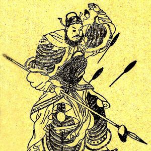 | Cao Wei general in Three Kingdoms period; also called 儁乂 (Jùnyì) | [Wikimedia](https://commons.wikimedia.org/wiki/File:Zhang_He_Portrait.jpg) |
| 郦 | 郦道元 | Lì Dàoyuán | 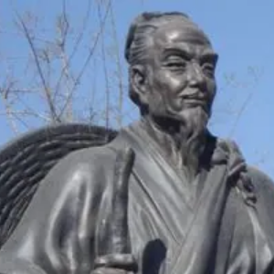 | Northern Wei geographer and writer; author of 《水经注》 (Commentary on the Water Classic) | [Baidu Baike](https://baike.baidu.com/item/%E9%83%A6%E9%81%93%E5%85%83/378151) |
| 雉 | 吕雉 | Lǚ Zhì | 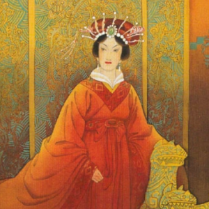 | Empress Dowager Lü of Han | [Baidu Baike](https://baike.baidu.com/item/%E5%90%95%E9%9B%89/85327) |
| 颉 | 仓颉 | Cāng Jié | 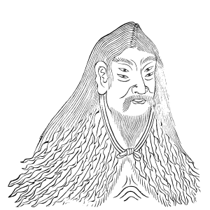 | mythological; four-eyed bureaucrat of the 黄帝 (Yellow Emperor); "inventor" of Chinese characters; origin of the name of the Cangjie input method | [Wikimedia](https://commons.wikimedia.org/wiki/File:Cangjie.png) |
| 馗 | 钟馗 | Zhōng Kuí | 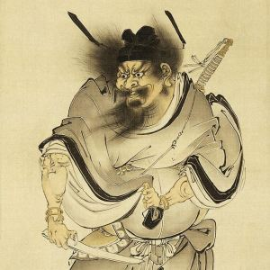 | mythological; Tang Dynasty scholar, amazing scores on the imperial civil service examination but was terrifyingly ugly and stripped of honors; he killed himself and became a vanquisher of evil spirits; his likeness is used to ward off evil spirits | [Wikimedia](https://commons.wikimedia.org/wiki/File:Zhong_Kui_by_Shibata_Zeshin.jpg) |
| 骞 | 张骞 | Zhāng Qiān | 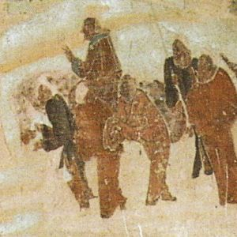 | Western Han diplomat; expeditions opened up the Silk Road | [Wikimedia](https://commons.wikimedia.org/wiki/File:ZhangQianTravels.jpg) |
| 鲧 | 鲧 | Gǔn | 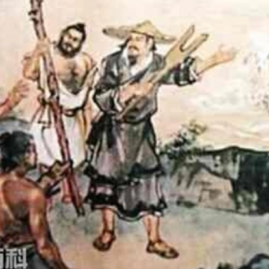 | mythical; failed at taming the great floods by building dams, and was executed; his son 禹 succeeded | [Baidu Baike](https://baike.baidu.com/item/%E9%B2%A7/952007) |

