# Rare characters in the wild

This list is for rare Chinese characters students might see in the wild (e.g., on signage in China), but would normally not be part of a standard education.  These characters are not included in (or are close to being excluded from) MteH, but can be seen in the wild (e.g., in China), and not just in one specific location.

| char | pinyin | explanation | photo | source | 
|------|--------|---------|-------|--------|
| 坞 | wù | 前方坞道 "dock access road ahead" related to 船坞 "dry dock"; found near waterways (the same 坞 as in 好莱坞 "Hollywood") | 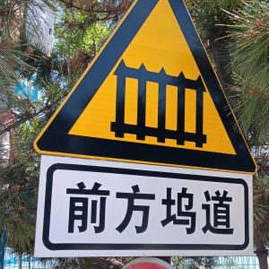 | original photo |
| 扦 | qiān | 扦裤脚 "to hem trousers"; seen at tailors | 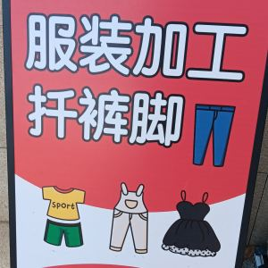 | original photo |
| 擀 | gǎn | [手擀面](https://baike.baidu.com/item/手擀面) "hand-rolled noodles"; 擀 = "to roll (dough, with a 擀面杖 rolling pin)"; seen at some restaurants |  | original photo |
| 殡 | bìn | [殡葬](https://baike.baidu.com/item/%E6%AE%A1%E8%91%AC) "funeral and burial service" (this one is named 福霖 "Fúlín"); seen at funeral parlors | 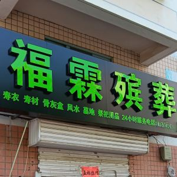 | original photo (anonymized) |
| 毂 | gǔ | [轮毂](https://baike.baidu.com/item/轮毂)焊修 "wheel hub welding/repair"; seen at mechanics |  | original photo |
| 氩 | yà | [氩弧焊](https://baike.baidu.com/item/氩弧焊) "argon arc welding"; 氩 "argon" (noble gas); commonly seen at metal workshops | 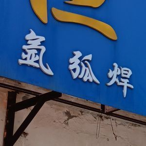 | original photo |
| 沂 | Yí | [沂蒙山](https://baike.baidu.com/item/沂蒙山) "Yimeng Mountains" in Shandong; 沂 refers to [沂河](https://baike.baidu.com/item/沂河) "Yi River"; seen on travel signs, food items | 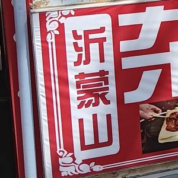 | original photo |
| 灸 | jiǔ | [艾灸](https://baike.baidu.com/item/艾灸) "moxibustion" a traditional Chinese medicine (TCM) practice; seen in TCM clinics |  | original photo |
| 烷 | wán | [环戊烷](https://baike.baidu.com/item/环戊烷) "cyclopentane", used in fridges, insulation, etc.; 烷 "alkane" (a type of hydrocarbon); seen on product labels | 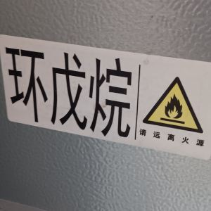 | original photo |
| 煲 | bāo | 腊肠[煲仔饭](https://baike.baidu.com/item/煲仔饭) "claypot rice with Chinese sausage"; 煲 = "to stew or cook slowly" | 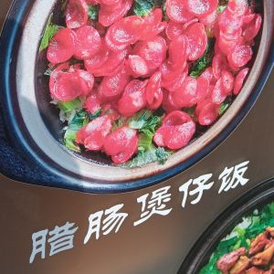 | original photo |
| 畸 | jī | [正畸](https://baike.baidu.com/item/正畸) "orthodontics"; refers to correcting teeth alignment; 畸 = "abnormal/deformed" (as in 畸形); commonly seen at dental clinics | 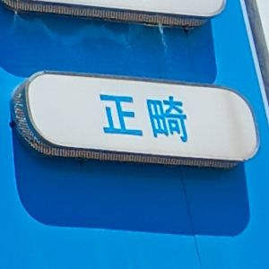 | original photo |
| 痧 | shā | [刮痧](https://zh.wikipedia.org/wiki/%E5%88%AE%E7%97%A7) "gua sha; scraping therapy" a traditional Chinese medicine (TCM) practice; seen in TCM clinics | 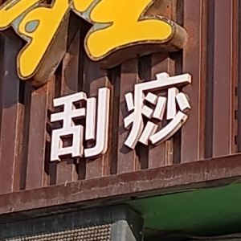 | original photo |
| 祺 | qí | [广汽传祺](https://baike.baidu.com/item/广汽传祺) "GAC motor / Trumpchi" (automobile brand); 祺 = "blessing/auspicious" |  | original photo |
| 禧 | xǐ | 福禧 "happiness and blessing"; seen in signs, decorations, etc. | 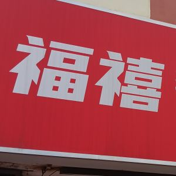 | original photo |
| 蛸 | shāo | 辣炒巴蛸 "spicy stir-fried octopus"; 巴蛸 (bāshāo or bāxiāo (?)) is another name for 章鱼 "octopus" | 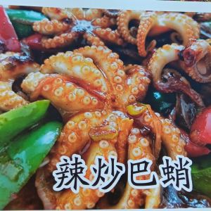 | original photo |
| 衢 | qú | [衢州鸭头](https://baike.baidu.com/item/衢州鸭头) "Quzhou duck head", a 衢州 Quzhou (Zhejiang) specialty; sold throughout China |  | original photo |
| 裘 | qiú | [裘皮](https://baike.baidu.com/item/裘皮)养护 "fur garment care/maintenance"; 裘皮 "fur"; seen at dry cleaners, etc. | 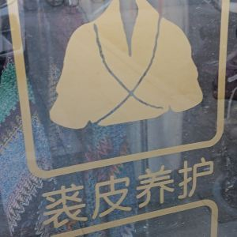 | original photo |
| 豉 | chǐ | [豆豉](https://baike.baidu.com/item/豆豉) "black beans"; seen on food packaging (especially [豆豉鲮鱼](https://baike.baidu.com/item/豆豉鲮鱼) "canned dace") | 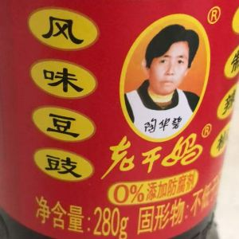 | original photo |
| 钎 | qiān | [钢钎](https://baike.baidu.com/item/钢钎/5924569)羊肉串 "steel skewer mutton kebabs"; 钎 = "skewer" or "sharp metal probe"; used for Xinjiang-style barbecue | 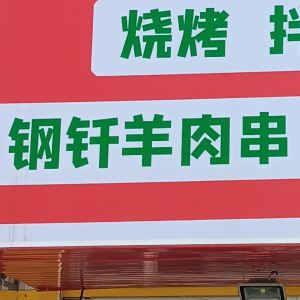 | original photo |
| 钣 | bǎn | [钣金](https://baike.baidu.com/item/钣金)喷漆 "sheet metal and spray painting"; refers to auto-body repairs; seen at mechanics |  | original photo |
| 镀 | dù | [镀晶](https://baike.baidu.com/item/镀晶) "ceramic coating" used to protect car paint, making it shiny, like a crystal; 镀 is a verb meaning "to coat/plate"; seen at car detailing shops |  | original photo |
| 阀 | fá | [角阀](https://baike.baidu.com/item/角阀) "angle valve" which controls water or gas flow; seen in hardware/plumbing stores |  | original photo |

