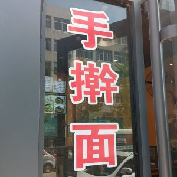
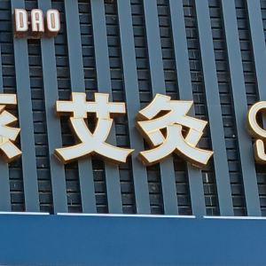
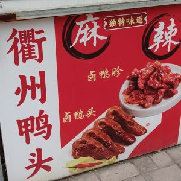
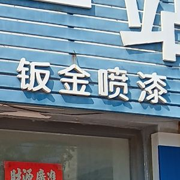
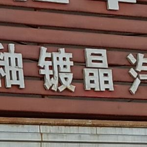
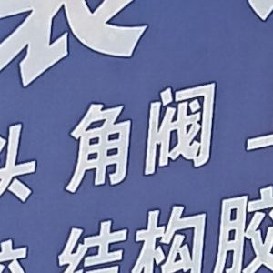

# Rare characters in the wild

This list is for rare Chinese characters students might see in the wild (e.g., on signage in China), but would normally not be part of a standard education.

| char | pinyin | explanation | photo | source | 
|------|--------|---------|-------|--------|
| 擀 | gǎn | [手擀面](https://baike.baidu.com/item/手擀面) "hand-rolled noodles"; 擀 = "to roll (dough)"; seen at some restaurants |  | original photo |
| 毂 | gǔ | [轮毂](https://baike.baidu.com/item/轮毂)焊修 "wheel hub welding/repair"; seen at mechanics |  | original photo |
| 灸 | jiǔ | [艾灸](https://baike.baidu.com/item/艾灸/6201856) "moxibustion" a traditional Chinese medicine (TCM) practice; seen in TCM clinics |  | original photo |
| 衢 | qú | [衢州鸭头](https://baike.baidu.com/item/衢州鸭头/7175550) "Quzhou duck head", a 衢州 Quzhou (Zhejiang) specialty; sold throughout China |  | original photo |
| 钣 | bǎn | [钣金](https://baike.baidu.com/item/钣金/8762156)喷漆 "sheet metal and spray painting"; refers to auto-body repairs; seen at mechanics |  | original photo |
| 镀 | dù | [镀晶](https://baike.baidu.com/item/镀晶/5695486) "ceramic coating" used to protect car paint, making it shiny, like a crystal; 镀 is a verb meaning "to coat/plate"; seen at car detailing shops |  | original photo |
| 阀 | fá | [角阀](https://baike.baidu.com/item/角阀) "angle valve" which controls water or gas flow; seen in hardware/plumbing stores |  | original photo |

