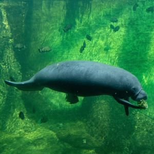

# Characters/words for mammals

The goal here is to survey Chinese characters used in words for mammals.  We can skip 人, 马, 狗, 猫, etc., which the advanced student already know, and include rarer ones which may arise.

| chars | word | pinyin | English | image | comments | image source |
|--------|------|--------|----------|--------|-----------|--------------|
| | 儒艮 | rúgèn | dugong |  | closely related to 海牛 (manatee) | [Pexels](https://www.pexels.com/photo/manatee-in-the-zoo-aquarium-13277593/) |
| 浣 | 浣熊 | huànxióng | raccoon |  | | [Pexels](https://www.pexels.com/photo/curious-raccoon-exploring-forest-edge-36419442/) |
| | 犀牛 | xīniú | rhinoceros |  |  | [Pexels](https://www.pexels.com/photo/a-rhinoceros-on-a-field-15水獭320328/) |
| 犸 | 猛犸 | měngmǎ | mammoth |  | 已灭绝动物 (extinct animal) | [Wikimedia](https://commons.wikimedia.org/wiki/File:202003_Woolly_mammoth.png) |
| 狍 | 狍子 | páozi | roe deer |  | | [Pexels](https://www.pexels.com/photo/roe-deer-on-grass-11390830/) |
| 狒 | 狒狒 | fèifèi | baboon |  | | [Pexels](https://www.pexels.com/photo/a-baboon-sitting-near-wild-plants-while-looking-afar-13717879/) |
| 狨; 猴 | 狨猴 | rónghóu | marmoset |  | | [Pexels](https://www.pexels.com/photo/common-marmoset-climbing-a-tree-in-forest-30206436/) |
| 猞; 猁 | 猞猁 | shēlì | lynx |  | | [Pexels](https://www.pexels.com/photo/lynx-looking-away-on-snowy-terrain-in-nature-7896217/) |
| 猩 | 大猩猩 | dàxīngxing | gorilla |  | | [Wikimedia](https://commons.wikimedia.org/wiki/File:Gorilla_gorilla_gorilla_(Gorille_des_plaines_de_l%27Ouest)_-_458.jpg) |
| 猩 | 猩猩 | xīngxing | orangutan |  | | [Pexels](https://www.pexels.com/photo/orangutans-sitting-on-big-rocks-11644939/) |
| 猩 | 黑猩猩 | hēixīngxing | chimpanzee |  | | [Pexels](https://www.pexels.com/photo/chimpanzee-smiling-19730393/) |
| 猬 | 刺猬 | cìwei | hedgehog |  | | [Pexels](https://www.pexels.com/photo/close-up-of-hedgehog-on-ground-18447656/) |
| 獭 | 水獭 | shuǐtǎ | otter |  | | [Pexels](https://www.pexels.com/photo/north-american-river-otter-on-rocky-shore-37836718/) |
| 獴 | 獴 | měng | mongoose |  | | [Pexels](https://www.pexels.com/photo/banded-mongoose-in-kenyan-wilderness-33650772/) |
| 獾 | 獾 | huān | badger |  | | [Pexels](https://www.pexels.com/photo/a-gray-badger-on-green-grass-10830792/) |
| | 穿山甲 | chuānshānjiǎ | pangolin |  | | [wikimedia](https://commons.wikimedia.org/wiki/File:Manis.jpg) |
| 羚 | 羚羊 | língyáng | antelope |  | pictured is the 藏羚羊 (Tibetan antelope) | [Wikimedia](https://commons.wikimedia.org/wiki/File:Chiru_(Pantholops_hodgsonii)_02.jpg) |
| 蝙; 蝠 | 蝙蝠 | biānfú | bat |  | | [Pexels](https://www.pexels.com/photo/close-up-of-bat-hanging-upside-down-in-cave-38098005/) |
| 豺 | 豺 | chái | jackal |  | | [Pexels](https://www.pexels.com/photo/jackal-in-a-field-26921851/) |
| 貂 | 雪貂 | xuědiāo | ferret |  |  | [Pexels](https://www.pexels.com/photo/adorable-ferret-on-black-studio-background-37850790/) |
| 貘 | 貘 | mò | tapir |  |  | [Pexels](https://www.pexels.com/photo/malayan-tapir-in-natural-habitat-outdoors-35872359/) |
| 鬣 | 鬣狗 | liègǒu | hyena |  | not to be confused with 猎狗 (liègǒu; hunting dog) | [Pexels](https://www.pexels.com/photo/spotted-hyenas-in-the-wild-11727678/) |
| 麂 | 麂子 | jǐzi | muntjac |  | | [Pexels](https://www.pexels.com/photo/muntjac-deer-crossing-a-road-in-thailand-30819811/) |
| 麋 | 麋鹿 | mílù | Père David's deer |  | sometimes called "Chinese reindeer"; [Père David](https://en.wikipedia.org/wiki/Armand_David) was a mid-1800s zoologist and French missionary to China | [Wikimedia](https://upload.wikimedia.org/wikipedia/commons/1/10/Pere_David_Deer_-_Woburn_Deer_Park_%285115883164%29.jpg) |
| 麝 | 麝 | shè | musk deer |  | 麝香 "musk" (fragrance) historically extracted from 麝; unrelated to 埃隆·马斯克 Elon Musk | [Wikimedia](https://commons.wikimedia.org/wiki/File:Musk_deer_in_Edinburgh_Zoo.jpg) |
| 鼬 | 鼬 | yòu | weasel |  | | [Pexels](https://www.pexels.com/photo/weasel-and-leaf-18527637/) |
| 鼹 | 鼹鼠 | yǎnshǔ | mole |  | | [Pexels](https://www.pexels.com/photo/black-mole-in-black-soil-88512/) |

