# Characters/words for mammals

Fully aquatic mammals (whales, dolphins, etc.) are in the [鱼 notes](./鱼.md).

| chars | word | pinyin | English | image | comments | image source |
|--------|------|--------|----------|--------|-----------|--------------|
| 人 | 人 | rén | human |  | noted for their intelligence and tool usage; 智人 (homo sapiens) | [Pexels](https://www.pexels.com/photo/joyful-woman-smiling-outdoors-in-baku-33438768/) |
| 兔 | 兔子 | tùzi | rabbit | 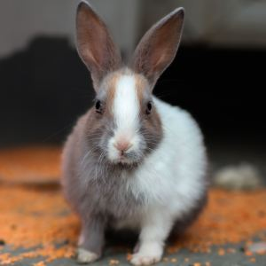 | used in the chengyus [守株待兔](https://baike.baidu.com/item/%E5%AE%88%E6%A0%AA%E5%BE%85%E5%85%94/560205) and [狡兔三窟](https://baike.baidu.com/item/狡兔三窟) | [Pexels](https://www.pexels.com/photo/adorable-brown-and-white-bunny-on-floor-30197040/) |
| | 树懒 | shùlǎn | sloth | 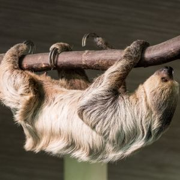 | literally "tree lazy" | [Pexels](https://www.pexels.com/photo/sloth-in-zoo-22610440/) |
| 熊 | 北极熊 | běijíxióng | polar bear | 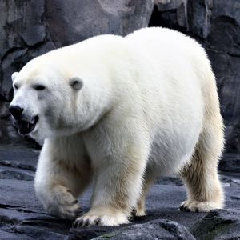 | | [Pexels](https://www.pexels.com/photo/a-polar-bear-walking-on-the-rock-10962759/) |
| 熊 | 大熊猫 | dàxióngmāo | giant panda | 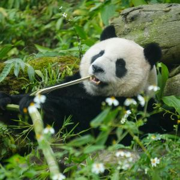 | used in the rhyme: 大熊猫，真憨厚， 爱吃竹叶不吃肉， 肚子饱了慢慢走， 山泉天水当美酒; known for eating bamboo, but can eat meat (this can come up on exams); downgraded from 濒危物种 (endangered species) to 易危物种 (vulnerable species) | [Pexels](https://www.pexels.com/photo/giant-panda-relaxing-and-eating-bamboo-in-lush-habitat-30356870/) |
| 熊 | 小熊猫; 红熊猫 | xiǎoxióngmāo; hóngxióngmāo | red panda | 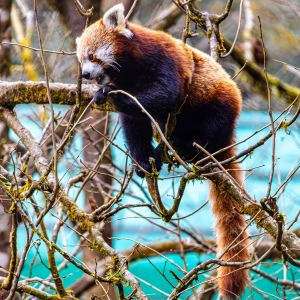 | not actually a bear; not closely related to 大熊猫 | [Pexels](https://www.pexels.com/photo/red-panda-poses-gracefully-in-tree-branches-30692710/) |
| 熊; 浣 | 浣熊 | huànxióng | raccoon | 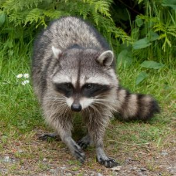 | | [Pexels](https://www.pexels.com/photo/curious-raccoon-exploring-forest-edge-36419442/) |
| 牛 | 奶牛; 乳牛 | nǎiniú; rǔniú | dairy cow; milk cow | 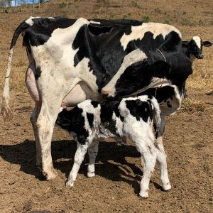 | produces 牛奶 (cow milk); used in the chengyus [对牛弹琴](https://baike.baidu.com/item/%E5%AF%B9%E7%89%9B%E5%BC%B9%E7%90%B4/3490), [九牛一毛](https://baike.baidu.com/item/%E4%B9%9D%E7%89%9B%E4%B8%80%E6%AF%9B), and [气壮如牛](https://baike.baidu.com/item/%E6%B0%94%E5%A3%AE%E5%A6%82%E7%89%9B) | [Pexels](https://www.pexels.com/photo/holstein-dairy-cow-nursing-calf-in-pasture-29535256/) |
| 牛 | 水牛 | shuǐniú | water buffalo | 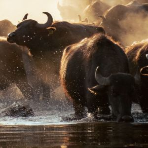 | | [Pexels](https://www.pexels.com/photo/a-herd-of-buffalo-running-through-the-water-28121324/) |
| 牛; 牦 | 牦牛 | máoniú | yak | 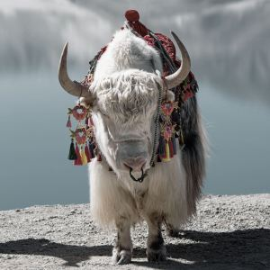 | | [Pexels](https://www.pexels.com/photo/white-yak-by-a-serene-lake-in-altai-xinjiang-34649126/) |
| 牛 | 犀牛 | xīniú | rhinoceros | 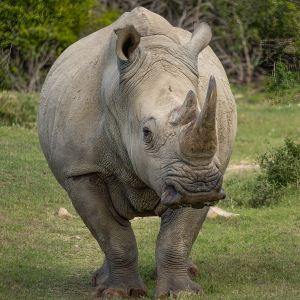 |  | [Pexels](https://www.pexels.com/photo/a-rhinoceros-on-a-field-15320328/) |
| 牛; 羚 | 羚牛 | língniú | takin | 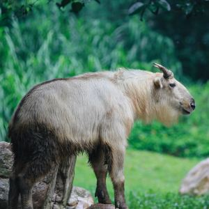 | | [Pexels](https://www.pexels.com/photo/animal-with-horns-15289300/) |
| 牛 | 野牛 | yěniú | bison | 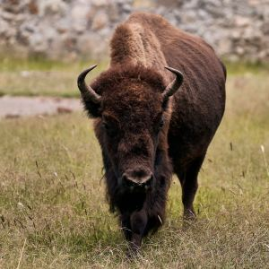 |  | [Pexels](https://www.pexels.com/photo/majestic-american-bison-grazing-in-open-field-37107310/) |
| 牛; 麝 | 麝牛 | shèniú | muskox | 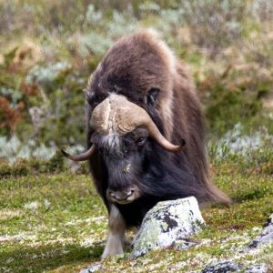 |  | [Pexels](https://www.pexels.com/photo/muskox-grazing-in-dovrefjell-national-park-38256691/) |
| 犸 | 猛犸 | měngmǎ | mammoth | 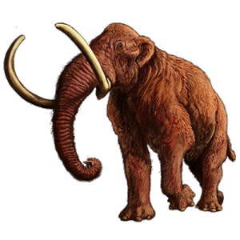 | 已灭绝动物 (extinct animal) | [Wikimedia](https://commons.wikimedia.org/wiki/File:202003_Woolly_mammoth.png) |
| 狍 | 狍子 | páozi | roe deer | 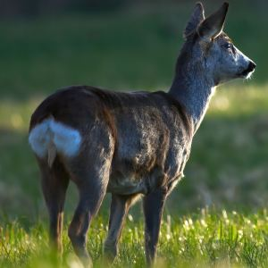 | | [Pexels](https://www.pexels.com/photo/roe-deer-on-grass-11390830/) |
| 狐; 狸 | 狐狸 | húli | fox | 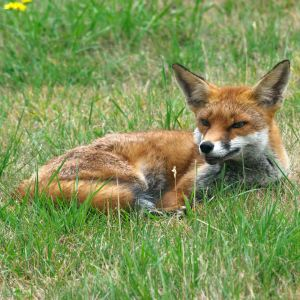 | used in the chengyu [狐假虎威](https://baike.baidu.com/item/%E7%8B%90%E5%81%87%E8%99%8E%E5%A8%81/482) | [Pexels](https://www.pexels.com/photo/fox-on-a-field-13533977/) |
| 狒 | 狒狒 | fèifèi | baboon |  | | [Pexels](https://www.pexels.com/photo/a-baboon-sitting-near-wild-plants-while-looking-afar-13717879/) |
| 狗; 犬 | 狗; 犬 | gǒu; quǎn | dog |  | 警犬 (police dog); 导盲犬 (guide dog); 猎犬/猎狗 (hunting dog; hound); 搜救犬 (search and rescue dog); 缉毒犬 (drug detector dog); 牧羊犬 (sheepdog); 看门狗 (kānméngǒu; guard dog); there are many 犬种 (dog breeds) such as 贵宾犬 (poodle), 拉布拉多 (labrador), and 藏獒 (Tibetan mastiff) | [Pexels](https://www.pexels.com/photo/adorable-dog-walking-at-sunset-in-park-34405083/) |
| 狗; 鬣 | 鬣狗 | liègǒu | hyena | 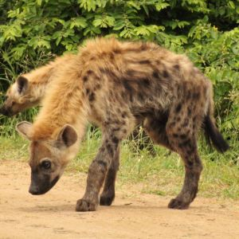 | not to be confused with 猎狗 (liègǒu; hunting dog); the character 鬣 is also used in 鬣蜥 (iguana) | [Pexels](https://www.pexels.com/photo/spotted-hyenas-in-the-wild-11727678/) |
| 狮 | 狮子 | shīzi | lion | 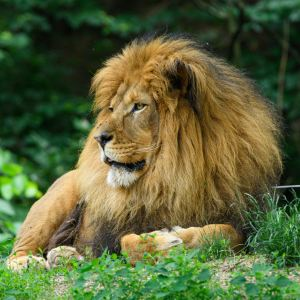 | male lions have 鬃毛 (zōngmáo; manes); 《狮子王》 (*The Lion King*) | [Pexels](https://www.pexels.com/photo/majestic-lion-resting-in-green-forest-32196368/) |
| 狸 | 海狸; 河狸 | hǎilí; hélí | beaver | 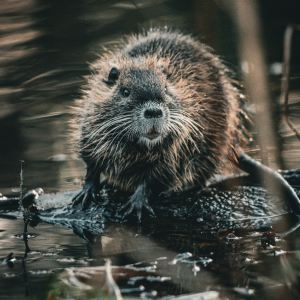 | | [Pexels](https://www.pexels.com/photo/wet-beaver-on-river-bank-21562091/) |
| 狼 | 狼 | láng | wolf | 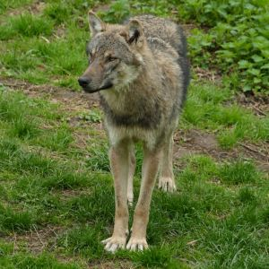 | used in the chengyus [狼吞虎咽](https://baike.baidu.com/item/%E7%8B%BC%E5%90%9E%E8%99%8E%E5%92%BD/4438649), [狼狈为奸](https://baike.baidu.com/item/%E7%8B%BC%E7%8B%88%E4%B8%BA%E5%A5%B8/2968) and [狼狈不堪](https://baike.baidu.com/item/%E7%8B%BC%E7%8B%88%E4%B8%8D%E5%A0%AA); 灰太狼 is the antagonist in the cartoon 《喜羊羊与灰太狼》 | [Pexels](https://www.pexels.com/photo/gray-wolf-in-forest-clearing-during-daytime-31767241/) |
| 猞; 猁 | 猞猁 | shēlì | lynx | 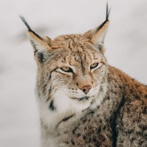 | | [Pexels](https://www.pexels.com/photo/lynx-looking-away-on-snowy-terrain-in-nature-7896217/) |
| 猩 | 大猩猩 | dàxīngxing | gorilla |  | | [Wikimedia](https://commons.wikimedia.org/wiki/File:Gorilla_gorilla_gorilla_(Gorille_des_plaines_de_l%27Ouest)_-_458.jpg) |
| 猩 | 猩猩 | xīngxing | orangutan |  | | [Pexels](https://www.pexels.com/photo/orangutans-sitting-on-big-rocks-11644939/) |
| 猩 | 黑猩猩 | hēixīngxing | chimpanzee | 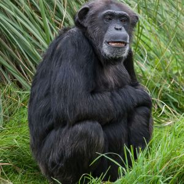 | | [Pexels](https://www.pexels.com/photo/chimpanzee-smiling-19730393/) |
| 猪 | 猪 | zhū | pig | 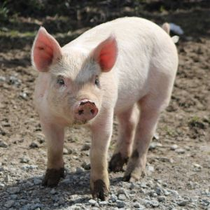 | | [Pexels](https://www.pexels.com/photo/piglet-on-a-farm-in-ohio-usa-37073014/) |
| 猪 | 疣猪 | yóuzhū | warthog | 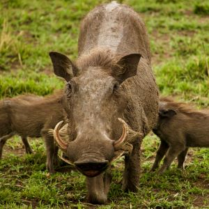 | | [Pexels](https://www.pexels.com/photo/close-up-photo-of-warthogs-on-green-grass-5521658/) |
| 猪 | 豪猪 | háozhū | porcupine | 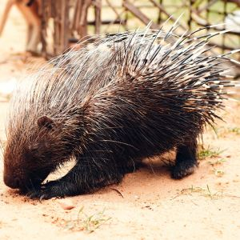 | | [Pexels](https://www.pexels.com/photo/wild-porcupine-foraging-near-a-cage-outdoors-33329562/) |
| 猪 | 野猪 | yězhū | wild boar | 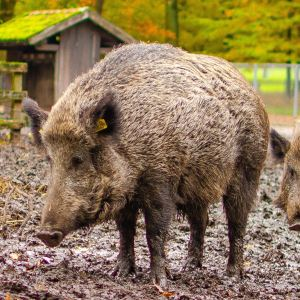 | | [Pexels](https://www.pexels.com/photo/wild-boars-in-forest-enclosure-during-fall-29034760/) |
| 猫 | 猫; 家猫 | māo; jiāmāo | cat; housecat |  | 猫科 (the cat family; Felidae); they eat 猫粮 (cat food); sometimes called 猫咪; you can buy movie tickets with the app 猫眼电影 | [Pexels](https://www.pexels.com/photo/close-up-of-relaxed-domestic-cat-lying-indoors-29748152/) |
| 猬 | 刺猬 | cìwei | hedgehog | 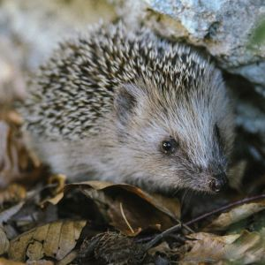 | | [Pexels](https://www.pexels.com/photo/close-up-of-hedgehog-on-ground-18447656/) |
| 猴; 狨 | 狨猴 | rónghóu | marmoset | 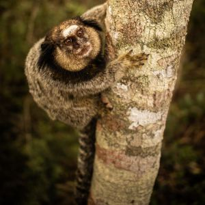 | | [Pexels](https://www.pexels.com/photo/common-marmoset-climbing-a-tree-in-forest-30206436/) |
| 猴; 猕 | 猕猴 | míhóu | macaque | 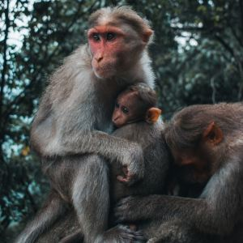 | also used in 猕猴桃 (kiwi fruit) | [Pexels](https://www.pexels.com/photo/photo-of-a-monkey-family-against-a-tree-18612365/) |
| 猴 | 猴子 | hóuzi | monkey | 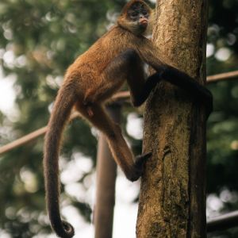 | pictured is a 蜘蛛猴 (spider monkey); used in the chengyus [杀鸡儆猴](https://baike.baidu.com/item/%E6%9D%80%E9%B8%A1%E5%84%86%E7%8C%B4/2389214) and [猴年马月](https://baike.baidu.com/item/%E7%8C%B4%E5%B9%B4%E9%A9%AC%E6%9C%88/1499064) | [Pexels](https://www.pexels.com/photo/spider-monkey-climbing-tree-in-costa-rica-33181302/) |
| 猿 | 猿 | yuán | ape | 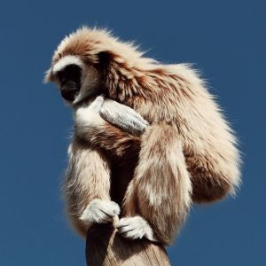 | general term for multiple apes; in biology, it includes 类人猿 (hominids); unlike 猴 (monkeys), 猿 (apes) do not have tails | [Pexels](https://www.pexels.com/photo/monkey-27260618/) |
| 獐 | 獐子 | zhāngzi | water deer | 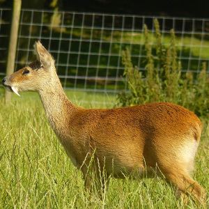 | males have tusk-like canine teeth | [Wikimedia](https://commons.wikimedia.org/wiki/File:Hydropotes_inermis_male.JPG) |
| 獭 | 水獭 | shuǐtǎ | otter | 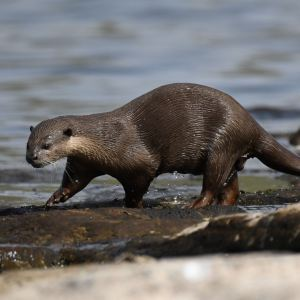 | | [Pexels](https://www.pexels.com/photo/north-american-river-otter-on-rocky-shore-37836718/) |
| 獴 | 獴 | měng | mongoose | 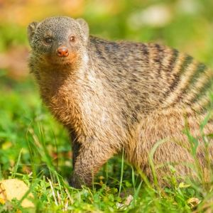 | | [Pexels](https://www.pexels.com/photo/banded-mongoose-in-kenyan-wilderness-33650772/) |
| 獾 | 獾 | huān | badger |  | | [Pexels](https://www.pexels.com/photo/a-gray-badger-on-green-grass-10830792/) |
| | 穿山甲 | chuānshānjiǎ | pangolin | 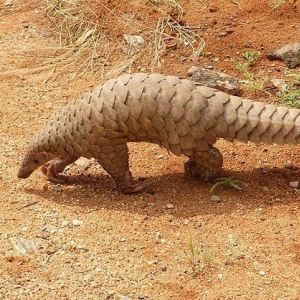 | | [wikimedia](https://commons.wikimedia.org/wiki/File:Manis.jpg) |
| 羊 | 山羊 | shānyáng | goat | 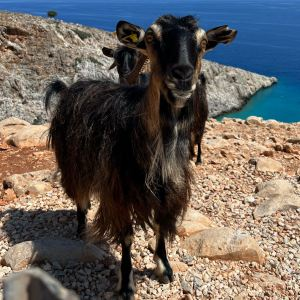 | | [Pexels](https://www.pexels.com/photo/goats-on-the-cliff-15251053/) |
| 羊 | 绵羊 | miányáng | sheep | 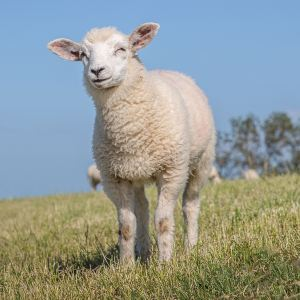 | produces 羊毛 (wool) | [Pexels](https://www.pexels.com/photo/texel-sheep-on-grass-field-under-the-blue-sky-12555344/) |
| 羊 | 黄羊 | huángyáng | Mongolian gazelle | 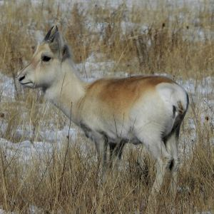 | | [Wikimedia](https://commons.wikimedia.org/wiki/File:Procapra_gutturosa_357203968.jpg) |
| 羚; 羊 | 羚羊 | língyáng | antelope | 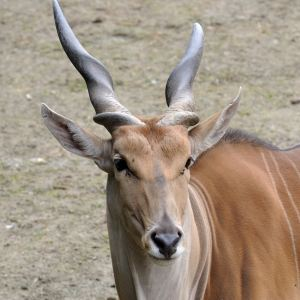 | pictured is a 大羚羊 (oryx) | [Wikimedia](https://commons.wikimedia.org/wiki/File:Chiru_(Pantholops_hodgsonii)_02.jpg) |
| 羚; 羊 | 藏羚羊 | zànglíngyáng | Tibetan antelope | 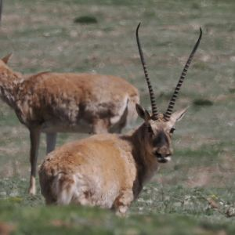 | | [Wikimedia](https://commons.wikimedia.org/wiki/File:Chiru_(Pantholops_hodgsonii)_02.jpg) |
| | 考拉 | kǎolā | koala | 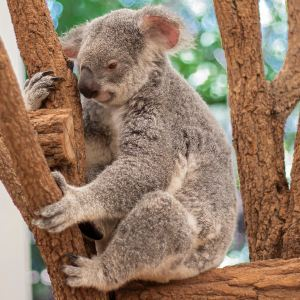 | | [Pexels](https://www.pexels.com/photo/a-koala-on-a-tree-5322338/) |
| 虎 | 老虎 | lǎohǔ | tiger | 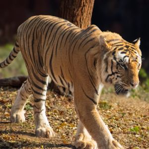 | used in the chengyus [狐假虎威](https://baike.baidu.com/item/%E7%8B%90%E5%81%87%E8%99%8E%E5%A8%81/482), [骑虎难下](https://baike.baidu.com/item/%E9%AA%91%E8%99%8E%E9%9A%BE%E4%B8%8B/1566600), and [虎头蛇尾](https://baike.baidu.com/item/虎头蛇尾) | [Pexels](https://www.pexels.com/photo/majestic-bengal-tiger-in-natural-habitat-37339203/) |
| 蝙; 蝠 | 蝙蝠 | biānfú | bat | 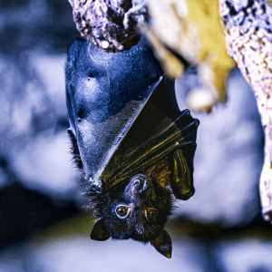 | | [Pexels](https://www.pexels.com/photo/close-up-of-bat-hanging-upside-down-in-cave-38098005/) |
| 象 | 大象 | dàxiàng | elephant | 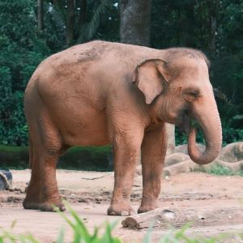 | used in the chengyu [盲人摸象](https://baike.baidu.com/item/%E7%9B%B2%E4%BA%BA%E6%91%B8%E8%B1%A1/1212794) | [Pexels](https://www.pexels.com/photo/asiatic-elephant-in-lush-jungle-habitat-29480531/) |
| 豹 | 豹子; 金钱豹 | bàozi; jīnqiánbào | leopard | 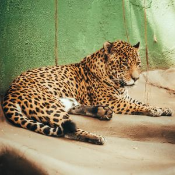 | | [Pexels](https://www.pexels.com/photo/resting-jaguar-in-a-green-enclosure-29944428/) |
| 豺 | 豺 | chái | jackal | 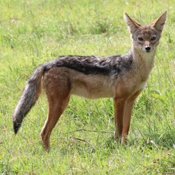 | | [Pexels](https://www.pexels.com/photo/jackal-in-a-field-26921851/) |
| 貂 | 雪貂 | xuědiāo | ferret | 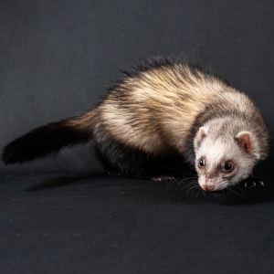 |  | [Pexels](https://www.pexels.com/photo/adorable-ferret-on-black-studio-background-37850790/) |
| 貉 | 貉 | hé | raccoon dog | 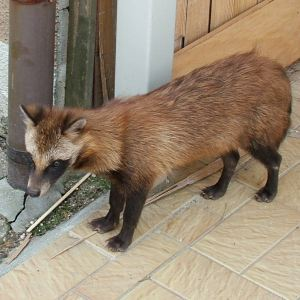 | | [Wikimedia](https://commons.wikimedia.org/wiki/File:Miajiima_raccoon_dog_(1).JPG) |
| 貘 | 貘 | mò | tapir | 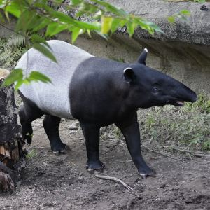 |  | [Pexels](https://www.pexels.com/photo/malayan-tapir-in-natural-habitat-outdoors-35872359/) |
| 马 | 河马 | hémǎ | hippopotamus | 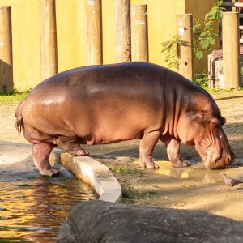 | | [Pexels](https://www.pexels.com/photo/photo-of-a-hippo-in-a-zoo-27174054/) |
| 马 | 马 | mǎ | horse |  | 千里马 describe a horse that can travel long distances; 骏马 is a general fine horse; there are quite a few characters related to horses, like 驷 (sì; four horses) and 驮 (tuó; to carry on one's back, for pack animals); used in the chengyus [塞翁失马](https://baike.baidu.com/item/%E5%A1%9E%E7%BF%81%E5%A4%B1%E9%A9%AC/541787), [老马识途](https://baike.baidu.com/item/%E8%80%81%E9%A9%AC%E8%AF%86%E9%80%94/491143), [马到成功](https://baike.baidu.com/item/%E9%A9%AC%E5%88%B0%E6%88%90%E5%8A%9F/1428834), [走马观花](https://baike.baidu.com/item/%E8%B5%B0%E9%A9%AC%E8%A7%82%E8%8A%B1/3257), [骑马找马](https://baike.baidu.com/item/%E9%AA%91%E9%A9%AC%E6%89%BE%E9%A9%AC/4821464), [马不停蹄](https://baike.baidu.com/item/%E9%A9%AC%E4%B8%8D%E5%81%9C%E8%B9%84/2357098), [汗马功劳](https://baike.baidu.com/item/%E6%B1%97%E9%A9%AC%E5%8A%9F%E5%8A%B3/1497998), [千军万马](https://baike.baidu.com/item/%E5%8D%83%E5%86%9B%E4%B8%87%E9%A9%AC/2010013), [天马行空](https://baike.baidu.com/item/%E5%A4%A9%E9%A9%AC%E8%A1%8C%E7%A9%BA/1573), [指鹿为马](https://baike.baidu.com/item/%E6%8C%87%E9%B9%BF%E4%B8%BA%E9%A9%AC/239153), [猴年马月](https://baike.baidu.com/item/%E7%8C%B4%E5%B9%B4%E9%A9%AC%E6%9C%88/1499064), [害群之马](https://baike.baidu.com/item/%E5%AE%B3%E7%BE%A4%E4%B9%8B%E9%A9%AC/84253), and [青梅竹马](https://baike.baidu.com/item/%E9%9D%92%E6%A2%85%E7%AB%B9%E9%A9%AC/369) | [Pexels](https://www.pexels.com/photo/horse-28455219/) |
| 驴 | 驴子 | lǘzi | donkey |  | used in the chengyu [骑驴找驴](https://baike.baidu.com/item/骑驴找驴) | [Wikimedia](https://commons.wikimedia.org/wiki/File:Jielbeaumadier_ane_des_pyrenees_vda_2010.jpeg) |
| 骆; 驼 | 骆驼 | luòtuo | camel |  | 单峰驼 (dromedary) and 双峰驼 (Bactrian) | [Pexels](https://www.pexels.com/photo/graceful-camels-walking-in-desert-in-afternoon-4321179/) |
| 骡 | 骡子 | luózi | mule |  | | [Wikimedia](https://commons.wikimedia.org/wiki/File:MULE_(2976074852).jpg) |
| | 鸭嘴兽 | yāzuǐshòu | platypus |  | | [Wikimedia](https://commons.wikimedia.org/wiki/File:Duck-billed_platypus_(Ornithorhynchus_anatinus)_surfacing_Scottsdale.jpg) |
| 鹿 | 长颈鹿 | chángjǐnglù | giraffe |  | | [Pexels](https://www.pexels.com/photo/giraffes-in-grassland-4577134/) |
| 鹿; 驯 | 驯鹿 | xùnlù | reindeer |  | a species of deer, capable of being 驯养 (domesticated) | [Pexels](https://www.pexels.com/photo/reindeer-grazing-on-snowy-terrain-in-winter-5592614/) |
| 鹿 | 鹿 | lù | deer |  | generic term; used in the chengyu [指鹿为马](https://baike.baidu.com/item/%E6%8C%87%E9%B9%BF%E4%B8%BA%E9%A9%AC/239153) | [Pexels](https://www.pexels.com/photo/serene-deer-in-a-sunlit-forest-clearing-29241394/) |
| 鹿; 麋 | 麋鹿 | mílù | Père David's deer |  | sometimes called "Chinese reindeer"; [Père David](https://en.wikipedia.org/wiki/Armand_David) was a mid-1800s zoologist and French missionary to China | [Wikimedia](https://upload.wikimedia.org/wikipedia/commons/1/10/Pere_David_Deer_-_Woburn_Deer_Park_%285115883164%29.jpg) |
| 麂 | 麂子 | jǐzi | muntjac |  | | [Pexels](https://www.pexels.com/photo/muntjac-deer-crossing-a-road-in-thailand-30819811/) |
| 麝 | 麝 | shè | musk deer |  | 麝香 "musk" (fragrance) historically extracted from 麝; unrelated to 埃隆·马斯克 Elon Musk | [Wikimedia](https://commons.wikimedia.org/wiki/File:Musk_deer_in_Edinburgh_Zoo.jpg) |
| 鼠 | 仓鼠 | cāngshǔ | hamster |  | | [Pexels](https://www.pexels.com/photo/guinea-pig-in-clay-pot-15316907/) |
| 鼠 | 松鼠 | sōngshǔ | squirrel |  | | [Pexels](https://www.pexels.com/photo/close-up-of-squirrel-in-green-grass-37770235/) |
| 鼠 | 老鼠 | lǎoshǔ | mouse; rat |  | used in the chengyu [胆小如鼠](https://baike.baidu.com/item/%E8%83%86%E5%B0%8F%E5%A6%82%E9%BC%A0) | [Pexels](https://www.pexels.com/photo/rad-eating-cheese-15193801/) |
| 鼠 | 花栗鼠; 花鼠 | huālìshǔ; huāshǔ | chipmunk |  | | [Pexels](https://www.pexels.com/photo/tender-moment-between-two-chipmunks-outdoors-35463402/) |
| 鼠 | 袋鼠 | dàishǔ | kangaroo |  | | [Pexels](https://www.pexels.com/photo/a-kangaroo-and-her-baby-are-standing-in-the-grass-27110776/) |
| 鼠; 鼯 | 飞鼠; 鼯鼠 | fēishǔ; wúshǔ | flying squirrel |  | | [Pexels](https://www.pexels.com/photo/charming-sugar-glider-on-textured-blanket-37799574/) |
| 鼠; 鼹 | 鼹鼠 | yǎnshǔ | mole |  | | [Pexels](https://www.pexels.com/photo/black-mole-in-black-soil-88512/) |
| 鼬 | 鼬 | yòu | weasel |  | | [Pexels](https://www.pexels.com/photo/weasel-and-leaf-18527637/) |
| 鼹 | 针鼹 | zhēnyǎn | echidna |  | | [Pexels](https://www.pexels.com/photo/brown-and-black-hedgehog-on-green-grass-field-7329775/) |

Mythical:

| chars | word | pinyin | English | image | comments | image source |
|--------|------|--------|----------|--------|-----------|--------------|
| 兽 | 年兽 | niánshòu | nian; nian beast |  | chased away during Chinese New Year celebrations using 鞭炮 (firecrackers) and the color red | [Gemini](https://share.gemini.google/G0dULoKs7AbQ) |
| 狐 | 九尾狐 | jiǔwěihú | nine-tailed fox |  | seen in movies e.g. 《尚气与十环传奇》 (*Shang-Chi and the Legend of the Ten Rings*) | [Wikimedia](https://commons.wikimedia.org/wiki/File:Shahaijing-chongzhen(1628%E2%80%931644)-nanshanjing1-fol5b-ninetailfox.jpg) |
| 狻; 猊 | 狻猊 | suānní |  |  | | [Wikimedia](https://commons.wikimedia.org/wiki/File:%EC%B2%AD%EC%9E%90_%EC%82%AC%EC%9E%90_%EC%9E%A5%EC%8B%9D_%EB%9A%9C%EA%BB%91_%ED%96%A5%EB%A1%9C.jpg) |
| 獬; 豸 | 獬豸 | xièzhì | xiezhi |  | | [Wikimedia](https://commons.wikimedia.org/wiki/File:Xiezhi1.jpg) |
| 貔; 貅 | 貔貅 | píxiū | pixiu |  | head of a dragon, and body of a lion | [Wikimedia](https://commons.wikimedia.org/wiki/File:Bixie.jpg) |
| 麒; 麟 | 麒麟 | qílín | qilin |  | has hooves, antlers, scales, and whiskers; depicted e.g. in the [*Fantastic Beasts*](https://harrypotter.fandom.com/wiki/Qilin) series; used in the chengyu [凤毛麟角](https://baike.baidu.com/item/%E5%87%A4%E6%AF%9B%E9%BA%9F%E8%A7%92/1471844) | [Wikimedia](https://commons.wikimedia.org/wiki/File:Statue_of_Qilin,_Tielu_Temple_2023030502.jpg) |

Male/female:

| char | pinyin | English | image | comments | image source |
|--------|------|--------|----------|--------|-----------|
| 公 | gōng| male |  | used for male animals; pictured is a 公牛 (bull) with prominent 阴茎 (yīnjīng; penis), 阴囊 (yīnnáng; scrotum) and 睾丸 (gāowán; testicles); the female 母牛 (cow) instead has a prominent 乳房 (breasts, or udder) | [Pexels](https://www.pexels.com/photo/majestic-bull-standing-against-misty-backdrop-35712118/) |
| 母 | mǔ | female |  | used for female animals; also used in human words such as 母亲 (mother) and 祖母 (paternal grandmother) | [Pexels](https://www.pexels.com/photo/tabby-cat-feeding-her-kittens-13975879/) |
| 牝 | pìn | female |  | pictured is a 牝马 (more specifically a mare) that is 怀孕 / 有孕 (pregnant) or in a 妊娠期 (gestation period); 牝马之贞 is used in 《易经》 to describe 坤 | [Pexels](https://www.pexels.com/photo/pregnant-horse-grazing-in-lush-green-pasture-31438471/) |
| 牡 | mǔ | male |  | pictured is a 牡鹿 (buck, or male deer); in many deer species, only males have 角 horns; the character 牡 is also used in 牡丹 (a flower) and 牡蛎 (oyster), but this usage is unrelated to the meaning "male" | [Pexels](https://www.pexels.com/photo/brown-deer-in-close-up-photography-10106090/) |
| 男 | nán | male |  | used for male humans | [Pexels](https://www.pexels.com/photo/casual-portrait-of-smiling-young-man-in-camouflage-cap-38114107/) |
| 女 | nǚ | female |  | used for female humans | [Pexels](https://www.pexels.com/photo/young-woman-in-traditional-blue-sari-outdoors-34324399/) |
| 雌 | cí | female |  | scientific term; pictured is a 雌狮 (lioness); females are noted for 卵子 (ovum; egg); female mammals are noted for their ability to 母乳喂养 (breastfeed) | [Pexels](https://www.pexels.com/photo/lioness-walking-in-a-serene-outdoor-enclosure-28483746/) |
| 雄 | xióng | male |  | scientific term; pictured is a 雄狮 (male lion); males are noted for producing 精子 (sperm), the male 生殖细胞 (reproductive cell), which typically has 鞭毛 (flagellum) for mobility | [Pexels](https://www.pexels.com/photo/majestic-african-lion-resting-in-the-grass-37075690/) |

Offspring:

| chars | word | pinyin | English | image | comments | image source |
|--------|------|--------|----------|--------|-----------|--------------|
| 崽; 幼 | 幼崽 | yòuzǎi | immature offspring |  | 崽 is often used as a suffix; pictured is a 猪崽 (piglet); 崽 is often used interchangeably with 仔 (zǎi); it's also common in everyday speech to use 小 as a prefix to refer to baby/young animals: 小狗 (puppy), 小马 (pony), 小猫 (kitten), etc. | [Pexels](https://www.pexels.com/photo/black-and-white-piglet-4767455/) |
| 犊 | 牛犊 | niúdú | calf |  | | [Pexels](https://www.pexels.com/photo/adorable-calf-standing-beside-mother-cow-outdoors-31437425/) |
| 羔 | 羊羔 | yánggāo | kid; lamb |  | | [Pexels](https://www.pexels.com/photo/lamb-grazing-peacefully-in-sunlit-pasture-36339005/) |
| 驹 | 马驹 | mǎjū | colt or filly (young horse) |  | | [Pexels](https://www.pexels.com/photo/brown-horse-feeding-white-horse-785327/) |
| 麑 | 麑 | ní | fawn (young deer) |  | | [Pexels](https://www.pexels.com/photo/young-deer-in-sunlit-forest-clearing-37284372/) |

