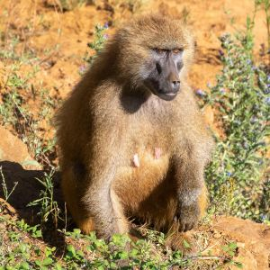
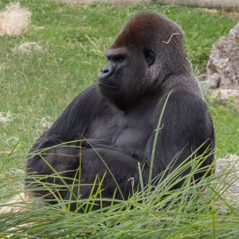
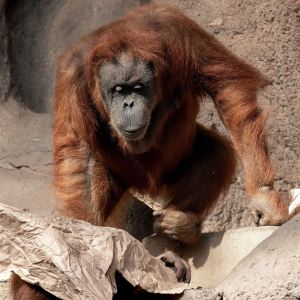
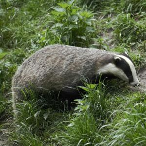
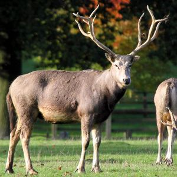
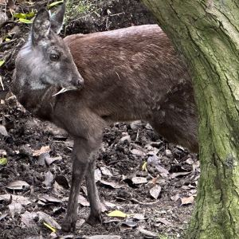

# Characters/words for mammals

The goal here is to survey Chinese characters used in words for mammals.  We can skip 人, 马, 狗, 猫, etc., which the advanced student already know, and include rarer ones which may arise.

| chars | word | pinyin | English | image | comments | image source |
|--------|------|--------|----------|--------|-----------|--------------|
| 狒 | 狒狒 | fèifèi | baboon |  | | [Pexels](https://www.pexels.com/photo/a-baboon-sitting-near-wild-plants-while-looking-afar-13717879/) |
| 猩 | 大猩猩 | dàxīngxing | gorilla |  | | [Wikimedia](https://commons.wikimedia.org/wiki/File:Gorilla_gorilla_gorilla_(Gorille_des_plaines_de_l%27Ouest)_-_458.jpg) |
| 猩 | 猩猩 | xīngxing | orangutan |  | | [Pexels](https://www.pexels.com/photo/orangutans-sitting-on-big-rocks-11644939/) |
| 獾 | 獾 | huān | badger |  | | [Pexels](https://www.pexels.com/photo/a-gray-badger-on-green-grass-10830792/) |
| 麋 | 麋鹿 | mílù | Père David's deer |  | sometimes called "Chinese reindeer"; [Père David](https://en.wikipedia.org/wiki/Armand_David) was a mid-1800s zoologist and French missionary to China | [Wikimedia](https://upload.wikimedia.org/wikipedia/commons/1/10/Pere_David_Deer_-_Woburn_Deer_Park_%285115883164%29.jpg) |
| 麝 | 麝 | shè | musk deer |  | 麝香 "musk" (fragrance) historically extracted from 麝; unrelated to 埃隆·马斯克 Elon Musk | [Wikimedia](https://commons.wikimedia.org/wiki/File:Musk_deer_in_Edinburgh_Zoo.jpg) |

