# Characters/words for musical instruments

| chars | word | pinyin | English | image | comments | image source |
|--------|------|--------|----------|--------|-----------|--------------|
| | 三角铁 | sānjiǎotiě | triangle |  | | [Pexels](https://www.pexels.com/photo/man-in-gray-shirt-holding-a-musical-instrument-7285257/) |
| | 二胡 | èrhú | erhu | 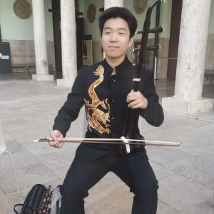 | bowed two-string fiddle | [Wikimedia](https://commons.wikimedia.org/wiki/File:La_Nau_Universitat_de_Val%C3%A8ncia_-_Erhu.jpg) |
| 号 | 大号 | dàhào | tuba |  | | [Pexels](https://www.pexels.com/photo/men-playing-trombones-19953443/) |
| 号 | 小号 | xiǎohào | trumpet |  | | [Pexels](https://www.pexels.com/photo/man-in-military-uniform-playing-trumpet-10706370/) |
| 号 | 法国号; 圆号 | fǎguóhào; yuánhào | French horn |  | | [Wikimedia](https://commons.wikimedia.org/wiki/File:230128-N-DK722-2012_-_NAVEUR-NAVAF_Band_performs_at_Terra_Kulture_Hall_in_Lagos.jpg) |
| 号 | 长号 | chánghào | trombone |  | | [Pexels](https://www.pexels.com/photo/two-people-playing-trombone-11939132/) |
| | 吉他 | jítā | guitar |  | | [Pexels](https://www.pexels.com/photo/man-sitting-in-grass-and-playing-guitar-20742180/) |
| 唢; 呐 | 唢呐 | suǒnà | suona |  | used at weddings, funerals, festivals | [Pexels](https://www.pexels.com/photo/elderly-man-playing-a-traditional-chinese-instrument-suona-on-the-sidewalk-at-night-9220728/) |
| 埙 | 埙 | xūn | xun; Chinese ocarina | 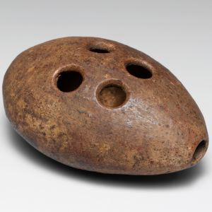 | | [Wikimedia](https://commons.wikimedia.org/wiki/File:Xun_MET_DP169485.jpg) |
| | 尤克里里 | yóukèlǐlǐ | ukulele |  | | [Pexels](https://www.pexels.com/photo/a-woman-in-a-hijab-sitting-on-a-chair-playing-a-ukule-28207863/) |
| 弦 | 三弦 | sānxián | sanxian | 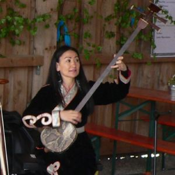 | family of 3-stringed plucked musical instruments | [Wikimedia](https://commons.wikimedia.org/wiki/File:Chanzy_performance.jpg) |
| | 拍板; 快板 | pāibǎn; kuàibǎn | paiban; bamboo clappers | 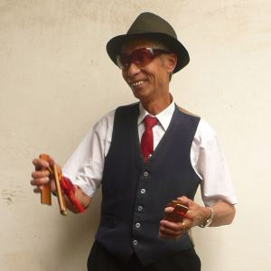 | used for rhythmic storytelling | [Wikimedia](https://commons.wikimedia.org/wiki/File:Man_playing_Paiban_in_Kunming.jpg) |
| | 曼陀林 | màntuólín | mandolin |  | | [Wikimedia](https://commons.wikimedia.org/wiki/File:Busker_playing_mandolin,_St._Lawrence_Market_(13626179644).jpg) |
| | 木鱼 | mùyú | wooden fish | 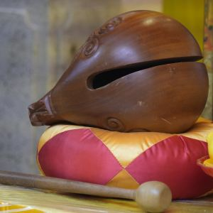 | | [Wikimedia](https://commons.wikimedia.org/wiki/File:A_Wooden_Fish_at_sacrifical_altar_in_Yuen_Yuen_Institule.jpg) |
| | 沙锤 | shāchuí | maraca |  | | [Pexels](https://www.pexels.com/photo/portrait-of-brunette-woman-with-colorful-rattles-8159029/) |
| 琴 | 中提琴 | zhōngtíqín | viola |  | | [Pexels](https://www.pexels.com/photo/a-woman-playing-violin-7095512/) |
| 琴 | 低音提琴 | dīyīn tíqín | double bass | 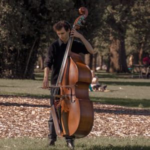 | | [Pexels](https://www.pexels.com/photo/man-playing-the-double-bass-in-a-park-27136100/) |
| 琴 | 口琴 | kǒuqín | harmonica; mouth organ |  | | [Pexels](https://www.pexels.com/photo/man-in-black-tank-top-playing-a-harmonica-11351552/) |
| 琴 | 大提琴 | dàtíqín | cello | 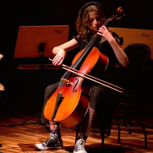 | | [Pexels](https://www.pexels.com/photo/woman-sitting-on-stage-and-playing-double-bass-13768516/) |
| 琴 | 小提琴 | xiǎotíqín | violin | 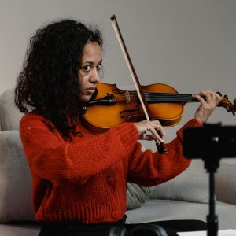 | | [Pexels](https://www.pexels.com/photo/woman-playing-the-violin-6671385/) |
| 琴 | 手风琴 | shǒufēngqín | accordion |  | | [Pexels](https://www.pexels.com/photo/a-man-and-a-girl-playing-accordions-8520140/) |
| 琴 | 扬琴 | yángqín | yangqin | 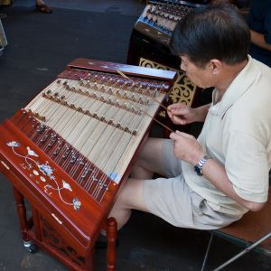 | Chinese hammered dulcimer | [Wikimedia](https://commons.wikimedia.org/wiki/File:%E6%89%AC%E7%90%B4_%D0%AF%D0%BD%D1%86%D0%B8%D0%BD%D1%8C.jpg) |
| 琴 | 木琴 | mùqín | xylophone | 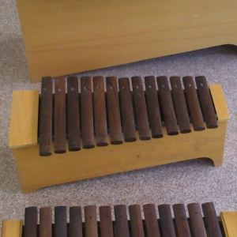 | | [Wikimedia](https://commons.wikimedia.org/wiki/File:Tres_xil%C3%B3fonos.JPG) |
| 琴 | 柳琴 | liǔqín | liuqin lute | 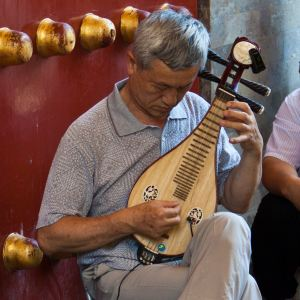 | smaller than 琵琶 | [Wikimedia](https://commons.wikimedia.org/wiki/File:Liuqin_player.jpg) |
| 琴 | 班卓琴 | bānzhuóqín | banjo | 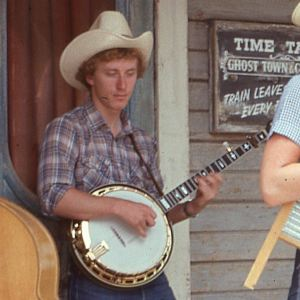 | | [Pexels](https://www.pexels.com/photo/people-in-cowboy-hats-playing-on-musical-instruments-12444472/) |
| 琴 | 琴; 古琴 | qín; gǔqín | qin | 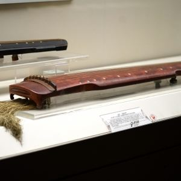 | 7-stringed Chinese zither | [Wikimedia](https://commons.wikimedia.org/wiki/File:%E5%8D%97%E5%AE%8B%E7%8E%89%E5%A3%B6%E5%86%B0%E7%90%B409554.jpg) |
| 琴 | 电子琴 | diànzǐqín | keyboard |  | | [Pexels](https://www.pexels.com/photo/a-person-playing-the-keyboard-5562683/) |
| 琴 | 竖琴 | shùqín | harp | 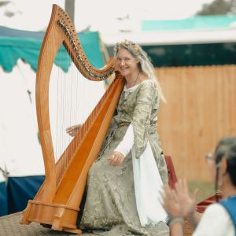 | | [Pexels](https://www.pexels.com/photo/woman-with-harp-15254984/) |
| 琴 | 管风琴; 风琴 | guǎnfēngqín; fēngqín | pipe organ | 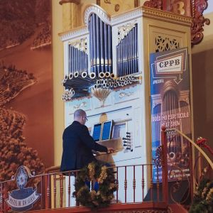 | | [Pexels](https://www.pexels.com/photo/ornamented-interior-with-man-playing-pipe-organ-19500635/) |
| 琴 | 钟琴 | zhōngqín | glockenspiel |  | | [Pexels](https://www.pexels.com/photo/a-child-playing-with-a-xylophone-6274908/) |
| 琴 | 钢琴 | gāngqín | piano |  | | [Pexels](https://www.pexels.com/photo/vintage-piano-in-a-room-17082397/) |
| 琴; 阮  | 阮琴; 中阮 | ruǎnqín; zhōngruǎn | ruan | 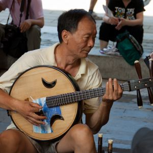 | 4-stringed round-bodied lute | [Wikimedia](https://commons.wikimedia.org/wiki/File:%E9%98%AE_Ruan_%D0%96%D1%83%D0%B0%D0%BD%D1%8C_(7851401654).jpg) |
| 琴 | 马头琴 | mǎtóuqín | morin khuur | 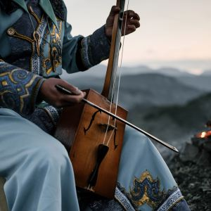 | Mongolian | [Pexels](https://www.pexels.com/photo/crop-person-playing-traditional-mongolian-stringed-instrument-in-countryside-4348093/) |
| 琵; 琶 | 琵琶 | pípa | pipa; Chinese lute | 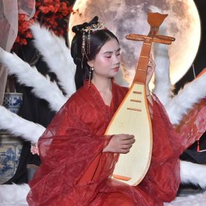 | | [Pexels](https://www.pexels.com/photo/elegant-woman-playing-pipa-in-traditional-attire-33667340/) |
| 瑟 | 古瑟; 瑟 | gǔsè; sè | guse; se | 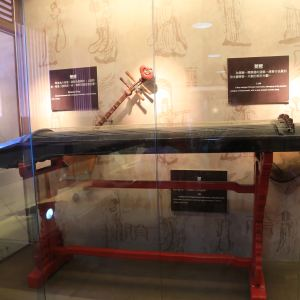 | historical; noted for its harmony with 琴; used figuratively in 琴瑟 to represent marital harmony | [Wikimedia](https://commons.wikimedia.org/wiki/File:%E5%8F%B0%E5%8D%97%E5%B8%82%E5%AD%94%E5%BB%9F%E6%96%87%E7%89%A9%E6%94%B6%E8%97%8F_%E6%A8%82%E5%99%A8%E7%91%9F.JPG) |
| | 电吉他 | diànjítā | electric guitar |  | | [Pexels](https://www.pexels.com/photo/young-woman-playing-guitar-19350224/) |
| 磬 | 编磬 | biānqìng | set of chime stones | 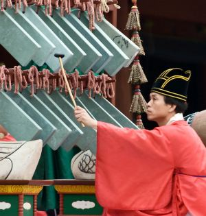 | | [Wikimedia](https://commons.wikimedia.org/wiki/File:Jongmyo_DSC_6892.jpg) |
| 笙 | 笙 | shēng | sheng | 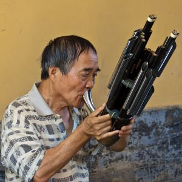 | multiple bamboo pipes | [Wikimedia](https://commons.wikimedia.org/wiki/File:%E7%AC%99_Sheng_%D0%A8%D1%8D%D0%BD_(7851401076).jpg) |
| 笛 | 短笛 | duǎndí | piccolo | 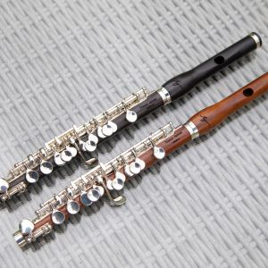 | | [Pexels](https://www.pexels.com/photo/close-up-shot-of-black-and-brown-flutes-14587582/) |
| 笛 | 笛子 | dízi | bamboo flute | 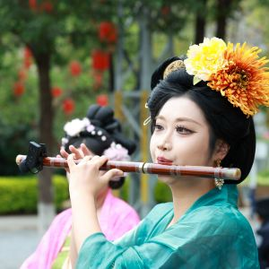 | | [Pexels](https://www.pexels.com/photo/traditional-musician-playing-bamboo-flute-outdoors-34128562/) |
| 笛 | 长笛 | chángdí | flute |  | | [Pexels](https://www.pexels.com/photo/a-boy-learning-how-the-play-the-flute-from-his-mentor-8191574/) |
| 笛 | 陶笛 | táodí | ocarina | 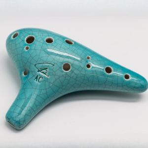 | | [Wikimedia](https://commons.wikimedia.org/wiki/File:2016-01_Ocarina_front.jpg); margins expanded with PixelCut AI |
| 筝 | 筝; 古筝 | zhēng; gǔzhēng | guzheng | 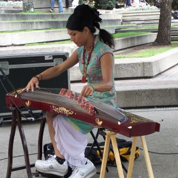 | Chinese zither; usually 21 strings | [Wikimedia](https://commons.wikimedia.org/wiki/File:Vi_An_Diep_plays_guzheng_1.JPG) |
| 箜; 篌 | 箜篌 | kōnghóu | konghou; Chinese harp | 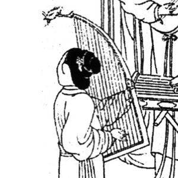 | went "extinct" during the Ming Dynasty; modern 箜篌 resemble western 竖琴 (harps) | [Wikimedia](https://commons.wikimedia.org/wiki/File:Konghou.jpg) |
| 管 | 单簧管; 黑管 | dānhuángguǎn; hēiguǎn | clarinet |  | | [Pexels](https://www.pexels.com/photo/man-playing-the-clarinet-on-a-street-15551341/) |
| 管 | 双簧管 | shuānghuángguǎn | oboe |  | | [Pexels](https://www.pexels.com/photo/a-woman-playing-clarinet-7095727/) |
| 管 | 巴松管; 低音管; 大管 | bāsōngguǎn; dīyīnguǎn; dàguǎn | bassoon |  | | [Pexels](https://www.pexels.com/photo/outdoor-performance-of-bassoon-soloist-at-concert-33661048/) |
| 管 | 萨克斯 | sàkèsī | saxophone |  | also called 萨克斯风 (sàkèsīfēng) and 萨克斯管 (sàkèsīguǎn) | [Pexels](https://www.pexels.com/photo/photo-of-a-man-playing-a-saxophone-9002853/) |
| 箫 | 排箫 | páixiāo | panpipes | 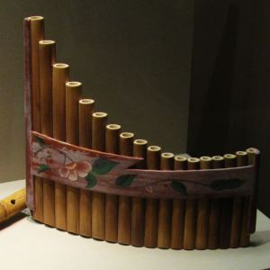 | | [Wikimedia](https://commons.wikimedia.org/wiki/File:Shakuhachi_and_Paixiao_of_theTang_Dynasty_2011-07.JPG) |
| 箫 | 箫 | xiāo | xiao | 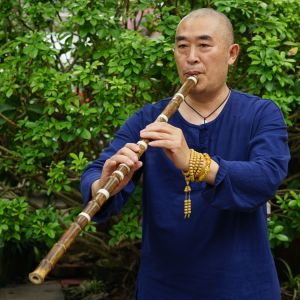 | vertical bamboo flute | [Pexels](https://www.pexels.com/photo/man-using-a-flute-12391588/) |
| 箫 | 葫芦丝; 葫芦箫 | húlúsī; húlúxiāo | hulusi; cucurbit flute; gourd flute | 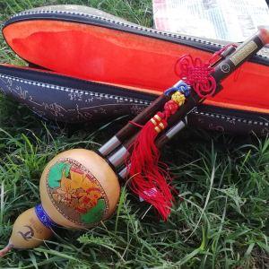 | | [Wikimedia](https://commons.wikimedia.org/wiki/File:Hulusi_Medieval_festival_of_Saint-Antoine-l%27Abbaye.jpg) |
| | 编钟 | biānzhōng | set of bells | 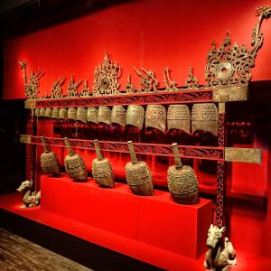 | | [Wikimedia](https://commons.wikimedia.org/wiki/File:Bell_set_unearthed_from_Tomb_1,_Dayun_Mountain,_Xuyi,_Jiangsu_Western_Han_period_(206_BCE%E2%80%939_CE)_MH_01.jpg) |
| 角 | 角 | jiǎo | horn | 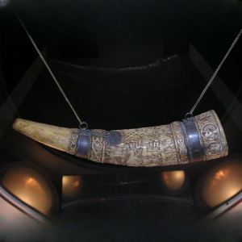 | | [Wikimedia](https://commons.wikimedia.org/wiki/File:Hungary_Jaszbereny_Lehel.jpg); margins expanded using PixelCut AI |
| | 贝斯; 贝司 | bèisī | bass guitar |  | | [Pexels](https://www.pexels.com/photo/close-up-of-a-bass-guitarist-performing-live-36219462/) |
| 钹; 镲 | 钹; 镲 | bó; chǎ | cymbals |  | | [Pexels](https://www.pexels.com/photo/military-orchestra-on-a-field-17551521/) |
| 铃 | 铃 | líng | bell | 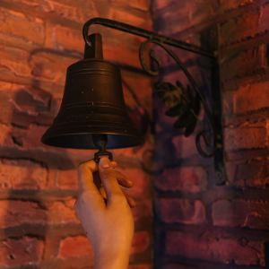 | | [Pexels](https://www.pexels.com/photo/close-up-shot-of-a-person-ringing-a-bell-hanging-from-the-brick-wall-8391511/) |
| 铃 | 风铃 | fēnglíng | wind chimes | 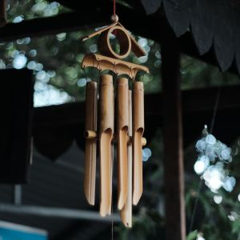 | | [Pexels](https://www.pexels.com/photo/bamboo-wind-chimes-9153309/) |
| 锣 | 锣 | luó | gong | 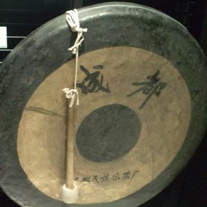 | | [Wikimedia](https://commons.wikimedia.org/wiki/File:National_Museum_of_Ethnology,_Osaka_-_Gong_-_Chengu,_Sichuan,_China_-_Collected_in_2003.jpg) |
| 鼓 | 堂鼓 | tánggǔ | ceremonial hall drum | 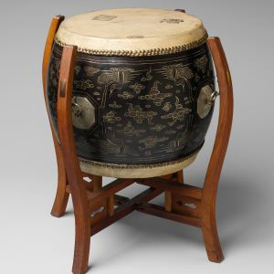 | | [Wikimedia](https://commons.wikimedia.org/wiki/File:T%C3%A1ngg%C7%94_(%E5%A0%82%E9%BC%93)_MET_DP219344.jpg) |
| 鼓 | 大鼓 | dàgǔ | bass drum | 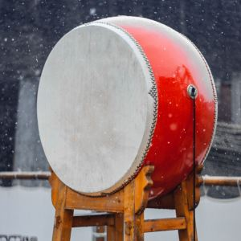 | | [Pexels](https://www.pexels.com/photo/a-large-drum-on-a-wooden-construction-standing-outside-18131025/) |
| 鼓 | 定音鼓 | dìngyīngǔ | timpani; kettledrum | 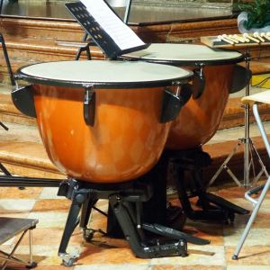 | | [Wikimedia](https://commons.wikimedia.org/wiki/File:Timpani,_I_Solisti_Veneti,_La_tromba,_regina_degli_ottoni_27_sett_2022_(Chesa_della_Rotonda,_Rovigo)_01.jpg) |
| 鼓 | 架子鼓 | jiàzigǔ | drum kit | 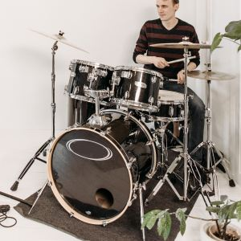 | | [Pexels](https://www.pexels.com/photo/man-playing-drums-7802342/) |
| 鼓 | 腰鼓 | yāogǔ | waist drum | 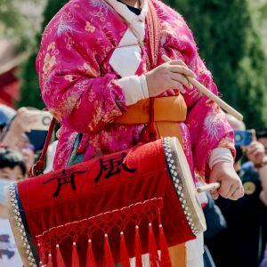 | | [Pexels](https://www.pexels.com/photo/traditional-chinese-festival-performer-in-costume-28776085/) |
| 鼓; 铃 | 铃鼓 | línggǔ | tambourine |  | | [Pexels](https://www.pexels.com/photo/colorful-tambourine-with-star-design-on-yellow-background-37414885/) |
| 鼓 | 鼓 | gǔ | drum | 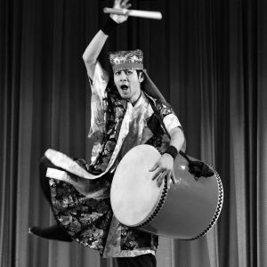 | generic term | [Pexels](https://www.pexels.com/photo/a-large-drum-on-a-wooden-construction-standing-outside-18131025/) |

