# Chinese Characters on the Periodic Table

The [Periodic Table of the Elements](https://zh.wikipedia.org/wiki/%E5%85%83%E7%B4%A0%E5%91%A8%E6%9C%9F%E8%A1%A8) contains a unique Chinese character for each element (and only a selection of these characters are included in MteH):

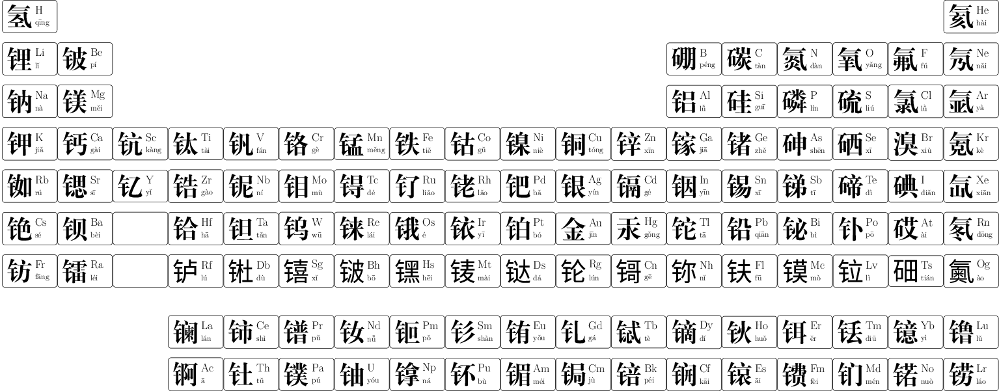

When a new element is officially discovered, it gets a new Chinese character.  Many fonts do not contain the characters for newly discovered elements.  These are the currently discovered elements:

> 氢 氦 锂 铍 硼 碳 氮 氧 氟 氖 钠 镁 铝 硅 磷 硫 氯 氩 钾 钙 钪 钛 钒 铬 锰 铁 钴 镍 铜 锌 镓 锗 砷 硒 溴 氪 铷 锶 钇 锆 铌 钼 锝 钌 铑 钯 银 镉 铟 锡 锑 碲 碘 氙 铯 钡 镧 铈 镨 钕 钷 钐 铕 钆 铽 镝 钬 铒 铥 镱 镥 铪 钽 钨 铼 锇 铱 铂 金 汞 铊 铅 铋 钋 砹 氡 钫 镭 锕 钍 镤 铀 镎 钚 镅 锔 锫 锎 锿 镄 钔 锘 铹 𬬻 𬭊 𬭳 𬭛 𬭶 鿏 𫟼 𬬭 鿔 鿭 𫓧 镆 𫟷 鿬 鿫

The majority of these Chinese characters are not familiar to most people, unless their career involves physics or chemistry or something similar.  The elements that might be encountered outside of science are:

| atomic number | element | pinyin | English | image | notes | image source |
|--------|-----------|------|-------|-----------|-----------|-----------|
| 1 | 氢 | qīng | Hydrogen | 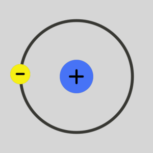 | 氢弹 (hydrogen bomb); also comes in the forms 氘 (dāo; deuterium; 重氢) and 氚 (chuān; tritium; 超重氢) | [Wikimedia](https://commons.wikimedia.org/wiki/File:Hydrogen_Atom.svg) |
| 2 | 氦 | hài | Helium |  | 氦气球 (helium balloon) | [Pexels](https://www.pexels.com/photo/close-up-shot-of-a-gold-balloon-5725971/) |
| 3 | 锂 | lǐ | Lithium | 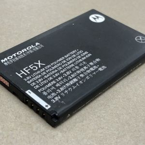 | 锂电池 (lithium ion battery) | [Wikimedia](https://commons.wikimedia.org/wiki/File:Motorola_HF5X_Battery.jpg) |
| 6 | 碳 | tàn | Carbon | 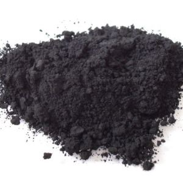 | 二氧化碳 (carbon dioxide); 碳水化合物 (carbohydrate) | [Wikimedia](https://commons.wikimedia.org/wiki/File:Carbon_black.jpg) |
| 7 | 氮 | dàn | Nitrogen | 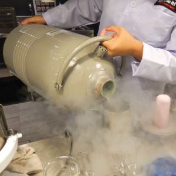 | 液氮 (liquid nitrogen); 氮肥 (nitrogen fertilizer) | [Wikimedia](https://commons.wikimedia.org/wiki/File:Making_Liquid_Nitrogen_Ice_Cream_-_Sentosa,_Singapore_-_16_Oct._2013.jpg) |
| 8 | 氧 | yǎng | Oxygen |  | 有氧运动 (aerobics); 二氧化碳 (carbon dioxide); 好氧生物 (aerobic organism); 厌氧生物 (anaerobic organism) | [Wikimedia](https://commons.wikimedia.org/wiki/File:Underwater_photograph_of_a_recreational_scuba_diver_in_Playa_del_Carmen_2006.jpg) |
| 9 | 氟 | fú | Fluorine | 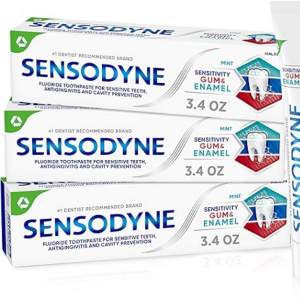 | 含氟牙膏 (fluoridated toothpaste); 氯氟烃 (CFCs); 铁氟龙 / 聚四氟乙烯 (Teflon); 氟利昂 (Freon) | [Amazon.com](https://www.amazon.com/Sensodyne-Toothpaste-Sensitivity-Protection-Refreshing/dp/B0BM4H31S1) |
| 10 | 氖 | nǎi | Neon | 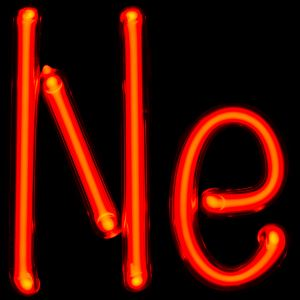 | element used in 霓虹灯 (neon light), but this word doesn't use 氖 | [Wikimedia](https://commons.wikimedia.org/wiki/File:NeTube.jpg) |
| 11 | 钠 | nà | Sodium | 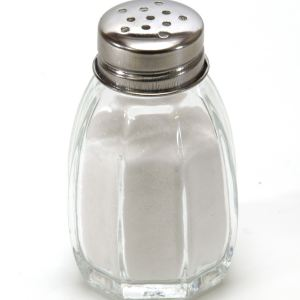 | 低钠食品 (low sodium foods); 氯化钠 (sodium chloride, or table salt) | [Wikimedia](https://commons.wikimedia.org/wiki/File:Salt_shaker_on_white_background.jpg) |
| 12 | 镁 | měi | Magnesium | 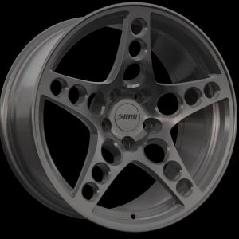 | 补镁 (supplement magnesium) | [Wikimedia](https://commons.wikimedia.org/wiki/File:Magnesium_forged_wheel_named_as_HGK_style_.jpg) |
| 13 | 铝 | lǚ | Aluminium | 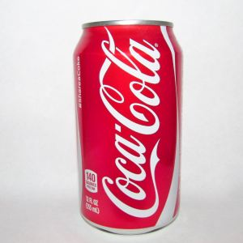 | 铝罐 (aluminium can); 铝箔 (aluminium foil) | [Wikimedia](https://commons.wikimedia.org/wiki/File:Can_of_Coca_Cola_(26899145485).jpg) |
| 14 | 硅 | guī | Silicon | 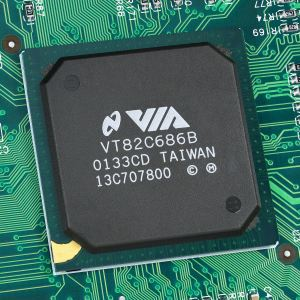 | 硅谷 (Silicon Valley); 硅芯片 (silicon chip); 硅胶 (silicone); called 矽 (xī) in Taiwan | [Wikimedia](https://commons.wikimedia.org/wiki/File:VT82C686B.jpg) |
| 17 | 氯 | lǜ | Chlorine | 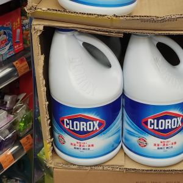 | 氯氟烃 (CFCs); 聚氯乙烯 (PVC); 氯化钠 (sodium chloride, or table salt) | [Wiktionary](https://commons.wikimedia.org/wiki/File:HK_STT_%E7%9F%B3%E5%A1%98%E5%92%80_Shek_Tong_Tsui_%E5%B1%B1%E9%81%93_9_Hill_Road_%E7%A5%A5%E7%99%BC%E5%A4%A7%E5%BB%88_Cheung_Fat_Building_shop_%E7%99%BE%E4%BD%B3%E8%B6%85%E5%B8%82_ParknShop_Supermarket_goods_%E9%AB%98%E6%A8%82%E6%B0%8F_Clorox_Bleach_August_2022_Px3.jpg) |
| 18 | 氩 | yà | Argon | 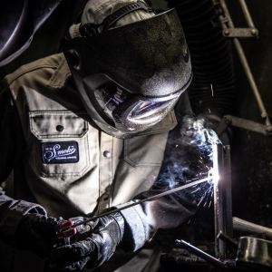 | 氩弧焊 (argon arc welding); 氩气保护 (argon gas shielding); inside some 灯泡 (light bulbs) such as 白炽灯 (incandescent lights) | [Wikimedia](https://commons.wikimedia.org/wiki/File:Shielded_Metal_Arc_Welding.jpg) |
| 19 | 钾 | jiǎ | Potassium | 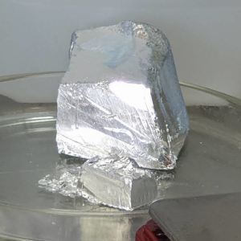 | 钾肥 (potassium fertilizer) | [Wikimedia](https://commons.wikimedia.org/wiki/File:Potassium_glovebox.jpg) |
| 20 | 钙 | gài | Calcium | 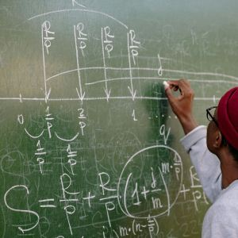 | 补钙 (calcium supplement); 碳酸钙 (calcium carbonate) | [Pexels](https://www.pexels.com/photo/back-view-of-a-person-writing-on-a-blackboard-8197529/) |
| 22 | 钛 | tài | Titanium | 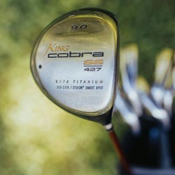 | 钛合金 (titanium alloy) | [Pexels](https://www.pexels.com/photo/logo-on-the-head-of-a-golf-club-8557693/) |
| 24 | 铬 | gè | Chromium |  | 电镀铬 (chrome plating) | [Wikimedia](https://commons.wikimedia.org/wiki/File:BMW_E92_M3_Chrome_Bullet_Goodwood_FoS_2012-06-29.jpg) |
| 26 | 铁 | tiě | Iron | 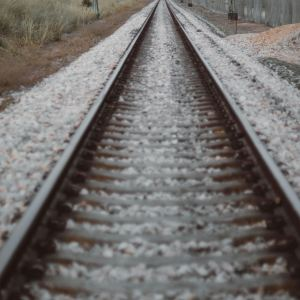 | 地铁 (subway); 铁路 (railroad); 磁铁 (magnet); 钢铁 (steel); 钢铁侠 (Iron Man); 烙铁 (branding iron); an "iron" for pressing clothes is 熨斗 | [Pexels](https://www.pexels.com/photo/brown-train-rails-2213140/) |
| 28 | 镍 | niè | Nickel | 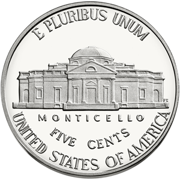 | 镀镍 (nickel plating); also used in many alloys (e.g. 镍铬合金 NiCr found in e.g. toasters); USA's 5-cent coin 5美分硬币 can be called 镍币 | [Wikimedia](https://commons.wikimedia.org/wiki/File:US_Nickel_2013_Rev.png) |
| 29 | 铜 | tóng | Copper | 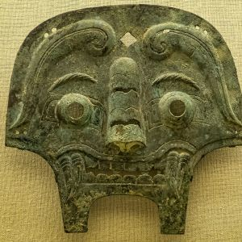 | 铜线 (copper wires); 铜牌 (bronze medal); 青铜 (bronze); the 自由女神 (Statue of Liberty) is made from 铜 | [Wikimedia](https://commons.wikimedia.org/wiki/File:Bronze_Monster_Mask_from_a_horse_bridle_Western_Zhou_dynasty_China_9th_century_BCE.jpg) |
| 30 | 锌 | xīn | Zinc | 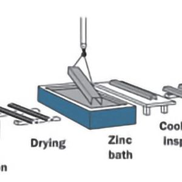 | 镀锌 (galvanize [zinc plated]) | [Wikimedia](https://commons.wikimedia.org/wiki/File:Hot_galvanized_sheet.jpg) |
| 47 | 银 | yín | Silver | 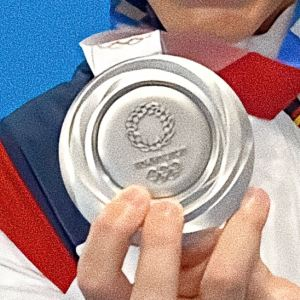 | 银牌 (silver medal); 银行 (bank) | [Wikimedia](https://commons.wikimedia.org/wiki/File:Maica_Garc%C3%ADa_Godoy.jpg) |
| 50 | 锡 | xī | Tin | 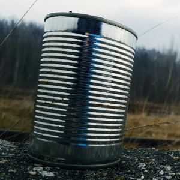 | 锡罐 (tin can); 锡箔 and 锡纸 (tin foil, sometimes the name used for aluminium foil); used in 焊料 (solder); 锡箔 or 锡箔纸 also refers to "joss paper", burned for 祭祀 sacrifices | [Pexels](https://www.pexels.com/photo/tin-can-on-gravel-surface-1003103/) |
| 53 | 碘 | diǎn | Iodine | 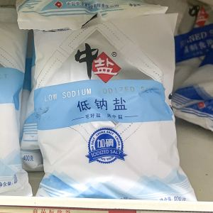 | 碘化食盐 (iodized salt) added to prevent 甲状腺肿 (goitre, an enlargement of the thyroid gland) | [Wikimedia](https://commons.wikimedia.org/wiki/File:China_Salt_low_sodium_iodized_salt_on_shelf_(20230824183556).jpg) |
| 74 | 钨 | wū | Tungsten | 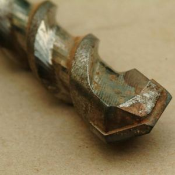 | 钨丝 (tungsten filament); used in 钻头 (drill bits) for it high 熔点 (melting point) | [Wikimedia](https://commons.wikimedia.org/wiki/File:Drill_tip_masonry.jpg) |
| 78 | 铂 | bó  | Platinum | 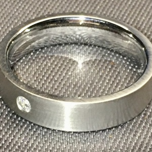 | 铂金 (platinum); sometimes called 白金 | [Wikimedia](https://commons.wikimedia.org/wiki/File:Platinum_finger_ring_with_diamond.jpg) |
| 79 | 金 | jīn | Gold | 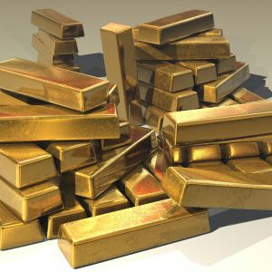 | 黄金 (gold); 金牌 (gold medal); 金融 (finance); 金属 (metal) | [Pexels](https://www.pexels.com/photo/gold-bar-lot-47047/) |
| 80 | 汞 | gǒng | Mercury | 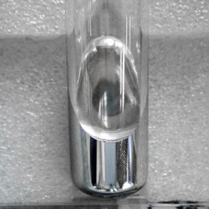 | aka 水银 (quicksilver) | [Wikimedia](https://commons.wikimedia.org/wiki/File:Mercury_(Element_-_80)_2.jpg) |
| 82 | 铅 | qiān | Lead | 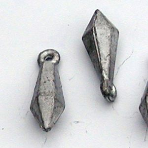 | 铅笔 (grey lead pencil), although they actually use 石墨 (graphite); 含铅汽油 (leaded petrol); 无铅汽油 (unleaded petrol); 铅坠 (fishing sinkers; aka 鱼坠); used to be used in 焊料 (solder) along with 锡 (tin) | [Wikimedia](https://commons.wikimedia.org/wiki/File:Angeln_zubehoer_grundblei_01.jpg) |
| 84 | 钋 | pō | Polonium | 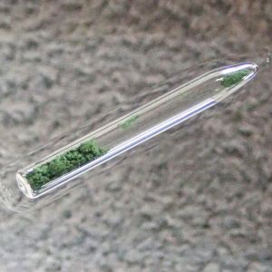 | strong alpha emitter; used to kill [Alexander Litvinenko](https://en.wikipedia.org/wiki/Poisoning_of_Alexander_Litvinenko) | [Wikimedia](https://commons.wikimedia.org/wiki/File:Polonium_(Element_-_84)_2.jpg) |
| 92 | 铀 | yóu | Uranium | 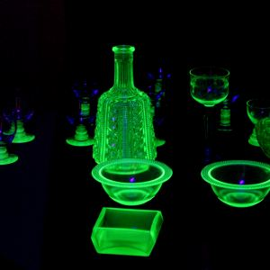 | 浓缩铀 (enriched uranium); 放射性 (radioactive); used in 核反应堆 (nuclear reactors) and 核武器 (nuclear weapons) | [Wikimedia](https://commons.wikimedia.org/wiki/File:Uranium_glass_(Polke)_(34394837730).jpg) |
| 94 | 钚 | bù | Plutonium | 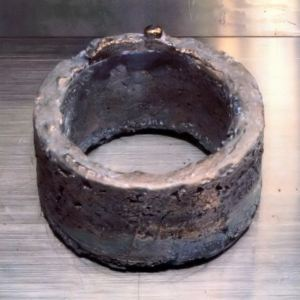 | used in 核反应堆 (nuclear reactors) and 核武器 (nuclear weapons) | [Wikimedia](https://commons.wikimedia.org/wiki/File:Plutonium_ring.jpg) |

Some Chinese characters, while not elements on the periodic table are specific to chemistry:

| molecule | pinyin | English | image | notes | image source |
|--------|-----------|------|-------|-----------|-----------|
| 甲烷 | jiǎwán | methane | 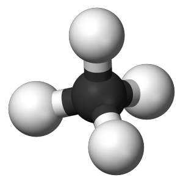 | | [Wikimedia](https://commons.wikimedia.org/wiki/File:Methane-3D-balls.png) |
| 乙烷 | yǐwán | ethane | 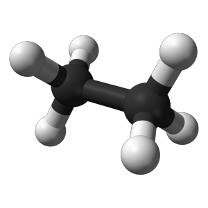 | | [Wikimedia](https://commons.wikimedia.org/wiki/File:Ethane-A-3D-balls.png) |
| 丙烷 | bǐngwán | propane | 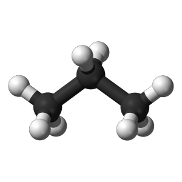 | | [Wikimedia](https://commons.wikimedia.org/wiki/File:Propane-3D-balls-A.png) |
| 丁烷 | dīngwán | butane | 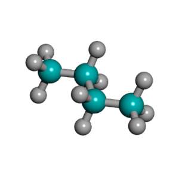 | | [Wikimedia](https://commons.wikimedia.org/wiki/File:N-butane_3D.png) |
| 戊烷 | wùwán | pentane | 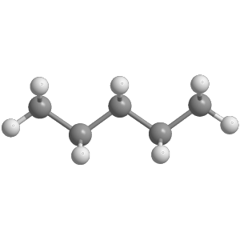 | | [Wikimedia](https://commons.wikimedia.org/wiki/File:N-Pentane_conformation_trans_trans.png) |
| 己烷 | jǐwán | hexane | 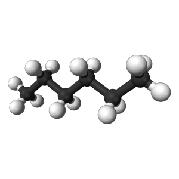 | | [Wikimedia](https://commons.wikimedia.org/wiki/File:Hexane-3D-balls.png) |
| 庚烷 | gēngwán | septane | 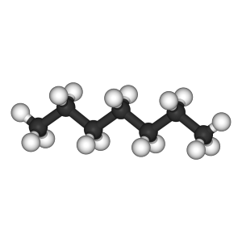 | | [Wikimedia](https://commons.wikimedia.org/wiki/File:Heptane-3D-balls.png) |
| 辛烷 | xīnwán | octane | 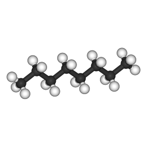 | | [Wikimedia](https://commons.wikimedia.org/wiki/File:Hydrogen_Atom.svg) |

