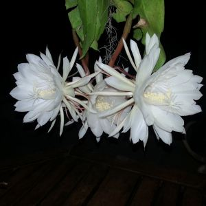
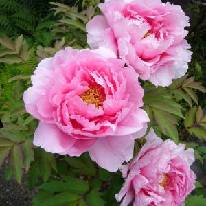
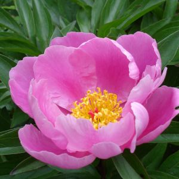
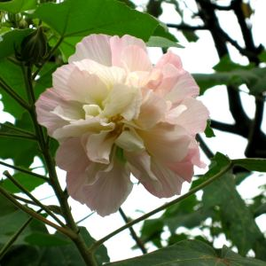
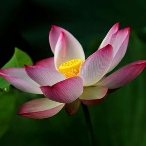
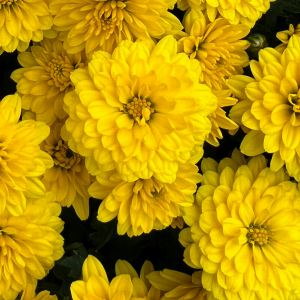
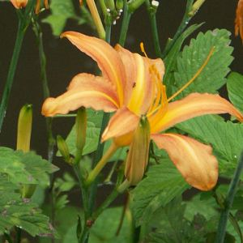
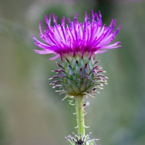
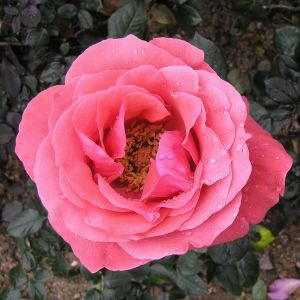
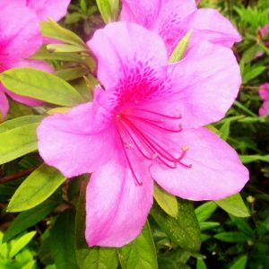

# Characters/words for plants and flowers

| chars | word | pinyin | English | image | comments | image source |
|--------|------|--------|----------|--------|-----------|--------------|
| 兰 | 兰花 | lánhuā | orchid |  | | [Pexels](https://www.pexels.com/photo/white-petaled-flowers-2291811/) |
| | 常青藤 | chángqīngténg | ivy |  | | [Pexels](https://www.pexels.com/photo/green-plants-in-wall-bricks-at-daytime-1171719/) |
| 昙 | 昙花 | tánhuā | night-blooming cereus |  | nocturnal cactus flower | [Wikimedia](https://zh.wikipedia.org/wiki/File:3_blooms_of_Epiphyllum_oxypetalum.jpg) |
| 牡, 丹 | 牡丹花 | mǔdānhuā | tree peony |  | national flower of China | [Wikimedia](https://zh.wikipedia.org/wiki/File:Paeonia_suffruticosa01_2048.jpg) |
| 芍 | 芍药 | sháoyào | Chinese peony   |  | | [Wikimedia](https://commons.wikimedia.org/wiki/File:Lactiflora1b.UME.jpg) |
| 芙, 蓉 | 芙蓉 | fúróng | hibiscus |  | many Chinese place names are named after this flower | [Wikimedia](https://en.wikipedia.org/wiki/File:Mufurong1.jpg) |
| 莲; 荷 | 莲花; 荷花 | liánhuā; héhuā | lotus flower |  | 莲蓬 liánpéng (seedpod); 莲蓬头 (showerhead; resembles lotus seedpod); 莲藕 liánǒu (lotus root) | [Pexels](https://www.pexels.com/photo/tilt-shift-photography-of-pink-and-white-flower-1179860/) |
| 菊 | 菊花 | júhuā | chrysanthemum |  | used in 菊花茶 chrysanthemum tea | [Pexels](https://www.pexels.com/photo/a-photo-of-a-yellow-flowers-14508521/) |
| 萱 | 萱草 | xuāncǎo | daylily | also called 忘忧草 |  | [Wikimedia](https://commons.wikimedia.org/wiki/File:Nokanzo_06c3694csv.jpg) |
| 蓟 | 蓟 | jì | thistle |  | | [Pexels](https://www.pexels.com/photo/blooming-thistle-in-meadow-5114103/) |
| 蔷 | 蔷薇 | qiángwēi | Rosa multiflora |  | generic term, including a range of roses, such as wild [野蔷薇](https://baike.baidu.com/item/%E9%87%8E%E8%94%B7%E8%96%87/4277) | [Wikimedia](https://commons.wikimedia.org/wiki/File:%E5%BB%A3%E6%9D%B1%E8%96%94%E8%96%87_Rosa_kwangtungensis_-%E9%A6%99%E6%B8%AF%E5%A4%A7%E5%9F%94%E6%B5%B7%E6%BF%B1%E5%85%AC%E5%9C%92_Taipo_Waterfront_Park,_Hong_Kong-_(9204835425).jpg) |
| 鹃 | 杜鹃花 | dùjuānhuā | rhododendron; azalea |  | 杜鹃 is also the word for cuckoo bird; 杜 Dù is also a Chinese surname, and there is a model named [杜鹃](https://baike.baidu.com/item/%E6%9D%9C%E9%B9%83/3142616) | [Wikimedia](https://commons.wikimedia.org/wiki/File:Azalea_Nanjing.jpg) |

