# Province abbreviations

Chinese provinces are assigned single-character abbreviatons.  In China, you'll most commonly see these abbreviations on license plates.  Photos (300px x 300px) taken of Chinese characters on license plates in China:

| 省份简称 | 省份     | 拼音   | 图片          |
|----------|---------|--------|---------------|
| 京       | 北京     | Jīng   |  |
| 吉       | 吉林     | Jí     |  |
| 川       | 四川     | Chuān  |  |
| 晋       | 山西     | Jìn    |  |
| 沪       | 上海     | Hù     |  |
| 浙       | 浙江     | Zhè    | 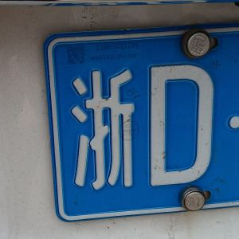 |
| 湘       | 湖南     | Xiāng  | 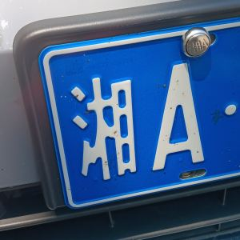 |
| 甘       | 甘肃     | Gān    |  |
| 皖       | 安徽     | Wǎn    |  |
| 苏       | 江苏     | Sū     |  |
| 豫       | 河南     | Yù     | 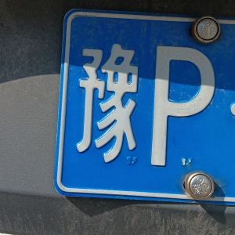 |
| 辽       | 辽宁     | Liáo   |  |
| 陕       | 陕西     | Shǎn   | 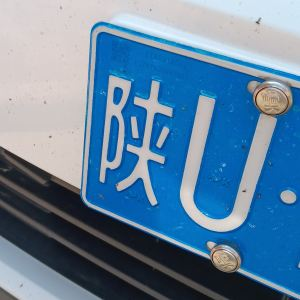 |
| 鲁       | 山东     | Lǔ     | 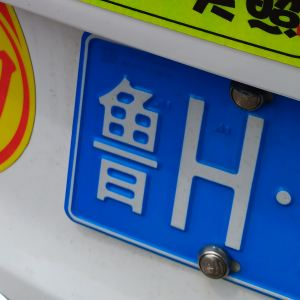 |
| 云       | 云南     | Yún    | 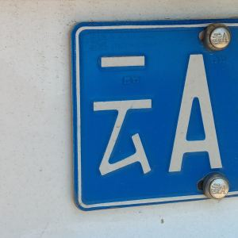 |
| 冀       | 河北     | Jì     | 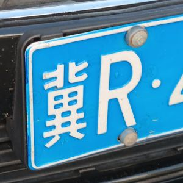 |
| 宁       | 宁夏     | Níng   |  |
| 新       | 新疆     | Xīn    | 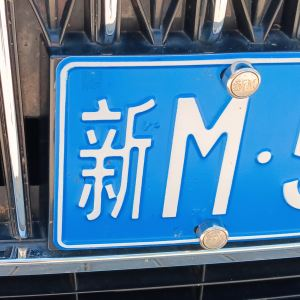 |
| 桂       | 广西     | Guì    | 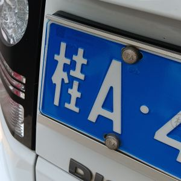 |
| 津       | 天津     | Jīn    |  |
| 渝       | 重庆     | Yú     |  |
| 琼       | 海南     | Qióng  |  |
| 粤       | 广东     | Yuè    | 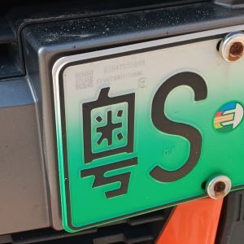 |
| 蒙       | 内蒙古   | Méng   |  |
| 赣       | 江西     | Gàn    | 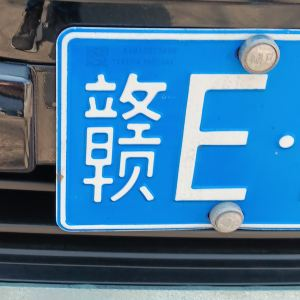 |
| 闽       | 福建     | Mǐn    |  |
| 青       | 青海     | Qīng   |  |
| 黑       | 黑龙江   | Hēi    |  |
| 鄂       | 湖北     | È      | (I don't have a photo) |
| 贵       | 贵州     | Guì    | (I don't have a photo) |
| 藏       | 西藏     | Zàng   | (I don't have a photo) |

These are special cases:

> 港, 澳, 台

Judging from Google Image Search, 澳 and 港 are used with 粤.  Taiwan's (台) license plates don't follow the same format.  These province abbreviations aren't used on license plates:

| abbrev. | province |
|----------|------|------|
| 蜀 | Shǔ | 四川 |
| 黔 | Qián | 贵州 |
| 滇 | Diān | 云南 |
| 秦 | Qín | 陕西 |
| 陇 | Lǒng | 甘肃 |

You can also find the character 电 on license plates:

> 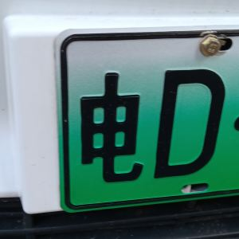

which is not a province, but indicates an eletric vehicle.  The character 使 also occurs on license plates for diplomats.
