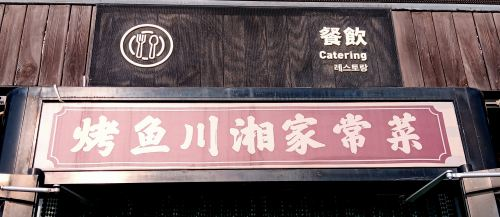

# Province abbreviations

Chinese provinces and other administrative divisions are assigned single-character abbreviatons.  In China, you'll most commonly see these abbreviations on license plates.

| abbrev. | pinyin | region | photo | source | 
|----------|---------|--------|---------------|---------------|
| 京       | Jīng   | 北京     |  | original photo |
| 吉       | Jí     | 吉林     |  | original photo |
| 川       | Chuān  | 四川     |  | original photo |
| 晋       | Jìn    | 山西     |  | original photo |
| 沪       | Hù     | 上海     |  | original photo |
| 浙       | Zhè    | 浙江     |  | original photo |
| 湘       | Xiāng  | 湖南     |  | original photo |
| 甘       | Gān    | 甘肃     |  | original photo |
| 皖       | Wǎn    | 安徽     |  | original photo |
| 苏       | Sū     | 江苏     |  | original photo |
| 豫       | Yù     | 河南     |  | original photo |
| 辽       | Liáo   | 辽宁     |  | original photo |
| 陕       | Shǎn   | 陕西     |  | original photo |
| 鲁       | Lǔ     | 山东     |  | original photo |
| 云       | Yún    | 云南     |  | original photo |
| 冀       | Jì     | 河北     |  | original photo |
| 宁       | Níng   | 宁夏     |  | original photo |
| 新       | Xīn    | 新疆     |  | original photo |
| 桂       | Guì    | 广西     |  | original photo |
| 津       | Jīn    | 天津     |  | original photo |
| 渝       | Yú     | 重庆     |  | original photo |
| 琼       | Qióng  | 海南     |  | original photo |
| 粤       | Yuè    | 广东     |  | original photo |
| 蒙       | Méng   | 内蒙古   |  | original photo |
| 赣       | Gàn    | 江西     |  | original photo |
| 闽       | Mǐn    | 福建     |  | original photo |
| 青       | Qīng   | 青海     |  | original photo |
| 黑       | Hēi    | 黑龙江   |  | original photo |
| 鄂       | È      | 湖北     |  | TO DO |
| 贵       | Guì    | 贵州     |  | TO DO |
| 藏       | Zàng   | 西藏     |  | TO DO |

These are special cases that don't follow the same format:

| abbrev. | pinyin | region | photo | source |
|----------|---------|--------|---------------|---------------|
| 港       | Gǎng  | 香港     |  | TO DO |
| 澳       | Ào    | 澳门     |  | TO DO |
| 台       | Tái   | 台湾     |  | TO DO |

You can also find the character 电 on license plates:

> 

which is not a province, but indicates an electric vehicle.  The character 使 also occurs on license plates for diplomats.

Some provinces and other administrative divisions abbreviations have multiple abbreivations:

| abbrev. | pinyin | region |
|----------|------|------|
| 蜀 | Shǔ | 四川 |
| 黔 | Qián | 贵州 |
| 滇 | Diān | 云南 |
| 秦 | Qín | 陕西 |
| 陇 | Lǒng | 甘肃 |
| 沽 | Gū | 天津 |

You'll encounter province abbreviations in the names of types of cuisine, e.g.:

> 
>
> 餐饮 烤鱼川湘家常菜

Here 川 is the abbreviation for 四川 (Sichuan) and 湘 is the abbreviation for 湖南 (Hunan).
