# Province abbreviations and license plates

Chinese provinces and other administrative divisions are assigned single-character abbreviatons.  In China, you'll most commonly see these abbreviations on license plates.

| abbrev. | pinyin | region | photo | source | 
|----------|---------|--------|---------------|---------------|
| 京       | Jīng   | 北京     | 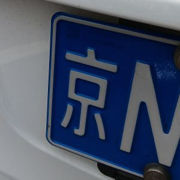 | original photo |
| 吉       | Jí     | 吉林     | 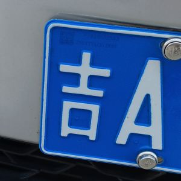 | original photo |
| 川       | Chuān  | 四川     | 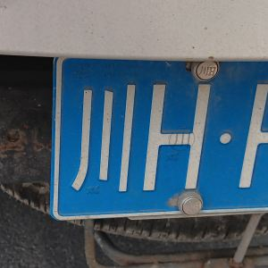 | original photo |
| 晋       | Jìn    | 山西     | 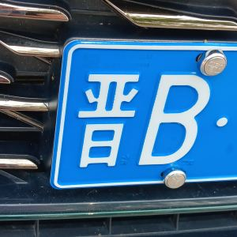 | original photo |
| 沪       | Hù     | 上海     | 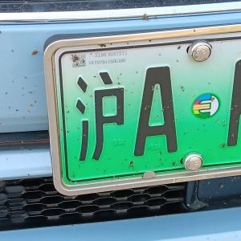 | original photo |
| 浙       | Zhè    | 浙江     |  | original photo |
| 湘       | Xiāng  | 湖南     |  | original photo |
| 甘       | Gān    | 甘肃     | 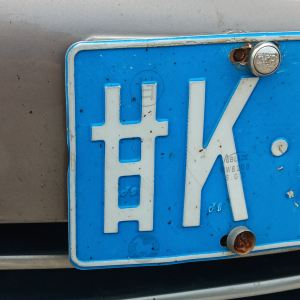 | original photo |
| 皖       | Wǎn    | 安徽     | 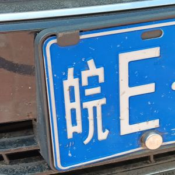 | original photo |
| 苏       | Sū     | 江苏     | 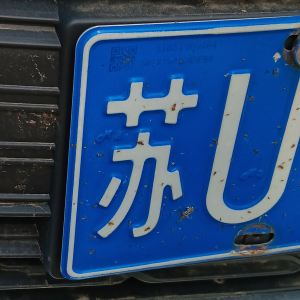 | original photo |
| 豫       | Yù     | 河南     |  | original photo |
| 辽       | Liáo   | 辽宁     | 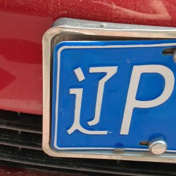 | original photo |
| 陕       | Shǎn   | 陕西     |  | original photo |
| 鲁       | Lǔ     | 山东     |  | original photo |
| 云       | Yún    | 云南     |  | original photo |
| 冀       | Jì     | 河北     |  | original photo |
| 宁       | Níng   | 宁夏     | 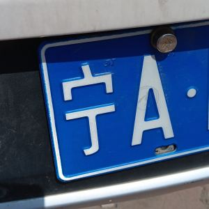 | original photo |
| 新       | Xīn    | 新疆     |  | original photo |
| 桂       | Guì    | 广西     |  | original photo |
| 津       | Jīn    | 天津     | 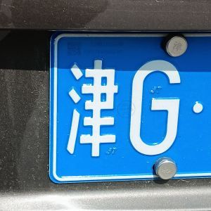 | original photo |
| 渝       | Yú     | 重庆     | 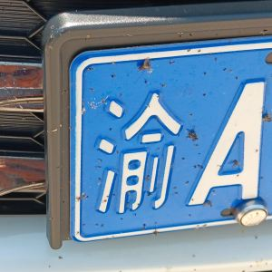 | original photo |
| 琼       | Qióng  | 海南     | 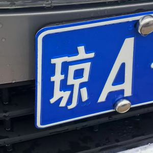 | original photo |
| 粤       | Yuè    | 广东     |  | original photo |
| 蒙       | Méng   | 内蒙古   | 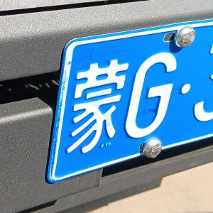 | original photo |
| 赣       | Gàn    | 江西     |  | original photo |
| 闽       | Mǐn    | 福建     | 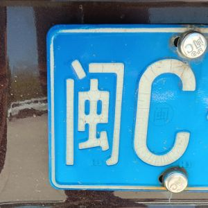 | original photo |
| 青       | Qīng   | 青海     | 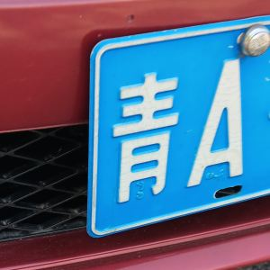 | original photo |
| 黑       | Hēi    | 黑龙江   | 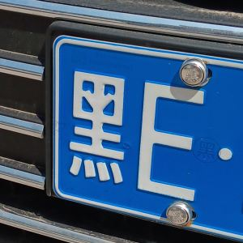 | original photo |
| 鄂       | È      | 湖北     | 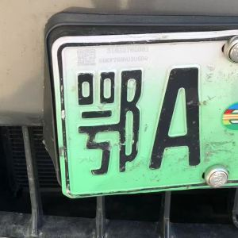 | original photo |
| 贵       | Guì    | 贵州     | 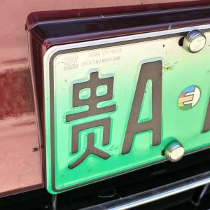 | [Wikimedia](https://commons.wikimedia.org/wiki/File:F_RCFD-GZ-Qiandongnan-Leishan-Xijiang_SG_%E8%B4%B5H39936_front.jpg) |
| 藏       | Zàng   | 西藏     | 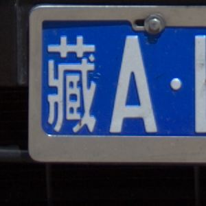 | original photo |

These regions don't follow the same format as mainland China:

| abbrev. | pinyin | region | photo | source |
|----------|---------|--------|---------------|---------------|
| 港       | Gǎng  | 香港     | 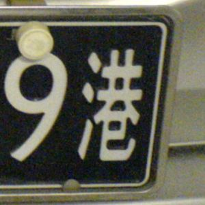 | [Wikimedia](https://commons.wikimedia.org/wiki/File:China_cross-border_Guangdong-Hong_Kong_license_plate-%E7%B2%A4Z%E2%80%A2G969%E6%B8%AF.jpg) |
| 澳       | Ào    | 澳门     | 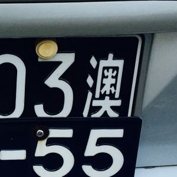 | [Wikimedia](https://commons.wikimedia.org/wiki/File:China_cross-border_Guangdong-Macau_license_plate_%E7%B2%A4Z_8503%E6%BE%B3.jpg) |
| 台       | Tái   | 台湾 / 台灣 | 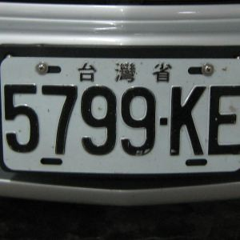 | [Wikimedia](https://commons.wikimedia.org/wiki/File:Taiwan_Province_License_Plate_(0146).JPG) |

Some other characters also appear on license plates in China:

| abbrev. | pinyin | meaning | photo | source |
|----------|---------|--------|---------------|---------------|
| 电       | diàn  | electric     |  | original photo |
| 警       | jǐng  | police 警察     | 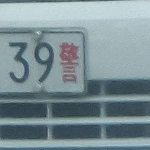 | original photo |
| 学       | xué  | student (e.g. driving schools)     | 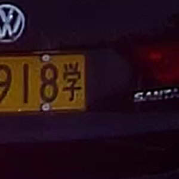 | [Wikimedia](https://commons.wikimedia.org/wiki/File:%E5%A4%A9%E6%B4%A5%E6%95%99%E7%BB%83%E8%BD%A6%E7%89%8C.png) |
| 挂       | guà  | large trailors 拖挂车     | 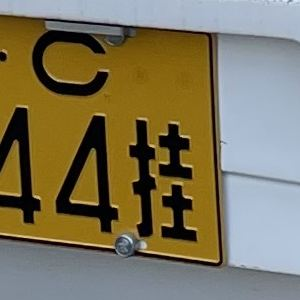 | [Wikimedia](https://commons.wikimedia.org/wiki/File:Yellow_vehicle_registration_plate_%E6%8B%96%E6%8C%82%E8%BD%A6_Trailer_in_Beijing,_P.R._China.jpg) |
| 使       | shǐ  | diplomat 大使     | 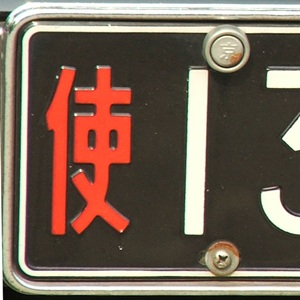 | [Wikimedia](https://commons.wikimedia.org/wiki/File:%E4%BD%BF_diplomatic_license_plate_from_the_People%27s_Republic_of_China.jpg) |
| 领       | lǐng    | consul 领事     | 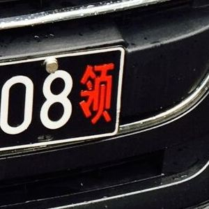 | [Wikimedia](https://commons.wikimedia.org/wiki/File:Vehicle_registration_plate_of_Consulate-General_of_France_in_Wuhan_%E9%84%82_China.jpg)  |

Some provinces and other administrative divisions have multiple abbreivations:

| abbrev. | pinyin | region |
|----------|------|------|
| 蜀; 川 | Shǔ | 四川 |
| 黔; 贵 | Qián | 贵州 |
| 滇; 云 | Diān | 云南 |
| 秦; 陕 | Qín | 陕西 |
| 陇; 甘 | Lǒng | 甘肃 |

You'll encounter province abbreviations in the names of types of cuisine, e.g.:

> 
>
> 餐饮 烤鱼川湘家常菜

Here 川 is the abbreviation for 四川 (Sichuan) and 湘 is the abbreviation for 湖南 (Hunan).

And Chinese cities also have abbreviations (too many to list in full):

| abbrev. | pinyin | region |
|----------|------|------|
| 津; 沽 | Gū | 天津 |
| 蓉 | Róng | 成都 |
| 武 | Wǔ | 武汉 |
| 宁 | Níng | 南京 |
| 哈 | Hā | 哈尔滨 |
| 青 | Qīng | 青岛 |
