# Characters/words using or related to 木

Trees and wood:

| chars | word | pinyin | English | images | comments | image source |
|-------|------|--------|---------|-------|----------|--------------|
| 杉 | 杉树 | shānshù | Chinese fir | 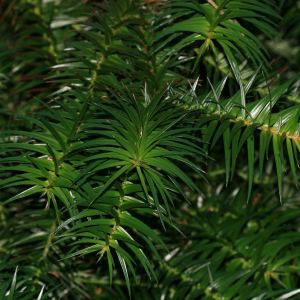 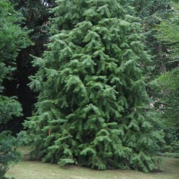 | | [Wikimedia](https://commons.wikimedia.org/wiki/File:Cunninghamia_lanceolata_(Chinese_Fir)_(31150059292).jpg); [Wikimedia](https://commons.wikimedia.org/wiki/File:Cunninghamia_lanceolata_Glauca.jpg) |
| 杉; 枞 | 冷杉树; 枞树 | lěngshānshù; cōngshù | fir | 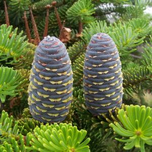 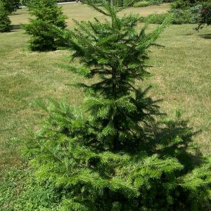 | a type of 松树 (pine) | [Wikimedia](https://commons.wikimedia.org/wiki/File:Abies_koreana_(szyszki).JPG); [Wikimedia](https://commons.wikimedia.org/wiki/File:Abies_nephrolepis.jpg) |
| 杉 | 红杉树 | hóngshānshù | redwood; sequoia | 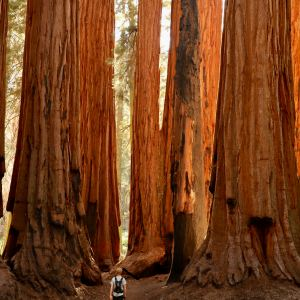 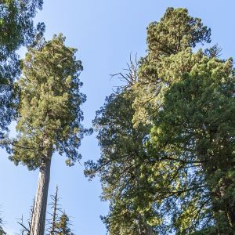 | | [Pexels](https://www.pexels.com/photo/sequoia-national-park-california-united-states-14946335/); [Wikimedia](https://commons.wikimedia.org/wiki/File:US_199_Redwood_Highway.jpg) |
| 杜; 松 | 杜松 | dùsōng | juniper | 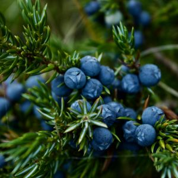 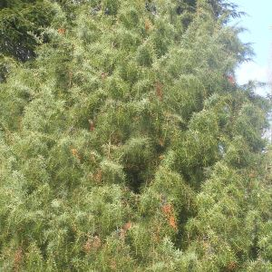 | produces 杜松子 (juniper berries) | [Pexels](https://www.pexels.com/photo/close-up-photo-of-blueberries-2463830/); [Wikimedia](https://commons.wikimedia.org/wiki/File:Juniperus_rigida_zampach1.JPG) |
| 杨 | 杨树 | yángshù | poplar; aspen | 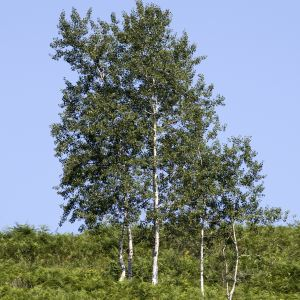 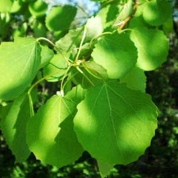 | | [Wikimedia](https://commons.wikimedia.org/wiki/File:Populus_tremula_-_Eurasian_Aspen_01.jpg); [Wikimedia](https://commons.wikimedia.org/wiki/File:PopulusTremula001.JPG) |
| 松 | 松树 | sōngshù | pine | 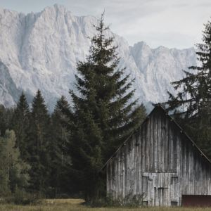 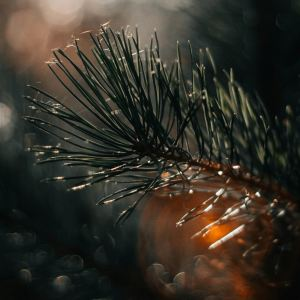 | produces 松果 (pine cones) and 松子 (pine nuts) | [Pexels](https://www.pexels.com/photo/cabin-in-mountains-12999768/); [Pexels](https://www.pexels.com/photo/macro-photography-of-long-needled-leaves-1517479/) |
| 松 | 雪松树 | xuěsōngshù | cedar | 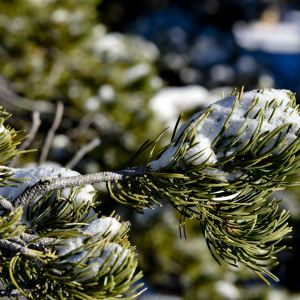 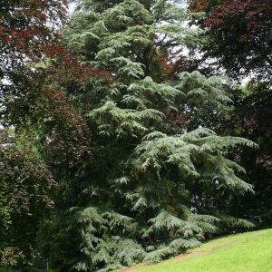 | a type of 松树 (pine) | [Public Domain](https://www.publicdomainpictures.net/cn/view-image.php?image=135905); [Wikimedia](https://commons.wikimedia.org/wiki/File:Cedrus_deodara_JPG1b.jpg) |
| 枫; 槭 | 枫树; 槭树 | fēngshù; qìshù | maple | 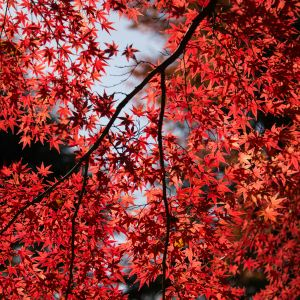 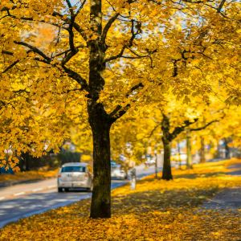 | | [Pexels](https://www.pexels.com/photo/red-leaf-tree-715134/); [Pexels](https://www.pexels.com/photo/yellow-leaf-tree-beside-roadway-262113/) |
| 柏 | 柏树 | bǎishù | cypress | 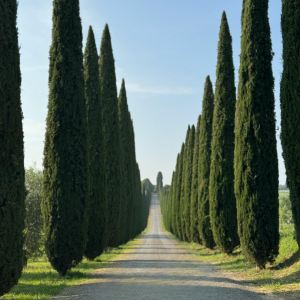 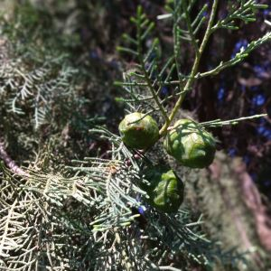 | | [Pexels](https://www.pexels.com/photo/yamaha-motorcycle-on-scenic-tuscan-road-32524287/) PixelCut AI used to remove motorcycle; [Wikimedia](https://commons.wikimedia.org/wiki/File:Leaf_cone_of_Cupressus_dupreziana_04.jpg) |
| 柏; 桧  | 圆柏; 桧柏 | yuánbǎi; guìbǎi  | Chinese juniper | 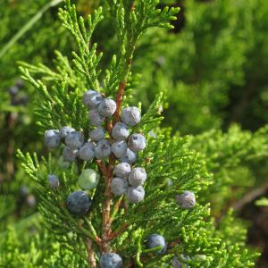 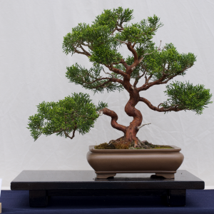 | | [Wikimedia](https://commons.wikimedia.org/wiki/File:Juniperus_sabina_RF.jpg); [Wikimedia](https://commons.wikimedia.org/wiki/File:Chinesischer_Wacholder_Bonsai.png) |
| 柳 | 柳树 | liǔshù | willow tree | 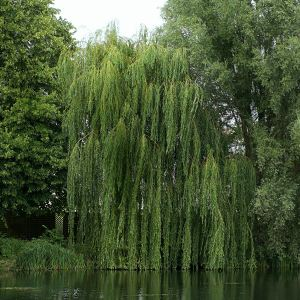 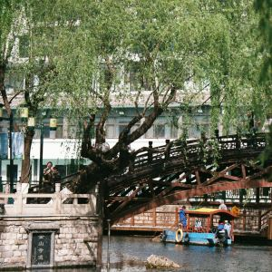 | | [Pexels](https://www.pexels.com/photo/red-tram-under-autumn-trees-in-park-setting-34453772/); [Pexels](https://www.pexels.com/photo/old-church-near-lush-tree-and-river-5644332/) |
| 柽; 柳 | 柽柳 | chēngliǔ | tamarisk | 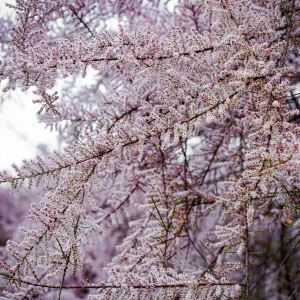 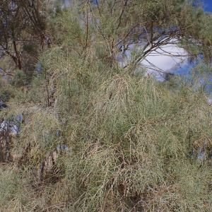 | | [Pexels](https://www.pexels.com/photo/white-blossoms-on-tree-branches-16935286/); [Wikimedia](https://commons.wikimedia.org/wiki/File:Tamarix_aphylla_kz03.jpg) |
| 栾 | 栾树 | luánshù | goldenrain tree | 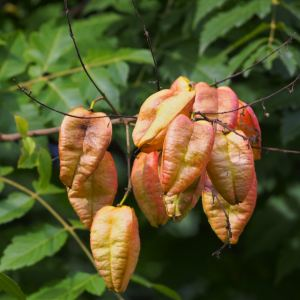 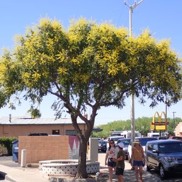 | | [Wikimedia](https://commons.wikimedia.org/wiki/File:Koelreuteria_paniculata_Roztrzeplin_wiechowaty_2021-10-02_02.jpg); [Wikimedia](https://commons.wikimedia.org/wiki/File:Koelreuteria_paniculata_-_golden_raintree_-_52179718746.jpg) |
| 桂 | 月桂 | yuèguì | laurel; bay tree | 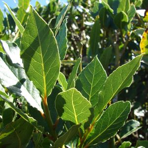 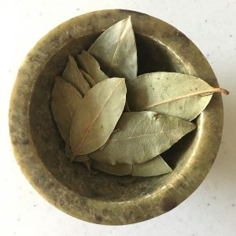 | produces 月桂叶 (bay leaves) | [Wikimedia](https://commons.wikimedia.org/wiki/File:Starr-071024-0195-Laurus_nobilis-leaves-Enchanting_Floral_Gardens_of_Kula-Maui_(24867859296).jpg); [Wikimedia](https://commons.wikimedia.org/wiki/File:Whole_Bay_Leaves.jpg) |
| 桂; 樨 | 桂花树; 木樨 | guìhuāshù; mùxī | osmanthus | 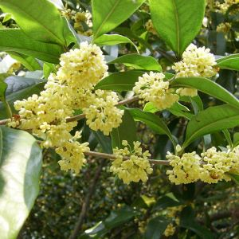 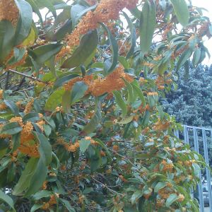 | | [Wikimedia](https://zh.wikipedia.org/wiki/File:Osmanthus_heterophyllus-hangzhou.JPG); [Wikimedia](https://commons.wikimedia.org/wiki/File:Osmanthus_fragrans_flowers.jpg) |
| 桃 | 桃花心木 | táohuāxīnmù | mahogany | 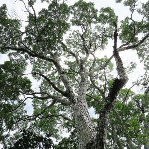  | sometimes called 红木 (hóngmù) but this better refers to prized hardwoods | [Wikimedia](https://commons.wikimedia.org/wiki/File:Swietenia_macrophylla_(30680883066).jpg); [Wikimedia](https://commons.wikimedia.org/wiki/File:Steinway_%26_Sons_upright_piano,_model_K-52_(mahogany_finish),_manufactured_at_Steinway%27s_factory_in_New_York_City.jpg) |
| 桉 | 桉树 | ānshù | eucalyptus; gum tree | 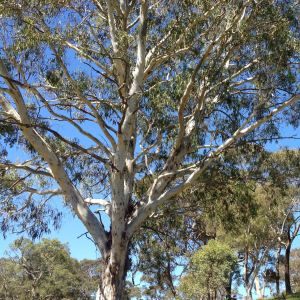 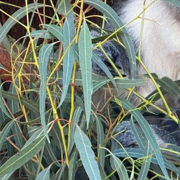  | | [Wikimedia](https://commons.wikimedia.org/wiki/File:Under_a_gum_tree_(6914173632).jpg); [Pexels](https://www.pexels.com/photo/close-up-of-a-koala-24343060/) |
| 桕 | 乌桕树 | wūjiùshù | Chinese tallow | 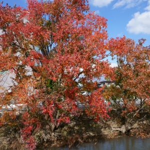 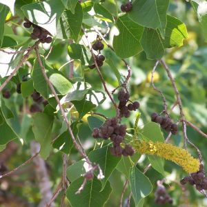 | | [Wikimedia](https://commons.wikimedia.org/wiki/File:Autumn_Triadica_sebifera_trees_by_a_river_in_Saga.jpg); [Wikimedia](https://commons.wikimedia.org/wiki/File:ChineseTallowSeedpods.jpg) |
| 桤 | 桤木; 桤树; 赤杨 | qīmù; qīshù; chìyáng | alder | 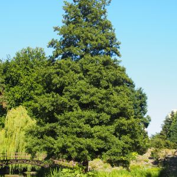 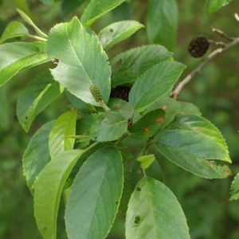 | | [Wikimedia](https://commons.wikimedia.org/wiki/File:Alnus_Olsza_2020-07-31_01.jpg); [Wikimedia](https://commons.wikimedia.org/wiki/File:Alnus_cremastogyne_kz.jpg) |
| 桦 | 桦树 | huàshù | birch | 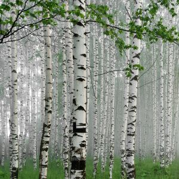 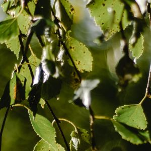 | | [Pexels](https://www.pexels.com/photo/path-in-a-foggy-birch-forest-8830706/); [Pexels](https://www.pexels.com/photo/close-up-of-leaves-on-tree-5503383/) |
| 梣 | 梣树; 白蜡树 | chénshù; báilàshù | Chinese ash | 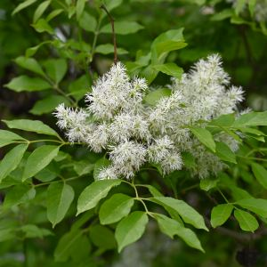 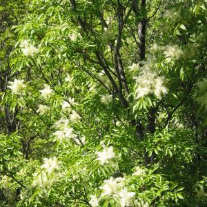 | | [Wikimedia](https://commons.wikimedia.org/wiki/File:Fraxinus_ornus_kz07.jpg); [Wikimedia](https://commons.wikimedia.org/wiki/File:Fraxinus_ornus_JPG1b.jpg) |
| 梧; 桐 | 梧桐树 | wútóngshù | Chinese parasol tree | 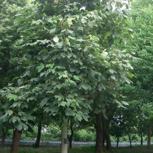 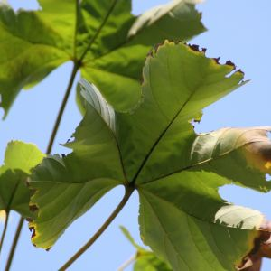 | | [Wikimedia](https://commons.wikimedia.org/wiki/File:Firmiana_simplex3.jpg); [Wikimedia](https://commons.wikimedia.org/wiki/File:Firmiana_simplex_3zz.jpg) |
| 棕; 榈 | 棕榈树 | zōnglǘshù | palm |  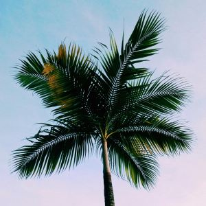 | | [Pexels](https://www.pexels.com/photo/silhouette-of-palm-trees-near-shoreline-461940/); [Pexels](https://www.pexels.com/photo/low-angle-photo-of-green-coconut-palm-tree-3205602/) |
| 植 | 植物 | zhíwù | plant | 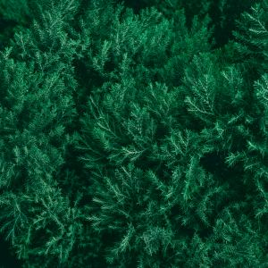 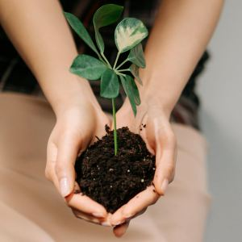 | generic term | [Pexels](https://www.pexels.com/photo/lush-green-chinese-juniper-foliage-texture-34704702/); [Pexels](https://www.pexels.com/photo/a-person-holding-soil-with-a-plant-7944399/) |
| 椒 | 花椒树 | huājiāoshù | Chinese prickly ash | 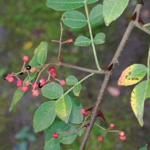 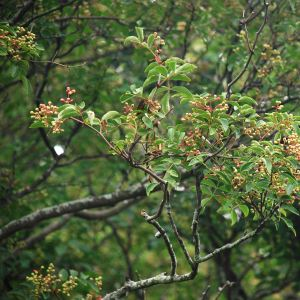 | produces 花椒 (Sichuan peppers) | [Wikimedia](https://en.wikipedia.org/wiki/File:Zanthoxylum_simulans_kz1.JPG); [Wikimedia](https://commons.wikimedia.org/wiki/File:Zanthoxylum_HighlandPark_RochesterNY12.jpg) |
| 椴 | 椴树 | duànshù | Chinese linden | 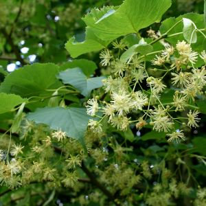 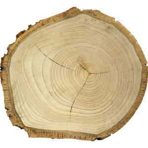 | | [Wikimedia](https://commons.wikimedia.org/wiki/File:Tilia_insularis_JPG1FeFl.jpg); [Wikimedia](https://commons.wikimedia.org/wiki/File:Tilia_tomentosa_coupe_MHNT.jpg) |
| 椿 | 香椿; 椿树 | xiāngchūn; chūnshù | Chinese toon |   | | [Wikimedia](https://commons.wikimedia.org/wiki/File:A_Toona_sinensis_tree.jpg); [Wikimedia](https://commons.wikimedia.org/wiki/File:Toona_sinensis_-_Kunming_Botanical_Garden_-_DSC02812.JPG) |
| 楝 | 楝树; 苦楝树 | liànshù; kǔliànshù | chinaberry tree; bead tree |   | | [Wikimedia](https://commons.wikimedia.org/wiki/File:Melia_azedarach_01434.jpg); [Wikimedia](https://commons.wikimedia.org/wiki/File:Melia_azedarach_Hotel_Broadway_Logan_Rd_Wooloongabba_P1180871.jpg) |
| 楠; 桢 | 楠树; 桢楠木 | nánshù; zhēnnánmù | Phoebe zhennan |   | | JingDong screenshot; [Wikimedia](https://commons.wikimedia.org/wiki/File:Phoebe_zhennan_-_Chengdu_Botanical_Garden_-_Chengdu,_China_-_DSC03647.JPG) |
| 楸; 梓 | 梓树; 楸树 | zǐshù; qiūshù | catalpa |   | | [Wikimedia](https://commons.wikimedia.org/wiki/File:Catalpa_bignonioides_boule.jpg); [Wikimedia](https://commons.wikimedia.org/wiki/File:Catalpa_inflorescence_(Catalpa_bignonioides).jpg) |
| 榆 | 榆树 | yúshù | elm |   | | [Wikimedia](https://commons.wikimedia.org/wiki/File:Elm_Tree_in_West_Hartford,_Connecticut_-_May_2017.jpg); [Pexels](https://www.pexels.com/photo/bright-green-elm-tree-leaf-4131782/) |
| 榉 | 山毛榉 | shānmáojǔ | beech |   | | [Wikimedia](https://commons.wikimedia.org/wiki/File:Copper_Beech_Fagus_sylvatica_f._purpurea_Autumn_Leaves_Closeup_3008px.jpg); [Wikimedia](https://commons.wikimedia.org/wiki/File:D%C3%BClmen,_B%C3%B6rnste,_Waldweg_--_2015_--_4649.jpg) |
| 榉 | 榉树 | jǔshù | Japanese zelkova |   | | [Wikimedia](https://zh.wikipedia.org/wiki/File:Japanese_Zelkova,_1895-2007.jpg); [Wikimedia](https://commons.wikimedia.org/wiki/File:Zelkova_serrata_Noma_keyaki01.jpg) |
| 榕 | 榕树 | róngshù | ficus; Chinese banyan |   | | [Pexels](https://www.pexels.com/photo/green-tree-709543/); [Wikimedia](https://commons.wikimedia.org/wiki/File:Chinese_Banyan_-_National_Bonsai_%26_Penjing_Museum_-_Washington,_D.C._-_Sarah_Stierch.jpg) |
| 榧 | 榧树 | fěishù | Chinese nutmeg yew |   | | [Wikimedia](https://commons.wikimedia.org/wiki/File:Torreya_grandis_Merrillii1.jpg) [Wikimedia](https://commons.wikimedia.org/wiki/File:Torreya_grandis.jpg) |
| 槐 | 槐树 | huáishù | locust tree; Chinese scholar tree |   | | [Pexels](https://www.pexels.com/photo/selective-focus-of-black-locust-flowers-25403143/); [Wikimedia](https://zh.wikipedia.org/wiki/File:Sophora_japonica_JPG2Aa.jpg) |
| 樟 | 樟树 | zhāngshù | camphor |   | | [Wikimedia](https://commons.wikimedia.org/wiki/File:Cinnamomum_camphora_Vergelegen.jpg); [Wikimedia](https://en.wikipedia.org/wiki/File:Cinnamomum_camphora_Turramurra_railway.jpg) |
| 橡 | 橡树; 栎树 | xiàngshù; lìshù | oak |   | produces acorns 橡子 | [Pexels](https://www.pexels.com/photo/person-holding-green-leafed-tree-701763/); [Wikimedia](https://commons.wikimedia.org/wiki/File:Sallandse_Heuvelrug_oak_tree_1.jpg) |
| 檀 | 檀香树 | tánxiāngshù | sandalwood |   | | [Wikimedia](https://commons.wikimedia.org/wiki/File:%E6%AA%80%E9%A6%99_Santalum_album_20210712091332_10.jpg); [Wikimedia](https://commons.wikimedia.org/wiki/File:Santalum_album_(Chandan)_in_Hyderabad,_AP_W_IMG_0029.jpg) |
| 檀 | 紫檀 | zǐtán | red sandalwood |   | one of the official 红木 (rosewoods) defined by the standards [GB/T 18107-2017《红木》](https://openstd.samr.gov.cn/bzgk/gb/newGbInfo?hcno=6E961C6DB78254EF883B5053D08BFA3B); there is a museum [中国紫檀博物馆](http://www.redsandalwood.com/) for this specific wood | [Wikimedia](https://commons.wikimedia.org/wiki/File:China_Red_Sandalwood_Museum_3.jpg); [Wikimedia](https://commons.wikimedia.org/wiki/File:Pterocarpus_santalinus_in_Talakona_forest,_AP_W_IMG_8099.jpg) |
| | 灌木 | guànmù | shrub |  | 灌木丛 (guànmùcóng) is "shrubbery" | [Wikimedia](https://commons.wikimedia.org/wiki/File:Shrubbery_Landscape,_entrance_to_Lucas_Nursery,_10190_Ann_Arbor_Road_West_Plymouth,_MI_-_panoramio.jpg) |
| | 竹子 | zhúzi | bamboo |   | | [Pexels](https://www.pexels.com/photo/bamboo-trees-881235/); [Wikimedia](https://commons.wikimedia.org/wiki/File:Big_Bamboo_Shoot_(Joi_Ito).jpg) |
| | 金合欢树 | jīnhéhuānshù | acacia; wattle |   | | [Pexels](https://www.pexels.com/photo/tree-at-the-desert-1821699/); [Wikimedia](https://commons.wikimedia.org/wiki/File:Acacia_pycnantha_Golden_Wattle.jpg) |

Trees named after their produce:

| chars | word | pinyin | English | image | comments | image source |
|-------|------|--------|---------|-------|----------|--------------|
| 李 | 李子树; 李树 | lǐzishù; lǐshù | plum tree |  | | [Pexels](https://www.pexels.com/photo/close-up-of-a-bunch-of-plums-on-the-branch-18273782/) |
| 杏 | 杏树 | xìngshù | apricot tree |  | produces 杏子 (apricots) and 杏核 (apricot seeds); 杏仁 (almond) is a completely different species | [Pexels](https://www.pexels.com/photo/apricots-on-a-tree-8774581/) |
| 杏 | 银杏树 | yínxìngshù | ginkgo tree |  | | [Pexels](https://www.pexels.com/photo/close-up-of-vibrant-yellow-ginkgo-leaves-in-autumn-29052543/) |
| 枇; 杷 | 枇杷树 | pípáshù | loquat tree |  | | [Pexels](https://www.pexels.com/photo/close-up-of-yellow-fruits-growing-on-the-tree-16100659/) |
| 果 | 果树 | guǒshù | fruit tree |  | generic term | [Pexels](https://www.pexels.com/photo/photo-of-orange-tree-under-the-sun-3541364/) |
| 果 | 苹果树 | píngguǒshù | apple tree |  | | [Pexels](https://www.pexels.com/photo/ripe-apples-growing-on-green-tree-branches-5528996/) |
| 枝 | 荔枝树 | lìzhīshù | lychee tree |  | | [Pexels](https://www.pexels.com/photo/red-litchi-fruit-17201892/) |
| | 枣树 | zǎoshù | jujube tree; date tree |  | | [Pexels](https://www.pexels.com/photo/ripe-red-date-fruits-on-a-branch-18465069/) |
| 枸; 杞 | 枸杞树 | gǒuqǐshù | goji berry tree |  | | [Wikimedia](https://commons.wikimedia.org/wiki/File:Lycium_barbarum_-_Wolfberries_China_7-05.jpg) |
| 柚 | 柚子树 | yòuzishù | pomelo tree |  | | [Pexels](https://www.pexels.com/photo/a-green-pomelo-fruits-on-a-tree-branch-with-green-leaves-7894869/) |
| 柠; 檬 | 柠檬树 | níngméngshù | lemon tree |  | | [Pexels](https://www.pexels.com/photo/fresh-lemons-on-a-tree-in-a-sunlit-garden-34451549/) |
| 柿 | 柿子树 | shìzishù | persimmon tree |  | | [Pexels](https://www.pexels.com/photo/branch-with-persimmons-7534602/) |
| 栗 | 栗子树 | lìzishù | chestnut tree |  | | [Pexels](https://www.pexels.com/photo/sweet-chestnuts-on-the-tree-11801655/) |
| 核; 桃 | 核桃树 | hétaoshù | walnut tree |  | | [Pexels](https://www.pexels.com/photo/close-up-of-a-walnut-13873939/) |
| 桃; 杏 | 扁桃树; 杏仁树 | biǎntáoshù; xìngrénshù | almond tree |  | almonds are also called 巴旦木 (loanword, probably from the Persian badam [بادام](https://en.wiktionary.org/wiki/%D8%A8%D8%A7%D8%AF%D8%A7%D9%85#Persian)) | [Pexels](https://www.pexels.com/photo/almond-tree-3632381/) |
| 桃 | 桃树 | táoshù | peach tree |  | | [Pexels](https://www.pexels.com/photo/ripe-peaches-hanging-from-a-tree-branch-33419664/) |
| 桑 | 桑树 | sāngshù | mulberry tree |  | | [Pexels](https://www.pexels.com/photo/mulberry-fruits-hanging-on-the-branches-8449325/) |
| 梅 | 梅树 | méishù | Chinese plum tree |   | produces 梅花 and 梅子/青梅 (plum, not the same as 李子), an ingredient in 酸梅汤 | [Wikimedia](https://commons.wikimedia.org/wiki/File:Prunus_mume_fruits_2.jpg); [Wikimedia](https://commons.wikimedia.org/wiki/File:MeihuaShan_1.jpg) |
| 梨 | 梨树 | líshù | pear tree |  | | [Pexels](https://www.pexels.com/photo/ripe-pears-on-tree-branch-in-sunlight-33643749/) |
| 椰 | 椰子树 | yēzishù | coconut palm |  | | [Pexels](https://www.pexels.com/photo/worm-s-eye-view-photo-of-coconut-tree-1646272/) |
| 榛 | 榛子树 | zhēnzishù | hazelnut tree |  | | [Wikimedia](https://commons.wikimedia.org/wiki/File:Corylus_avellana_-_Hazelnut_-_F%C4%B1nd%C4%B1k_2.JPG) |
| 榴 | 石榴树 | shíliúshù | pomegranate tree |  | | [Pexels](https://www.pexels.com/photo/ripe-green-pomegranates-on-tree-branches-in-izmir-32975980/) |
| 槟; 榔 | 槟榔树 | bīnglángshù | betel nut palm; areca palm |  | | [Wikimedia](https://commons.wikimedia.org/wiki/File:Areca_catechu_32466993.jpg) |
| 樱; 桃 | 樱桃树 | yīngtáoshù | cherry tree |  | | [Pexels](https://www.pexels.com/photo/ripe-red-cherries-hanging-on-a-tree-branch-34493387/) |
| 樱 | 樱花; 樱花树 | yīnghuā; yīnghuāshù | cherry blossom tree |   | bred through 嫁接 (grafting); it's hard to differentiate 梅花, 樱花, 桃花, and 李花 | [Pexels](https://www.pexels.com/photo/pink-petaled-flowers-closeup-photo-992734/); [Pexels](https://www.pexels.com/photo/pink-bicycle-parked-beside-a-cherry-blossom-tree-4198566/) |
| 橄; 榄 | 橄榄树 | gǎnlǎnshù | olive tree |  | | [Pexels](https://www.pexels.com/photo/crop-faceless-gardener-touching-olives-on-tree-in-garden-6231906/) |
| 橙; 柳; 柑; 橘 | 橙子树; 柳橙树; 柑橘树 | chéngzǐshù; liǔchéngshù; gānjúshù | orange tree; citrus tree |  | | [Pexels](https://www.pexels.com/photo/orange-fruit-2683370/) |
| 橡 | 橡胶树 | xiàngjiāoshù | rubber tree |  | despite the name, not actually a 橡树 (oak) | [Pexels](https://www.pexels.com/photo/natural-rubber-tapping-from-a-rubber-tree-32755398/) |

Tree/wood-related products, etc.:

| chars | word | pinyin | English | image | comments | image source |
|-------|------|--------|---------|-------|----------|--------------|
| | 乌木 | wūmù | ebony |  | | [Wikimedia](https://commons.wikimedia.org/wiki/File:Ebony_elefant.JPG) |
| | 木偶 | mù'ǒu | puppet |  | also used in 木偶戏 (puppet show) | [Pexels](https://www.pexels.com/photo/photograph-of-a-wooden-puppet-12266787/) |
| | 木匠 | mùjiàng | carpenter |  | | [Pexels](https://www.pexels.com/photo/woodworker-using-an-industrial-grinding-machine-5466226/) |
| | 木屑 | mùxiè | sawdust; wood shavings |  | | [Pexels](https://www.pexels.com/photo/person-using-chainsaw-4206122/) |
| 木 | 木柴 | mùchái | firewood |  | | [Pexels](https://www.pexels.com/photo/pile-of-fire-woods-244563/) |
| | 木浆 | mùjiāng | wood pulp |  | raw material for making paper | [Wikimedia](https://commons.wikimedia.org/wiki/File:Workers_shoveling_mass_in_pulp_mill.jpg) |
| | 木炭 | mùtàn | charcoal |  | | [Pexels](https://www.pexels.com/photo/burning-charcoal-36458/) |
| | 木耳 | mù'ěr | black fungus |  | | [Pexels](https://www.pexels.com/photo/fried-tofu-with-vegetables-on-white-ceramic-plate-5848479/) |
| | 木雕 |  | wood carving |  | 根雕 gēndiāo for root carving | [Wikimedia](https://commons.wikimedia.org/wiki/File:Wood_carving_master.jpg) |
| | 木马 | mùmǎ | wooden horse; Trojan horse |  | also used for malware | screenshot from movie Troy |
| | 木鱼 | mùyú | wooden fish |  | Buddhist percussion instrument | [Wikimedia](https://commons.wikimedia.org/wiki/File:A_Wooden_Fish_at_sacrifical_altar_in_Yuen_Yuen_Institule.jpg) |
| 杆 | 球杆 | qiúgān | club; cue |  | used in 高尔夫 (golf), 台球 (billiards), 马球 (polo) | [Pexels](https://www.pexels.com/photo/artistic-portrait-of-man-holding-hockey-sticks-30637023/) |
| 杖 | 拐杖 | guǎizhàng | walking stick; crutches |  | | [Wikimedia](https://www.pexels.com/photo/senior-with-walking-stick-on-street-20571260/) |
| 杖 | 拐杖; 手杖 | guǎizhàng; shǒuzhàng | walking stick |  | often seen in the collocation 拄着……拐杖 | [Wikimedia](https://www.pexels.com/photo/senior-with-walking-stick-on-street-20571260/) |
| 杖 | 擀面杖 | gǎnmiànzhàng | rolling pin |  | | [Wikimedia](https://www.pexels.com/photo/person-flattening-a-dough-with-rolling-pin-6061694/) |
| 杵 | 杵 | chǔ | pestle |  | used in 臼杵 (jiùchǔ; mortar and pestle); historically 杵 was made of wood and was used for washing clothes 捣衣杵 (dǎoyīchǔ; a kind of laundry mallet); seen in the chengyu 磨杵成针 | [Pexels](https://www.pexels.com/photo/close-up-of-woman-using-mortar-and-pestle-to-make-pesto-4871370/) |
| 松 | 松子 | sōngzǐ | pine nuts |  | | [Wikimedia](https://commons.wikimedia.org/wiki/File:Pinoli.jpg) |
| 松 | 松果 | sōngguǒ | pine cone |  | | [Pexels](https://www.pexels.com/photo/closeup-photography-of-brown-pine-cone-1021616/) |
| 松 | 松茸 | sōngróng | matsutake mushroom; pine mushrooms |  | often grows near 松树 (pine) | [Pexels](https://www.pexels.com/photo/assorted-forest-mushrooms-in-a-rustic-bowl-33111629/) |
| 板 | 木板 | mùbǎn | wooden plank |  | | [Pexels](https://www.pexels.com/photo/brown-wooden-panel-beside-concrete-board-269063/) |
| 果 | 果仁 | guǒrén | kernel; nut; seed |  | 杏仁 (apricot kernel), 核桃仁 (walnut kernel), 花生仁 (peanut kernel), etc. | [Pexels](https://www.pexels.com/photo/stainless-steel-spoon-beside-bread-on-white-ceramic-plate-5605628/) |
| 果 | 果园 | guǒyuán | orchard |  | | [Wikimedia](https://commons.wikimedia.org/wiki/File:Cherry_orchard_at_Norton_-_geograph.org.uk_-_170685.jpg) |
| 果 | 果汁 | guǒzhī | fruit juice |  | 苹果汁 (apple juice), 橙汁 (orange juice), 葡萄汁 (grape juice), 西瓜汁 (watermelon juice), 菠萝汁 (pineapple juice), 芒果汁 (mango juice), etc. | [Pexels](https://www.pexels.com/photo/woman-in-pink-top-holding-orange-juice-in-glass-cupo-3676/) |
| 果 | 果皮 | guǒpí | fruit peel |  | 苹果皮 (apple peel), 香蕉皮 (banana peel), 葡萄皮 (grape skin), etc.; sometimes used in traditional Chinese medicine, e.g. 陈皮 (dried 橘子皮) | [Pexels](https://www.pexels.com/photo/yellow-banana-peels-on-white-surface-1974514/) |
| 果 | 果酱 | guǒjiàng | jam |  | 草莓酱 (strawberry jam), 覆盆子酱 (raspberry jam), 杏子酱 (apricot jam), 橘子酱 (marmalade), etc. | [Pexels](https://www.pexels.com/photo/bread-with-jam-on-a-wooden-board-8108150/) |
| 枝; 杈 | 树枝; 树杈 | shùzhī; shùchà | tree branch |  | | [Pexels](https://www.pexels.com/photo/brown-wooden-bird-cage-hangs-on-gray-tree-branch-754738/) |
| 柩 | 灵柩 | língjiù | coffin |  | contains the deceased | [Pexels](https://www.pexels.com/photo/a-group-of-men-in-black-clothing-carrying-a-wooden-coffin-7317938/) |
| | 树叶 | shùyè | leaves |  | | [Pexels](https://www.pexels.com/photo/autumn-leaves-on-grass-with-brown-shoes-34532632/) |
| | 树干 | shùgàn | tree trunk |  | | [Pexels](https://www.pexels.com/photo/photo-of-tree-bark-2287952/) |
| | 树懒 | shùlǎn | sloth |  | | [Pexels](https://www.pexels.com/photo/portrait-of-sloth-hanging-upside-down-on-branch-4484954/) |
| | 树液 | shùyè | tree sap |  | | [Wikimedia](https://commons.wikimedia.org/wiki/File:Sap_of_Sansevieria_trifasciata.jpg) |
| | 树皮 | shùpí | tree bark |  | | [Pexels](https://www.pexels.com/photo/gray-tree-trunk-355757/) |
| | 树脂 | shùzhī | resin |  | | [Wikimedia](https://commons.wikimedia.org/wiki/File:Resin-Cherry.jpg) |
| | 树苗 | shùmiáo | sapling |  | | [Pexels](https://www.pexels.com/photo/person-holding-a-green-plant-1072824/) |
| | 树荫 | shùyīn | shade of a tree |  | | [Pexels](https://www.pexels.com/photo/a-man-and-woman-doing-yoga-together-8939919/) |
| | 树蛙 | shùwā | tree frog |  | | [Pexels](https://www.pexels.com/photo/close-up-photo-of-green-frog-3656636/) 
| 根 | 树根 | shùgēn | tree root |  | | [Pexels](https://www.pexels.com/photo/gray-trunk-green-leaf-tree-beside-body-of-water-762679/) |
| 栽 | 盆景; 盆栽 | pénjǐng; pénzāi | bonsai; potted plant |  | 盆栽 is also the Japanese for "bonsai" | [Pexels](https://www.pexels.com/photo/green-bonzai-tree-on-table-2149105/) |
| 栽 | 种树; 栽树 | zhòngshù; zāishù | to plant trees |  | | [Pexels](https://www.pexels.com/photo/yellow-flower-with-green-leaves-9324330/) |
| 桩 | 树桩 | shùzhuāng | tree stump |  | | [Pexels](https://www.pexels.com/photo/photo-of-a-forest-14447605/) |
| 桶 | 木桶 | mùtǒng | bucket; barrel |  | | [Pexels](https://www.pexels.com/photo/wine-tank-room-434311/) |
| 梢 | 树梢; 树冠 | shùshāo; shùguān | treetop; canopy |  | | [Pexels](https://www.pexels.com/photo/aerial-shot-of-forest-3078734/) |
| 棍 | 球棍; 曲棍 | qiúgùn; qūgùn | hockey stick |  | used in 曲棍球 (field hockey), 长曲棍球 (lacrosse), 冰球 (ice hockey) | [Pexels](https://www.pexels.com/photo/artistic-portrait-of-man-holding-hockey-sticks-30637023/) |
| 棒 | 球棒 | qiúbàng | bat |  | used in 棒球 (baseball), 垒球 (softball), 板球 (cricket); sometimes 球拍 or 球棍 is used | [Pexels](https://www.pexels.com/photo/people-playing-baseball-1234953/) |
| 森; 林 | 森林; 树林 | sēnlín; shùlín | forest |  | | [Pexels](https://www.pexels.com/photo/green-leaf-trees-on-forest-167698/) |
| 棺 | 棺材 | guāncai | coffin |  | physical box; 木棺材 (wood coffin), 石棺材 (stone coffin), etc.; 石棺 (sarcophagus); there's also 棺椁, with an inner 棺 and outer 椁 coffin | [Wikimedia](https://commons.wikimedia.org/wiki/File:A_casket_maker_spraying_a_coffin_01.jpg) |
| 槌; 棒 | 木槌; 槌棒 | mùchuí; chuíbàng | mallet |  | used in 槌球 (croquet) | [Pexels](https://www.pexels.com/photo/a-mallet-on-the-grass-7348593/) |
| 槿 | 芙蓉花; 木槿 | fúrónghuā; mùjǐn | hibiscus |  | sometimes 芙蓉 is used poetically to refer to lotus 荷花 | [Wikimedia](https://commons.wikimedia.org/wiki/File:Hibiscus_mutabilis_0409.JPG) |
| | 漆 | qī | lacquer; varnish |  | coating made from the sap of 漆树 | [Pexels](https://www.pexels.com/photo/photo-of-man-applying-varnish-3186683/) |
| | 漆树 | qīshù | lac tree |  | its (toxic) sap is used to make 漆 (lacquer) | [Wikimedia](https://commons.wikimedia.org/wiki/File:Mature_Toxicodendron_vernicifluum,_Royal_Botanic_Garden,_Edinburgh.jpg) |
| | 琥珀 | hǔpò | amber |  | fossilized tree resin | [Pexels](https://www.pexels.com/photo/brown-crystal-fragment-87610/) |
| 竿 | 鱼竿 | yúgān | fishing pole; fishing rod |  | used in 钓鱼 (fishing) | [Pexels](https://www.pexels.com/photo/man-fishing-in-a-river-14848553/) |
| | 苔藓 | táixiǎn | moss |  | | [Pexels](https://www.pexels.com/photo/moss-macro-close-up-113848/) |
| | 莲藕 | liánǒu | lotus root |  | | [Pexels](https://www.pexels.com/photo/spicy-korean-lotus-root-salad-with-sesame-34451335/) |
| | 蕨类 | juélèi | fern |  | | [Pexels](https://www.pexels.com/photo/close-up-photo-of-green-fern-leaf-1226302/) |
| | 藤 | téng | vine |  | | [Pexels](https://www.pexels.com/photo/vibrant-bird-perched-in-entwined-vines-31189104/) |
| 藻 | 藻类 | zǎolèi | algae |  | | [Pexels](https://www.pexels.com/photo/duck-in-green-water-9937659/) |
| 麻 | 芝麻 | zhīma | sesame |  | | [Wikimedia](https://upload.wikimedia.org/wikipedia/commons/8/8f/Sesamum_indicum%28%E0%A6%A4%E0%A6%BF%E0%A6%B2_%E0%A6%97%E0%A6%9B%29.jpg) |

