# Chinese ethnicities

This is a work in progress.

| ethnic group | pinyin | English | images | comments | image source |
|--------------|--------|---------|--------|----------|--------------|
| 汉族 | Hànzú | Han |  | 90%+ of Chinese people are Han Chinese (largest ethnic group in the world; 1.4 billion people; 20%+ of the world's population); there are another 55 officially recognized ethnic groups in China | [Pexels](https://www.pexels.com/photo/elegant-woman-in-traditional-asian-attire-34521640/); [Wikimedia](https://commons.wikimedia.org/wiki/File:%E6%96%87%E6%88%BF%E5%9B%9B%E5%AF%B6_Four_Treasures_in_the_Study,_Paper,_Writing_Brush,_Ink_Stick,_and_Ink_Stone_-_panoramio.jpg) |

There are 55 recognized ethnic minorities in China, namely:

> 阿昌族, 白族, 布朗族, 保安族, 布依族, 达斡尔族, 傣族, 德昂族, 侗族, 东乡族, 独龙族, 鄂温克族, 高山族, 仡佬族, 哈尼族, 哈萨克族, 回族, 赫哲族, 京族, 景颇族, 基诺族, 柯尔克孜族, 朝鲜族, 拉祜族, 黎族, 傈僳族, 珞巴族, 满族, 毛南族, 门巴族, 蒙古族, 苗族, 仫佬族, 纳西族, 怒族, 鄂伦春族, 普米族, 羌族, 俄罗斯族, 撒拉族, 畲族, 水族, 塔吉克族, 塔塔尔族, 藏族, 土族, 土家族, 维吾尔族, 乌孜别克族, 佤族, 锡伯族, 瑶族, 彝族, 裕固族, 壮族

| ethnic group | pinyin | English | images | comments | image source |
|--------------|--------|---------|--------|----------|--------------|
| 白族 | Báizú | Bai |  | | [Pexels](https://www.pexels.com/photo/woman-in-pink-traditional-clothing-18658203/) |
| 布依族 | Bùyīzú | Bouyei |  | | [Wikimedia](https://commons.wikimedia.org/wiki/File:Three_matchmakers.jpg) |
| 傣族 | Dǎizú | Dai |  | | [Wikimedia](https://commons.wikimedia.org/wiki/File:%E4%BA%91%E5%8D%97%E7%9C%81%E8%A5%BF%E5%8F%8C%E7%89%88%E7%BA%B3%E5%82%A3%E6%97%8F%E8%87%AA%E6%B2%BB%E5%B7%9E%E6%99%AF%E6%B4%AA%E5%B8%822009%E5%B9%B4%E4%BC%A0%E7%BB%9F%E6%B3%BC%E6%B0%B4%E8%8A%82%E6%97%A5%E9%87%8C%E5%8C%85%E5%90%AB%E9%93%9C%E8%87%AD%E7%85%A7%E7%89%87%E7%BE%A4%E4%BC%97%E7%9A%84%E9%98%9F%E4%BC%8D_-_panoramio.jpg) |
| 侗族 | Dòngzú | Dong |  | | [Wikimedia](https://commons.wikimedia.org/wiki/File:%E4%BE%97%E6%97%8F%E6%9C%8D%E9%A5%B02.jpg) |
| 东乡族 | Dōngxiāngzú | Dongxiang |  | | [Wikimedia](https://commons.wikimedia.org/wiki/File:Dongxiang_minority_student.jpg) |
| 仡佬族 | Gēlǎozú | Gelao | 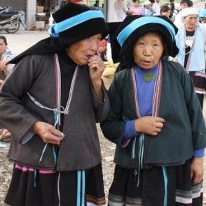 | | [Wikimedia](https://commons.wikimedia.org/wiki/File:%E5%BB%A3%E8%A5%BF%E9%9A%86%E6%9E%97%E9%BA%BC%E5%9F%BA%E6%9D%91%E4%BB%A1%E4%BD%AC%E6%97%8F%EF%BC%88%E5%A4%9A%E7%BE%85%E6%96%B9%E8%A8%80%EF%BC%89.jpg) |
| 哈尼族 | Hānízú | Hani | 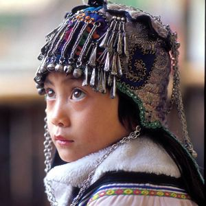 | | [Wikimedia](https://commons.wikimedia.org/wiki/File:Ethnic_Hani_Headgear_China.jpg) |
| 回族 | Huízú | Hui |  | Islamic ethnic group, noted for 兰州拉面 (Lanzhou pulled noodles) which are 清真 (halal) | [Pexels](https://www.pexels.com/photo/group-praying-at-historical-asian-temple-entrance-30419194/); [Wikimedia](https://commons.wikimedia.org/wiki/File:Lanzhou_Handmade_Beef_Noodles.jpg) |
| 基诺族 | Jīnuòzú | Jino | 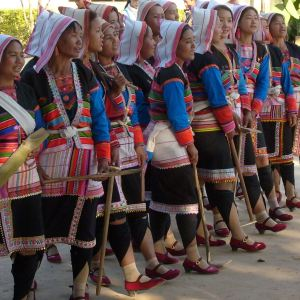 | | [Wikimedia](https://commons.wikimedia.org/wiki/File:Jinuo_Village.jpg) |
| 柯尔克孜族 | Kē'ěrkèzīzú | Kyrghiz |  | | [Pexels](https://www.pexels.com/photo/women-in-traditional-hats-17116610/) |
| 朝鲜族 | Cháoxiǎnzú | Korean | 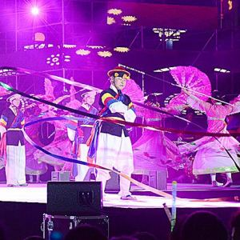 | | [Wikimedia](https://commons.wikimedia.org/wiki/File:%E6%9C%9D%E9%B2%9C%E6%97%8F%E8%B1%A1%E5%B8%BD%E8%88%9E.jpg) |
| 拉祜族 | Lāhùzú | Lahu | 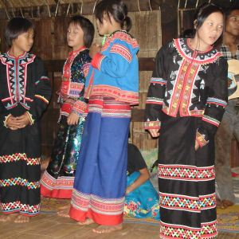 | | [Wikimedia](https://commons.wikimedia.org/wiki/File:Lahu_girls.jpg) |
| 傈僳族 | Lìsùzú | Lisu | 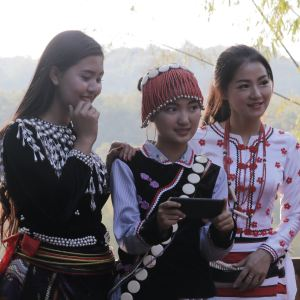 | | [Wikimedia](https://commons.wikimedia.org/wiki/File:Jingpo_girl,_Lisu_girl_and_Rawang_girl.jpg) |
| 珞巴族 | Luòbāzú | Lhoba | 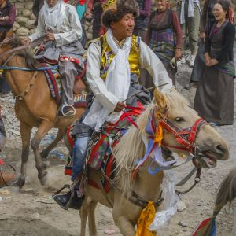 | | [Wikimedia](https://commons.wikimedia.org/wiki/File:Horsemen_ride_during_Yartung_Festival.jpg) |
| 满族 | Mǎnzú | Manchu | 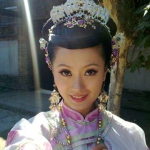 | | [Wikimedia](https://commons.wikimedia.org/wiki/File:Traditional_Chinese_cloth.jpg) |
| 蒙古族 | Měnggǔzú | Mongol | 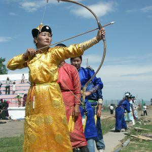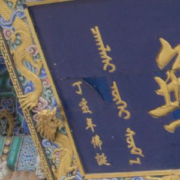  | pictured is ᠴᠠᠭᠯᠠᠰᠢ ᠦᠭᠡᠢ ᠰᠦᠮ᠎ᠡ ([大召寺](https://baike.baidu.com/item/%E5%A4%A7%E5%8F%AC%E5%AF%BA/1024669)), the name of a temple in 呼和浩特 (Hohhot) | [Wikimedia](https://commons.wikimedia.org/wiki/File:Naadam_women_archery.jpg); [Wikimedia](https://commons.wikimedia.org/wiki/File:Hohhot_Dazhao_temple.ecriteau_miltilingue.jpg) |
| 苗族 | Miáozú | Miao; Hmong |  | | [Pexels](https://www.pexels.com/photo/traditional-chinese-costume-with-silver-headwear-30770253/) |
| 纳西族 | Nàxīzú | Naxi | 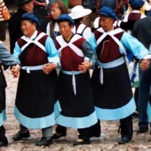 | | [Wikimedia](https://commons.wikimedia.org/wiki/File:Lijiang-danza-naxi-l01.jpg) |
| 怒族 | Nùzú | Nu | 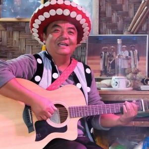 | | [Wikimedia](https://commons.wikimedia.org/wiki/File:Nu_plays_dabiya.jpg) |
| 普米族 | Pǔmǐzú | Pumi | 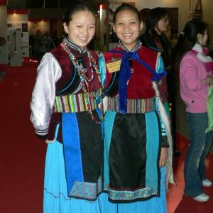 | | [Wikimedia](https://commons.wikimedia.org/wiki/File:P1090077.JPG) |
| 羌族 | Qiāngzú | Qiang | 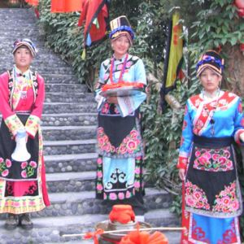 | | [Wikimedia](https://commons.wikimedia.org/wiki/File:Qiangpeople.jpg) |
| 畲族 | Shēzú | She | 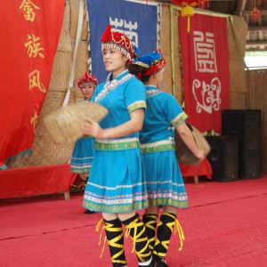 | | [Wikimedia](https://commons.wikimedia.org/wiki/File:She_people_traditional_dance_performance_in_Huanglongyan,_Heyuan,_Guangdon.jpg) |
| 塔吉克族 | Tǎjíkèzú | Tajik | 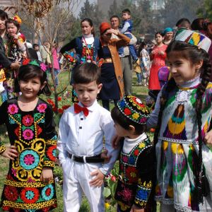 | | [Wikimedia](https://commons.wikimedia.org/wiki/File:Happy_Tajik_children.jpg) |
| 藏族 | Zàngzú | Tibetan |  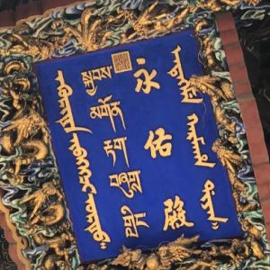 | pictured is the sign on the 永佑殿 (Yongyou Palace) inside the 雍和宮 (Lama Temple) in Beijing; it was the former residence of 雍亲王 (Prince Yong) before being converted into a Tibetan Buddhist temple; 喇嘛 (lǎma; བླ་མ་; Lama) refers to a spiritual leader in Tibetan Buddhist | [Pexels](https://www.pexels.com/photo/asian-woman-wearing-colorful-kimono-16762991/); [Wikimedia](https://commons.wikimedia.org/wiki/File:Yongyou_Hall,_Yonghe_Temple,_Dongcheng_District,_Beijing_(202208111051).jpg) |
| 土族 | Tǔzú | Tu | 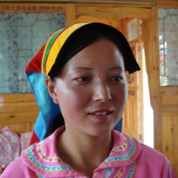 | | [Wikimedia](https://commons.wikimedia.org/wiki/File:%E7%BE%8E%E4%B8%BD%E7%9A%84%E9%B2%9C%E5%8D%91%E5%90%8E%E8%A3%94-%E9%9D%92%E6%B5%B7%E5%9C%9F%E6%97%8F%E5%A7%91%E5%A8%98_beauty_of_China_Tu_-_panoramio.jpg) |
| 土家族 | Tǔjiāzú | Tujia | 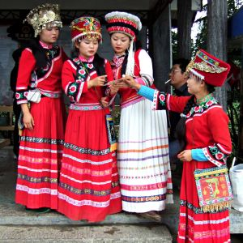 | | [Wikimedia](https://commons.wikimedia.org/wiki/File:Tujia_women.jpg) |
| 维吾尔族 | Wéiwú'ěrzú | Uyghur |  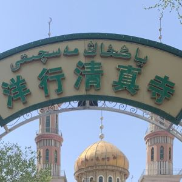 | pictured is 洋行清真寺 (Yanghang Mosque) in 乌鲁木齐 (Ürümqi); it says the name of the mosque ياڭخاڭ مەسچىتى in 维吾尔文 (Uyghur), a script which evolved from 阿拉伯文 (Arabic) | [Pexels](https://www.pexels.com/photo/traditional-dress-walking-in-chinese-market-32792820/); [Wikimedia](https://commons.wikimedia.org/wiki/File:%E4%B9%8C%E9%B2%81%E6%9C%A8%E9%BD%90%E5%B8%82%E6%B4%8B%E8%A1%8C%E6%B8%85%E7%9C%9F%E5%AF%BA%E5%A4%A7%E9%97%A8.jpg) |
| 乌孜别克族 | Wūzībiékèzú | Uzbek |  | | [Pexels](https://www.pexels.com/photo/women-wearing-traditional-clothing-9194538/) |
| 佤族 | Wǎzú | Va | 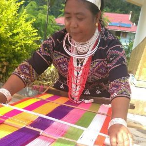 | | [Wikimedia](https://commons.wikimedia.org/wiki/File:%E6%B2%A7%E6%BA%90%E4%BD%A4%E6%97%8F01.jpg) |
| 瑶族 | Yáozú | Yao |  | | [Wikimedia](https://commons.wikimedia.org/wiki/File:Yao_people%27s_Harvest_Festival_in_Nala_Village_-_5.jpg) |
| 彝族 | Yízú | Yi |  | | [Pexels](https://www.pexels.com/photo/women-wearing-traditional-clothes-12368070/) |
| 壮族 | Zhuàngzú | Zhuang |   | | [Pexels](https://www.pexels.com/photo/traditional-zhuang-folk-music-performance-34748480/) |

There are also some unrecognized ethnic minorities, such as:

> 摩梭人, 穿青人, 艾努人, 革家人, 白马人, 回辉人, 夏尔巴人

| ethnic group | pinyin | English | images | comments | image source |
|--------------|--------|---------|--------|----------|--------------|
| 摩梭人 | Mósuōrén | Mosuo | 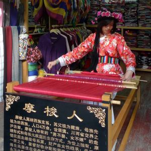 | | [Wikimedia](https://commons.wikimedia.org/wiki/File:Mosuo_girl_weaver_in_Old_town_Lijiang.JPG) |
