# Characters/words using or related to 疒

| chars | word | Pinyin | English | Image | Comments | Image Source |
|-------|------|--------|---------|-------|----------|--------------|
| 疔; 疮 | 疔疮 | dīngchuāng | boil; carbuncle |  | | TO DO |
| 疖 | 疖子 | jiēzi | abscess; furuncle |  | | TO DO |
| 疗 | 治疗 | zhìliáo | treatment; therapy |  | | TO DO |
| 疙; 瘩 | 疙瘩 | gēda | lump; bump | 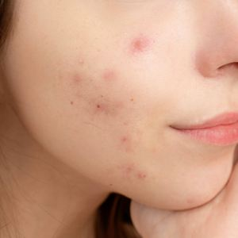 | | [Pexels](https://www.pexels.com/photo/a-portrait-of-a-woman-6475978/) |
| 疚 | 内疚 | nèijiù | guilty; remorseful |  | | TO DO |
| 疝 | 疝气 | shànqì | hernia | 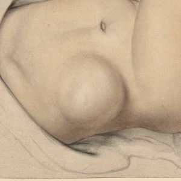 | | [Wikimedia](https://commons.wikimedia.org/wiki/File:Ventral_hernia_Wellcome_L0061630.jpg) |
| 疟; 疾 | 疟疾 | nüèjí | malaria | 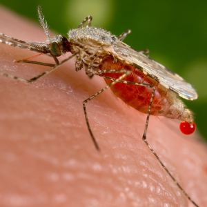 | | [Wikimedia](https://commons.wikimedia.org/wiki/File:Anopheles_stephensi.jpeg) |
| 疡; 疡 | 疮疡 | chuāngyáng | skin ulcer; sore | 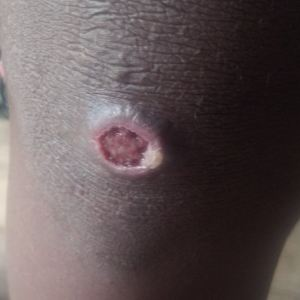 | | [Wikimedia](https://commons.wikimedia.org/wiki/File:10.1177_0956462414549036-fig2-Ulcer_of_primary_yaws.jpg) |
| 疣 | 疣 | yóu | wart | 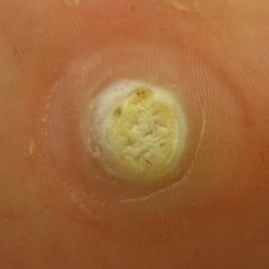 | | [Wikimedia](https://commons.wikimedia.org/wiki/File:Largeplanterwart.jpg) |
| 疤; 痕 | 疤痕 | bāhén | scar | 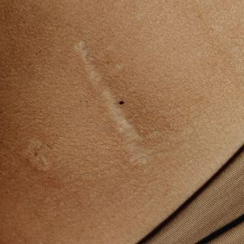 | | [Pexels](https://www.pexels.com/photo/a-person-s-stomach-6642978/) |
| 疥; 疮 | 疥疮 | jièchuāng | scabies | 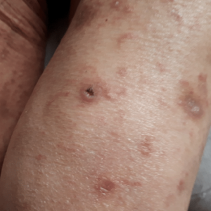 | | [Gerqari et al. (2021)](https://pubmed.ncbi.nlm.nih.gov/36644304/) |
| 疯 | 疯狂 | fēngkuáng | madness; insane |  | | TO DO |
| 疰 | 疰夏 | zhùxià | summer illness (children) |  | | TO DO |
| 疱; 疹 | 疱疹 | pàozhěn | blister; herpes | 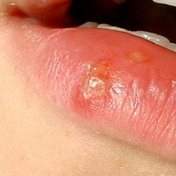 | | [Wikimedia](https://commons.wikimedia.org/wiki/File:Herpes_labialis.jpg) |
| 疲 | 疲劳 | píláo | fatigue; tiredness |  | | TO DO |
| 疹 | 皮疹; 疹子 | pízhěn; zhěnzi | rash |  | | [Wikimedia](https://commons.wikimedia.org/wiki/File:Euproctis_Chrysorrhoea_skin_rash_cutted.png) |
| 疼; 痛 | 疼痛 | téngtòng | pain; ache |  | | [Pexels](https://www.pexels.com/photo/woman-in-gray-dress-sitting-on-bed-3754299/) |
| 疾; 病 | 疾病 | jíbìng | disease; illness |  | | TO DO |
| 痂 | 结痂 | jiéjiā | to form a scab | 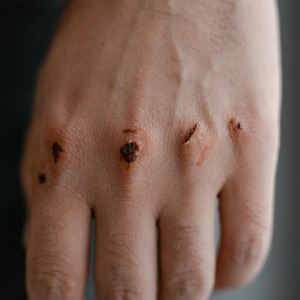 | | [Pexels](https://www.pexels.com/photo/wounded-knuckles-7699460/) |
| 病 | 病人 | bìngrén | patient |  | | TO DO |
| 症 | 症状 | zhèngzhuàng | symptom |  | | TO DO |
| 痈; 疽 | 痈疽 | yōngjū | abscess | 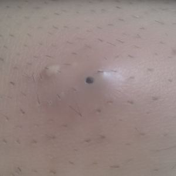 | | TO DO |
| 痉 | 痉挛 | jìngluán | spasm; cramp | 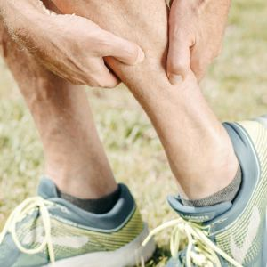 | | TO DO |
| 痊 | 痊愈 | quányù | recovery; to heal |  | | TO DO |
| 痰 | 痰液 | tán yè | phlegm; sputum | 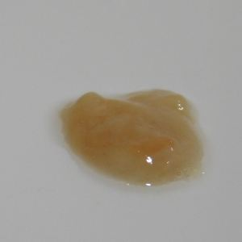 | | TO DO |
| 痲; 痹 | 痲痹 | mábì | numbness; paralysis |  | | TO DO |
| 痴 | 痴呆 | chīdāi | dementia |  | Cognitive disorder | TO DO |
| 痹 | 风湿痹 | fēngshībì | rheumatism |  | | TO DO |
| 痿 | 肌痿 | jīwěi | muscle atrophy |  | | TO DO |
| 瘀 | 瘀伤 | yūshāng | bruise | 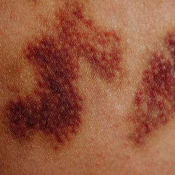 | | TO DO |
| 瘟; 疫 | 瘟疫 | wēnyì | plague; epidemic |  | | TO DO |
| 瘤 | 瘤子 | liúzi | tumor; neoplasm |  | | TO DO |
| 瘦 | 瘦弱 | shòuruò | thin and weak |  | | TO DO |
| 瘫; 痪 | 瘫痪 | tānhuàn | paralysis |  | | TO DO |
| 癌; 症 | 癌症 | áizhèng | cancer |  | | TO DO |
| 癖 | 癖好 | pǐhào | obsession; strange habit |  | | TO DO |
| 癫; 痫 | 癫痫 | diānxián | epilepsy |  | | TO DO |

