# Characters/words using or related to 虫

| chars | word | pinyin | English | image | comments | image source |
|--------|------|--------|----------|--------|-----------|--------------|
| | 扇贝 | shànbèi | scallop | 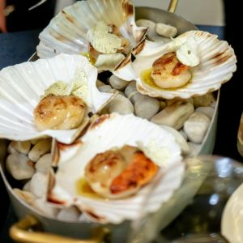 | | [Pexels](https://www.pexels.com/photo/gourmet-scallop-dish-preparation-in-a-fine-dining-setting-31682351/) |
| | 毛毛虫 | máomaochóng | caterpillar | 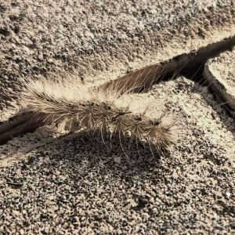 |  | [Pexels](https://www.pexels.com/photo/shallow-focus-photography-of-green-caterpillar-on-green-leaf-1119582/) |
| | 瓢虫 | piáochóng | ladybug | 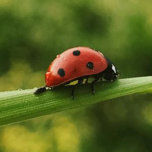 |  | [Pexels](https://www.pexels.com/photo/lady-bug-on-leaf-3371779/) |
| | 甲虫 | jiǎchóng | beetle | 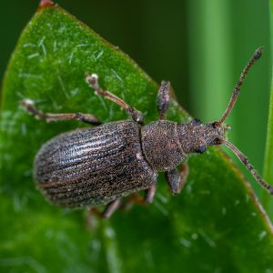 |  | [Pexels](https://www.pexels.com/photo/black-beetle-on-green-leaf-1096270/) |
| | 竹节虫 | zhújiéchóng | stick insect | 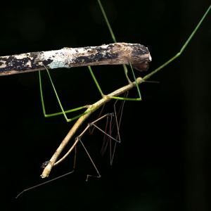 | | [Pexels](https://www.pexels.com/photo/green-walking-stick-animal-2583151/) |
| 茧 | 茧 | jiǎn | cocoon | 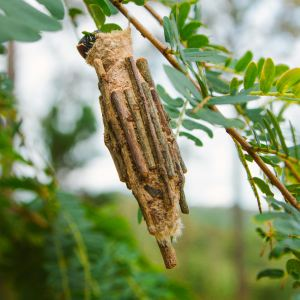 | protective case spun by insects (e.g., silkworms); contains the pupa 蛹 | [Pexels](https://www.pexels.com/photo/unique-bagworm-cocoon-on-green-leafy-branch-33986066/) |
| 萤 | 萤火虫 | yínghuǒchóng | firefly |  | | [Pexels](https://www.pexels.com/photo/fire-particles-floating-through-the-green-fern-leaves-9007628/) |
| | 虫漆; 虫胶漆 | chóngqī; chóngjiāoqī | shellac | 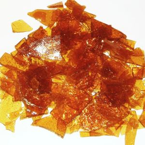 | lacquer derived from lac insects; used as coating or polish | [Wikimedia](https://commons.wikimedia.org/wiki/File:Schellak.jpg) |
| | 虫胶 | chóngjiāo | lac | 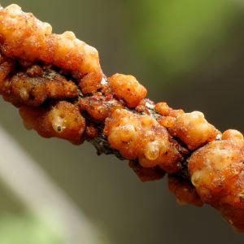 | secretion of 漆虫 (lac insects); used to make 虫胶漆 (shellac) | [Wikimedia](https://commons.wikimedia.org/wiki/File:Lac_Insects_on_a_Babybonnet_Branch_-_Flickr_-_treegrow_(3).jpg) |
| 虾 | 小龙虾 | xiǎolóngxiā | crayfish; crawfish | 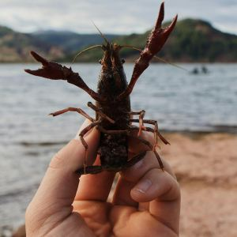 | freshwater crustacean; popular food in China | [Pexels](https://www.pexels.com/photo/hand-holding-lobster-6230060/) |
| 虾 | 虾 | xiā | shrimp; prawn | 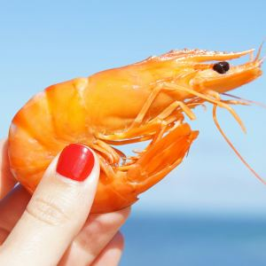 |  | [Pexels](https://www.pexels.com/photo/person-holding-shrimp-1483780/) |
| 虾 | 龙虾 | lóngxiā | lobster | 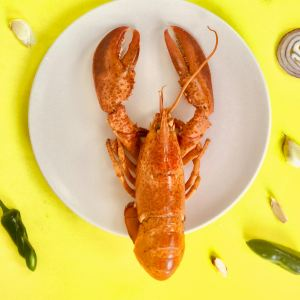 | | [Pexels](https://www.pexels.com/photo/lobster-on-round-white-ceramic-plate-1194431/) |
| 蚁 | 白蚁 | báiyǐ | termite | 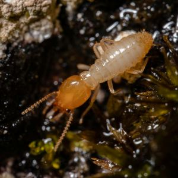 |  | [Pexels](https://www.pexels.com/photo/a-macro-shot-of-a-termite-12895278/) |
| 蚂; 蚁 | 蚂蚁 | mǎyǐ | ant | 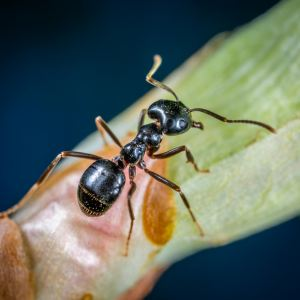 |  | [Pexels](https://www.pexels.com/photo/macro-photo-of-black-carpenter-ant-on-green-leaf-1086872/) |
| 蚊 | 蚊子 | wénzi | mosquito | 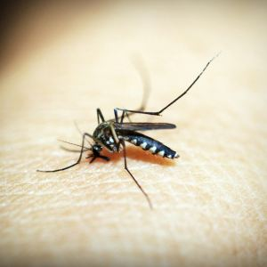 | larva 蚊子幼虫 are also called 孑孓 (jiéjué) "wigglers" | [Pexels](https://www.pexels.com/photo/black-mosquito-on-person-s-skin-169357/) |
| 蚌 | 贻贝; 蚌 | yíbèi; bàng | mussel | 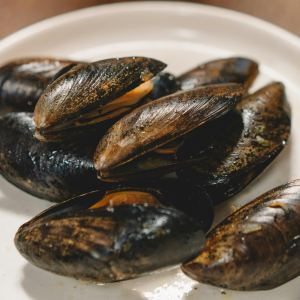 | | [Pexels](https://www.pexels.com/photo/a-close-up-shot-of-mussels-on-a-plate-6955638/) |
| 蚕 | 蚕 | cán | silkworm | 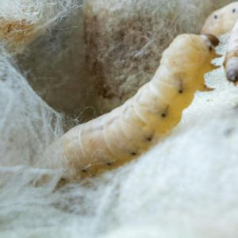 | | [Pexels](https://www.pexels.com/photo/silk-worms-in-cocooning-stage-in-wooden-bowl-32277756/) |
| 蚜 | 蚜虫 | yáchóng | aphid | 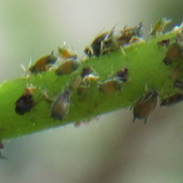 | | [Wikimedia](https://commons.wikimedia.org/wiki/File:Aphidoidea_(afidi).JPG) |
| 蚤 | 跳蚤 | tiàozǎo | flea | 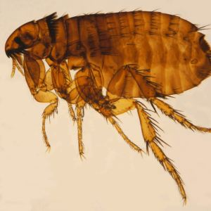 | | [Wikimedia](https://commons.wikimedia.org/wiki/File:Ctenocephalides_felis_ZSM.jpg)|
| 蚧 | 漆虫; 胶蚧 | qīchóng; jiāojiè | lac insects | 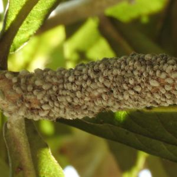 | secretes 虫胶 (lac) | [Wikimedia](https://commons.wikimedia.org/wiki/File:Lac_insects-1-bsi-yercaud-salem-India.jpg) |
| 蚩 | 蚩尤 | Chīyóu | [chiyou](https://en.wikipedia.org/wiki/Chiyou) | 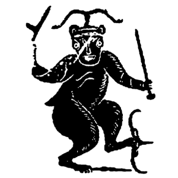 | mythological being | [Wikimedia](https://commons.wikimedia.org/wiki/File:Chi_You.gif) |
| 蚯; 蚓; 蠕 | 蚯蚓; 蠕虫 | qiūyǐn; rúchóng | worm; earthworm | 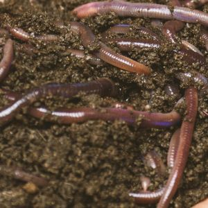 |  | [Pexels](https://www.pexels.com/photo/earthworms-on-a-persons-hand-3696170/) |
| 蚰; 蜒 | 蚰蜒 | yóuyán | house centipede | 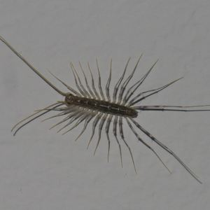 | | [Wikimedia](https://commons.wikimedia.org/wiki/File:Scutigeromorpha_P1580880a.jpg) |
| 蚱; 蜢 | 蚱蜢; 草蜢 | zhàměng; cǎoměng | grasshopper | 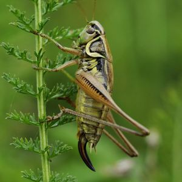 | sometimes called 蚂蚱 (màzha) | [Pexels](https://www.pexels.com/photo/brown-grass-hopper-on-green-plant-35021/) |
| 蛆 | 蛆 | qū | maggot | 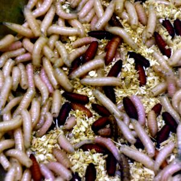 | fly larva | [Wikimedia](https://commons.wikimedia.org/wiki/File:Maggots,_London_Zoo,_London.jpg) |
| 蛇 | 蛇 | shé | snake | 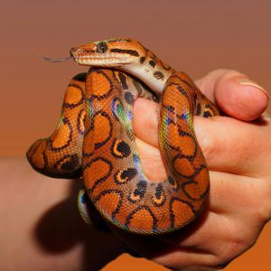 |  | [Pexels](https://www.pexels.com/photo/person-holding-red-and-black-snake-34426/) |
| 蛊 | 蛊毒虫 | gǔdúchóng | poison bugs | 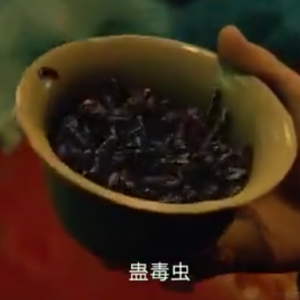 | legendary | screenshot from *Legend of the Demon Cat* 《妖猫传》 |
| 蛎; 蚝; 蚵 | 牡蛎; 蚝; 蚵 | mǔlì; háo; kē | oyster | 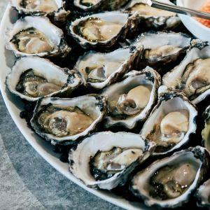 | 蚵 common in Taiwan | [Pexels](https://www.pexels.com/photo/oysters-on-plate-2647936/) |
| 蛔 | 蛔虫 | huíchóng | roundworm | 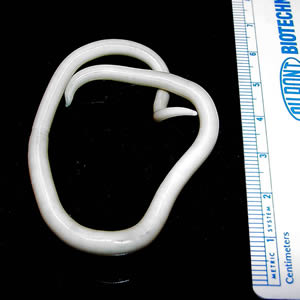 | parasitic worm | [Wikimedia](https://commons.wikimedia.org/wiki/File:Ascaris_lumbricoides.jpeg) |
| 蛙 | 青蛙 | qīngwā | frog | 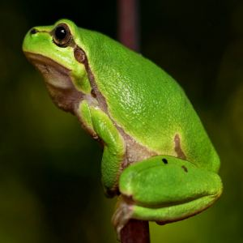 | | [Pexels](https://www.pexels.com/photo/shallow-focus-photography-of-green-frog-35669/) |
| 蛞; 蝓 | 蛞蝓; 鼻涕虫 | kuòyú; bítìchóng | slug | 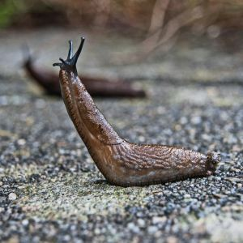 | | [Pexels](https://www.pexels.com/photo/slug-158158/) |
| 蛤; 蜊 | 蛤蜊 | gélí | clam | 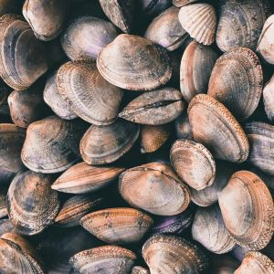 |  | [Pexels](https://www.pexels.com/photo/close-up-of-clamshells-on-a-beach-29334380/) |
| 蛤; 蟆; 蟾蜍 | 蛤蟆; 蟾蜍 | hámá; chánchú | toad | 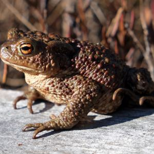 | | [Wikimedia](https://commons.wikimedia.org/wiki/File:Bufo_bufo_Joutsij%C3%A4rvi_2.jpg) |
| 蛭; 蚂; 蟥| 水蛭; 蚂蟥 | shuǐzhì; mǎhuáng | leech | 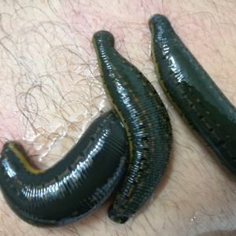 |  | [Wikimedia](https://commons.wikimedia.org/wiki/File:Hirudo_medicinalis_01.jpg) |
| 蛴; 螬 | 蛴螬 | qícáo | grub; larva | 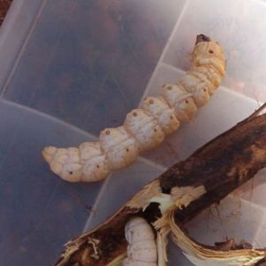 | beetle larva | [Wikimedia](https://commons.wikimedia.org/wiki/File:Witchetty-Made.jpg) |
| 蛹 | 蛹 | yǒng | pupa; chrysalis | 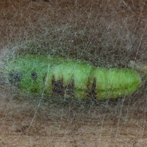 | the insect in its pupal stage; may be inside a cocoon 茧 or exposed | [Wikimedia](https://commons.wikimedia.org/wiki/File:Cabbage_looper_in_cocoon.jpg) |
| 蛾 | 蛾; 飞蛾 | é; fēi'é | moth | 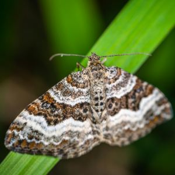 | mostly nocturnal | [Pexels](https://www.pexels.com/photo/selective-focus-photography-of-gray-brown-and-black-striped-butterfly-perched-on-green-leaf-1096299/) |
| 蜂 | 大黄蜂 | dàhuángfēng | bumblebee | 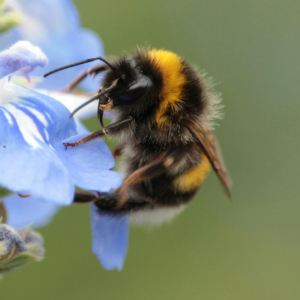 | | [Pexels](https://www.pexels.com/photo/yellow-and-black-bumble-bee-perched-on-lavender-selective-focus-photography-2570372/) |
| 蜂 | 虎头蜂 | hǔtóufēng | hornet | 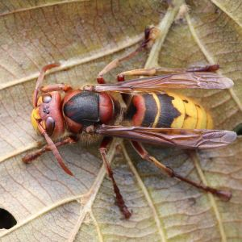 | | [Pexels](https://commons.wikimedia.org/wiki/File:Vespa_crabro_02.JPG) |
| 蜂 | 黄蜂 | huángfēng | wasp | 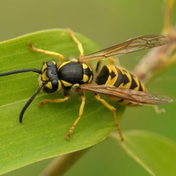 | | [Pexels](https://www.pexels.com/photo/close-up-photo-of-yellowjacket-wasp-on-green-leaf-158313/) |
| 蜇 | 水母; 海蜇 | shuǐmǔ; hǎizhé | jellyfish | 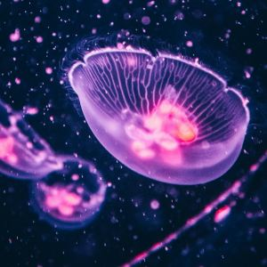 | | [Pexels](https://www.pexels.com/photo/four-purple-jellyfish-2690766/) |
| 蜈; 蚣 | 蜈蚣; 百足虫 | wúgōng; bǎizúchóng | centipede | 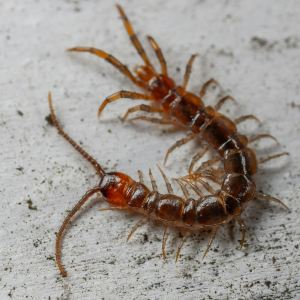 | | [Pexels](https://www.pexels.com/photo/centipede-crawling-on-conc-8020439/) |
| 蜉; 蝣 | 蜉蝣 | fúyóu | mayfly | 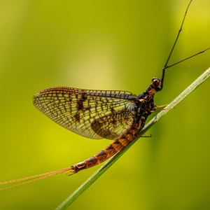 | | [Pexels](https://www.pexels.com/photo/close-up-of-a-mayfly-on-a-green-leaf-29877541/) |
| 蜕 | 蜕 | tuì | moulted skin | 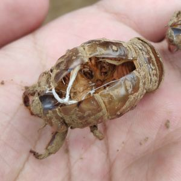 | e.g. cicada shell | [Wikimedia](https://commons.wikimedia.org/wiki/File:%E8%9D%89%E8%9C%95.jpg) |
| 蜗 | 蜗牛 | wōniú | snail | 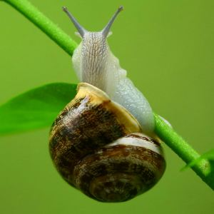 | | [Pexels](https://www.pexels.com/photo/brown-and-gray-snail-on-green-plant-branch-108141/) |
| 蜘; 蛛 | 蜘蛛 | zhīzhū | spider | 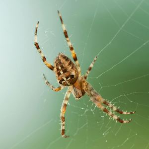 |  | [Pexels](https://www.pexels.com/photo/brown-and-black-spider-63857/) |
| 蜜; 蜂 | 蜜蜂 | mìfēng | bee | 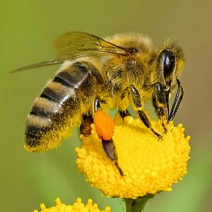 | | [Pexels](https://www.pexels.com/photo/brown-and-black-bee-on-yellow-flower-nectar-460961/) |
| 蜣; 虼; 螂 | 蜣螂; 虼螂 | qiāngláng; gèláng | dung beetle | 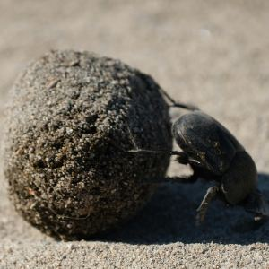 | | [Pexels](https://www.pexels.com/photo/dung-beetle-rolling-its-ball-on-sandy-terrain-31405790/) |
| 蜥; 蜴 | 蜥蜴 | xīyì | lizard | 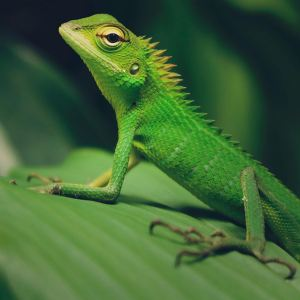 |  | [Pexels](https://www.pexels.com/photo/macro-photography-of-green-crested-lizard-735174/) |
| 蜱 | 蜱虫 | píchóng | tick | 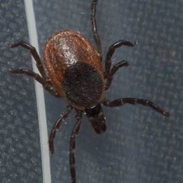 | | [Wikimedia](https://commons.wikimedia.org/wiki/File:Ixodes_scapularis_P1170300a.jpg) |
| 蜻; 蜓 | 蜻蜓 | qīngtíng | dragonfly | 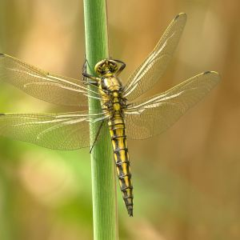 |  | [Pexels](https://www.pexels.com/photo/yellow-and-black-dragonfly-on-green-stem-during-daytime-56010/) |
| 蝇 | 苍蝇 | cāngying | fly |  |  | [Pexels](https://www.pexels.com/photo/common-house-fly-on-black-textile-676245/) |
| 蝈; 螽 | 蝈蝈; 螽斯 | guōguō; zhōngsī | katydid; bush cricket |  | related to grasshoppers | [Wikimedia](https://commons.wikimedia.org/wiki/File:Katydid_(Catoptropteryx_aurita)_(13818855493).jpg) |
| 蝉 | 蝉 | chán | cicada |  | | [Pexels](https://www.pexels.com/photo/close-up-of-a-cicada-on-a-branch-with-soft-bokeh-32395601/) |
| 蝌; 蚪 | 蝌蚪 | kēdǒu | tadpole |  | | [Pexels](https://www.pexels.com/photo/plants-leaves-on-water-15388189/) |
| 蝎 | 蝎子 | xiēzi | scorpion |  | | [Pexels](https://www.pexels.com/photo/selective-focus-photography-of-black-scorpion-169362/) |
| 蝗 | 蝗虫 | huángchóng | locust |  | a kind of 蚱蜢 (grasshopper) known for swarming and destroying crops | [Wikimedia](https://commons.wikimedia.org/wiki/File:LOCUSTS._HOPPERS,_LOCUSTS_in_wingless_phase,_crossing_roads_in_the_Northern_Cape,_South_Africia._This_swarm_between_Riemvasmaak_and_Springbok.jpg) |
| 蝙; 蝠 | 蝙蝠 | biānfú | bat |  | | [Pexels](https://www.pexels.com/photo/swarm-of-bats-hanging-on-tree-branches-11934268/) |
| 蝰; 蛇 | 蝰蛇; 毒蛇 | kuíshé; dúshé | viper; venomous snake |  | 蝰蛇 is a specific viper | [Wikimedia](https://commons.wikimedia.org/wiki/File:Red-tailed_bamboo_pit_viper_in_Sundarbans_National_Park_October_2025_by_Tisha_Mukherjee_11.jpg) |
| 蝴; 蝶 | 蝴蝶 | húdié | butterfly |  |  | [Pexels](https://www.pexels.com/photo/macro-photo-of-butterfly-perched-on-pink-flowers-3805975/) |
| 蝼; 蛄 | 蝼蛄 | lóugū | mole cricket |  | | [Wikimedia](https://commons.wikimedia.org/wiki/File:Mole_Cricket_(3856961719).jpg) |
| 蝽 | 网蝽 | wǎngchūn | lace bug |  | | [Wikimedia](https://commons.wikimedia.org/wiki/File:Stephanitis_takeyai_(Tingidae)_-_(imago),_Mook,_the_Netherlands.jpg) |
| 蝽 | 蝽; 臭虫 | chūn; chòuchóng | bedbug |  | | [Wikimedia](https://commons.wikimedia.org/wiki/File:Bed_bug,_Cimex_lectularius_(9627010587).jpg) |
| 蝾; 螈; 蚖 | 蝾螈; 蚖 | róngyuán; yuán | salamander; newt |  | | [Pexels](https://www.pexels.com/photo/orange-juvenile-newt-crawling-on-the-forest-floor-17231282/) |
| 螃; 蟹 | 螃蟹 | pángxiè | crab |  | | [Pexels](https://www.pexels.com/photo/yellow-crab-on-gray-sand-during-daytime-73769/) |
| 螅 | 水螅 | shuǐxī | hydra; freshwater polyp |  | | [Wikimedia](https://commons.wikimedia.org/wiki/File:Hydra001.jpg) |
| 螨 | 螨虫 | mǎnchóng | mite |  | | [Wikimedia](https://commons.wikimedia.org/wiki/File:Rust_Mite,_Aceria_anthocoptes.jpg) |
| 螭 | 螭吻 | chīwěn | hornless dragon |  | mythological; roof ornament | [Wikimedia](https://commons.wikimedia.org/wiki/File:Datong_Huayansi_chiwen_(1)_January_1985.jpg) |
| 螯 | 螯 | áo | pincers; claws |  | lobsters, crayfish, crabs, scorpions, and some shrimp and beetles have 螯 | [Pexels](https://www.pexels.com/photo/red-freshwater-crayfish-on-white-background-33711897/) |
| 螳; 螂 | 螳螂 | tángláng | praying mantis |  |  | [Pexels](https://www.pexels.com/photo/small-green-insect-2132765/) |
| 螺; 蛳 | 螺蛳; 田螺 | luósī; tiánluó | river snail |  | seen in the dish 螺蛳粉; freshwater escargot | [Wikimedia](https://commons.wikimedia.org/wiki/File:Viviparus_georgianus_02.jpg) |
| 螺 | 鹦鹉螺 | yīngwǔluó | nautilus |  | | [Pexels](https://www.pexels.com/photo/ammonites-221219/) |
| 蟋; 蟀; 蛐蛐 | 蟋蟀; 蛐蛐 | xīshuài; qūqū | cricket |  |  | [Wikimedia](https://commons.wikimedia.org/wiki/File:Gryllus_campestris_(1).jpg) |
| 蟑; 螂; 蜚; 蠊 | 蟑螂; 蜚蠊 | zhāngláng; fěilián | cockroach |  | also 曱甴 (yuē​zhá) from Cantonese | [Pexels](https://www.pexels.com/photo/a-madagascar-hissing-cockroach-on-a-yellow-shirt-8458858/) |
| 蟒; 蛇 | 蟒蛇 | mǎngshé | python |  | | [Pexels](https://www.pexels.com/photo/beige-python-on-brown-branch-of-tree-1108192/) |
| 蟠 | 蟠龙 | pánlóng | coiled dragon |  | decorative motif | [Pexels](https://www.pexels.com/photo/a-golden-dragon-pendant-lying-on-a-leather-book-16030489/) |
| 蠓 | 蠓; 蠓虫 | měng; měngchóng | midge; gnat |  | tiny bloodsucking fly; smaller than mosquito | [Wikimedia](https://commons.wikimedia.org/wiki/File:Biting_Midge_on_my_leg.jpg) |
| 蠹 | 蠹鱼 | dùyú | silverfish |  | | [Wikimedia](https://commons.wikimedia.org/wiki/File:Lepisma_saccharina_1a.JPG) |
| 蠼; 螋 | 蠼螋 | qúsōu | earwig |  | | [Pexels](https://www.pexels.com/photo/a-cricket-is-sitting-on-top-of-yellow-flowers-27613543/) |
| | 象鼻虫 | xiàngbíchóng | weevil |  | | [Wikimedia](https://commons.wikimedia.org/wiki/File:Curculionidae_Tignerone_02.jpg) |
| | 马陆; 千足虫 | mǎlù; qiānzúchóng | millipede |  | the character 蚂 (in ant 蚂蚁) evolved from 马, but for 马陆 the 马 didn't change to 蚂 | [Pexels](https://www.pexels.com/photo/a-black-caterpillar-crawling-on-stick-14465943/) |

