# Characters/words using or related to 鱼

| chars | word | Pinyin | English | Image | Comments | Image Source |
|--------|------|--------|----------|--------|-----------|--------------|
| | 乌贼; 墨鱼 | wūzéi; mòyú | cuttlefish | 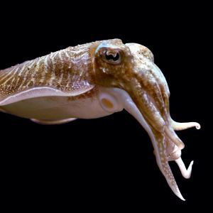 | | [Wikimedia](https://commons.wikimedia.org/wiki/File:Sepia_officinalis_(aquarium).jpg) |
| 人鱼 | 人鱼 | rényú | mermaid |  | | [Pexels](https://www.pexels.com/photo/a-woman-in-a-mermaid-costume-19058996/) |
| | 大比目鱼 | dàbǐmùyú | halibut | 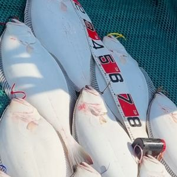 | | [Wikimedia](https://commons.wikimedia.org/wiki/File:Halibut_korea.jpg) |
| | 水母; 海蜇 | shuǐmǔ / hǎizhé | jellyfish | 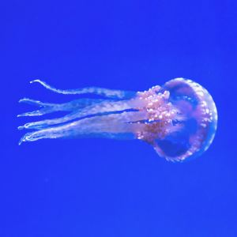 | | [Pexels](https://www.pexels.com/photo/pink-jellyfish-137616/) |
| | 沙丁鱼 | shādīngyú | sardine | 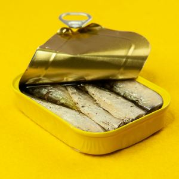 | | [Pexels](https://www.pexels.com/photo/close-up-shot-of-a-can-of-sardines-on-a-yellow-surface-6901802/) |
| | 海参 | hǎishēn | sea cucumber | 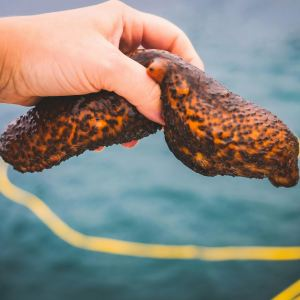 | | [Pexels](https://www.pexels.com/photo/person-holding-a-warty-sea-cucumber-8824660/) |
| | 海星 | hǎixīng | starfish | 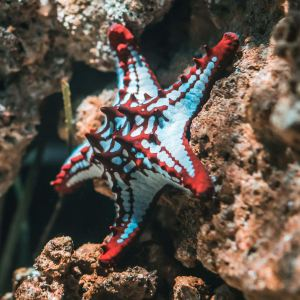 | | [Pexels](https://www.pexels.com/photo/starfish-on-brown-stone-1894351/) |
| | 海胆 | hǎidǎn | sea urchin | 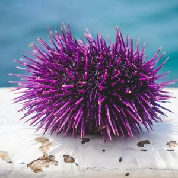 | | [Pexels](https://www.pexels.com/photo/sea-mountains-nature-beach-8826371/) |
| | 海豚 | hǎitún | dolphin | 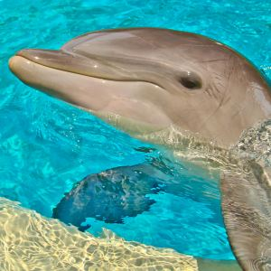 | | [Pexels](https://www.pexels.com/photo/playful-dolphin-in-crystal-clear-pool-water-34434038/) |
| | 海马 | hǎimǎ | seahorse | 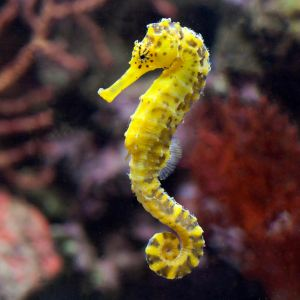 | | [Pexels](https://www.pexels.com/photo/close-up-of-seahorse-8887695/) |
| | 海龟 | hǎiguī | sea turtle | 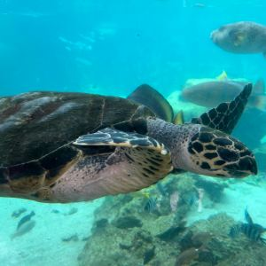 | | [Pexels](https://www.pexels.com/photo/sea-turtle-swimming-underwater-in-coral-reef-34422096/) |
| | 清道夫鱼 | qīngdàofūyú | pleco | 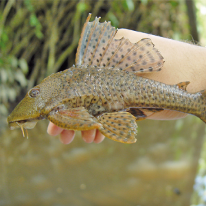 | Pleco dictionary is named after this fish | [Wikimedia](https://commons.wikimedia.org/wiki/File:Hypostomus_plecostomus_-_Rapha%C3%ABl_Covain.png) |
| | 渔民 | yúmín | fisherman |  |  | [Pexels](https://www.pexels.com/photo/man-on-boat-holding-white-mesh-fishing-net-2131904/) |
| | 狮子鱼 | shīziyú | lionfish | 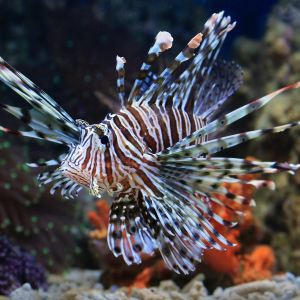 | | [Pexels](https://www.pexels.com/photo/close-up-photo-of-a-red-lionfish-9004405/) |
| | 神仙鱼 | shénxiānyú | angelfish | 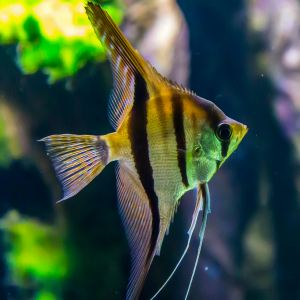 | | [Pexels](https://www.pexels.com/photo/macro-shot-photography-of-yellow-and-black-fish-1677116/) |
| | 章鱼 | zhāngyú | octopus | 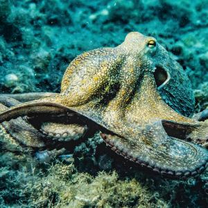 | | [Pexels](https://www.pexels.com/photo/selective-focus-photography-of-octopus-3046629/) |
| | 锦鲤 | jǐnlǐ | brocade carp; koi | 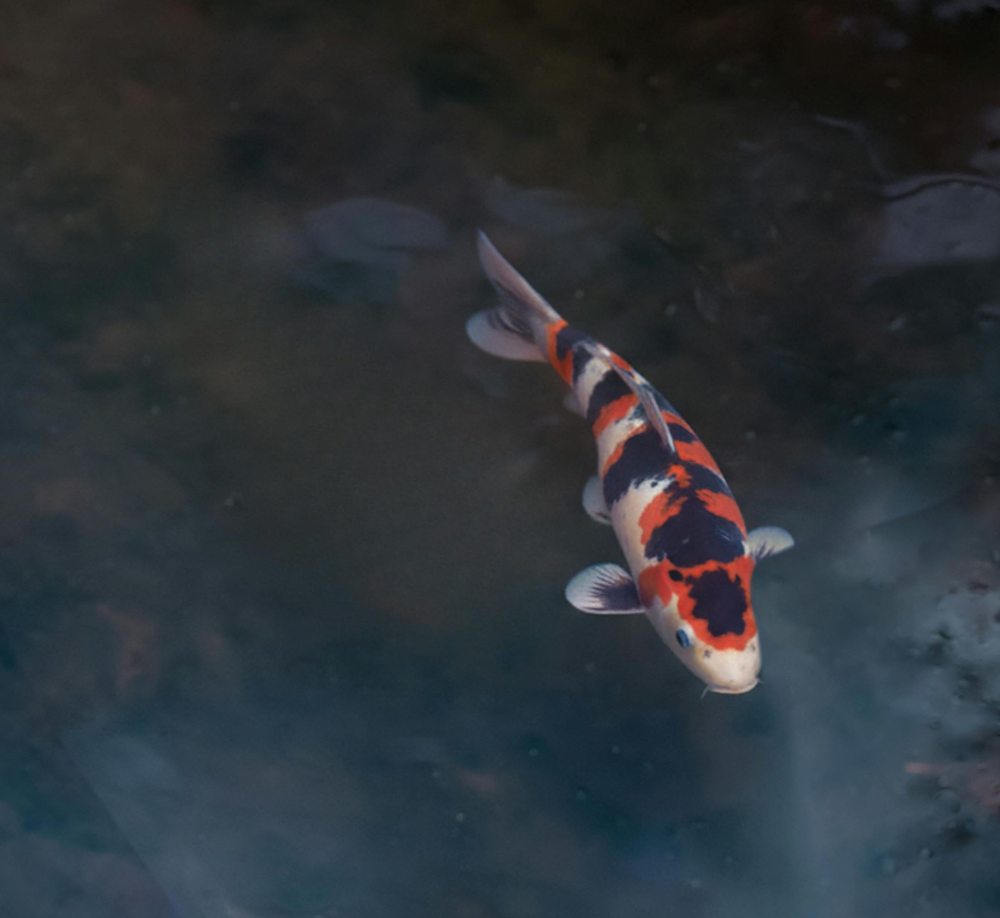 | | [Pexels](https://www.pexels.com/photo/calm-koi-fish-pond-by-wooden-deck-34382557/); PixelCut AI used to remove a fish |
| 鱿 | 鱿鱼 | yóuyú | squid | 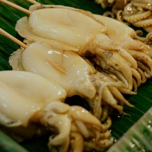 | | [Pexels](https://www.pexels.com/photo/raw-squid-on-barbecue-sticks-5602496/) |
| 鲂 | 鲂鱼 | fángyú | freshwater bream | 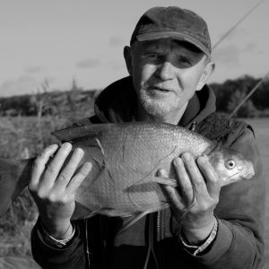 | | [Pexels](https://www.pexels.com/photo/happy-angler-holds-fish-18864949/) |
| 鲇 | 鲇鱼 | niányú | sheatfish; catfish | 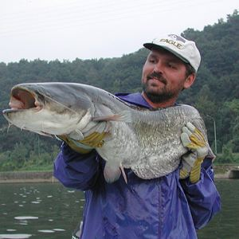 | | [Wikimedia](https://commons.wikimedia.org/wiki/File:EuropeseMeervalLucasVanDerGeest.jpg) |
| 鲈 | 鲈鱼 | lúyú | bass; perch | 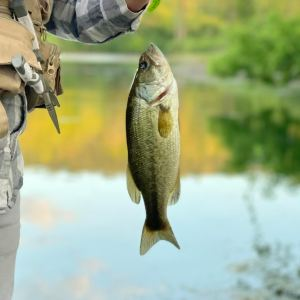 | | [Pexels](https://www.pexels.com/photo/young-boy-enjoys-successful-fishing-adventure-33646611/) |
| 鲍 | 鲍鱼 | bàoyú | abalone | 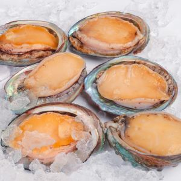 | | [Pexels](https://www.pexels.com/photo/frozen-mussels-lime-and-tomato-20810985/) |
| 鲎 | 鲎 | hòu | horseshoe crab | 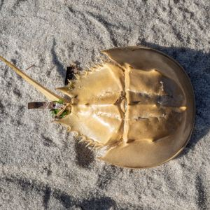 | | [Wikimedia](https://commons.wikimedia.org/wiki/File:Horseshoe_crab_(62577).jpg) |
| 鲑 | 三文鱼; 鲑鱼 | sānwényú; guīyú | salmon | 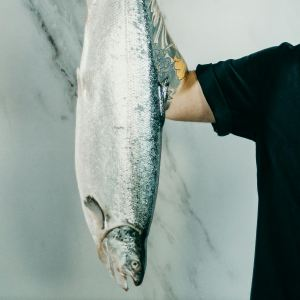 | | [Pexels](https://www.pexels.com/photo/person-holding-raw-fish-3304176/) |
| 鲕 | 鱼卵; 鱼籽; 鲕 | yúluǎn; yúzǐ; ér | fish roe | 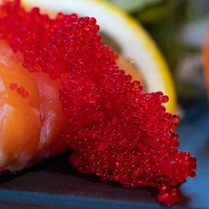 | “鱼籽” is common in speech; “鲕” is a literary synonym. | [Pexels](https://www.pexels.com/photo/close-up-photo-of-sliced-salmon-1683545/) |
| 鲢 | 鲢鱼 | liányú | silver carp | 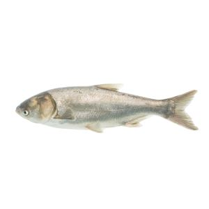 | | [Wikimedia](https://commons.wikimedia.org/wiki/File:Silver_Carp_Adult_(Hypophthalmichthys_molitrix).jpg) |
| 鲤 | 鲤鱼 | lǐyú | carp | 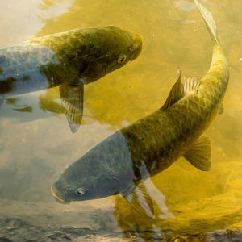 | | [Pexels](https://www.pexels.com/photo/nishikigoi-fishes-in-pond-18179521/) |
| 鲥鱼 | 鲥鱼 | shíyú | shad | 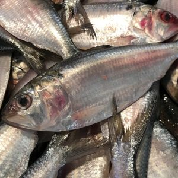 | | [Pexels](https://commons.wikimedia.org/wiki/File:Hilsa_fish.jpg) |
| 鲦; 鲰 | 鲦鱼; 鲰鱼 | tiáoyú; zōuyú | minnow | 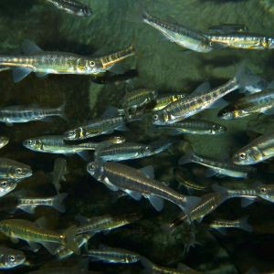 | generic term for small fish | [Wikimedia](https://commons.wikimedia.org/wiki/File:Eurasian_Minnows_(Phoxinus_phoxinus)_(13533343043).jpg) |
| | 鲨鱼 | shāyú | shark | 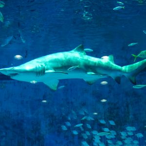 | | [Pexels](https://www.pexels.com/photo/photo-of-grey-shark-2832641/) |
| 鲩 | 草鱼; 鲩鱼 | cǎoyú; huànyú | grass carp | 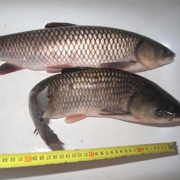 | | [Wikimedia](https://commons.wikimedia.org/wiki/File:Amur_b%C3%ADl%C3%BD_(09).jpg) |
| 鲫 | 金鱼; 鲫鱼 | jīnyú; jìyú | goldfish; crucian carp | 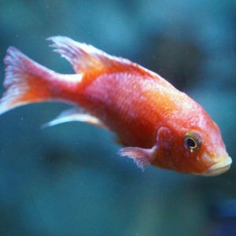 | | [Pexels](https://www.pexels.com/photo/close-up-shot-of-a-fish-13847668/) |
| 鲭; 鲛; 鲐 | 鲭鱼; 马鲛鱼; 青花鱼; 鲐鱼 | qīngyú; mǎjiāoyú; qīnghuāyú; táiyú | mackerel | 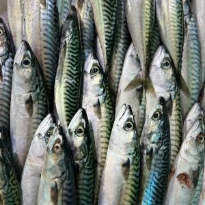 | | [Pexels](https://www.pexels.com/photo/fresh-mackerel-display-at-les-sables-d-olonne-market-29048590/) |
| 鲮 | 鲮鱼 | língyú | mud carp | 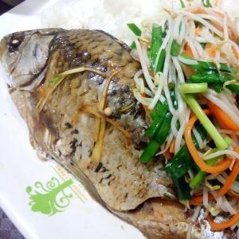 | | [Wikimedia](https://commons.wikimedia.org/wiki/File:SZ_%E6%B7%B1%E5%9C%B3_Shenzhen_%E7%A6%8F%E7%94%B0_Futian_%E7%A6%8F%E6%B0%91%E8%B7%AF_Fumin_Road_fast_food_restaurant_food_%E9%AF%AA%E9%AD%9A_fish_%E8%8A%BD%E8%8F%9C_vegetable_%E7%8D%85%E5%AD%90%E7%90%83_meat_ball_June_2017_Lnv2_02.jpg) |
| 鲱 | 鲱鱼 | fēiyú | herring | 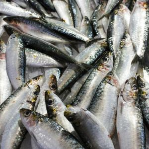 | | [Pexels](https://www.pexels.com/photo/fishes-on-a-market-16664053/) |
| 鲲 | 鲲 | kūn | giant flying fish |  | mythological; 《庄子》“鲲之大，不知其几千里也”；transforms into 鹏 | Generated by Gemini |
| 鲳 | 鲳鱼 | chāngyú | butterfish | 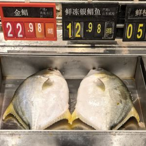 | | [Pexels](https://www.pexels.com/photo/a-fish-on-a-cutting-board-with-vegetables-lying-around-18907099/) |
| 鲶 | 鲶鱼 | niányú | Chinese catfish | 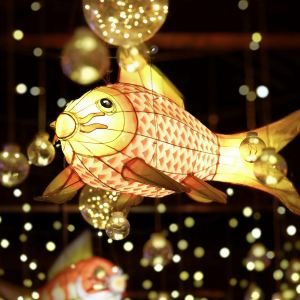 | | [Pexels](https://www.pexels.com/photo/traditional-fish-decoration-at-night-19364191/) |
| 鲷 | 鲷鱼 | diāoyú | sea bream; snapper | 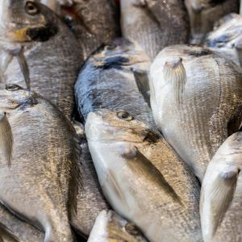 | | [Pexels](https://www.pexels.com/photo/close-up-shot-of-fish-in-the-market-10112455/) |
| 鲸 | 鲸鱼 | jīngyú | whale | 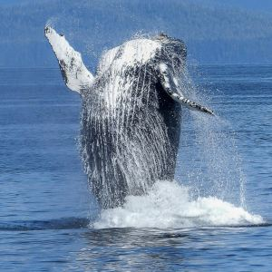 | 蓝鲸 (blue whale), 座头鲸 (humpback whale), 抹香鲸 (sperm whale), 虎鲸 (orca / killer whale), 白鲸 (beluga whale), etc. | [Pexels](https://www.pexels.com/photo/black-and-white-dolphin-on-body-of-water-during-daytime-51964/) |
| 鲻 | 鲻鱼 | zīyú | mullet | 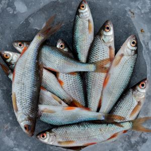 | | [Pexels](https://www.pexels.com/photo/fish-catch-2792153/) |
| 鲼; 鳐 | 蝠鲼; 黄貂鱼; 鳐鱼 | fúfèn; huángdiāoyú; yáoyú | manta ray | 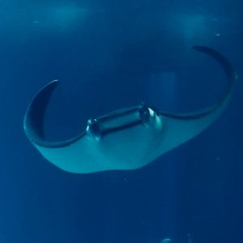 | | [Pexels](https://www.pexels.com/photo/underwater-photo-of-fishes-6406224/) |
| 鲽; 鲆; 鳎 | 比目鱼; 鲽鱼; 鲆鱼; 鳎鱼 | bǐmùyú; diéyú; píngyú; tǎyú | flounder; sole | 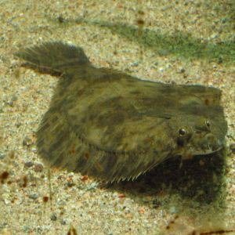 | | [Wikimedia](https://commons.wikimedia.org/wiki/File:Flundra.jpg) |
| 鳀 | 鳀鱼 | tíyú | anchovy | 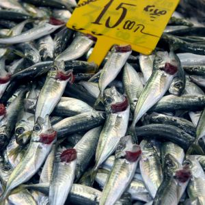 | | [Pexels](https://www.pexels.com/photo/fresh-anchovy-on-market-4748420/) |
| 鳃 | 鳃 | sāi | gills | 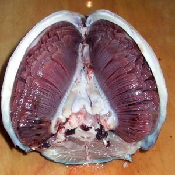 |  | [Wikimedia](https://commons.wikimedia.org/wiki/File:Tuna_Gills_in_Situ_01.jpg) |
| 鳄 | 鳄鱼 | èyú | crocodile; alligator | 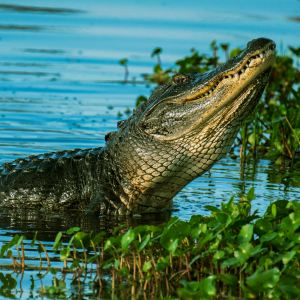 | | [Pexels](https://www.pexels.com/photo/alligator-near-water-plant-on-body-of-water-1360123/) |
| 鳇 | 鳇鱼 | huángyú | sturgeon | 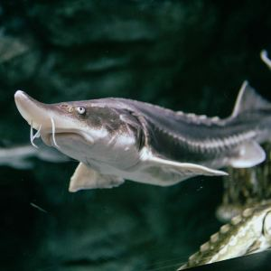 | | [Pexels](https://www.pexels.com/photo/close-up-of-a-sturgeon-swimming-underwater-29452932/) |
| 鳊鱼 | 鳊鱼 | biānyú | pomfret | 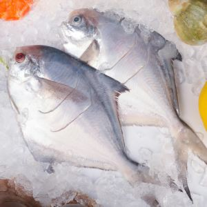 | | [Pexels](https://www.pexels.com/photo/fish-on-ice-20810997/) |
| 鳌 | 鳌; 赑屃 | áo; bìxì | mythological sea turtle | 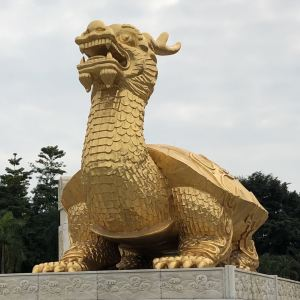 | often shown bearing a stone stele | [Wikimedia](https://commons.wikimedia.org/wiki/File:%E9%87%91%E9%B3%8C%E9%9B%95%E5%A1%91.jpg) |
| 鳍 | 鳍 | qí | fin | 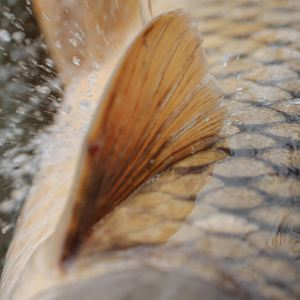 | 背鳍 (dorsal fin), 尾鳍 (tail fin), etc. | [Pexels](https://www.pexels.com/photo/close-up-shot-of-a-fish-5538146/) |
| 鳔 | 鳔 | biào | swim bladder | 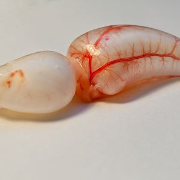 | buoyancy | [Wikimedia](https://commons.wikimedia.org/wiki/File:Abramis_brama_-_Swim_bladder_B_2010-09-24_HBP.jpg) |
| 鳕 | 鳕鱼 | xuěyú | cod | 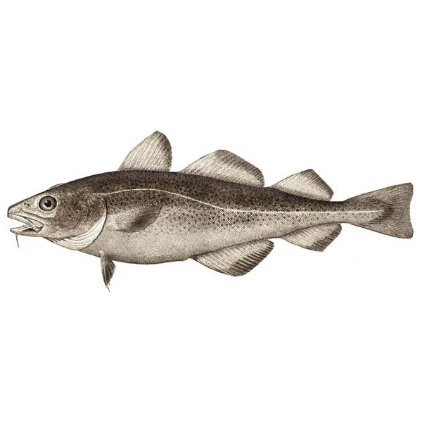 | | [Wikimedia](https://commons.wikimedia.org/wiki/File:Atlantic_cod.jpg) |
| 鳖 | 鳖 | biē | softshell turtle | 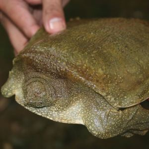 | | [Wikimedia](https://commons.wikimedia.org/wiki/File:Pelochelys_cantorii_from_the_vicinity_of_San_Mariano_-_ZooKeys-266-001-g100.jpg) |
| 鳗 | 鳗鱼 / 鳝鱼 | mányú; shànyú | eel |  | | [Pexels](https://www.pexels.com/photo/eel-swimming-underwater-6770873/) |
| 鳙鱼 | 鳙鱼 | yōngyú | bighead carp |  | | [Wikimedia](https://commons.wikimedia.org/wiki/File:Cardona,RizalFishPortjf5152_08.JPG) |
| 鳜 | 鳜鱼; 桂花鱼 | guìyú; guìhuāyú | mandarin fish |  | | [Wikimedia](https://commons.wikimedia.org/wiki/File:Fermented_mandarin_fish.jpg) |
| 鳞 | 鳞 | lín | fish scales |  | | [Wikimedia](https://commons.wikimedia.org/wiki/File:Fish_scales.jpg) |
| 鳟 | 鳟鱼 | zūnyú | trout |  | | [Pexels](https://www.pexels.com/photo/man-proudly-holding-a-large-brook-trout-outdoors-34479845/) |

