| Chinese | Pinyin | English | Image | Image Source | Comments |
|---------|--------|---------|-------|--------------|----------|
| 乌鸦 | wūyā | Crow, Raven | 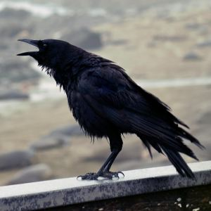 | https://www.pexels.com/photo/black-bird-perching-on-concrete-wall-with-ocean-overview-953150/ | Intelligent black bird. |
| 乌鸫 | wūdōng | Blackbird | 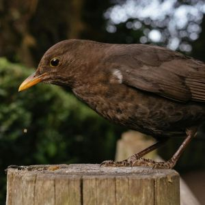 | https://www.pexels.com/photo/blackbird-on-tree-trunk-26387775/ | Medium-sized songbird. |
| 企鹅 | qǐ'é | Penguin |  | https://www.pexels.com/photo/group-of-penguins-53970/ | Flightless, southern hemisphere. |
| 信天翁 | xìntiānwēng | Albatross | 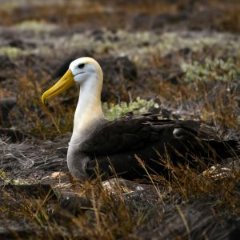 | https://www.pexels.com/photo/waved-albatross-nesting-in-galapagos-landscape-32849527/ | Large seabird, long-distance flyer. |
| 八哥 | bāgē | Myna | 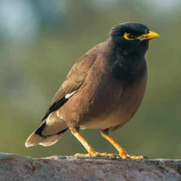 | https://www.pexels.com/photo/close-up-photo-of-a-myna-15082504/ | Songbird, often black & white. |
| 凤凰 | fènghuáng | Chinese Phoenix | 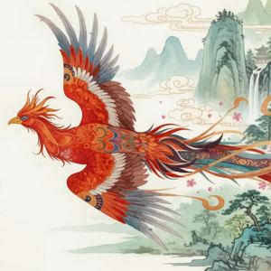 | Generated using Leonardo.AI | Mythical bird. |
| 凤头鹦鹉 | fèngtóu yīngwǔ | Cockatoo | 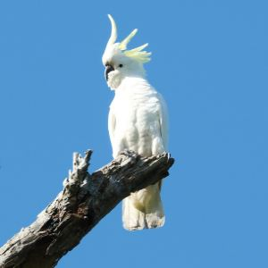 | https://www.pexels.com/photo/sulphur-crested-cockatoo-perched-on-bare-tree-branch-34405836/ | Colorful parrot. |
| 啄木鸟 | zhuómùniǎo | Woodpecker | 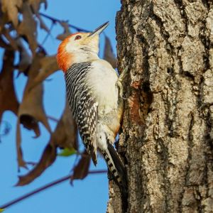 | https://www.pexels.com/photo/vibrant-woodpecker-on-tree-trunk-in-sunlight-29496336/ | Tree-drilling behavior. |
| 喜鹊 | xǐquè | Magpie | 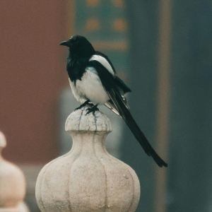 | https://www.pexels.com/photo/bird-perched-on-concrete-6819588/ | Black & white, considered lucky. |
| 夜莺 | yèyīng | Nightingale | 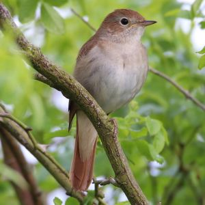 | https://commons.wikimedia.org/wiki/File:Luscinia_megarhynchos_-_Common_nightingale_-_Nachtegaal.jpg | Famous for singing. |
| 大鹏鸟 | dàpéngniǎo | Roc | 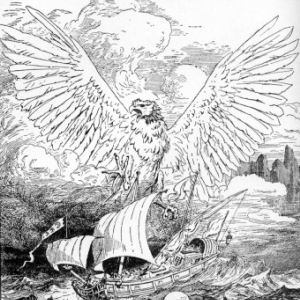 | https://commons.wikimedia.org/wiki/File:Roc8954.jpg | Mythical giant bird. |
| 天鹅 | tiān'é | Swan | 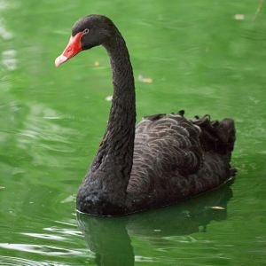 | https://www.pexels.com/photo/black-swans-gracefully-gliding-on-green-water-32410932/ | Graceful waterfowl. |
| 孔雀 | kǒngquè | Peacock | 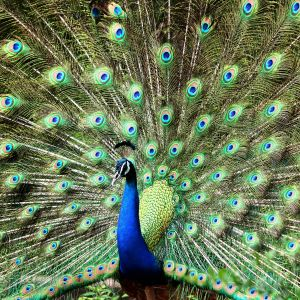 | https://www.pexels.com/photo/blue-and-green-peacock-638738/ | Colorful tail display. |
| 巨嘴鸟 | jùzuǐniǎo | Toucan | 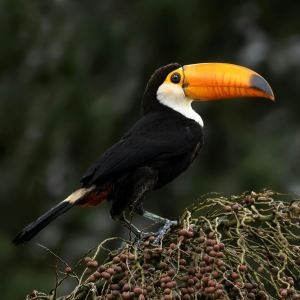 | https://www.pexels.com/photo/toucan-perching-on-branch-11692041/ | Tropical, huge colorful beak. |
| 斑鸠 | bānjiū | Turtledove | 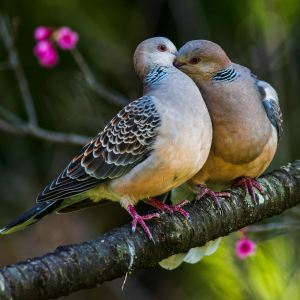 | https://www.pexels.com/photo/turtledove-birds-sitting-on-a-branch-and-hugging-6925118/ | Small dove. |
| 朱鹭 | zhūlù | Ibis | 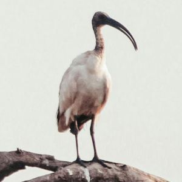 | https://www.pexels.com/photo/birds-perched-on-brown-tree-branch-12337358/ | Wading bird. |
| 杜鹃 | dùjuān | Cuckoo | 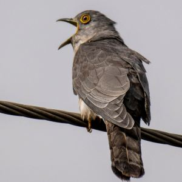 | https://www.pexels.com/photo/close-up-of-cuckoo-bird-on-wire-33146259/ | Known for brood parasitism. |
| 海鸥 | hǎi'ōu | Gull | 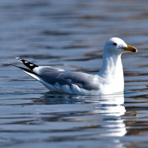 | https://www.pexels.com/photo/elegant-seagull-floating-on-tranquil-water-34479618/ | Coastal bird. |
| 燕子 | yànzi | Swallow | 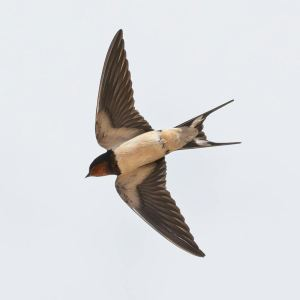 | https://www.pexels.com/photo/flying-barn-swallow-22027116/ | Migratory, agile flyer. |
| 犀鸟 | xīniǎo | Hornbill | 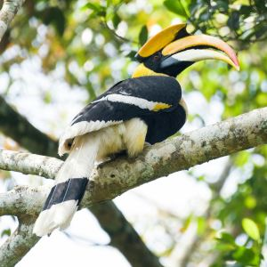 | https://www.pexels.com/photo/close-up-shot-of-a-hornbill-perched-on-a-tree-branch-7125230/ | Tropical bird, large bill. |
| 猎隼 | lièsǔn | Falcon | 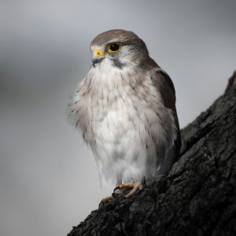 | https://www.pexels.com/photo/close-up-of-a-perched-falcon-in-natural-setting-34484238/ | Raptor, hunting bird. |
| 猫头鹰 | māotóuyīng | Owl | 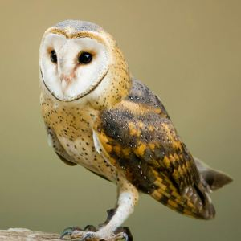 | https://www.pexels.com/photo/close-up-photo-of-an-owl-1526404/ | Nocturnal raptor. |
| 画眉 | huàméi | Hwamei, Thrush | 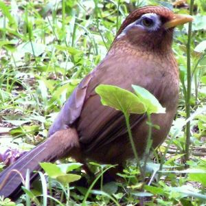 | https://commons.wikimedia.org/wiki/File:Garrulax_canorus_-_Watching_Back.jpg | Small songbird. |
| 白尾鹞 | báiwěiyào | Hen Harrier | 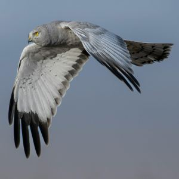 | https://www.pexels.com/photo/close-up-of-a-hen-harrier-flying-20746832/ | Small raptor. |
| 白鹭 | báilù | Egret | 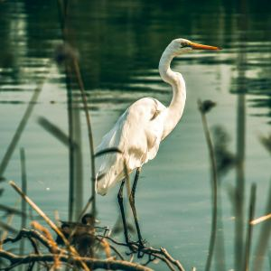 | https://www.pexels.com/photo/white-bird-on-focus-photography-2152399/ | Wading bird. |
| 秃鹫 | tūjiù | Vulture | 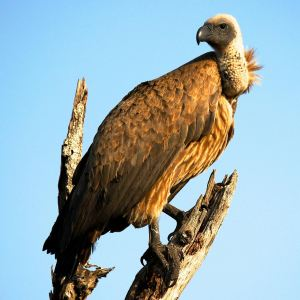 | https://www.pexels.com/photo/close-up-photography-of-brown-vulture-797670/ | Scavenger, bald head. |
| 秃鹰 | tūyīng | Bald Eagle | 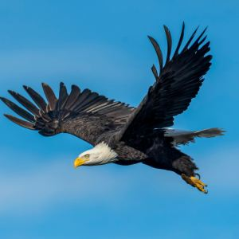 | https://www.pexels.com/photo/an-eagle-flying-in-the-sky-3250638/ | Large raptor. |
| 绿头鸭, 野鸭, 凫 | lǜtóuyā, yěyā, fú | Mallard | 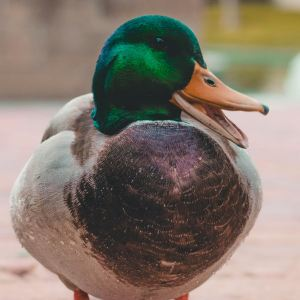 | https://www.pexels.com/photo/green-and-gray-mallard-duck-833687/ | Waterfowl. |
| 翠鸟 | cuìniǎo | Kingfisher | 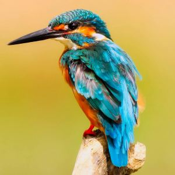 | https://www.pexels.com/photo/close-up-photo-of-perched-kingfisher-326900/ | Fishing bird. |
| 蜂鸟 | fēngniǎo | Hummingbird | 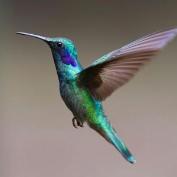 | https://www.pexels.com/photo/macro-photography-of-colorful-hummingbird-349758/ | Tiny, hovering flyer. |
| 金刚鹦鹉 | jīngāng yīngwǔ | Macaw | 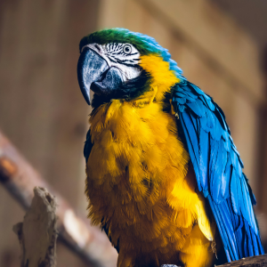 | https://www.pexels.com/photo/blue-and-yellow-macaw-parrot-sitting-on-a-rope-17577166/ | Tropical parrot. |
| 锦鸡 | jǐnjī | Golden Pheasant | 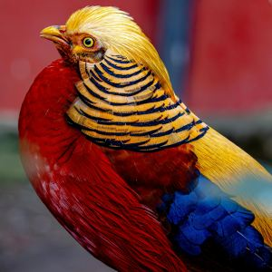 | https://www.pexels.com/photo/golden-pheasant-with-vibrant-plumage-30583569/ | Colorful pheasant. |
| 隹 | zhuī | Small bird | 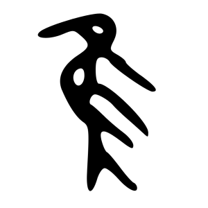 | https://commons.wikimedia.org/wiki/File:%E9%9A%B9-oracle.svg | Radical/ornamental bird. |
| 雕鸮 | diāoxiāo | Eurasian Eagle-Owl | 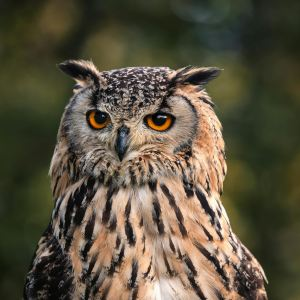 | https://www.pexels.com/photo/eurasian-eagle-owl-bird-19679352/ | Large owl. |
| 鸡 | jī | Chicken | 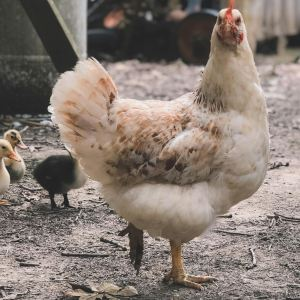 | https://www.pexels.com/photo/selective-focus-photography-of-white-hen-1405930/ | Domestic bird. |
| 鸬鹚 | lúcí | Cormorant | 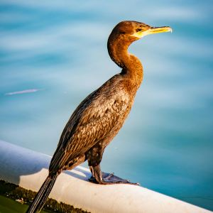 | https://www.pexels.com/photo/photo-of-a-cormorant-standing-by-the-water-16031510/ | Fishing waterfowl. |
| 鸳鸯 | yuānyāng | Mandarin Duck | 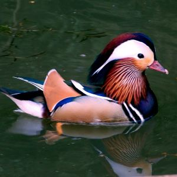 | https://www.pexels.com/photo/blue-and-brown-duck-402556/ | Colorful waterfowl. |
| 鸵鸟 | tuóniǎo | Ostrich | 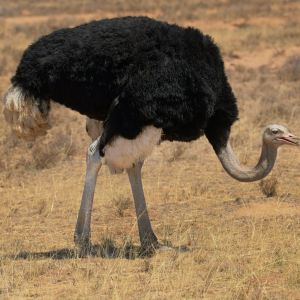 | https://www.pexels.com/photo/black-and-white-ostrich-on-brown-grass-field-3640270/ | Flightless. |
| 鸸鹋 | érmiáo | Emu | 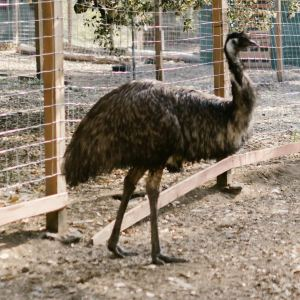 | https://www.pexels.com/photo/flightless-birds-on-a-farm-7781994/ | Flightless, Australia. |
| 鸽子 | gēzi | Pigeon, Dove | 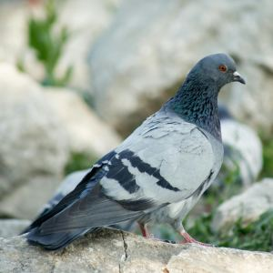 | https://www.pexels.com/photo/close-up-of-a-rock-pigeon-on-natural-rocks-34478808/ | Urban bird. |
| 鸾 | luán | Mythical Bird | 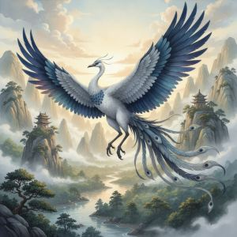 | Generated using Leonardo.AI | Mythical. |
| 鹅 | é | Goose | 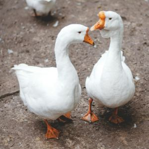 | https://www.pexels.com/photo/two-white-ducks-16602/ | Waterfowl. |
| 鹈鹕 | tíhú | Pelican | 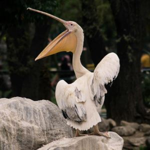 | https://www.pexels.com/photo/pelican-standing-on-stone-158986/ | Large water bird. |
| 鹌鹑 | ānchún | Quail | 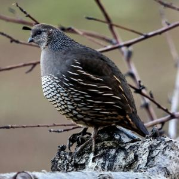 | https://www.pexels.com/photo/a-quail-perched-on-tree-trunk-3863173/ | Small ground bird. |
| 鹗 | è | Osprey | 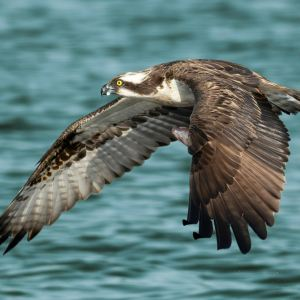 | https://www.pexels.com/photo/osprey-soaring-over-tranquil-waters-33447695/ | Fish-hunting raptor. |
| 鹡鸰 | jílíng | Wagtail | 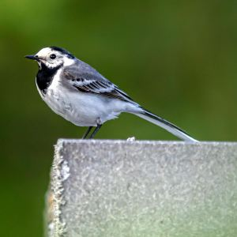 | https://www.pexels.com/photo/white-wagtail-in-close-up-14752326/ | Small songbird. |
| 鹤 | hè | Crane | 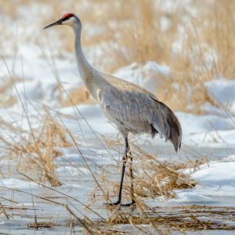 | https://www.pexels.com/photo/sandhill-crane-birds-standing-on-brown-grass-field-7255533/ | Long-legged wader. |
| 鹪鹩 | jiāoliáo | Wren | 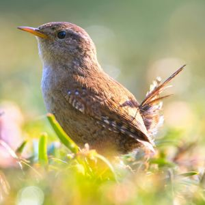 | https://www.pexels.com/photo/selective-focus-photo-of-brown-bird-432991/ | Tiny songbird. |
| 鹬 | yù | Snipe | 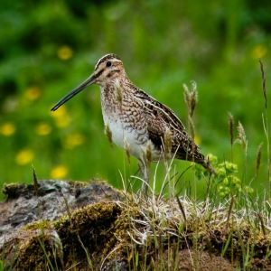 | https://www.pexels.com/photo/great-snipe-in-meadow-20458194/ | Shorebird, wading. |
| 鹳 | guàn | Stork | 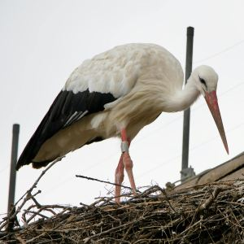 | https://www.pexels.com/photo/white-stork-nesting-on-rooftop-in-switzerland-34450994/ | Long-legged wader. |
| 麻雀 | máquè | Sparrow | 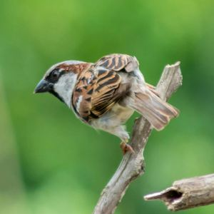 | https://www.pexels.com/photo/selective-focus-photography-of-house-sparrow-perching-on-tree-branch-679600/ | Common small bird. |
| 黄鹂 | huánglí | Oriole |  | https://www.pexels.com/photo/close-up-shot-of-a-bird-11075444/ | Colorful songbird. |
| 黑鸢 | hēiyuān | Black Kite |  | https://commons.wikimedia.org/wiki/File:Milvus_migrans_front(ThKraft).jpg | Medium raptor. |

