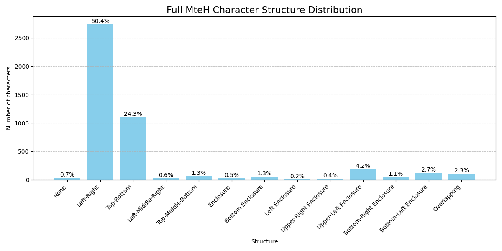
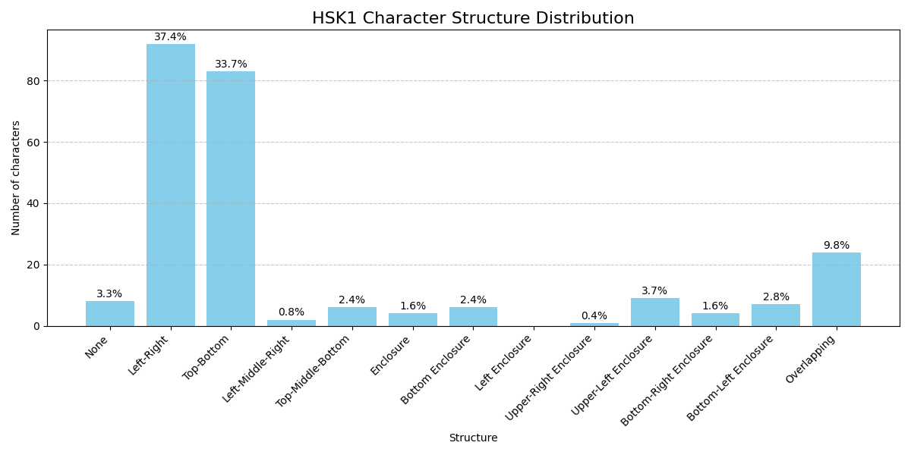
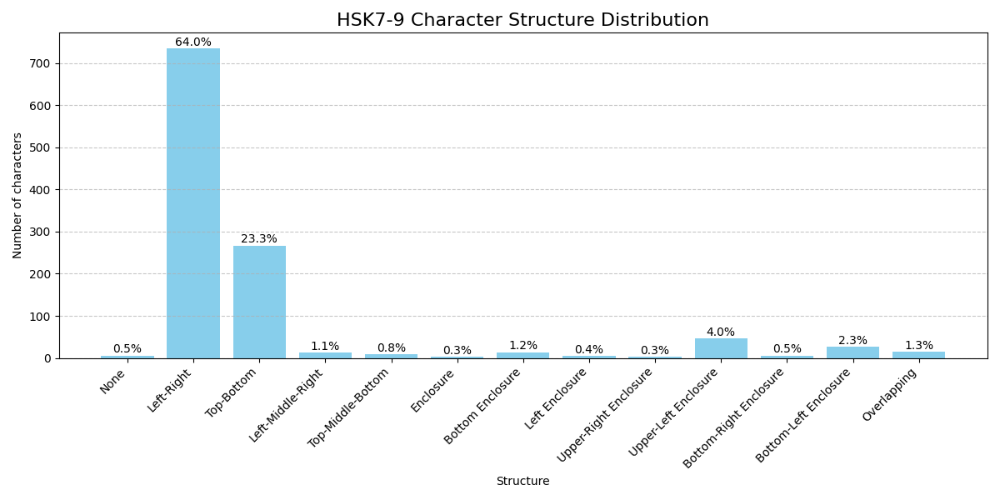
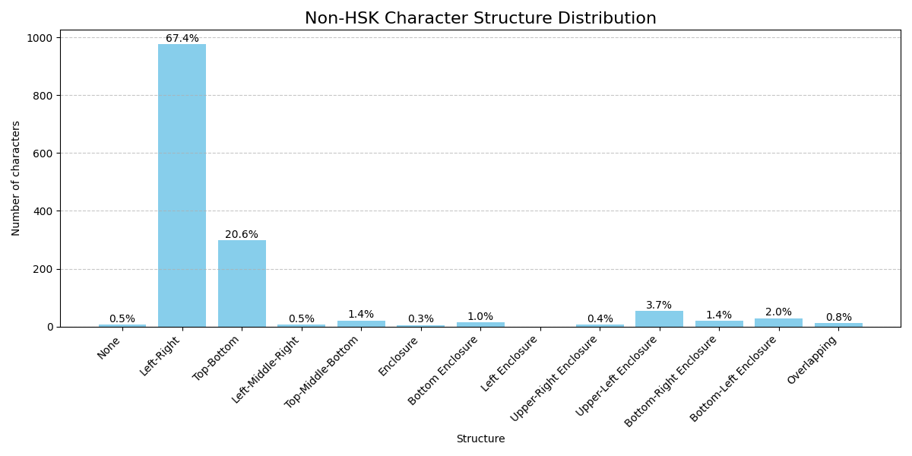

# Character Structure Histogram Report

<<<<<<< HEAD
Report generated on: 2026-02-17 09:58:17
=======
Report generated on: 2026-02-17 10:23:22; Python script written by ChatGPT
>>>>>>> 4f41a3df (update structure reports)

Checking MteH file: ../mteh.txt

## Full MteH Character Structure Distribution

<<<<<<< HEAD

## HSK1 Character Structure Distribution

## HSK2 Character Structure Distribution

## HSK3 Character Structure Distribution

## HSK4 Character Structure Distribution

## HSK5 Character Structure Distribution

## HSK6 Character Structure Distribution

## HSK7-9 Character Structure Distribution

## Non-HSK Character Structure Distribution

=======

## HSK1 Character Structure Distribution

## HSK2 Character Structure Distribution

## HSK3 Character Structure Distribution

## HSK4 Character Structure Distribution

## HSK5 Character Structure Distribution

## HSK6 Character Structure Distribution

## HSK7-9 Character Structure Distribution

## Non-HSK Character Structure Distribution

>>>>>>> 4f41a3df (update structure reports)

