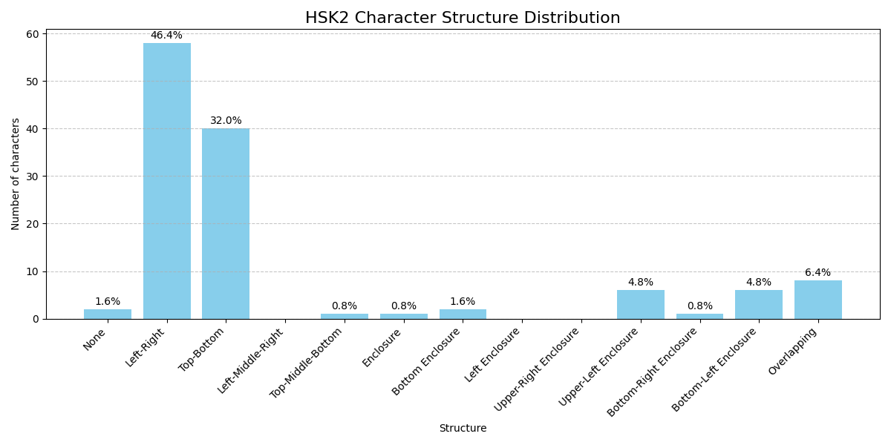
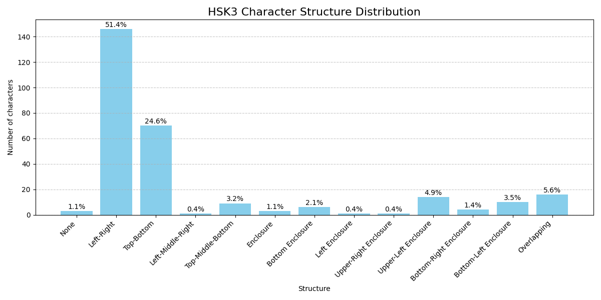
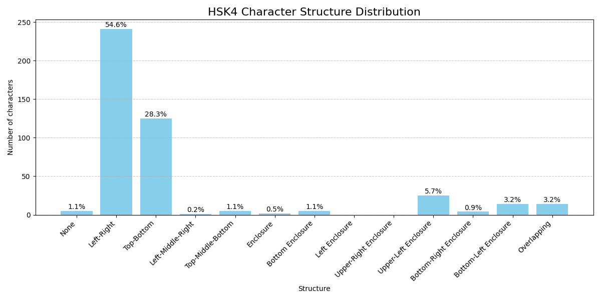
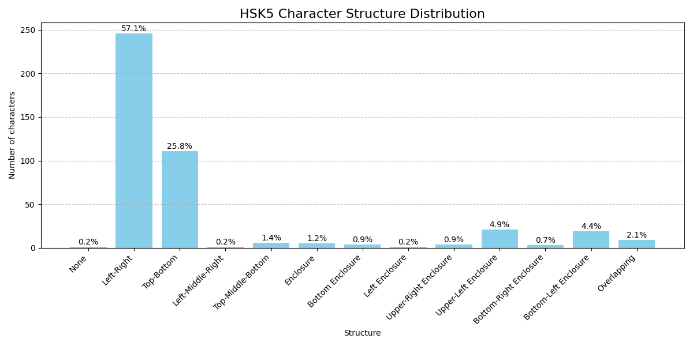
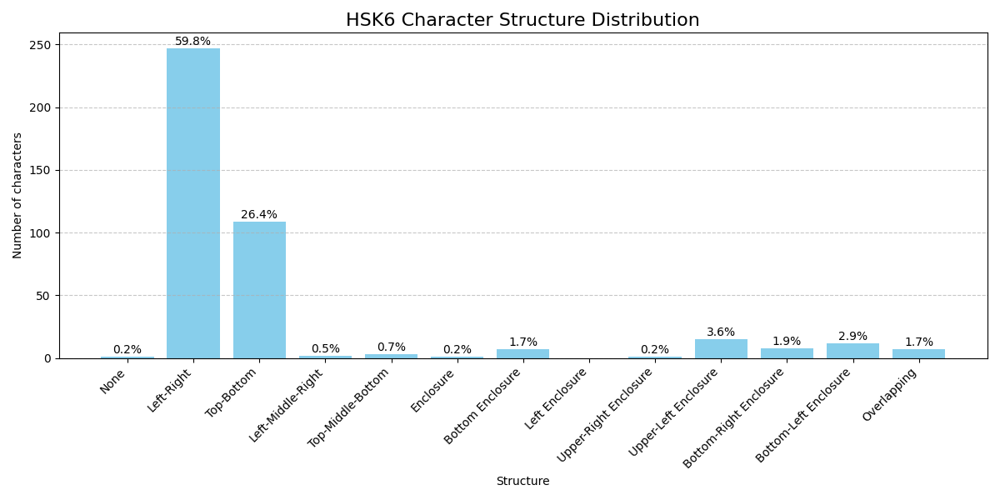

# Character Structure Histogram Report

Report generated on: 2026-02-17 10:41:32; Python script written by ChatGPT

Checking MteH file: ../versions/v0.1.3/mteh_v0.1.3.txt

## Full MteH Character Structure Distribution

## HSK1 Character Structure Distribution

## HSK2 Character Structure Distribution

## HSK3 Character Structure Distribution

## HSK4 Character Structure Distribution

## HSK5 Character Structure Distribution

## HSK6 Character Structure Distribution

## HSK7-9 Character Structure Distribution

## Non-HSK Character Structure Distribution

