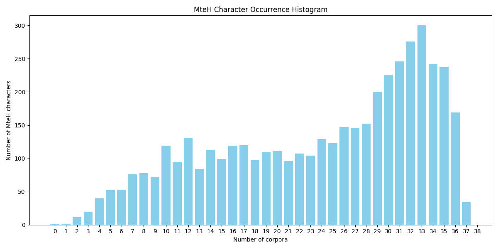
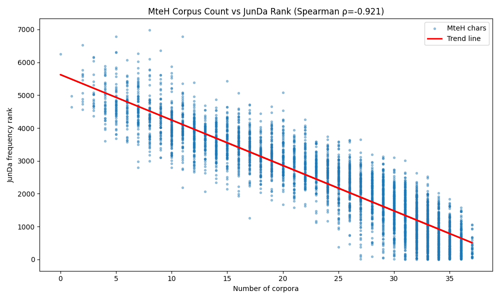

# MteH Character Occurrence Histogram

**Report generated on:** 2026-06-25 19:55:22; Python script written by ChatGPT (GPT-5-mini).

**Checking MteH snapshot:** `../versions/v0.1.3/mteh_v0.1.3.txt`

**Number of corpora checked:** 38

## Summary Table

| # Corpora | 0 | 1 | 2 | 3 | 4 | 5 | 6 | 7 | 8 | 9 | 10 | 11 | 12 | 13 | 14 | 15 | 16 | 17 | 18 | 19 | 20 | 21 | 22 | 23 | 24 | 25 | 26 | 27 | 28 | 29 | 30 | 31 | 32 | 33 | 34 | 35 | 36 | 37 | 38 |
|---|---|---|---|---|---|---|---|---|---|---|---|---|---|---|---|---|---|---|---|---|---|---|---|---|---|---|---|---|---|---|---|---|---|---|---|---|---|---|---|
| # Characters | 1 | 2 | 12 | 20 | 40 | 52 | 53 | 76 | 78 | 72 | 119 | 95 | 131 | 84 | 113 | 99 | 119 | 120 | 98 | 110 | 111 | 96 | 107 | 104 | 129 | 123 | 147 | 146 | 152 | 200 | 226 | 246 | 276 | 300 | 242 | 238 | 169 | 34 | 0 |

## MteH Full Character List

The MteH characters that belong to X corpora, as X varies.

### Characters in 0 corpora (1)

跽

### Characters in 1 corpora (2)

狻趔

### Characters in 2 corpora (12)

佝噔掴昇柩膻蜱趄蹰躅颏龀

### Characters in 3 corpora (20)

剜吒哐喑嘣揄泅炝盥睚筲艿襁讣赳踟踯鞣馕髭

### Characters in 4 corpora (40)

倨刎啷喟嗥嗫嘁噙忤忸忾掼揶搡擤橇檩殒殓氖煸瘘秫笤簌绔绺胛胴舛艄裨讫遒钚钣锛锨镞馐

### Characters in 5 corpora (52)

佻偻僭咝咣唁唰啮嘞嘭噤嚅圜婀孱怩悻揠摞撂撸槁毽氦涔湎潸燧犒犸獠眦睨砧秕粕纨肄脍芡褓觥詈谲赝赭钨铩镌闩馊龇

### Characters in 6 corpora (53)

厩咂哔哝哧啐嘤噼妲峋幂弑怏恫惴愎愠摁攫枳欸殚氪湮溏滓疽痍瞟礴笞绌聒舐苫蓑觐诌诟谗蹙蹴酊铣铰锂锏闫颦飚馔骜鬣

### Characters in 7 corpora (76)

仃仨倏匝卅呓啻嘹嚓囫囵奘姹孀孑嵋嶙忪怆愫戾拚搽撅擢攥汩洄淖淙淼漕炀焯焱獒珞瓤痂矾粲纣缜罄耷腭臃蓖虢蜴衩觎誊诶谥豉豢赊跎蹉酩醺铄铡铬锉锒镊陲飕鹬黠鼬鼹龅龋

### Characters in 8 corpora (78)

丕侗俚俨劾匐卞叵呃呷咻哒啾囔堇堑娆岌徇忖惆慵戍抿拮捋掬掳掸揩摒擀杳淅漉犷狒獾畦痞皙祜秸笺篙纭罹羿肓胄腓腩舀荸蔫蚜蛭蛰蜢螯袅裱覃觊讴诿谒蹑蹩镍镣镳靳颚颧骰鬃麸

### Characters in 9 corpora (72)

亟仄佯冽匍呦呸啕啜嗑嗔坨坳壑夯宥徉徜恻搐杈桀氟氰牍痫瘀瘁皈睾瞑瞠箔篑粑粼糗纾绶缰罂膘舷芍茯葩蚝袂诩谄谆跄踮逵遢邂邋钛铐镂霭颔饯饷驷骛鳃鹌麾黝龌龛

### Characters in 10 corpora (119)

亘亵佃佟俟刽剽咔咛唏唔喱喵嗒嗖嗟噗垛埂妊娓娠婊嫡孢崽巳幄幔幺庖忏忒怦戌挞捌掇掣撬撵杷榷沏泓洱涸湍瀛烯焖煦熨狙狰獭玷甬甭疣疱痉瘠瘴癞皑皖睽砺砾硼碴祉筏篆篝簪纂缄罔翟胫胯腼荠蓦蕨藓蛆蜚蜷褛褴褶诋诙谀谑豺跆踉踱踹蹿躏辍邃釉铀铆锲镯阉阖隼魇鳍鹑龊

### Characters in 11 corpora (95)

伫俸偌傣呗咯哽嗝嗷坯垠塾娑娲婢孺岷幡忐忑怔愕扈扪抨捺搪斓昵杵枇枭枸柒桅楂楔榻槌浒浚烊烬烷熠獗珈瘪癸盹眈睑瞭禀窕篡绛缭缮羁胤胺腆膺臆臊茬荞莅蛎蟒裆诘谩跚踞蹂蹒蹶逅遨铂铮锢锰颉飓飨馏馥骁髻鳗黍鼾

### Characters in 12 corpora (131)

佼侏倭冢剁厮叁吆吠吮吱咫唧啧喙喳嘈坍夙妩娅娼媲嫖宕宦帚帧弼彷徨忡忿怅恣恿悯惘惚慑懵戛扉抡拈挝掂揖搔擞斡旌梆殆殉毓汐泵泸涝渥滇烩焙熹犊猕猝猥瑙疟痢瘸瞅瞥瞰瞿矜砥砰秆窈笈箴篓缨羯耆耙胱腑茴莘葆蓓虱蛹蜥蟑袒褂觑谏谙谧赡跛跺跻踵蹊轼辘迩迸邸酮酯铠铿锭镁镐陛霎颌馄骡骷髅鲑

### Characters in 13 corpora (84)

伎俑偎傀剿匾叟叩呛呱咄咆唆噬囤坂壕娩孪孰岖岱怂悸惬惺拗挛敕晌楣殡汛汞涣渍湄溥漪潢潺炕燎狞玺璀璇甥痊癖盅瞌碉磺禺稷筵绫翌芮蘸蛊蜒蜿蟆蟋蟾蠕讪诧谛谟躇轶迢迥酶钗锹隽鞘饨鳌龈

### Characters in 14 corpora (113)

丞偃偕儡叱叽吭咎咚啪喀喋喔嗤嗨嘘噎嚎壬奄妾娴媛孚孽帛幌弋彝恪悖悚憧憩懦懿戊戮抉拎捂捅摹撩敝昊晦曜札枷栩毗毡汕沌沓泯涅涎涓涮炯煲璞疚疡痣癣睐睿祁祛窖竺箍簸籁纫羌翎肮苯萦蚓蚣蛟蜕蝌蝗蟀裴谕貂贻赣赦踌踝辄迂遛邯郸鑫镖阑阙霖韭骸鬓鱿麓

### Characters in 15 corpora (99)

佬佰俺兮匮咦唬嘀嘟圳堰奚妞婪嫣嫦寐恃恙恺悴惦憔扼捻掰掺擒斌昙暧朕楞槛樵泞渎渤滕瀚炳煽猬璋璨痔皓眸眺砚碘碾稣穹箕箫纶绥缎羲翱胰腌舜苓苞茗茜荼蒿藐蚤蚪蚯蜈褥讷讹诅诏诠谚蹭辗钠锚锵镑阂隋霾靓飒飙饪馍驭鸵龚

### Characters in 16 corpora (119)

乾伽侥倔倩冉冗凋凛匕咋啰嗡嗣噜埠妓姗尧岑岚峨嵩巅庵庶廿弈弩彗徙惮憎憬懊戟拄拷挎捎掖撮攘斐曳栈榔榛槟毋沪浣渭漩濡炙烙狄狩猖玖琥琶瓢瓮痹癫皎皿眩禧窘竣笠绚绮羹聆肛胭脓腋臼茨荟荤菁蛀螂袄褪诛诣诲诽贰跋跷踊遐邵郝酉酋釜钾铎锌锥镀闰阪阮雳霓馁驮骋鳖

### Characters in 17 corpora (120)

丐侄俞匡匣叼咒哉啬喃喽嗦嘎嘶噢噩嚏嚣圭坞坷埔奎妍婶寅尬尴尹峦帷廖弗恤惋惶抠拧拭拽捶掐揍搀晖晾柑柚椭氨氯汀沁涟涧渲湃溺漱炽焊琵甄疵疹瘟盎眯矶硅祠窿箩簧糠绊绢绯羔羚耘脐芷苇茹荚萃蕃蕊薰蛤衙裘褒诀豚赘跤蹋蹬轧逞邹鄂酣钵镰阜霹靡靶韶驹驿骼髦鲨麒黛黯

### Characters in 18 corpora (98)

仕倪剃匈卯厄厥吝咧咪哟哮唠嗯囱圃垢垮娟寰峙崛巍弛忱恬惫戎戳拂拴挟撰斟晤暄暨曦柬栅桓梵檐沥淌淤潇煞狈猾珀琐琦瑜睫磋磐祀祟禹秽窒笆笙糜聂肋臻茸薇虔蝙衅褐詹诬谍豌贮赎趾迄迦遁邑邢郡鄙酝铛闵陕陨雍雹霆颐颓

### Characters in 19 corpora (110)

丫亥兀冥哆哩啥垣壹姥姬娄娥婷婿嫉屎屹庇庚彤彪憋憨懈捍揪攸敛斋晏曝朔桦榄樊橄歼氮汝汲沦沽洼涤漓潦炖烽焉琪痘痪盔睬矗硝硫磊窦笃篱缅缆缉缪翡翩肘肴脯腮臀舔芜芥茁荧莓蔑藉藕藩蚌蝠襄襟讳诡诫谤谴赃辕辙遏邱酗酪闽阱陀雏颅鲍鳞鸠鹃鹉黔

### Characters in 20 corpora (111)

亢侃俐冀凿剔募卉卦吩呜咕咙啼嚷囚堕墩妃姊孜寥屉幢弘彦怯悍惰愣拯捆捣揣搁撇擂攒敖暇杉棠椎榆橱氢沮浏淫渝溅濒烹牟狡珑琉瑶畸瘾瞄瞳矣磕磷窥簿籽粽糯肇胚胧舵芋芸苑苔茉茵荔莎莞莺菠菱萤蔗蘑虞蜻蝎贱赁赂逍酥锄闺阀霄鞍韦颊饵馅馋鸯鸳鹦麟

### Characters in 21 corpora (96)

乍伺侈俘僚兹刨勺卒卤卿吏呻咏哦啃啄嗜墅夭奕妮姚娜嬉孵尉崔弧徊徘恕悼惟掷柯桔梧棺殃殴氓汹浙涩漾澈炊猩猿琅琳瑚眶眷瞩祈祷秃窍窑粟粤粱紊絮绷翰胳腺腻膛膳芯芹苛茧薛蛾蜀螃裔谭躯钝钳铝铲隅靖靴顷驯骇鳄黏

### Characters in 22 corpora (107)

亨仑佑倘僻冕冤刁劈呐呕哄哎喧嘛嘻嘿墟婉宛屡崎庐恍惕憾扳拇拢挚挠掀揽搓撼曙朦杞枉枢柠栓桩椰檬毙涡淇淮渺湘湛澎灸炬烘焚犀琼瑕瑟甩甫疮瘩砌禄秧稽窜筐簇绽缕缤腥膊舶芭莽菩虏虐蜓蜗袱譬讥讶谬贿躬轩轿辫酵钧锈锯阐陋隘颁馈馨骏鸥

### Characters in 23 corpora (104)

亩伶佣倡兢凄凳凹刃勋匿叛叨咐哼唾坎埃奠寇嵌彬怠怡拙拣挨搂摧擎旭昼杠桐桨梗楷歹殷氛汰沼泻浦淆淑淳溉溯炫熄熔熙爹犁狸璧疙疤瘫瞒矢矫碟碱礁稼糙绅绰缀缔耍耶耻肪腕艘芙荫菲萎葫葵蒜蓉蔡蜘觅讽谣账贬蹄逮逾钮锣闸阎驳驼鲤鹊

### Characters in 24 corpora (129)

佐侮俏兑冈刹勘卢叭吼咀咨哗唉嗅嗓嘲坤奸妒娶嫂寝寡屁峭帖弊彭徽惭慨慷扛抒挣捏掏揉晕暮杭枫柿梭棕棘棱榨樱歉毯沧泌涕淀渗滔滞潘瀑灼焕熏爵牡狠珊瓷痰痴癌眨瞬砂磅祭禅秤稚稠穆窟笋筛筝篷粥纬绎缚耽莉菇蒋蒲蔼藻蚀蛛蝉蠢袁裸讼谎豁赌赐赚趟趴跪迪迭逛逝遂酌醇锻镶隧韧驴骆魅鸿鹏

### Characters in 25 corpora (123)

乒乓乔乖侨俄俯僧儒兜冯剖匆匪厕吕吨呀咱哑哨哺喇嗽嘱嚼垦堤奢妄妆妥妨姻媚寞届屯岂岔崭怎恳悄惩愧扔拌挫搅搞敷旱昭曰曼朽杏栖框梢梳榴沐泣渊滥澜澡牺玛玲琢甸畴痒盏睁睦睹瞎砸禾穗笛筷粪粹纽绞署翘耿膝膨舱芝莱莹蔚薯蚕蝇蟹衬贸贾蹦蹲躁轴辜钙陡隙雇雌鞠驶髓魄鲸鹤

### Characters in 26 corpora (147)

侣俩俭倦偿僵凸函刊刘删券勿卵卸吁吧吵吾哇啤啦啸圾坊坝坟坠坪垄夷契姨媳宰宴尿屑岭巫帕帘帜廓廷您愤慌戈扒挪捡携撑撤擅敦斥斧杖枣棚槽橘橙沈浇浊涛涯渣溢澳熬牲狭瘤盯瞧瞪碳禽秉稿竿绑绒绸缴缸罢耸聋聘肾胀胁脊舅舆艰苟茄茎茫萍葛葬蔓蕴蕾蛮螺衍袜誓订诈诵谜豹贩赠赫踩躺辖辱逸逻邓邦酬酱酿钞钥钦铭铸锤颠颤饥馒魁鼎

### Characters in 27 corpora (146)

乞些亦仍伊估侍侠侦侯傍傻兆冶凯凰劫匙匠卑厢吗吟呢呵咳哀哪售啊喉囊垫塌妖姜嫁嫌孕孟宋寓屠屿岳巡帆庸很怖悠扮拆拓拘拟拱掠掩摘敞斑斩旨昧昨晰曹枕档械槐橡殿氧沛洛洽淹溶滤澄灶烛焰煎犬狐狱玄瑰畅畏畔疯瞻砍硕碑窃筹纱纺缠肢艇芦茅荆萧葱薪虾蚂蚊蜡裳裹诊译谅谐贞贪赴轨轰辐辑这遣遭邪郭酷钉钓隶韩韵页饲饺驻骚骤

### Characters in 28 corpora (152)

丸亏企伞伪侵倚债储兼凑凭刷剂劣匀厘叉叮吓唤啡喂噪址坑垃垒塑塘墓壶够奴她姆娱媒嫩宙宪尼峻帐彰役恋恨悬惧惨扯抄抛抵押捐掘摊撞旬昔晒枯柄某栏栗栽棍椒欠歧沾泊泼浆浸涵溪灿炸玫畜疫疲症痕皆矛砖础碌祸窄粘罐罩肆肖肿胎胞脖膜舰艾芬菌萌萝萨蒂蓄蔽虽蝴衔衫衷袍裙裤讯询谓谱购贷贼赋赔踪蹈躲辈逊逗邀钩链闷陌雁霞鞭颖驰魏鸦鸽龟

### Characters in 29 corpora (200)

丢丧串乃么仲件份伐允凌刑判剩割勾厅厨另吴吻咖哥哭喘填壤奥娇婚婴孩宠宵寨寺尸岗峡崖巩巷帅廊御恼患惑惹懂扇执找抖抬拐拦挖捉捞捧控描搏摔撕攀旷昌晋暑朱杆柏柜栋桌梯棵榜款歇殖毫污沸泄泳洒浩浴溃滨漆潭灾炒炭炮烁烤烫煌煤煮爆爪爷爸猜玻瓣甚疾皂皱盲盾着矮碍碧碰磁秒秦秩税稻究竖筋筒签篮糕纤绘绣综缝罚羡翅翠耗肤肺腔般芳荐荒莲菊萄葡董蚁蛙裁览认讨访该诱课谊贤赵趁趋践踏踢辆辟辩辰违逆递逼遮醋钻锅闯阁霉鞋颂颇餐饰骂魂鹅黎

### Characters in 30 corpora (226)

乎乏乙亡亭仅仆仇仗们价伴供促俊俗俱倾假做傅兄兽册凝划刮剥办勃匹厂厦叔召叹否吹呈哲唐喝埋堪堵奈奏奖姐它属履崩币帝帽幻庞废座弃弦弹徐怨恭悔惯愁愉愚懒戒扑扩扫批抑抚抢披挑挡挤挽搜搬摄敢敲斜斤暂替杰析枚枪株桶棋此歪毁毅氏汁汇汪沃泛派涨渔港溜滚滩漂漏燕爬父爽牧猎猛猴玩瑞璃疗疼盗眠督矩矿码票私租穴穷窗窝竭笨笼篇纠纲给绵编罪羞翁翔耕聊肌肝胃脂脆脏脾腊腐膀膏臣芽茂蔬蕉藤虑虚蛇蝶衰袖被袭覆评诉词诞谁谋贫跌跨较辅输辞辨迁返逐逢郎鉴铅锡阅队陪障霸靠频饶饼驱驾骗鬼魔鲁鸟鹰

### Characters in 31 corpora (246)

丙丛丹乘了予互仓仔付仿伙伦但你例倒借偷催像兔写凤凶刻削剪努势勒午卜又叙叠只吉吊君吞呆咬咽唇喊喻嘉坦垂堆堡壳夕夸夺奉奶妻姿娘孝宅宏导射尝局岩己巾店庙廉弄弟弱待忆忙忧态怕怜恒悦惠愈慧戏我或戚截扭抓担拨括拳拼挥挺捕捷掉插揭援播擦攻既旺昏晃晶暗最朴杀杯染校核桂梁梨检棉椅概欣欧欲欺毒汽沫泪泰涉涌液淘添渠渴湾漠漫灭炉烂燥版牢犯狮猫率瓶疆盆盒盟盼看研社稀策算箱籍粮紧纵纹组绕络绪罕耀肚肩肯胖脉脸腹腿臂臭艳芒莫著蓬虹裕誉讲误读谦责赢跃跑距软辉辣辽迈迫述送逃遗邮郊郑铺销键闲阔阵阶阻限陵陷隆隔需霍顽颈颗鸭鼠龄

### Characters in 32 corpora (276)

丈丑丘之也买争亮亿仁伏众住佩使候停傲免入具决冻击剑剧劝励协卓卖卧厌取句吃吸哈唯嘴圈均坐坛型培塔塞备央失妇妙妹姓委娃婆宁审害寂寸尖尺屋屏岸崇州已市希席帮幅幕幼床序弓弯彻循忌忘急怪恐恰恶悉惜慈扁扣扰把投抹拒拾拿损换授探推措握搭摆摇摩摸撒敌料断斯旁旋映晓晴更朗朵杜条构柳桑梅棒森模横歌止死残每汗泽洪淋混渡湿滋滴演灌灰燃片牵犹狂狗狼猪琴瓜瓦番疏的盈盐睛睡硬确碗磨祝祥禁稍稳站竞竟笔筑答箭粒糟素繁纷纸织终缩缺翼而耐肃肠股胆胶脚舌舟航苍苏若荷蒸虫蛋蜂蜜血街袋裂装触警议论设识试诗话详说请诸诺谨豫貌负败货贯贴走赶跟迅追透遍遥那钢锁锦闪闹际降院陶雀雅霜革预饮饱饿鹿鼻齿

### Characters in 33 corpora (300)

与且世丝两严个书乱事享京今他仰伍伟伤伸似低佛佳侧便值健党兵冒军况准减几凡初到刺副劲勉半卡即却压县反叫右各吐听启告员命咸唱商喷器因困圣在场坏块坡域墨壁声处夫奋奔套妈始姑威孔存孙季孤宇宣室宿对尘尚尤就尽层岁岛峰川巢差并幽庄库弥往径徒必忠忽恢悟悲想愿慎慕慰户才扎抗抱抽拍拖拥挂按据故敏救教散敬整斗旅族旦旧昂昆是普暖暴曾朋杂权材村束杨枝架柴样案殊毕永沉沟没沿泡泥注洁洗洞洲济浑浓浪润炼烦熊牌献申男画略疑病痛瘦皇益监盛省眉短碎示祖秀突童符第粉粗糊糖索级纯绝统继绩绳维缓置职育背脑腰腾舞艺苹范荡荣落融衡视言计训许诚谈豆豪贝财赖赛赤趣轻载近还迹退选途遵邻郁都配醒铃铜锋锐错陆除险隐难雕雾顶须领题额飘饭馆骄验骑骨鸣麦

### Characters in 34 corpora (242)

一下不专业为久义乌乳井交产亲什从仙令以任信倍偏偶元充先兰共其典再冠冬冰净切制动劳勇勤区升博印危厉厚去参受史号司名含固土坚堂境墙士壮夏夹学守宗宜客宫宾寄寻将尊屈左师幸庆异引录影彼得忍志念怒性总恩惊慢所手打托扶承技护报拜择持振排操支效数旗早显晨景服朝期李来板柔查标楚欢武段民气求池油泉洋测涂消渐湖潜灯炎烈烧焦然熟状玉王球甘甜田由甲电登目眼知破种科称穿章竹类系累约纪纳线续缘网羽翻考者联聪肉胜胸至舍船苗苦菜薄衣补见规证语谷贡质贺资赏赞越足身适遇避酸醉释量针钱镜闭问间防雨雪震静非面顾飞食齐龙

### Characters in 35 corpora (238)

丁七东丰临丽举九习乡二于五亚人介代仪会传伯位何作依修八公六兴养内农冷出刀分列则刚创别前务助化北医千华南占卫卷及友双变口古可同后味呼品响善喜团国图圆城基外夜头女如字安完官定宝实宽富寒寿封小少尔尾居展山巴带应底府康延式强形征律德思息情感成战戴扬折拉接收政文施晚智有木未机林柱桃梦植楼次步母毛江汤河法津浅淡温游潮激火烟爱牛物独珍珠班生用皮直相真石礼秋秘积移程立端笑等紫红练绍结罗羊美耳聚肥能花茶草获营蒙蓝藏虎行表西要观觉角让调象贵路跳迎运远连迟造部采野金闻阴阿附集雷露顿颜香鱼鸡默鼓

### Characters in 36 corpora (169)

万三上中主乐云休优体余保儿光全关冲凉利力功加包十单历原台叶向周和四园围地增复多大天太奇好子察工巧巨干平年广度建归彩微心快怀意拔招指掌提改放新方无日时明易星春月望末本松果树根桥正比水汉沙治活流浮深源滑灵点热照牙现界留白百盘福离空简管米细绿群老胡脱自致舒良色节英药解记谢超车转轮辛边达过进迷速道酒里重钟铁银镇长门陈随雄零青音项风首马高鲜麻黄黑

### Characters in 37 corpora (34)

克发合回家容密布常庭开张当房曲术极格波海清满特环理盖神精经费起通阳顺

### Characters in 38 corpora (0)

**Total 4540 chars.**

## Non-MteH Character Summary

The non-MteH characters that belong to X corpora, as X varies.

### Non-MteH characters in 20 corpora (1)

榕

### Non-MteH characters in 19 corpora (1)

檀

### Non-MteH characters in 18 corpora (2)

汶鹭

### Non-MteH characters in 17 corpora (5)

岐梓楠蔷陇

### Non-MteH characters in 16 corpora (2)

萱雯

### Non-MteH characters in 15 corpora (3)

椿樟瑾

### Non-MteH characters in 14 corpora (9)

泗泾漳珂琛璐隍鲈鸾

### Non-MteH characters in 13 corpora (12)

奂寮峪汾沂沅炜皋缥荀螳诃

### Non-MteH characters in 12 corpora (21)

侬剌噶忻栾樽澹玮町睢祺筱胥臧蕙薏蟠褚轲闾鲫

### Non-MteH characters in 11 corpora (30)

喏婕峥嵘晟桢榭沱浜淄渚潼濮烨盂祯筠芊莒蔺蜃衢酚醛銮钊韬鳅鹂鹄

### Non-MteH characters in 10 corpora (41)

佘俎俪俾厝嗳姣娣婵宸昕棣泷浃濑玑瑛瓯祐稔缇翊腱艮荃荨荪莆莴蓟蛔蛳蜇蠡邺钰铉镭霏靛骥

### Non-MteH characters in 9 corpora (56)

仟佗刍咤唷喆囡圩婧懋斛旖旻栎榈歆泮淞滂潞濂濠煜燮牦珉琏璜璟缈罡聿苒苣茱荻萼蓼蔻蚱贲迳钏铢镒阡陂雉颍饴骊骞骧鳕鳝鹫

### Non-MteH characters in 8 corpora (63)

乜仞佚凫剐咿噱妳姝嫔嬷岬徕悌旎昱枞桧槃殇泱洙涞潍爻牯猷琨瑄疝砷祚穰窠耦舫芪苡荏菅蓿藜蜊诒诤谌赈逑遽邝邳醪醴锷镕陟霁靥鞑馀鹜鹞麝

### Non-MteH characters in 7 corpora (105)

侪倌倜僖冼劭咩哓唢啵埕墉娉婺嬴宓岫崴嶂帼庾弭抻擘昶晔柘桉楮楹槿浔涿淦滢澧濯炅烜牠獐琮琰畲畿痤痨矽砲硒稞竽糍綦绾缙缶耒肽舖苋苎苜茭荥莼菏菘菡葭蓁衲袤觞訾诰谯豕貉邈邛邬郅郢郦郴鄢鄱酰醍钡钿铤铧铵镛闳阆饕馗骐髯鲲鹳麋

### Non-MteH characters in 6 corpora (181)

亳偈傥儆儋勐叻吋吖哞嗲囧囿垩垭夔妤姘嫚孛尻屐岘峒崃嵇巽徵捩揆昀晁晗暹枋柞柰栉桠椤榉橹歙氐氲汨汴沆沣沭洌洮洵浠涪渌渑溆溧滁滦澍灏灞煊煨熵爰猗玟玥珏珙珥珮珲琇琚瑗璎瓠甑畹疸痿瘙癜盱砣砭砻碚磬祇祗秣秭笕箐箸糸绉绻缁缛羟肱胝胼膈芎芩芫芾苁苌苷茌荜莜莠莪菀菖葚葳蕲藁藿虬蚬蜍螟蠹衮袈诓赅赓蹇轸辇逖遑遴邕邰郏郧鄞鄯醐醚钴钹钺铨锑锟镔镝镫阈隗隰隹雒靼韫颞颢骅髋鲅鲶鲷鸢鸬鸶鹗黜

### Non-MteH characters in 5 corpora (196)

亓佶僮凇刈剡厍吡呲哂哌唑唳嗬噌噫噻囹圪圻坜垓垚埤塍妫孬孳屌岢岿峁峄崂崆崧嵊嵬弁彧徬徼怛怿恁恽悱戕戢撷於旄昉昴晞暝曷杓杲枥栀桡桷棹椋椽楸槎槭欤殁毂氩汜泔泠洹湟溟漯濉濞烃焗焘焜牒狷珩瓒瓴疔疖疥痧痺瘢眙砀砒砝祎穑箬篾粳绦翕翥翳聩芨苴茏荩荽莨莳菽萏萸蒗蒡蓍蓥蕈蕤薮蚨蚩蚵蚶蛐蜉蝈螅螨衿裟讧诨豨赟趵迤迺邡郄郓郜郫郯鄄酢鋆钤钲锃锜锴锶镉闱阋阚陉雎雩霈顼颀颛餮馑驸骈鬟鬲魉魑鲂鲇鲔鲛鲟鲢鲭鲽鳎鸪鸰鹡鹧黩黾鼐

### Non-MteH characters in 4 corpora (277)

乩仝仡伉伢伥佞佢佤佥俦俳倬傧傩兖冇凼剀匏卲呎呒呤咁哙啫嗪嘢囟圄圉坭坻垡埒埙埸堉塬墀壅妣妪姒姪娌嬖孖尕屺岙峤嵛巉帏帑庋庑庠廪徂怵怼恂恸悒悭戬扦抟挈挹捭掮摈旃旮旯旸昝朐杼枧枰桎梏梿棰椹楝楫槲樨樾橼檗殄氤汊沄沔浉浍浯涑淝淬湔溴滟燊燔犄犇犍犟猡玕玠玳珐琊琬琯瑁畛疃痱眇睇睥瞇瞋矍砼硎硐硚碇碓碣磴祂稗竑竦笄笏笫箓箦箪簋簷糅繇纡纰缑缢缦缬罘羸翦耨聃胪腴臾舸艹艽芗苻茆茼荭荳萁萩葑蒹蒺薅薜薹蘅虻蚍蛉蝣蝮蝼蝽蝾螈螫螽蟥蟮蠊衹衽褫讦诳谔谖谘谝谠谡谮貊貔赉赑赜趸跖踅蹚蹼轭辔逄逯邗邙邾郇郗郤郾醮醯鏖钎钒钼锆镏镓镗镬隳霰鞅韪颡飏飧饩饬饽骝骠髂鬈鬻魍鲆鲠鲳鲵鸩鸮鹈鹕鹚鹩鹮麂黟龉

### Non-MteH characters in 3 corpora (406)

丶仉仫仵伛伧伲侩俅俫俵倥偬偲傈僳円劢劬劼勖勰卍卬卮叡吽呋呔呣呶咗哏哕哚啖啱啶喈喺嗄嘅嘌嘚嚟嚯囍坌坼垅垌垸埇埗埚埭埴埼埽堀堃墒妁妗妯媄媞媪嫒嫘嬗嬲寤尨屙屣岣崚崮嵯嶝嶷帙幛庹彀彊彘徳怍怙恚恹悃悛惝愀戡戥戸抔揹揾揿搥搴撙撺斫昃晡暾曌枨柙柢柽栲桁桕桤桴棂棼椟椴楦樗樯橐檄檎檠歃殪殳毖毳氹沚沤沩沬泖泺洧洸浈浐浞浡涠淠湫湲溘溱溲滏滘潟潲澌澥瀍瀣炔炘炷熘燄燚牝狍狎狲猇猢玆珣珪珺瑀瑭瑷璁璘璠甯畀畈畋畚疳痈痼瘰瘼瘿皕眛眬瞓矬矸砗硖硷磙磡祢秾稂窨笊笥笪笮筌筚筮箧篁篦籐糌綮纮绀绠绨绱缟缡缣缫缱罅羧翚翮耄耧肫肼胙脔脬腚膑舂舄艋艸芈苕苘荇荛莛莩莸菈菟菪菰菹萘葸葺蒌蒯蒽蓊蔟蕺蕻薤薨薷蘖虮虺虿蚋蚧蚰蚴蛄蛏蛱蛲蛴蜞蠓蠖衾裎裢褡觯诜诮谂谶豇貅贽赧跗跬踔轫轱轳轾辊辏逋逦遄邴邶鄠酃酆酐鋈鎏鏊钇钍钜钫钯钸铍铖铗铪铱铳铼锔锝锞锱锺镡镪镱阃阊阍阕阗陬雠鞯顸饔饧馓驽骉骓骖骶髀髁髡鮀鮠鮰鲀鲋鲎鲐鲥鲩鲮鲱鲻鳊鳏鳔鳜鳟鳢鸨鸱鸲鸷鸹鹘鹛鹪麽黉黥黧鼋鼍鼯齉龃

### Non-MteH characters in 2 corpora (601)

乂乇乸亍亹伈佮佴侉侑侔俆俶値偾傜僰兕冓冮刂刖刭刳刿劁劓勍匜匦卟卣吔吲呙咡咭咲哋唛唿啁啉啭啲喹嗉嗙嗞嗮嘧嘬噍噘囖囗団圊圮圯圹垆垟垤垧垱埝埯埵埶堋堙塄塆塭塱墁夤夬夼奓姮娈媠媸媾嫠嫫嫱嫲嬅嬛孓孥対尜尥屄屦岈岜岵岽峣崀崁崟崤嵎嵖嵝嵴嶋巯巻帔帻幞庥廛廨弢彖徭徯忝忭怃怄怫恵惇惢愆愦慝懑戋戽扃抃拊拏挢挦挲捯捱掊採掤掾揸搠搦搧搯搿摅摽攞攰敫旰旳昫昻晷暌暱朶杪枊枵枹柁柝栌栝栟栳桄桫桲棁椁椠椪楯榀榇榖榧榫榱槊槠橛橦歛歳殍殛毘毬氅気氙氡汆汔汫汭沢泇泐泫洇洈洎洣洫洺浬浼涫淏淯渫渼湜溷溽滹漖漷潆潋潴潽澉澪澶炱烔焌焓熳燠爨爿牖牴犏犭犮犰狨狯狳猁猋猓猞猯猱獴玎玡玢珅珧珵琍琤瑧瑯瑱璩璺甍甙甪甾疋疠疬疴痲瘌瘖瘛瘳癀癔皃皤皲眄眚眭睃瞢瞽砟硇硌硗硪碛碜碡碶磔磲礅禛禳稃穂窣窬窸竝笱笳笸筇筭筿箅箢箨篌篪篼簏簕簟簦籀籼粃粜粝粧粿糢糨糬経縻纛纥纩绁绂绗绡缃缐缧缯缳罒罴罾羝羼翀耩耪耵聍聱肏胂胍胗脒脣脲腧膂膦臌臜臬舁舢舣舻芃芄芘芟苄苈苠苤苧茀茈茑茕茛茳荑荦荬荮菔萋葶蒟蒴蓠蕗蕞藋藠藦蘧虼蚺蛘蛞蛩蛸蜣蜩蜮蝓蝟蝰螋螠螵蟌蟛蟪蠋蠲蠵衞袢袷裒裥裾褊褔褙褰褱襞襻觋觚觳觿訇訚詟讬讵诂诎诖诹谇谪谰豊豸貍貘贠贳赀赇赍趑趺跂跣跩跶跸踬踽蹀蹠躄躞辂辋辎迓迨迮逡逶邨郐鄣酞酡酹醅醌醢釆鉄鍪鎗钅钕钭钶钽铊铌铒铕铙铟铯锗锘锠镘镦関闼阄阒隈雱鞒鞫颟飍餍餽饫饸饹馫驩骀骎骢髫髹鬯魃魆魈魟魮鮨鲉鲚鲡鲣鲴鲹鲼鲿鳀鳇鳉鳐鳒鳓鳙鳚鴗鸫鸸鸻鹆鹇鹋鹍鹣鹨麇麈黐黒黮黻黼鼙鼢鼷齁齑龠

### Non-MteH characters in 1 corpora (1518)

〇㐷㤘㧐㧟㸆䁖䏝䥽䦃丂丅丌丏丒丟丨丩丬丮丳丵丷丼丿乚乛乷亁亅亖亜亠亶亸亻亾仂仌仏仠仳伕伝伩伱伾佌佔佫佲併佷佹佾侎侒侜俛俜俠俣倖倝倮倴倸偁偑偢偪偭傕傫傯僝僩僪僯僽僾僿儍儗儛儞兎兿冁冂冃冄冎冖冘冡冧冫冿凊凖刓刕刬剅剉剋剗剚剞剸劖劘劚劦劵劻勦勷勹匚匸匽卄卌卐卝卩卻厓厣厵厶厷厽厾叆叇叏叒叕叚吅吣吪吰吷呖呪呬呯呴呿咅咈咴哹唂唃唅唣唪唵唻唼啎啛喁喣喾嗈嗌嗍嗐嗱嗵嗾嘡噀噁噃噉噐噷嚄嚆嚒嚚嚞嚤嚬囓囝図囷圝圞圬坩坫坵垈垕垯垲垴垵垺埄埌埏埘埜埫埳堌堍堎堔堞堠堦堨堺堽塂塅塝墐増墘墦墬墺墼売壴壸壿夂変夊夗夥夨夰奁奡奭奻姈姉姫姱婑婓婼媟媭媮媵媿嫐嫑嬬嬭孨宀実宬寔寛寳専尛尞尢尦尪屩屮屰屾岒岞岺峃峎峘崄崕崞崦崾嵚嵫嶶巇巘巠巿帡帢幎幙幪幵幾庀広廋廲廴廸廻廾弶弸彐彛彟彡彫彳後徛徧忂忄忇忚忮忳忺恇恊恑恓恝恟恠悈悝悢悪悫悮惏惓惙惛惸愊愒愓愔愬愼慊慓慱慴憍憝憭憰懔戆戉戗戠戦戼扌扞抂抜抦抭抴抶拃拋拤挒挵挻捃捰捲捽掎掞掱掿揎揳搆搋搑搕搘搛搤搨搰摀摃摋摎摛摭摰摺撃撄撖撚撦撧擐擗擡擧擭擿攉攋攔攧攮攲攴攵敔敩斝斠斨斳斿旂旆旒旡旴昘昜昬晙晥晧晩晬暍暐暸暻曅曈曛曩曱曺朅朘朙朤朿杄杅杌杒杕杧杩杻枓枘枱枿柃柈柊柤柲栃栊栒栘桊桜桭梃梘梣梫梾棊棨棪棫棬棯棻椆椇椌椐椑楛楤楬楽榃榅榑榠榡榪榲榼槑槔様槙槺樕樘樫橉橑橿檞檨檫檵櫜欹歔歜歠歩歬歮歴歺殂殢殣殸殽毪毵毹氆氇氍氘氚氵氷氿汙汥沨沲沺泃泆泙泩洑洚洩洳浀浕浛浤浥浭涢涴淩淸渃済渋渒渖渟渮湉湋湓湴湶溁溓溙溞溻滃滆滍滗滛滠滪滫漭漶漹潓潖潠潥澋澒澔澛澨澭濊濛濨瀋瀬瀵瀹瀼灜灥灬炁炆炰炻烀烎烕烸烾焅焐焤焮煅煋煚煳煺熛熜熥熯燋燐燹燿爇爝爫爮爯牁牂牋牜牤牮牻牾牿犋犎犤犦犳犴狁狖狴狺猃猄猊猘猙猣猦猧猲猹猻獍獚獛獬玏玗玙玦玭珎珰珹琫琱瑅瑠瑳璈璪瓃瓘瓞瓟瓩瓿甁甏甕甡甴甽畎畐畑畒畤畬畾疌疒疭痌痜痡痦瘃瘅瘆瘊瘏瘐瘗瘝瘵癃癍癯発皀皁皛皞皦皴盉盍盤盺眊県眍眐眔眢眴眵睄睍睖睘睪睭瞀瞐瞚瞵瞶矅砉砑砘砜砠砦砬砹砽硁硃硄硍硏硙硭碁碲碻磇磉磒磛磝磻礐礓礡礤礲礻祃祅祆祓祕祧祲祼祾禇禊禚禿秂秊稈稊稜稹穅穇穉穞穠穢穣穽窆窎窳窾竜竤竨竫竻笯笹笾筀筊筜筢筦筴筻筼箎箑箜箝箣篠篥篲簑簖簝簠簩簰籥籦籴籵粞粨糁紏絜絫綈綟緌総緜縠縢繐繖繸纑纚纟纴纻绲缂缊缌缒缗缲缵罍罟罣罨罱罽羐羑羖羰羱羴習耂耋耎耏耑耖耜耠耢耥耱肁肜肟胏胔胠胨胬胾脇脕脘脧脩脰脷脿腃腈腘腠腯膎膙膣膮臁臤舎舙舨舳舴舺舾艟艨艴艻芏芑芔芣芧芰芼苐苖苨苪苺苼苿茍茓茔茖茚茝茞茻荄荅荌荗荙荵荿莋莕莙莶莿菉菍菑菝菥菫菴菵菾萂萆萑萜萮萹葎葔葙葜葠葨葯葾蒉蒒蒨蒭蒮蒷蒻蒾蓂蓇蓐蓢蓣蓧蓪蓺蔀蔊蔌蔍蔏蔘蔵蔸蔹蕖蕫蕹薁薐薢薴薸藄藊藟藨蘘蘡蘩蘼虉虍虒蚖蚮蚿蛣蛷蜎蜑蜾蝘蝥蝩蝲蝻螓螗螣螬螭蟊蟏蟖蟱蟳蠃蠙蠼衄衒衤衯袆袪袴袼裉裓裦裰裵裻裼褀褎褟褢褧褵襀襦襪襼覅覈覌覚覧観觇觌觏觜觫訫訳詀読諠謇謦謭謷譌譶讠诇诐诔诪诼谞谫谳谵谿豔豠豭豳貎貒貤賏賔賖贶赆赕赙赪趙趱趼趿跅跏跐跕跞跫跹踒踕踖踚踡踣踤踧踨踷踺踼蹁蹐蹯蹽蹾躐躜躥躭躱転輭輶轘轵轷轹辀辚辬辵辶辺辻迀迋迍迒迕迖迴逭逹遘遝適遫遬遯遶邅邽郉郘郚郛郿鄌鄐鄚鄹酂酎酤酦酲酽酾醎醙醡醨鉥銤銧銲鋕錱錾鐀鐾钋钌钖钪钬铈铋铑铓铫铷铻锇锊锕锩锸锾镈镙镚镠镢镧镨镩镲镴镵閒閖閧閪闇闘闿阇阏阝阨阬阯阼阽陔陞陴隠雚雜雥雰霨霪靐靑靦靰靸靺靿鞀鞚鞞鞡鞧鞨鞬鞲鞴韁韟韡頣颃颎颙颿飂飑飖飝飡餧餬餵餸餿饐饣馃馇馌馘馧駅騒騣驺骒骕骘骟骣骺髈髌髐髑髙髟鬏鬒鬘鬵魀魣魨魾鮃鮄鮈鮊鮋鮍鮗鮟鮡鮣鮯鮸鮻鯆鯒鯕鯙鯥鯮鯵鯷鯻鯿鰆鰏鰕鰛鰜鰟鰤鰧鰳鰶鰺鱂鱇鱈鱊鱚鱝鱠鱥鱧鱯鱲鱵鱻鲃鲌鲏鲖鲞鲦鲧鲪鲬鲯鲺鲾鳁鳂鳆鳈鳋鳑鳛鳠鳡鳤鳽鳾鴂鴃鴆鴈鴞鴷鵖鵙鵟鵰鶗鶲鶺鷇鷉鷑鷦鷸鸊鸏鸺鹀鹁鹎鹐鹓鹟鹠鹢鹯鹱鹲鹺麕麞麤麴麹麺黇黡黢黣黪黰鼔鼗鼦鼩鼪鼱齧齰龆龖龘龢𠳐𥻗𩽾𪱷𬉼

**Total 3530 chars.**

## Corpus-specific unique MteH characters

MteH characters that belong to exactly 1 corpora.

### 通用规范汉字表/通用规范汉字表_level2_chars_unicode_order.txt — 1 unique MteH characters

趔

### BLCU/BLCU_30000words_chars_simplified_unicode_order.txt — 1 unique MteH characters

狻

**Total 2 chars.**

## JunDa Rank vs Corpus Count (with trend line)

Spearman correlation coefficient ρ = -0.921 (p = 0)

- Characters in 0 corpora (1): most frequent 跽 least frequent 跽

- Characters in 1 corpora (2): most frequent 狻趔 least frequent 狻趔

- Characters in 2 corpora (11): most frequent 柩噔趄 least frequent 膻蹰蜱

- Characters in 3 corpora (20): most frequent 馕赳泅 least frequent 踟睚筲

- Characters in 4 corpora (40): most frequent 氖簌橇 least frequent 镞锛秫

- Characters in 5 corpora (52): most frequent 悻撂僭 least frequent 毽秕揠

- Characters in 6 corpora (52): most frequent 哝瞟哧 least frequent 骜闫溏

- Characters in 7 corpora (76): most frequent 倏拚龋 least frequent 蹉豉獒

- Characters in 8 corpora (78): most frequent 忖呃狒 least frequent 麸荸腩

- Characters in 9 corpora (72): most frequent 饷舷跄 least frequent 坨徜糗

- Characters in 10 corpora (119): most frequent 鳍釉踱 least frequent 捌荠喱

- Characters in 11 corpora (95): most frequent 怔咯愕 least frequent 黍枇柒

- Characters in 12 corpora (131): most frequent 陛瞥瞅 least frequent 烩羯茴

- Characters in 13 corpora (84): most frequent 璇剿诧 least frequent 囤潢璀

- Characters in 14 corpora (113): most frequent 涅喀谕 least frequent 遛鱿煲

- Characters in 15 corpora (99): most frequent 圳稣斌 least frequent 靓璨佰

- Characters in 16 corpora (118): most frequent 茨乾禧 least frequent 濡榛玖

- Characters in 17 corpora (120): most frequent 弗喃咒 least frequent 柚麒妍

- Characters in 18 corpora (98): most frequent 嗯陕煞 least frequent 雹豌铛

- Characters in 19 corpora (110): most frequent 歼哩鲍 least frequent 酗茁壹

- Characters in 20 corpora (111): most frequent 韦矣莎 least frequent 莞菠粽

- Characters in 21 corpora (96): most frequent 娜兹惟 least frequent 卤鳄螃

- Characters in 22 corpora (107): most frequent 嘛瑟倘 least frequent 灸蜓柠

- Characters in 23 corpora (104): most frequent 埃耶菲 least frequent 楷葵璧

- Characters in 24 corpora (129): most frequent 蒋迪彭 least frequent 咀榨秤

- Characters in 25 corpora (123): most frequent 怎呀俄 least frequent 乓拌禾

- Characters in 26 corpora (147): most frequent 吧您刘 least frequent 橙橘馒

- Characters in 27 corpora (146): most frequent 这些很 least frequent 槐滤饺

- Characters in 28 corpora (152): most frequent 她企虽 least frequent 彰蝴椒

- Characters in 29 corpora (200): most frequent 着么认 least frequent 醋皂宵

- Characters in 30 corpora (226): most frequent 们它此 least frequent 蔬芽蕉

- Characters in 31 corpora (246): most frequent 了我你 least frequent 燥丙梨

- Characters in 32 corpora (276): most frequent 的说也 least frequent 雀蒸霜

- Characters in 33 corpora (300): most frequent 是在他 least frequent 巢苹咸

- Characters in 34 corpora (242): most frequent 一不来 least frequent 羽苗甜

- Characters in 35 corpora (238): most frequent 人有国 least frequent 柱浅桃

- Characters in 36 corpora (169): most frequent 中上大 least frequent 滑拔凉

- Characters in 37 corpora (34): most frequent 发家经 least frequent 顺盖曲
